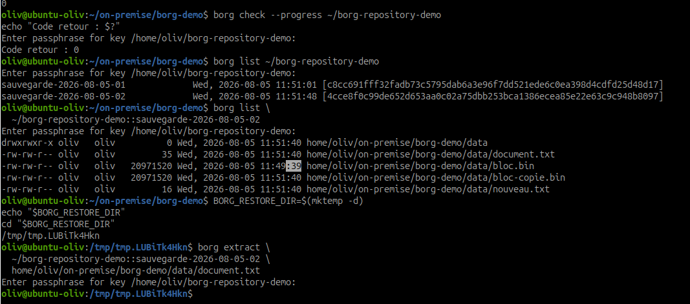
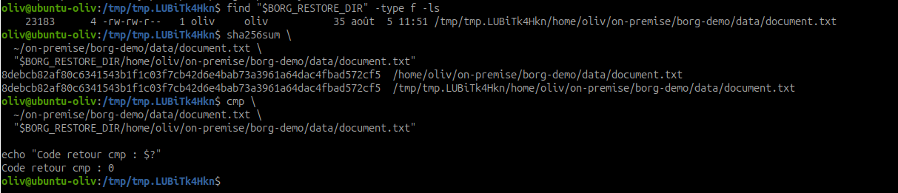

# Vérifier les sauvegardes BorgBackup

## Objectif

Vérifier l'intégrité du dépôt Borg, contrôler les archives disponibles et
restaurer un fichier dans un répertoire temporaire afin de le comparer avec
son fichier d'origine.

## 1. Préparer la vérification

Se placer dans le répertoire de démonstration :

```bash
cd ~/on-premise/borg-demo
borg --version
```

Le dépôt utilisé est :

```text
~/borg-repository-demo
```

La phrase secrète du dépôt sera demandée. Elle ne doit pas apparaître dans la
documentation ni dans les captures.

## 2. Vérifier l'intégrité du dépôt

Commencer par une vérification standard :

```bash
borg check --progress ~/borg-repository-demo
echo "Code retour : $?"
```

Un code retour `0` indique qu'aucune erreur n'a été détectée.

Effectuer ensuite une vérification approfondie des données :

```bash
borg check --verify-data --progress ~/borg-repository-demo
echo "Code retour : $?"
```

L'option `--verify-data` relit et vérifie les blocs de données. Cette opération
peut être plus longue sur un dépôt volumineux.

## 3. Consulter les archives

```bash
borg list ~/borg-repository-demo
```

Les archives attendues sont :

```text
sauvegarde-2026-08-05-01
sauvegarde-2026-08-05-02
```

Afficher le contenu de la seconde archive :

```bash
borg list \
  ~/borg-repository-demo::sauvegarde-2026-08-05-02
```

Repérer le chemin du fichier `document.txt`. Borg conserve normalement le
chemin sans le `/` initial :

```text
home/oliv/on-premise/borg-demo/data/document.txt
```


*Preuve : `borg check` retourne `0`, les deux archives sont présentes et
`document.txt` est extrait dans un répertoire temporaire.*

## 4. Restaurer un fichier temporairement

Créer un répertoire temporaire vide :

```bash
BORG_RESTORE_DIR=$(mktemp -d)
echo "$BORG_RESTORE_DIR"
cd "$BORG_RESTORE_DIR"
```

Extraire uniquement `document.txt` :

```bash
borg extract \
  ~/borg-repository-demo::sauvegarde-2026-08-05-02 \
  home/oliv/on-premise/borg-demo/data/document.txt
```

Vérifier sa présence :

```bash
find "$BORG_RESTORE_DIR" -type f -ls
```

Le fichier est restauré dans le répertoire temporaire. Le fichier d'origine
n'est donc pas écrasé.

## 5. Comparer avec l'original

Comparer les empreintes SHA-256 :

```bash
sha256sum \
  ~/on-premise/borg-demo/data/document.txt \
  "$BORG_RESTORE_DIR/home/oliv/on-premise/borg-demo/data/document.txt"
```

Les deux empreintes doivent être identiques.

Effectuer également une comparaison binaire :

```bash
cmp \
  ~/on-premise/borg-demo/data/document.txt \
  "$BORG_RESTORE_DIR/home/oliv/on-premise/borg-demo/data/document.txt"

echo "Code retour cmp : $?"
```

`cmp` ne produit aucune sortie lorsque les fichiers sont identiques. Son code
retour doit être `0`.


*Preuve : les empreintes SHA-256 sont identiques et `cmp` retourne le code
`0`.*

## 6. Résultats à consigner

| Vérification | Résultat attendu | Résultat obtenu |
|---|---|---|
| Intégrité du dépôt | Code retour Borg `0` | Conforme, code `0` |
| Vérification approfondie des données | Code retour Borg `0` | À vérifier |
| Présence des deux archives | Archives `01` et `02` visibles | Conforme |
| Présence du fichier dans l'archive | `document.txt` visible | Conforme |
| Restauration temporaire | Fichier extrait sans écraser l'original | Réussie |
| Empreintes SHA-256 | Empreintes identiques | Conforme |
| Comparaison avec `cmp` | Code retour `0` | Conforme, code `0` |

La vérification approfondie reste à compléter avec une preuve de la commande
`borg check --verify-data`.

## 7. Recommandations d'exploitation

- vérifier quotidiennement le code retour et les journaux de sauvegarde ;
- surveiller l'espace libre du dépôt et la bonne application de la rétention ;
- lancer régulièrement `borg check` ;
- planifier `borg check --verify-data` à une fréquence adaptée au volume ;
- réaliser des restaurations mensuelles dans un répertoire isolé ;
- comparer les fichiers restaurés par empreinte et par contrôle fonctionnel ;
- conserver la clé et la phrase secrète séparément du dépôt ;
- déclencher une alerte si une archive manque ou si une vérification échoue ;
- documenter chaque test dans le journal technique.

## Conclusion

La présence d'une archive ne prouve pas qu'elle est exploitable. Une solution
de sauvegarde doit être contrôlée par des vérifications d'intégrité et surtout
par des restaurations régulières. Le test est terminé uniquement lorsque les
données restaurées sont lisibles et identiques à l'original.
