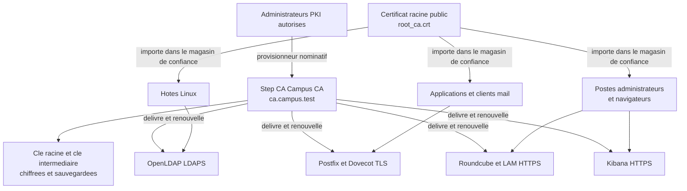

# Concevoir l'architecture de certification

## Objectif

Concevoir une infrastructure de gestion des certificats adaptée à
l'infrastructure AlpesNet, avant de délivrer des certificats aux services.

Cette feuille décrit l'architecture cible et les règles d'exploitation. Les
durées, les rôles et les procédures seront présentés au formateur avant leur
mise en œuvre.

## 1. Choix d'architecture

| Élément | Choix retenu | Justification |
| --- | --- | --- |
| Autorité de certification | Step CA `Campus CA`, hébergée sur un serveur Linux dédié à l'administration | La clé intermédiaire, la base de certificats et les journaux ne partagent pas un conteneur applicatif. |
| Adresse de la CA | `https://ca.campus.test:443` | Nom DNS stable, vérifiable dans le certificat serveur et utilisable par les clients. |
| Clé racine | Conservée chiffrée, sauvegardée hors de l'hôte de production | Une compromission de l'hôte ne doit pas permettre de recréer toute la chaîne de confiance. |
| Clé intermédiaire | Conservée chiffrée sur le serveur Step CA et utilisée pour les signatures courantes | La clé racine n'est pas sollicitée pour chaque émission de certificat. |
| Certificat racine | Déployé dans les magasins de confiance des systèmes et applications concernés | Les clients valident la chaîne TLS à partir de cette ancre de confiance. |
| Journalisation | Journaux systemd de `step-ca`, inventaire des certificats et journal des révocations | Chaque émission, renouvellement ou révocation doit pouvoir être attribué. |

La configuration actuellement initialisée dans `/home/oliv/.step` est adaptée
au laboratoire. Pour une exploitation durable, la CA doit être isolée dans une
VM ou un serveur d'administration dédié, sauvegardé et accessible seulement aux
administrateurs PKI.

## 2. Schéma de l'infrastructure PKI

Le certificat racine public est distribué aux clients. Les clés privées de la
CA, les mots de passe et les secrets de provisionneur restent exclusivement sur
le serveur de certification ou dans le stockage sécurisé de sauvegarde.

## 3. Systèmes qui doivent faire confiance à la CA

| Système ou groupe | Besoin de confiance | Méthode prévue |
| --- | --- | --- |
| Serveur Step CA | Vérification locale et administration | Conserver `root_ca.crt` et l'empreinte SHA-256 de référence. |
| Hôtes Linux de l'infrastructure | Appels TLS vers LDAP, messagerie, applications ou supervision | Installer le certificat racine dans le magasin système, puis actualiser les certificats de confiance. |
| Conteneurs OpenLDAP, Postfix et Dovecot | Chaîne TLS interne et échanges chiffrés | Monter le certificat racine en lecture seule si le conteneur vérifie une autre ressource interne. |
| Roundcube et LDAP Account Manager | Accès HTTPS des utilisateurs et administrateurs | Installer un certificat serveur signé par Campus CA ; les navigateurs clients reçoivent le certificat racine. |
| Postes administrateurs | Accès au portail HTTPS, à Kibana et aux interfaces d'administration | Importer le certificat racine dans le magasin du système et, si nécessaire, du navigateur. |
| Clients de messagerie | Validation IMAPS, SMTPS ou Submission TLS | Distribuer le certificat racine par la configuration du système ou du client de messagerie. |
| Kibana et les outils de supervision | Accès HTTPS et contrôle des API internes | Installer un certificat serveur signé et distribuer le certificat racine aux administrateurs. |

Un certificat racine ne doit être importé que sur les systèmes qui doivent
consommer un service signé par cette CA. Les postes personnels non administrés
ne font pas partie du périmètre initial.

## 4. Autorisations de délivrance

| Rôle | Autorisation | Règle appliquée |
| --- | --- | --- |
| Administrateur PKI référent | Émettre, renouveler et révoquer les certificats d'infrastructure | Utilise un provisionneur dédié et nominatif ; les opérations sont journalisées. |
| Administrateur système habilité | Demander ou renouveler un certificat pour un service dont il est responsable | Validation par l'administrateur PKI avant la première émission. |
| Compte d'automatisation | Renouveler uniquement les certificats des services autorisés | Provisionneur distinct, à périmètre réduit, sans droit d'administration général. |
| Utilisateur standard | Aucun droit d'émission | Il reçoit seulement la chaîne publique de confiance. |

Le provisionneur `admin` créé pour le laboratoire sert au premier
administrateur PKI. En exploitation, il est remplacé ou complété par des
provisionneurs distincts, nominatifs ou dédiés à l'automatisation. Le secret du
provisionneur n'est jamais partagé entre plusieurs personnes.

## 5. Durées de validité retenues

| Certificat | Durée cible | Renouvellement | Justification |
| --- | --- | --- | --- |
| Certificat racine | 10 ans | Préparation au moins 12 mois avant l'expiration | Son remplacement impose de rediffuser l'ancre de confiance à tous les clients. |
| Certificat intermédiaire | 5 ans | Préparation au moins 6 mois avant l'expiration | Une rotation est plus simple que celle de la racine et limite l'impact d'une compromission. |
| Certificat serveur TLS | 90 jours | Automatique à 30 jours de l'expiration | Durée courte, compatible avec une détection rapide des erreurs de renouvellement. |
| Certificat client ou administrateur | 30 jours | Automatique ou après validation du rôle | Réduit la durée d'utilisation possible d'un certificat perdu ou compromis. |

Les durées générées lors de l'initialisation de Step CA doivent être relevées
avec `step certificate inspect` et comparées à cette cible avant toute mise en
production.

## 6. Procédure de renouvellement

1. L'outil de supervision alerte à 30 jours, puis à 7 jours de l'expiration.
2. Le compte d'automatisation renouvelle les certificats serveur autorisés.
3. Le service concerné recharge sa configuration ou redémarre de manière
   contrôlée.
4. L'administrateur vérifie la date, le nom DNS, l'émetteur et la chaîne TLS.
5. L'opération est inscrite dans l'inventaire des certificats.

Une erreur de renouvellement est traitée comme un incident avant l'expiration :
contrôle du service Step CA, du DNS, du provisionneur, des droits sur les clés
et de la connectivité réseau.

## 7. Procédure de révocation

La révocation est déclenchée en cas de perte de clé, départ d'un administrateur,
erreur de nom DNS, mauvais usage du certificat ou suspicion de compromission.

1. Identifier le certificat par son numéro de série et le service concerné.
2. Prévenir l'administrateur PKI et consigner le motif de révocation.
3. Révoquer le certificat dans Step CA, puis émettre un certificat de
   remplacement si le service doit rester disponible.
4. Déployer le certificat de remplacement et redémarrer ou recharger le
   service concerné.
5. Vérifier la nouvelle chaîne TLS, l'absence de l'ancien certificat et les
   journaux de l'opération.
6. Publier et tester un mécanisme de révocation compatible avec les clients
   visés, tel qu'une CRL, avant l'exploitation en production.

Dans le laboratoire, les certificats courts limitent l'exposition en attendant
la mise en place et le test de la CRL. La révocation ne remplace pas le
renouvellement : elle traite une situation anormale et doit laisser une trace.

## 8. Livrable formateur

Présenter au formateur :

1. le schéma de l'infrastructure PKI ;
2. l'emplacement retenu pour la CA et la protection des clés ;
3. la liste des systèmes qui recevront le certificat racine ;
4. les rôles autorisés à demander ou délivrer des certificats ;
5. les durées de validité, les procédures de renouvellement et de révocation.

## Résultat

L'architecture repose sur une CA interne isolée, un certificat racine distribué
aux seuls clients concernés, des droits d'émission limités et journalisés, des
certificats de courte durée pour les services et une procédure de révocation
traçable.

## Termes à retenir

- **PKI** : infrastructure réunissant une CA, des certificats, des clés et les
  procédures qui permettent de gérer la confiance numérique.
- **Ancre de confiance** : certificat racine installé dans le magasin de
  confiance d'un client.
- **Provisionneur** : mécanisme qui autorise une demande de certificat selon un
  rôle ou une politique.
- **Renouvellement** : émission d'un nouveau certificat avant l'expiration de
  celui qui est utilisé.
- **Révocation** : annulation anticipée d'un certificat qui ne doit plus être
  accepté.

## Ressources

- [Installer et initialiser une autorité Step CA](installer-initialiser-step-ca.md)
- [Documentation Step CA](https://smallstep.com/docs/step-ca/)
- [Production considerations for Step CA](https://smallstep.com/docs/step-ca/certificate-authority-server-production/)
