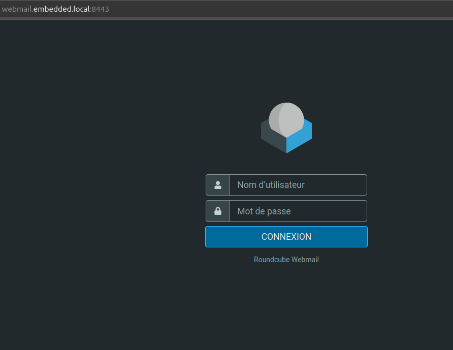
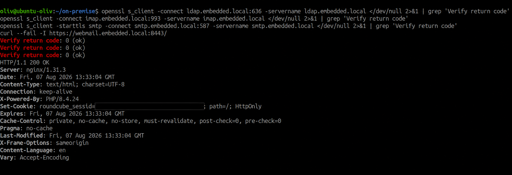
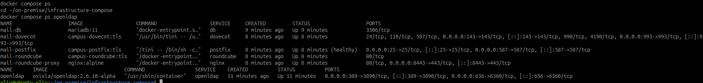

# Déployer les certificats sur les services

## Objectif

Configurer les services avec les certificats délivrés par `Campus CA`, puis
vérifier les connexions TLS et le démarrage des conteneurs.

Le déploiement a été réalisé le 7 août 2026 : LDAPS, IMAPS, SMTP STARTTLS et
HTTPS Roundcube présentent tous une chaîne Campus CA valide. L'authentification
dans l'interface Roundcube reste à vérifier avec un compte LDAP de test.



*Roundcube est accessible avec le nom DNS couvert par son certificat et le port
HTTPS de laboratoire `8443`.*

## Préconditions

- Les noms `ldap.embedded.local`, `smtp.embedded.local`,
  `imap.embedded.local` et `webmail.embedded.local` résolvent vers le bon hôte.
- Chaque service possède un certificat, une clé privée et un fichier
  `fullchain` dans `~/on-premise/pki/issued/<service>/`.
- La racine `Campus-CA-root.crt` est installée chez les clients et dans les
  conteneurs qui doivent vérifier un certificat Campus CA.
- Les clés privées restent hors de Git et sont montées en lecture seule.

Contrôle avant installation :

```bash
cd ~/on-premise
step certificate inspect pki/issued/openldap/openldap.crt
openssl verify -CAfile pki/certs/Campus-CA-root.crt \
  -untrusted ~/.step/certs/intermediate_ca.crt \
  pki/issued/openldap/openldap.crt
```

`*.fullchain.crt` contient le certificat de service puis l'intermédiaire. C'est
ce fichier qui doit être présenté aux clients, jamais la clé privée.

## Emplacements retenus

| Service | Source sur l'hôte | Emplacement dans le conteneur | Usage |
| --- | --- | --- | --- |
| OpenLDAP | `pki/issued/openldap/openldap.{key,fullchain.crt}` | volume `openldap_tls` dans `/container/services/openldap/assets/certs/` | LDAPS |
| Postfix | `pki/issued/postfix/postfix.{key,fullchain.crt}` | volume `mail_postfix_tls` dans `/etc/postfix/tls/` | SMTP STARTTLS |
| Dovecot | `pki/issued/dovecot/dovecot.{key,fullchain.crt}` | volume `mail_dovecot_tls` dans `/etc/dovecot/tls/` | IMAPS et IMAP STARTTLS |
| Roundcube | `pki/issued/roundcube/roundcube.{key,fullchain.crt}` | volume `mail_roundcube_tls` dans `/etc/nginx/tls/` | HTTPS |
| Clients | `pki/certs/Campus-CA-root.crt` | magasin de confiance | validation |

## Roundcube en HTTPS

L'image `roundcube/roundcubemail:1.6.x-apache` sert actuellement Roundcube en
HTTP sur son port interne `80`. La terminaison TLS est confiée à un reverse
proxy Nginx sur le réseau `mail`, qui monte le volume `mail_roundcube_tls`.
Le port HTTP de Roundcube n'est plus publié directement.

Créer le répertoire et ouvrir le fichier de configuration du proxy :

```bash
cd ~/on-premise/messaging-compose
mkdir -p nginx
nano nginx/roundcube.conf
```

Coller le bloc suivant dans `nginx/roundcube.conf` :

```nginx
server {
    listen 443 ssl;
    server_name webmail.embedded.local;
    ssl_certificate     /etc/nginx/tls/roundcube.fullchain.crt;
    ssl_certificate_key /etc/nginx/tls/roundcube.key;
    ssl_protocols TLSv1.2 TLSv1.3;
    location / {
        proxy_pass http://roundcube:80;
        proxy_set_header Host $host;
        proxy_set_header X-Forwarded-Proto https;
    }
}
```

Dans le même répertoire, modifier `docker-compose.yml` : supprimer le bloc
`ports:` de `roundcube` qui publie `${ROUNDCUBE_PORT}:80`, puis ajouter le
service suivant au même niveau que `roundcube` :

```yaml
  nginx:
    image: nginx:alpine
    container_name: mail-roundcube-proxy
    restart: unless-stopped
    depends_on:
      - roundcube
    ports:
      - "8443:443"
    volumes:
      - ./nginx/roundcube.conf:/etc/nginx/conf.d/default.conf:ro
      - roundcube_tls:/etc/nginx/tls:ro
    networks:
      - mail
```

Step CA occupe déjà le port `443` de l'hôte. Pour le laboratoire, publier le
proxy sur `8443:443`, ou utiliser une autre IP ; le test devient alors
`https://webmail.embedded.local:8443/`.

Ne pas modifier les quatre variables suivantes tant que Dovecot et Postfix ne
présentent pas eux-mêmes leurs certificats. Après leur validation, les modifier
dans la section `environment:` du service `roundcube` de
`~/on-premise/messaging-compose/docker-compose.yml` :

```yaml
ROUNDCUBEMAIL_DEFAULT_HOST: ssl://imap.embedded.local
ROUNDCUBEMAIL_DEFAULT_PORT: 993
ROUNDCUBEMAIL_SMTP_SERVER: tls://smtp.embedded.local
ROUNDCUBEMAIL_SMTP_PORT: 587
```

## Postfix et Dovecot

### Postfix

Avant toute modification ou tout redémarrage, vérifier que les deux fichiers
existent. Si cette commande échoue, émettre les certificats avec le script PKI
et ne pas redémarrer Postfix :

```bash
test -f ~/on-premise/pki/issued/postfix/postfix.fullchain.crt \
  -a -f ~/on-premise/pki/issued/postfix/postfix.key
```

Ouvrir le fichier Compose de la messagerie :

```bash
cd ~/on-premise/messaging-compose
nano docker-compose.yml
```

Dans le service `postfix`, ajouter les cinq lignes TLS sous
`environment:`, après les autres variables `POSTFIX_*` :

```yaml
      POSTFIX_smtpd_tls_cert_file: /etc/postfix/tls/postfix.fullchain.crt
      POSTFIX_smtpd_tls_key_file: /etc/postfix/tls/postfix.key
      POSTFIX_smtpd_tls_security_level: may
      POSTFIX_smtpd_tls_auth_only: "yes"
      POSTFIX_smtp_tls_security_level: may
```

Dans le même service `postfix`, ajouter ensuite ce montage sous son bloc
`volumes:` existant, après `postfix-init.sh` :

```yaml
      - postfix_tls:/etc/postfix/tls:ro
```

`POSTFIX_smtpd_tls_auth_only` interdit l'authentification SMTP en clair. Si
TLS doit être imposé sur le port 587, compléter `master.cf` selon les
possibilités de l'image Postfix et vérifier le refus d'un client non-TLS.

Redémarrer et lire les journaux du seul service concerné :

```bash
docker compose up -d --force-recreate postfix
docker compose logs --tail=50 postfix
```

### Dovecot

Avant de redémarrer Dovecot, vérifier aussi ses fichiers. Sans eux, le service
refusera de démarrer puisque la configuration exige TLS :

```bash
test -f ~/on-premise/pki/issued/dovecot/dovecot.fullchain.crt \
  -a -f ~/on-premise/pki/issued/dovecot/dovecot.key
```

Toujours dans `~/on-premise/messaging-compose/docker-compose.yml`, ajouter ce
montage sous le bloc `volumes:` du service `dovecot`, après le montage
`./dovecot:/etc/dovecot` :

```yaml
      - dovecot_tls:/etc/dovecot/tls:ro
```

Ouvrir ensuite la vraie configuration Dovecot :

```bash
nano ~/on-premise/messaging-compose/dovecot/dovecot.conf
```

Remplacer dans ce fichier les deux lignes de laboratoire `ssl = no` et
`disable_plaintext_auth = no`, puis ajouter les trois lignes suivantes juste
en dessous :

```conf
ssl = required
disable_plaintext_auth = yes
ssl_cert = </etc/dovecot/tls/dovecot.fullchain.crt
ssl_key = </etc/dovecot/tls/dovecot.key
ssl_min_protocol = TLSv1.2
```

Le port 993 devient IMAPS. Conserver 143 seulement si IMAP avec STARTTLS est
nécessaire.

Enregistrer, puis redémarrer et contrôler Dovecot :

```bash
cd ~/on-premise/messaging-compose
docker compose up -d --force-recreate dovecot
docker compose logs --tail=50 dovecot
```

## OpenLDAP

Le certificat émis couvre `ldap.embedded.local`. Le conteneur actif est piloté
par `~/on-premise/infrastructure-compose/compose.yaml`, et non par le Compose
isolé `openldap/`. La configuration publie `636:6360`, monte le volume
`openldap_tls` et définit les chemins `OPENLDAP_BOOTSTRAP_TLS_*`.

```yaml
      - ldap_tls:/container/services/openldap/assets/certs:ro
```

Comme les volumes LDAP existaient déjà, le bootstrap de l'image ne rejoue pas
les paramètres TLS. Le script suivant applique les attributs `olcTLS*` à la
configuration persistante, après avoir préparé le volume :

```bash
cd ~/on-premise/infrastructure-compose
./prepare-openldap-tls.sh
./configure-openldap-tls.sh
```

Après validation, remplacer les URI LDAP en clair de Postfix et Dovecot :

```text
LDAP_URI=ldaps://ldap.embedded.local:636
```

Installer auparavant la racine Campus CA dans les conteneurs Postfix et
Dovecot : sans cette confiance, ce changement casserait l'authentification.

## Redémarrage et vérifications

Après les montages et la mise à jour de confiance :

```bash
cd ~/on-premise/messaging-compose
docker compose config --quiet
docker compose up -d --force-recreate postfix dovecot roundcube
docker compose ps
docker compose logs --tail=100 postfix dovecot roundcube
```

Inclure le proxy Nginx s'il est ajouté. Corriger toute erreur de chemin, de
permission, de chaîne incomplète ou de CA inconnue avant les tests clients.

```bash
# HTTPS Roundcube : adapter 8443 si Step CA occupe le port 443.
curl --fail --verbose https://webmail.embedded.local:8443/
openssl s_client -connect webmail.embedded.local:8443 \
  -servername webmail.embedded.local -CAfile pki/certs/Campus-CA-root.crt </dev/null

# IMAPS, SMTP STARTTLS et LDAP sécurisé.
openssl s_client -connect imap.embedded.local:993 \
  -servername imap.embedded.local -CAfile pki/certs/Campus-CA-root.crt </dev/null
openssl s_client -starttls smtp -connect smtp.embedded.local:587 \
  -servername smtp.embedded.local -CAfile pki/certs/Campus-CA-root.crt </dev/null
openssl s_client -connect ldap.embedded.local:636 \
  -servername ldap.embedded.local -CAfile pki/certs/Campus-CA-root.crt </dev/null
```

Chaque test doit retourner `Verify return code: 0 (ok)` et inclure le nom DNS
attendu dans le SAN. Tester ensuite une authentification Roundcube et un envoi
SMTP pour confirmer le parcours complet.



*Les services LDAP, IMAP et SMTP valident la chaîne Campus CA ; Roundcube
retourne `HTTP/1.1 200`. L'identifiant de session HTTP a été masqué.*



*Postfix est `healthy` ; Dovecot, Roundcube, Nginx et OpenLDAP sont actifs.*

Sur le poste client, les noms `ldap.embedded.local`, `imap.embedded.local`,
`smtp.embedded.local` et `webmail.embedded.local` doivent résoudre vers le
serveur. Lors de la validation, aucun DNS local ne les publiait encore : ajouter
les entrées dans le DNS du laboratoire ou dans `/etc/hosts` du client avant
d'ouvrir `https://webmail.embedded.local:8443/`. Ne pas utiliser une adresse IP
à la place du nom, car elle n'est pas couverte par les SAN.

## Suivi de déploiement

| Service | Certificat installé | Connexion TLS fonctionnelle | État au 7 août 2026 |
| --- | --- | --- | --- |
| OpenLDAP | Oui, volume `openldap_tls` | LDAPS validé sur 636 | Actif |
| Postfix | Oui, volume `mail_postfix_tls` | STARTTLS validé sur 587 | Actif, `healthy` |
| Dovecot | Oui, volume `mail_dovecot_tls` | IMAPS validé sur 993 | Actif |
| Roundcube | Oui, volume `mail_roundcube_tls` sur Nginx | HTTPS validé, `HTTP 200` sur 8443 | Actif |

## Difficultés et actions correctives

| Difficulté | Action |
| --- | --- |
| Chaîne incomplète | Présenter `*.fullchain.crt`, pas seulement le certificat de service. |
| Port 443 occupé par Step CA | Publier le proxy sur `8443`, ou utiliser une IP/VM distincte. |
| Certificats manquants | Émettre Postfix, Dovecot et Roundcube avant l'activation. |
| CA inconnue dans un conteneur | Installer `Campus-CA-root.crt` dans son magasin de confiance. |
| Échec au démarrage | Vérifier journaux, chemins, permissions et montages `:ro`. |
| Mot de passe SMTP en clair | Imposer TLS avant authentification et tester le refus non-TLS. |

## Livrable formateur

Présenter les certificats montés, les extraits de configuration, la sortie de
`docker compose ps`, les journaux de démarrage et les tests `openssl s_client`
et `curl` effectués depuis un client de confiance.

## Termes à retenir

- **Terminaison TLS** : composant qui reçoit HTTPS et le transmet au service
  interne selon une politique définie.
- **Chaîne complète** : certificat de service suivi des intermédiaires utiles
  à sa validation.
- **STARTTLS** : négociation qui transforme une connexion SMTP, IMAP ou LDAP
  en connexion TLS.
- **IMAPS** : IMAP chiffré dès la connexion, habituellement sur le port 993.

## Docs associées

- [Générer les certificats des services](generer-certificats-services.md)
- [Distribuer le certificat racine sur un client](distribuer-certificat-racine-client.md)
- [Préparer la sécurisation TLS de la messagerie](../it-4/securiser-messagerie-tls.md)
