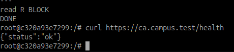
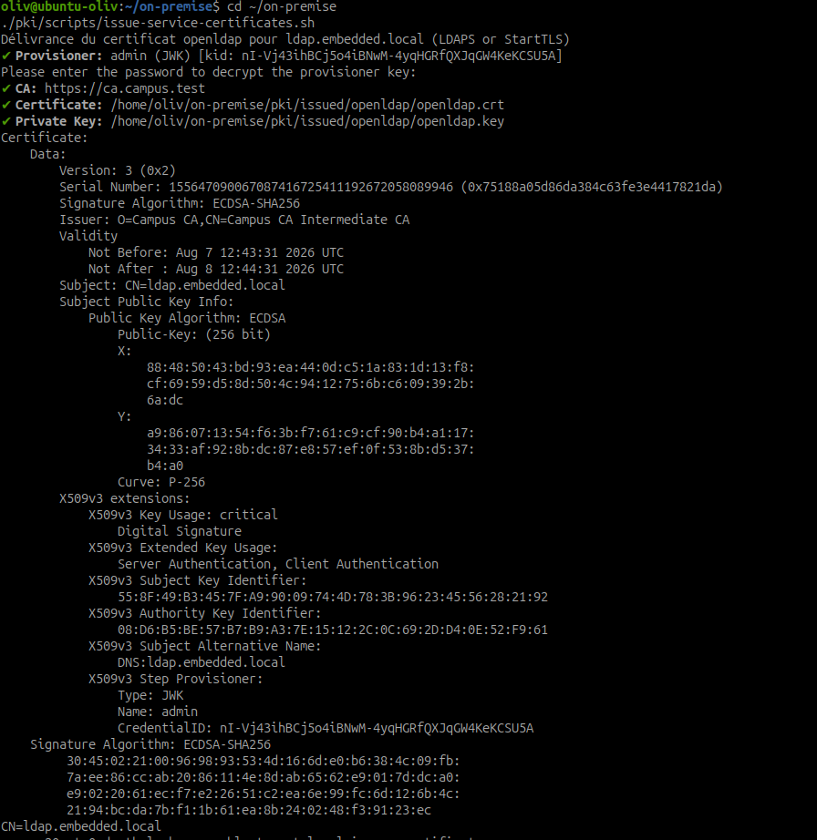
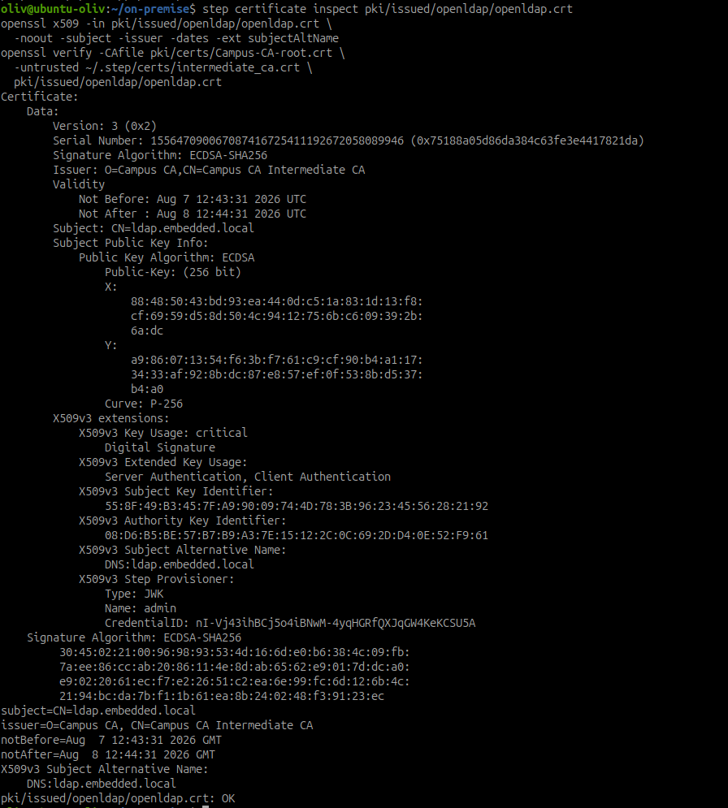
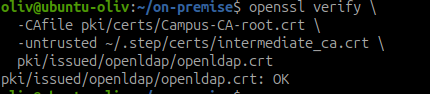

# Générer les certificats des services

## Objectif

Générer les clés privées et les certificats nécessaires aux services identifiés
dans l'inventaire, avec l'autorité `Campus CA` déjà déployée.

Les certificats sont préparés avant leur déploiement dans les conteneurs. Les
clés privées restent dans `~/on-premise/pki/issued/`, un répertoire exclu de
Git. Le mot de passe du provisionneur n'est jamais ajouté au script, à un
fichier `.env` ni à une capture.

## 1. Plan de délivrance

| Service | Nom DNS principal | SAN à prévoir | Usage | Durée cible |
| --- | --- | --- | --- | --- |
| OpenLDAP | `ldap.embedded.local` | `ldap.embedded.local` | LDAPS ou StartTLS | 90 jours |
| Postfix | `smtp.embedded.local` | `smtp.embedded.local`, `mail.embedded.local` | Submission SMTP et SMTP TLS | 90 jours |
| Dovecot | `imap.embedded.local` | `imap.embedded.local`, `mail.embedded.local` | IMAPS ou IMAP StartTLS | 90 jours |
| Roundcube | `webmail.embedded.local` | `webmail.embedded.local` | HTTPS | 90 jours |
| LDAP Account Manager | `lam.embedded.local` | `lam.embedded.local` | HTTPS | 90 jours |
| Kibana | `kibana.embedded.local` | `kibana.embedded.local` | HTTPS | 90 jours |
| Elasticsearch | `elasticsearch.embedded.local` | `elasticsearch.embedded.local` | API HTTPS | 90 jours |
| Site Web publié | Nom DNS validé avant émission | Nom DNS validé avant émission | HTTPS | 90 jours |

`mail.embedded.local` est le nom actuellement défini par le Compose de
messagerie. Les noms `smtp`, `imap`, `webmail`, `lam`, `kibana` et
`elasticsearch` doivent résoudre dans le DNS avant leur déploiement. Ne pas
émettre un certificat pour un nom non validé.

La durée réellement délivrée est contrôlée par la politique de Step CA. La
cible de 90 jours doit être autorisée par les claims de la CA ; sinon Step CA
limite ou refuse la demande. La durée exacte est relevée avec
`step certificate inspect` après chaque émission.

## 2. Préparer le répertoire des certificats

Le dépôt `~/on-premise` contient le plan et le script de délivrance :

```text
~/on-premise/pki/
├── certs/
│   └── Campus-CA-root.crt
├── issued/                 # certificats et clés privées, ignorés par Git
├── scripts/
│   └── issue-service-certificates.sh
└── service-certificate-plan.tsv
```

Le fichier `service-certificate-plan.tsv` décrit les services et leurs SAN. Le
script crée, pour chaque service, un dossier contenant le certificat PEM, la
clé privée PEM, la chaîne complète (certificat de service plus intermédiaire)
et un relevé d'inspection.

## 3. Générer les certificats avec Step CA

Vérifier d'abord que la CA répond et que le certificat racine utilisé est le
bon :

```bash
curl --fail --silent --show-error https://ca.campus.test/health
step certificate fingerprint ~/on-premise/pki/certs/Campus-CA-root.crt
```



*Contrôle préalable : le point de santé de l'autorité renvoie `{"status":"ok"}` depuis le client de test.*

Lancer ensuite la génération depuis l'hôte autorisé. Step demandera le secret
du provisionneur `admin` de manière interactive :

```bash
cd ~/on-premise
./pki/scripts/issue-service-certificates.sh
```



*Preuve de délivrance : le certificat OpenLDAP est émis par `Campus CA Intermediate CA` pour `ldap.embedded.local`.*

Pour demander 90 jours seulement si la politique de la CA l'autorise :

```bash
CERT_NOT_AFTER=2160h ./pki/scripts/issue-service-certificates.sh
```

Le script utilise, pour chaque service, une commande de cette forme :

```bash
step ca certificate ldap.embedded.local \
  pki/issued/openldap/openldap.crt \
  pki/issued/openldap/openldap.key \
  --san ldap.embedded.local \
  --ca-url https://ca.campus.test \
  --root pki/certs/Campus-CA-root.crt \
  --provisioner admin
```

`step ca certificate` génère la clé privée et le certificat signé. La clé est
créée avec des permissions restrictives et ne doit pas être copiée hors du
serveur ou du service qui l'utilisera.

## 4. Vérifier chaque certificat

Après émission, contrôler le sujet, l'émetteur, les dates et les SAN :

```bash
step certificate inspect pki/issued/openldap/openldap.crt
openssl x509 -in pki/issued/openldap/openldap.crt \
  -noout -subject -issuer -dates -ext subjectAltName
openssl verify -CAfile pki/certs/Campus-CA-root.crt \
  -untrusted ~/.step/certs/intermediate_ca.crt \
  pki/issued/openldap/openldap.crt
```

Le résultat attendu de la dernière commande est `OK`. Le certificat de service
est signé par l'intermédiaire Campus CA : la racine sert d'ancre de confiance,
et l'intermédiaire est fourni à OpenSSL avec `-untrusted`. Le fichier
`openldap.fullchain.crt` généré par le script doit être présenté par le service
afin que les clients reçoivent aussi l'intermédiaire.



*L'inspection confirme le sujet, le SAN, l'émetteur et les dates ; OpenSSL termine par `OK`.*



*La racine Campus CA est l'ancre de confiance et le certificat intermédiaire complète la chaîne.*

## 5. Registre des certificats délivrés

Compléter le registre dans `~/on-premise/documentation/certificate-register.md`
avec les valeurs réellement obtenues :

| Service | Nom DNS | Certificat généré | Durée relevée | Vérification |
| --- | --- | --- | --- | --- |
| OpenLDAP | `ldap.embedded.local` | Oui | Environ 24 heures | Sujet, SAN et chaîne validés le 7 août 2026. |
| Postfix | `smtp.embedded.local` | À compléter après émission | À relever | Sujet, SAN et chaîne valides. |
| Dovecot | `imap.embedded.local` | À compléter après émission | À relever | Sujet, SAN et chaîne valides. |
| Roundcube | `webmail.embedded.local` | À compléter après émission | À relever | Sujet, SAN et chaîne valides. |
| LAM | `lam.embedded.local` | À compléter après émission | À relever | Sujet, SAN et chaîne valides. |
| Kibana | `kibana.embedded.local` | À compléter après émission | À relever | Sujet, SAN et chaîne valides. |
| Elasticsearch | `elasticsearch.embedded.local` | À compléter après émission | À relever | Sujet, SAN et chaîne valides. |

## 6. Préparer le déploiement

Avant de monter les certificats dans un conteneur :

1. vérifier que le nom DNS du certificat est bien celui utilisé par le client ;
2. conserver la clé privée dans un volume ou un répertoire protégé ;
3. monter les certificats en lecture seule dans le conteneur ;
4. limiter la lecture de la clé au compte du service ;
5. planifier le rechargement contrôlé du service et le renouvellement.

Les certificats et les clés sont préparés, mais les fichiers Compose ne sont
pas encore modifiés dans cette activité. Leur installation relève du déploiement
TLS propre à chaque service.

## 7. Livrable formateur

Présenter :

1. le plan des noms DNS et des SAN ;
2. un certificat et sa clé par service généré ;
3. l'inspection montrant le sujet, l'émetteur, les SAN et les dates ;
4. le registre des certificats délivrés ;
5. les règles de protection des clés privées.

## Résultat

Les certificats des services sont préparés dans un répertoire local protégé,
signés par Campus CA et vérifiés avant leur déploiement. La durée de validité
est relevée sur chaque certificat réellement délivré.

## Termes à retenir

- **Clé privée** : secret cryptographique utilisé par un service pour prouver
  qu'il possède le certificat.
- **CSR** : demande de signature de certificat ; `step ca certificate` peut
  générer directement la clé et obtenir le certificat sans CSR séparée.
- **SAN** : noms DNS ou adresses supplémentaires valides pour un certificat.
- **Émetteur** : CA qui a signé le certificat.
- **Durée de validité** : période comprise entre `Not Before` et `Not After`.

## Ressources

- [Documentation Step CA](https://smallstep.com/docs/step-ca/)
- [Référence step ca certificate](https://smallstep.com/docs/step-cli/reference/ca/certificate/)
- [SSL - Outil : step-ca (SmallStep)](https://julien-moreau.fr/2025/07/24/ssl-smallstep/)
- [Creating a Private Certificate Authority for Your Homelab with step-ca](https://franfabrizio.dev/posts/private-ca-with-step-ca/)
