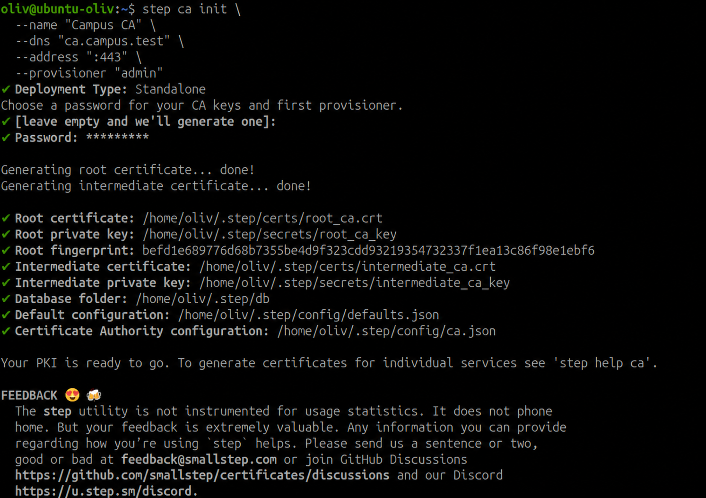
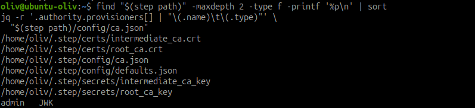
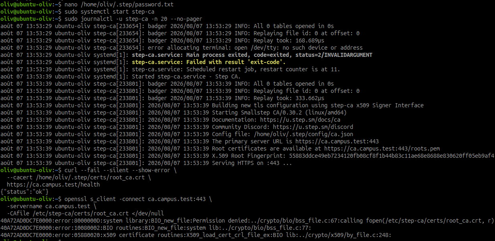
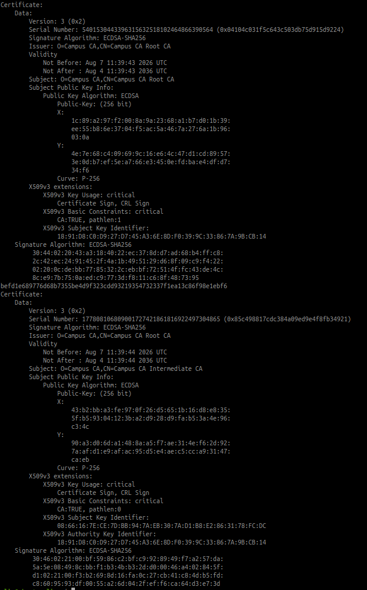

# Installer et initialiser une autorité Step CA

## Objectif

Installer Step CA, initialiser l'autorité de certification interne, créer son
provisionneur, démarrer le service et relever les informations nécessaires pour
que les clients lui fassent confiance.

Les exemples utilisent le nom `Campus CA` et le nom DNS
`ca.campus.test`. Adapter ces deux valeurs au laboratoire avant l'exécution.

## 1. Préparer les paramètres

| Élément | Valeur d'exemple | À conserver |
| --- | --- | --- |
| Nom de l'autorité | `Campus CA` | Oui |
| Nom DNS de la CA | `ca.campus.test` | Oui |
| URL de la CA | `https://ca.campus.test` | Oui |
| Adresse d'écoute | `:443` | Oui |
| Provisionneur JWK | `admin` | Oui, sans son secret |
| Répertoire initial de configuration | `$(step path)` (généralement `~/.step`) | Oui |
| Répertoire du service du laboratoire | `/home/oliv/.step` | Oui |

Avant l'installation, le nom DNS doit résoudre vers l'hôte qui exécute Step CA.
En laboratoire, une entrée temporaire dans le DNS local ou dans `/etc/hosts`
peut suffire. Le nom DNS indiqué lors de l'initialisation doit correspondre au
nom utilisé par les clients.

## 2. Installer Step CA

Ajouter le dépôt officiel Smallstep, puis installer `step-ca` et `step-cli` :

```bash
curl -fsSL https://packages.smallstep.com/keys/apt/repo-signing-key.gpg \
  | sudo gpg --dearmor -o /etc/apt/trusted.gpg.d/smallstep.gpg
echo 'deb https://packages.smallstep.com/stable/debian debs main' \
  | sudo tee /etc/apt/sources.list.d/smallstep.list
sudo apt update
sudo apt install step-ca step-cli
step-ca version
step version
```

Conserver la version affichée dans le compte rendu. Si l'environnement ne
dispose pas d'un accès au dépôt, utiliser le paquet correspondant à la
distribution depuis la documentation officielle plutôt qu'un binaire non
vérifié.

## 3. Initialiser l'autorité et le provisionneur

L'initialisation crée les certificats racine et intermédiaire, la configuration
`ca.json` et le provisionneur JWK nommé `admin` :

```bash
step ca init \
  --name "Campus CA" \
  --dns "ca.campus.test" \
  --address ":443" \
  --provisioner "admin"
```

`step ca init` est une commande du client `step`. Ne pas écrire
`step-ca init` : `step-ca` est le serveur et attend directement le chemin d'un
fichier `ca.json`, ce qui provoque l'erreur « too many positional arguments ».

Le programme demande des mots de passe pour protéger les clés privées et le
provisionneur. Les saisir directement au terminal : ne pas les mettre dans la
documentation, dans l'historique des commandes, dans Git ou dans une capture.

La commande crée d'abord les fichiers dans `$(step path)`, habituellement
`~/.step`. Contrôler les fichiers et le provisionneur créé :

```bash
find "$(step path)" -maxdepth 2 -type f -printf '%p\n' | sort
jq -r '.authority.provisioners[] | "\(.name)\t\(.type)"' \
  "$(step path)/config/ca.json"
```

Le résultat attendu de la seconde commande contient le provisionneur `admin`.
Si un provisionneur supplémentaire est nécessaire, il est créé après le
démarrage de la CA avec une méthode adaptée au besoin, par exemple un
provisionneur ACME pour l'automatisation. Le provisionneur `admin` suffit pour
cette première mise en service.





## 4. Préparer et démarrer le service

Dans le laboratoire, la CA reste dans le répertoire initialisé
`/home/oliv/.step` et le service s'exécute sous le compte `oliv`. Autoriser le
binaire à écouter sur le port 443, puis créer un fichier local contenant le mot
de passe de la clé intermédiaire :

```bash
sudo setcap CAP_NET_BIND_SERVICE=+eip "$(command -v step-ca)"
nano /home/oliv/.step/password.txt
chmod 600 /home/oliv/.step/password.txt
```

Saisir dans `password.txt` le mot de passe de la clé intermédiaire choisi lors
de `step ca init`, puis protéger ce fichier. Ne jamais le placer dans une
variable d'environnement, dans le fichier de service ou dans Git.

Créer ensuite `/etc/systemd/system/step-ca.service` :

```ini
[Unit]
Description=Step CA
After=network-online.target
Wants=network-online.target

[Service]
Type=simple
User=oliv
Group=oliv
WorkingDirectory=/home/oliv
ExecStart=/usr/bin/step-ca /home/oliv/.step/config/ca.json --password-file /home/oliv/.step/password.txt
Restart=on-failure
RestartSec=10

[Install]
WantedBy=multi-user.target
```

Charger l'unité et activer le service pour qu'il démarre aussi après un
redémarrage de l'hôte :

```bash
sudo systemctl daemon-reload
sudo systemctl enable --now step-ca
sudo systemctl status step-ca --no-pager
sudo journalctl -u step-ca -n 50 --no-pager
sudo ss -ltnp | rg ':443'
```

Vérifier ensuite le point de santé en présentant explicitement le certificat
racine de la CA :

```bash
curl --fail --silent --show-error \
  --cacert /home/oliv/.step/certs/root_ca.crt \
  https://ca.campus.test/health
```

Le service est conforme si `systemctl` indique `active (running)`, si le port
443 est en écoute et si l'endpoint `/health` répond sans erreur TLS. En cas
d'échec, vérifier d'abord le mot de passe de la clé intermédiaire, les droits du
fichier `password.txt`, le nom DNS, puis le journal systemd.



Pour une validation plus complète, relever aussi le certificat servi :

```bash
openssl s_client -connect ca.campus.test:443 \
  -servername ca.campus.test \
  -CAfile /home/oliv/.step/certs/root_ca.crt </dev/null
```

La sortie doit se terminer par `Verify return code: 0 (ok)`.

## 5. Informations de confiance à transmettre aux clients

Les clients ne font pas confiance au provisionneur. Ils font confiance au
certificat racine de la CA, puis vérifient le nom DNS et la chaîne présentée par
le serveur.

Relever les informations suivantes :

```bash
step certificate inspect /home/oliv/.step/certs/root_ca.crt
step certificate fingerprint /home/oliv/.step/certs/root_ca.crt
step certificate inspect /home/oliv/.step/certs/intermediate_ca.crt
```



| Élément à fournir ou relever | Commande ou emplacement | Usage client |
| --- | --- | --- |
| Certificat racine public | `/home/oliv/.step/certs/root_ca.crt` | À importer dans le magasin de confiance du système ou de l'application. |
| Empreinte SHA-256 du certificat racine | `step certificate fingerprint .../root_ca.crt` | À comparer par un canal fiable avant l'import. |
| URL de l'autorité | `https://ca.campus.test` | À joindre ou interroger pour les opérations Step CA. |
| Nom DNS attendu | `ca.campus.test` | À faire résoudre vers l'hôte de la CA ; il doit correspondre au certificat serveur. |
| Certificat intermédiaire public | `/home/oliv/.step/certs/intermediate_ca.crt` | À conserver pour le diagnostic ; la CA le présente normalement dans la chaîne. |
| Nom du provisionneur | `admin` | À utiliser par les administrateurs autorisés à demander des certificats. |

Ne jamais transmettre les fichiers du répertoire `secrets/`, les clés privées
des certificats racine ou intermédiaire, ni le mot de passe du provisionneur.
Ces éléments permettent d'émettre ou de signer des certificats et doivent rester
sur l'hôte de la CA avec des droits d'accès restreints.

## 6. Exemple de résultat à présenter

| Élément | Valeur relevée |
| --- | --- |
| Nom de l'autorité | `Campus CA` |
| URL de l'autorité | `https://ca.campus.test` |
| Provisionneur | `admin` |
| État du service | `active (running)` |
| Certificat racine | `/home/oliv/.step/certs/root_ca.crt` |
| Empreinte SHA-256 | Valeur obtenue avec `step certificate fingerprint` |

Présenter au formateur la sortie de l'état du service, la liste des
provisionneurs et l'empreinte du certificat racine. Les mots de passe et les
clés privées ne font pas partie des preuves à montrer.

## 7. Éléments à conserver

- la configuration `/home/oliv/.step/config/ca.json` ;
- les paramètres d'initialisation : nom, DNS, adresse et URL de la CA ;
- le certificat racine public et son empreinte ;
- le certificat intermédiaire public ;
- le nom et le type du provisionneur ;
- la version installée de `step-ca` ;
- une preuve de l'état actif du service et du test `/health`.

Sauvegarder la configuration et les secrets selon la politique de sauvegarde de
l'infrastructure, avec un stockage chiffré et un accès limité. Une perte des
clés de la CA peut empêcher le renouvellement des certificats ; leur divulgation
compromettrait toute la chaîne de confiance.

## Résultat

L'autorité `Campus CA` est installée, initialisée avec le provisionneur `admin`
et active sur son nom DNS. Les clients reçoivent le certificat racine public,
son empreinte, l'URL de la CA et le nom DNS à vérifier ; aucun secret de la CA
ne leur est communiqué.

## Termes à retenir

- **Autorité de certification (CA)** : service qui signe des certificats et
  atteste l'identité de leurs détenteurs.
- **Certificat racine** : certificat public qui ancre la confiance des clients.
- **Certificat intermédiaire** : certificat utilisé par la CA pour signer les
  certificats clients ou serveurs sans exposer directement la clé racine.
- **Provisionneur** : mécanisme autorisant et contrôlant les demandes de
  certificats.
- **Empreinte** : condensat permettant de vérifier l'intégrité et l'identité
  d'un certificat reçu.

## Ressources

- [Documentation Step CA](https://smallstep.com/docs/step-ca/)
- [Step CA sur GitHub](https://github.com/smallstep/certificates)
- [Learning PKI with step ca](https://medium.com/@yann.cardaillac/learning-pki-with-step-ca-101fd0797492)
