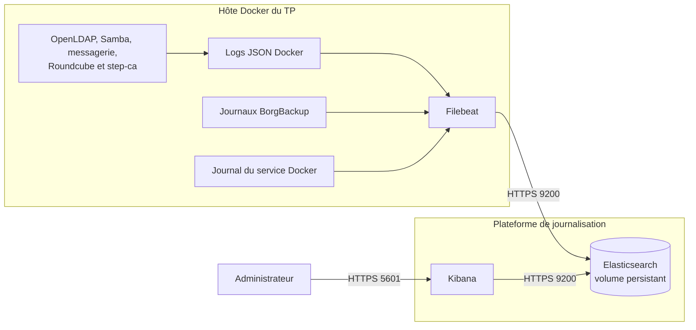

# Concevoir une architecture de centralisation des journaux

## Objectif

Concevoir, sans effectuer de déploiement, une plateforme Filebeat,
Elasticsearch et Kibana capable de centraliser les journaux de l'infrastructure.

## Architecture proposée

Dans le TP, tous les composants peuvent être exécutés sur le même ordinateur
pour limiter les ressources nécessaires. Dans une infrastructure réelle,
Elasticsearch et Kibana doivent être placés sur un serveur de supervision
distinct : la perte de l'hôte Docker ne doit pas faire disparaître les services
et leurs journaux en même temps.

## Choix d'architecture

| Élément | Choix retenu | Justification |
|---|---|---|
| Filebeat | Un agent conteneurisé sur l'hôte Docker | Il lit localement les journaux sans modifier chaque application et conserve sa position de lecture dans un volume dédié. |
| Elasticsearch | Un nœud unique dans une pile `monitoring-compose`, avec volume persistant | Ce dimensionnement suffit pour le TP. Le service reste accessible uniquement sur le réseau Docker de supervision. |
| Kibana | Un conteneur relié à Elasticsearch | Il fournit la recherche, les tableaux de bord et l'analyse des incidents. Seule son interface Web est publiée. |
| Réseau | Réseau Docker dédié `monitoring` | Il sépare les flux de collecte des réseaux applicatifs. Elasticsearch n'a pas besoin d'un port public. |
| Stockage | Volume `elasticsearch_data` sauvegardé et surveillé | Les index survivent au redémarrage des conteneurs. Une alerte est déclenchée à 80 %, puis à 90 % d'occupation. |
| Disponibilité | Nœud unique pour le TP, cluster d'au moins trois nœuds en production | Le nœud unique est simple, mais constitue un point de défaillance. |

## Flux de collecte

| Source | Collecte | Destination |
|---|---|---|
| Sorties `stdout` et `stderr` des conteneurs | Fichiers JSON Docker montés en lecture seule dans Filebeat | Index `logs-docker-*` |
| Authentification OpenLDAP, Samba et step-ca | Champs service, utilisateur, résultat, IP et horodatage | Index `logs-auth-*` |
| Postfix, Dovecot et Roundcube | Événement SMTP, IMAP ou HTTP, résultat et code d'erreur | Index `logs-mail-*` |
| BorgBackup | Lecture de `backup/logs/*.log` et de `last-run.status` | Index `logs-backup-*` |
| Moteur Docker | Entrée `journald` pour les démarrages, arrêts et erreurs | Index `logs-system-*` |
| Filebeat vers Elasticsearch | Envoi par lots sur le port `9200` | Stockage et indexation |
| Kibana vers Elasticsearch | Requêtes sur le port `9200` | Recherche et tableaux de bord |

Les fichiers de journaux sont montés en lecture seule. L'accès au socket Docker
n'est pas nécessaire pour la première version : il donnerait au conteneur un
accès très puissant à l'hôte. Les métadonnées minimales sont ajoutées dans la
configuration Filebeat.

## Conservation retenue

| Catégorie | Durée | Motif |
|---|---:|---|
| Débogage très détaillé | 7 jours | Données volumineuses, utiles immédiatement après une anomalie. |
| Applications et conteneurs | 30 jours | Diagnostic des incidents courants et suivi d'exploitation. |
| Authentification, Samba et certificats | 90 jours | Analyse des accès et incidents de sécurité. |
| Sauvegardes, restaurations et événements PRA | 180 jours | Preuve des sauvegardes et des exercices de reprise. |

Des politiques ILM réalisent la suppression automatique à l'échéance. Le TP
utilise seulement une phase active suivie de la suppression. Une plateforme de
production peut ajouter un stockage moins coûteux avant suppression.

## Sécurisation prévue

- les certificats issus de `step-ca` protégeront Filebeat vers Elasticsearch et
  le navigateur vers Kibana ;
- Filebeat utilisera un compte limité à l'écriture des index attendus ;
- les mots de passe seront conservés hors Git, dans un keystore ou un fichier
  local protégé ;
- Kibana sera publié sur `127.0.0.1:5601` pour le TP, ou derrière un filtrage
  réseau en entreprise ;
- les mots de passe, clés privées, phrases secrètes et contenus complets des
  messages ne devront pas être indexés.

## Vérifications avant le déploiement

1. Confirmer la liste et le format des journaux réellement produits.
2. Vérifier l'espace disque et la mémoire disponibles pour Elasticsearch.
3. Valider les durées de conservation avec le PCA, le PRA et les contraintes de
   protection des données.
4. Présenter le schéma, les flux, les ports et les limites du nœud unique au
   formateur.

## Livrables

- schéma de la plateforme de journalisation ;
- tableau des choix d'architecture ;
- flux de collecte et politique de conservation documentés.
