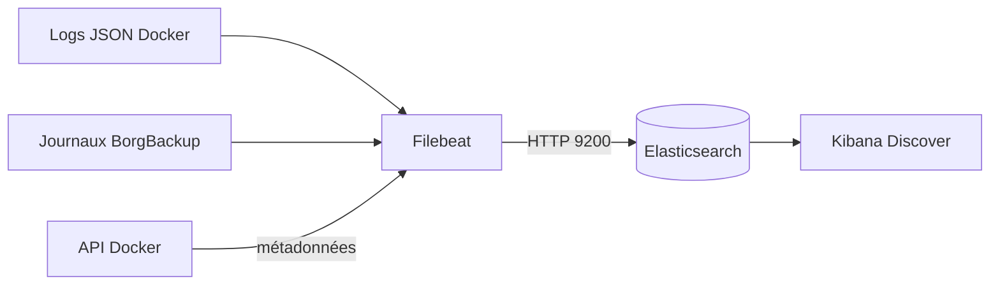

# Configurer la collecte centralisée avec Filebeat

## Objectif

Déployer Filebeat, collecter les journaux Docker et BorgBackup, les transmettre
à Elasticsearch et les rendre consultables dans Kibana.

## 1. Comprendre le pipeline



Filebeat n'est pas un stockage. Il lit les fichiers, transforme chaque ligne en
événement et l'envoie à Elasticsearch. Son registre mémorise la position de
lecture pour reprendre au bon endroit après un redémarrage.

## 2. Vérifier les sources

```bash
docker info --format 'Pilote={{.LoggingDriver}} Racine={{.DockerRootDir}}'
docker ps -a --format 'table {{.Names}}\t{{.Status}}'
find ~/on-premise/backup/logs -maxdepth 1 -type f -printf '%f\n'
```

Le pilote Docker doit être `json-file`. Les journaux des conteneurs se trouvent
alors sous `/var/lib/docker/containers`. Filebeat s'exécute comme `root` dans le
conteneur pour lire ce répertoire.

## 3. Créer `filebeat.yml`

Dans `~/on-premise/monitoring-compose/filebeat.yml` :

```yaml
filebeat.inputs:
  - type: filestream
    id: docker-containers
    enabled: true
    paths:
      - /var/lib/docker/containers/*/*.log
    parsers:
      - container:
          stream: all
          format: docker
    fields_under_root: true
    fields:
      log_source: docker
      event.dataset: docker.container

  - type: filestream
    id: borgbackup-files
    enabled: true
    paths:
      - /var/log/borgbackup/*.log
      - /var/log/borgbackup/last-run.status
    fields_under_root: true
    fields:
      log_source: borgbackup
      service.name: borgbackup
      event.dataset: borgbackup.log

processors:
  - add_docker_metadata:
      host: unix:///var/run/docker.sock
  - drop_event:
      when:
        equals:
          container.name: monitoring-filebeat

setup.template.name: logs-infrastructure
setup.template.pattern: logs-infrastructure*
setup.template.overwrite: true
setup.ilm.enabled: false

setup.kibana:
  host: ${KIBANA_HOST}

output.elasticsearch:
  hosts: ["${ELASTICSEARCH_HOSTS}"]
  index: logs-infrastructure
  preset: balanced

logging.level: info
```

### Explication des blocs

| Bloc | Fonction |
|---|---|
| `filestream` | surveille les fichiers et suit leur progression |
| `id` | identifie durablement chaque input ; le changer peut créer des doublons |
| `container` | retire l'enveloppe JSON Docker et récupère message, flux et date |
| `fields` | ajoute une origine simple utilisable dans Kibana |
| `add_docker_metadata` | ajoute nom, image et labels grâce au socket Docker |
| `drop_event` | empêche Filebeat d'indexer ses propres journaux |
| `setup.template` | prépare les types de champs du data stream |
| `output.elasticsearch` | définit la destination et le nom logique des événements |

Filebeat 9 utilise ici un **data stream** nommé `logs-infrastructure`. Les
index techniques visibles dans `_cat/indices` commencent par
`.ds-logs-infrastructure`.

## 4. Ajouter Filebeat au Compose

Dans `monitoring-compose/compose.yaml`, sous les autres services :

```yaml
  filebeat:
    image: docker.elastic.co/beats/filebeat:${STACK_VERSION}
    container_name: monitoring-filebeat
    restart: unless-stopped
    user: root
    command: ["filebeat", "-e", "--strict.perms=false"]
    depends_on:
      elasticsearch:
        condition: service_healthy
    environment:
      ELASTICSEARCH_HOSTS: http://elasticsearch:9200
      KIBANA_HOST: http://kibana:5601
    volumes:
      - ./filebeat.yml:/usr/share/filebeat/filebeat.yml:ro
      - filebeat_data:/usr/share/filebeat/data
      - /var/lib/docker/containers:/var/lib/docker/containers:ro
      - /var/run/docker.sock:/var/run/docker.sock:ro
      - ../backup/logs:/var/log/borgbackup:ro
    networks:
      - monitoring
```

Déclarer ensuite le volume :

```yaml
volumes:
  filebeat_data:
    name: monitoring_filebeat_data
```

Le fichier de configuration et les journaux sont montés en lecture seule. Le
volume `filebeat_data` reste inscriptible, car Filebeat doit y enregistrer son
registre.

!!! warning "Socket Docker"
    Le socket Docker est nécessaire pour obtenir `container.name` et
    `container.image.name`. Même avec `:ro`, il donne un accès puissant à l'API
    Docker. Il doit être réservé à une image officielle et à une configuration
    maîtrisée.

## 5. Rendre Dovecot collectable

Dovecot n'écrivait initialement aucun événement dans `docker logs`. Les lignes
suivantes ont été ajoutées à `messaging-compose/dovecot/dovecot.conf` :

```text
log_path = /dev/stderr
info_log_path = /dev/stdout
auth_verbose = yes
auth_verbose_passwords = no
```

Les erreurs deviennent visibles par Docker, sans afficher les mots de passe.
Le service est ensuite recréé :

```bash
cd ~/on-premise/messaging-compose
docker compose up -d --force-recreate dovecot
```

## 6. Déployer et tester Filebeat

```bash
cd ~/on-premise/monitoring-compose
docker compose config
docker compose up -d filebeat
docker compose ps

docker compose exec filebeat filebeat test config -e --strict.perms=false
docker compose exec filebeat filebeat test output -e --strict.perms=false
docker compose logs --tail=100 filebeat
```

Les résultats obtenus sont `Config OK`, connexion Elasticsearch `OK` et version
distante `9.3.1`.

## 7. Vérifier Elasticsearch

```bash
curl 'http://127.0.0.1:9200/_data_stream/logs-infrastructure*?pretty'
curl 'http://127.0.0.1:9200/_cat/indices/logs-infrastructure*?v'
```

Pour compter les événements par conteneur et par source :

```bash
curl -s http://127.0.0.1:9200/logs-infrastructure*/_search \
  -H 'Content-Type: application/json' \
  -d '{
    "size": 0,
    "aggs": {
      "conteneurs": {
        "terms": {"field": "container.name", "size": 20}
      },
      "sources": {
        "terms": {"field": "log_source", "size": 10}
      }
    }
  }'
```

## 8. Créer la vue Kibana

Dans Kibana :

1. ouvrir **Stack Management**, puis **Data Views** ;
2. créer la vue `logs-infrastructure*` ;
3. choisir `@timestamp` comme champ temporel ;
4. ouvrir **Discover** et sélectionner **Journaux infrastructure**.

La même opération peut être reproduite par l'API :

```bash
curl -X POST http://127.0.0.1:5601/api/data_views/data_view \
  -H 'kbn-xsrf: true' \
  -H 'Content-Type: application/json' \
  -d '{
    "data_view": {
      "title": "logs-infrastructure*",
      "name": "Journaux infrastructure",
      "timeFieldName": "@timestamp"
    }
  }'
```

## Résultats vérifiés

Instantané du 6 août 2026 à 16 h 19 :

| Service | Filtre | Journaux reçus |
|---|---|---:|
| Docker | `log_source: docker` | Oui, 4 720 |
| Postfix | `container.name: mail-postfix` | Oui, 608 |
| Dovecot | `container.name: mail-dovecot` | Oui, 9 |
| OpenLDAP | `container.name: openldap` | Oui, 1 043 |
| Samba | message `liaison LDAP administrateur refusée` | Oui, 6 |
| BorgBackup | `service.name: borgbackup` | Oui, 210 |

Les compteurs augmentent avec l'activité. Samba était déjà arrêté avant le
démarrage de Filebeat : ses anciens journaux sont bien indexés, mais sans
`container.name`. Le message d'erreur Samba sert donc de preuve. Après un futur
démarrage, les nouveaux événements recevront les métadonnées Docker.

## Problèmes rencontrés et corrections

| Symptôme | Cause | Correction |
|---|---|---|
| `no matching index template` au premier envoi | le motif ne couvrait pas le data stream de base | utilisation de `logs-infrastructure*` et rechargement du template |
| aucun journal Dovecot | le service ne journalisait pas sur les sorties du conteneur | redirection vers `stdout` et `stderr` |
| avertissement sur les fichiers inférieurs à 1 024 octets | `filestream` attend une empreinte suffisante avant lecture | génération de plusieurs événements IMAP de test non sensibles |
| avertissement TLS | Elasticsearch utilise encore HTTP local | accepté pour le TP, à corriger avant exposition réseau |

## Preuves à conserver

1. `docker compose ps` avec Filebeat actif ;
2. `filebeat test output` avec connexion Elasticsearch réussie ;
3. agrégation Elasticsearch montrant les différentes sources ;
4. Kibana Discover avec les filtres Postfix, LDAP et BorgBackup.

## Termes à retenir

- **Filebeat** : agent léger qui lit et transmet des journaux.
- **Input** : définition d'une source à surveiller.
- **Processeur** : transformation ou enrichissement avant l'envoi.
- **Registre** : état local des fichiers et positions déjà lus.
- **Data stream** : ensemble d'index organisé pour des données horodatées.
- **Data view** : vue Kibana permettant d'explorer un ou plusieurs index.

## Ressources

- [Filebeat sur Docker](https://www.elastic.co/docs/reference/beats/filebeat/running-on-docker)
- [Input filestream](https://www.elastic.co/docs/reference/beats/filebeat/filebeat-input-filestream)
- [Métadonnées Docker](https://www.elastic.co/docs/reference/beats/filebeat/add-docker-metadata)
- [Sortie Elasticsearch](https://www.elastic.co/docs/reference/beats/filebeat/elasticsearch-output)
