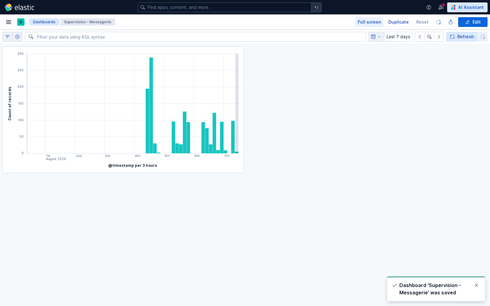
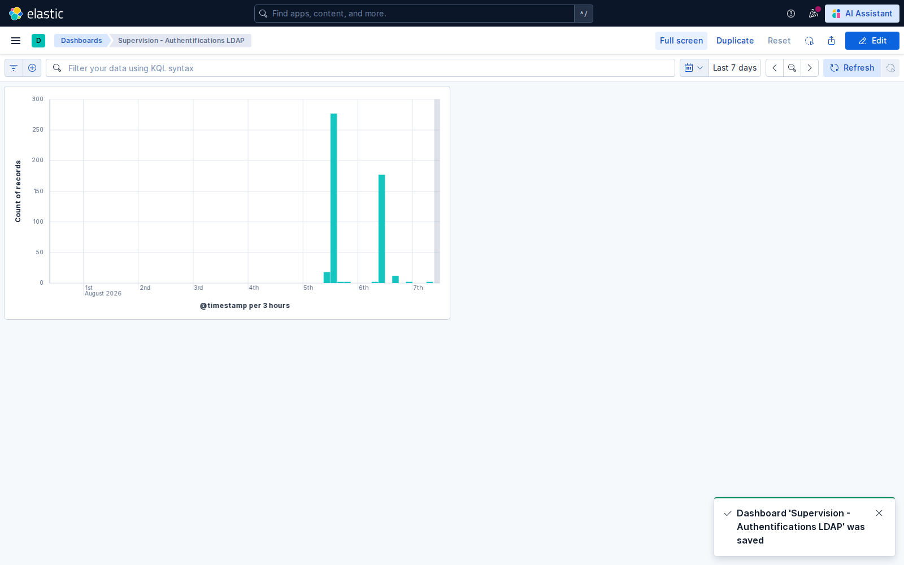
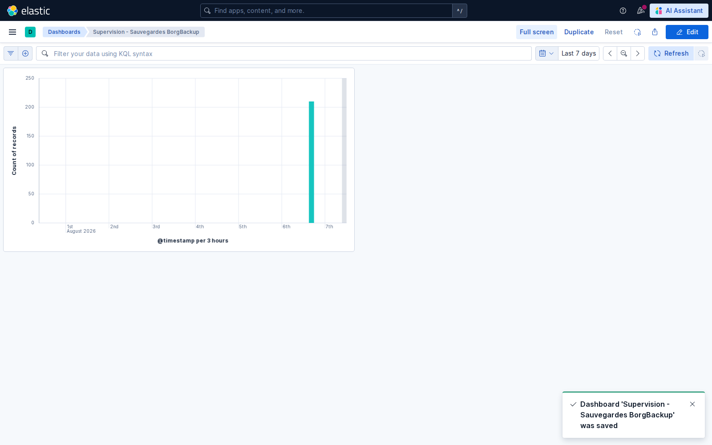
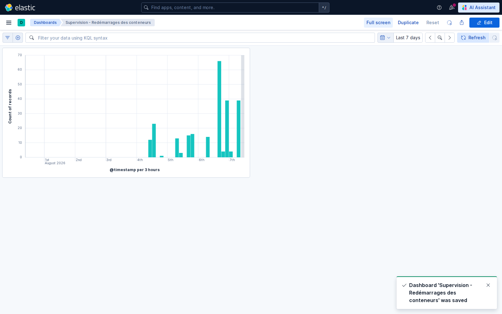
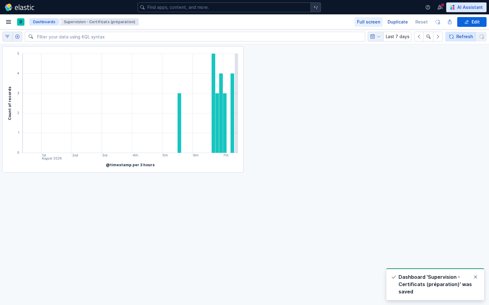

# Créer les tableaux de bord Kibana

## Objectif

Créer des tableaux de bord permettant de suivre les principaux services à
partir des événements centralisés par Filebeat dans
`logs-infrastructure*`.

Les cinq tableaux de bord ont été créés dans Kibana le 7 août 2026 et utilisent
une période enregistrée de sept jours.

## Synthèse

| Tableau de bord | Événements observés | Intérêt quotidien |
|---|---|---|
| Messagerie | Postfix, Dovecot et Roundcube | repérer une baisse d'activité ou une hausse des erreurs |
| Authentifications LDAP | opérations `BIND` et `RESULT` | détecter les échecs de connexion et contrôler l'activité de l'annuaire |
| Sauvegardes BorgBackup | exécutions, résultats et erreurs Borg | vérifier qu'une sauvegarde récente existe et qu'elle se termine correctement |
| Redémarrages des conteneurs | messages de démarrage, d'arrêt et signaux | repérer un service instable ou redémarré fréquemment |
| Certificats | événements TLS, X.509 et futurs journaux step-ca | préparer le suivi des émissions, renouvellements et expirations |

## 1. Vérifier les prérequis

Dans Kibana, la vue **Journaux infrastructure** doit utiliser :

- le motif `logs-infrastructure*` ;
- le champ temporel `@timestamp`.

Vérifier la présence des événements :

```bash
curl 'http://127.0.0.1:9200/_cat/indices/logs-infrastructure*?v'
```

## 2. Méthode de création dans Kibana

Pour chaque tableau de bord :

1. ouvrir <http://127.0.0.1:5601> ;
2. ouvrir **Dashboards**, puis **Create a dashboard** ;
3. sélectionner **Create visualization** ;
4. choisir la vue **Journaux infrastructure** ;
5. déposer `@timestamp` sur l'axe horizontal ;
6. déposer **Records** sur l'axe vertical ;
7. saisir le filtre KQL correspondant au service ;
8. choisir la période **Last 7 days** ;
9. sélectionner **Save and return**, puis enregistrer le tableau de bord.

Lens transforme ici les événements en nombre d'enregistrements par intervalle
de temps. La barre KQL permet ensuite d'affiner temporairement l'analyse.

## 3. Tableau de bord Messagerie

Filtre de la visualisation :

```text
container.name: ("mail-postfix" OR "mail-dovecot" OR "mail-roundcube")
```



Cette vue indique quand les services de messagerie produisent des événements.
Une absence soudaine d'activité ou un pic inhabituel doit conduire à consulter
les messages bruts dans Discover.

Filtres utiles :

```text
container.name: "mail-postfix" AND message: "status=sent"
container.name: "mail-postfix" AND message: (error OR warning OR failed OR reject*)
container.name: "mail-dovecot" AND message: (auth OR login OR failed)
```

## 4. Tableau de bord Authentifications LDAP

Filtre de la visualisation :

```text
container.name: "openldap" AND message: (BIND OR RESULT)
```



Il permet de suivre les demandes de connexion à l'annuaire. Un volume anormal
d'échecs peut révéler un mot de passe erroné, un service mal configuré ou une
tentative d'accès non autorisée.

```text
container.name: "openldap" AND message: "err=0"
container.name: "openldap" AND message: "err=49"
```

`err=0` indique une opération réussie. Le code LDAP `49` correspond à des
identifiants invalides.

## 5. Tableau de bord Sauvegardes BorgBackup

Filtre de la visualisation :

```text
service.name: "borgbackup"
```



L'administrateur contrôle chaque matin la présence d'événements récents, puis
recherche explicitement le succès ou l'échec de la dernière exécution.

```text
service.name: "borgbackup" AND message: ("Sauvegarde terminée" OR "success status")
service.name: "borgbackup" AND message: (ERROR OR failed OR échec)
```

Une activité présente ne suffit pas à prouver le succès : le message final et
le code retour doivent également être vérifiés.

## 6. Tableau de bord Redémarrages des conteneurs

Filtre de la visualisation :

```text
message: ("starting" OR "started" OR "entered RUNNING state" OR "slapd starting" OR "Killed with signal")
```



Cette vue repère les messages applicatifs associés aux démarrages et arrêts.
Des événements rapprochés peuvent révéler une boucle de redémarrage.

!!! warning "Limite de la mesure"
    Filebeat lit actuellement les journaux des conteneurs, pas le flux
    d'événements du moteur Docker. Ce tableau fournit donc un indicateur par
    messages applicatifs. Une mesure exacte de `restart_count` nécessiterait
    une collecte complémentaire des métriques ou événements Docker.

## 7. Tableau de bord Certificats

Filtre de préparation :

```text
message: (certificate OR certificat OR x509 OR TLS OR SSL OR step-ca)
```



Les événements actuels proviennent principalement des composants qui évoquent
TLS ou les certificats dans leurs journaux. Ils ne constituent pas encore une
preuve de supervision de l'autorité de certification.

Après le déploiement de `step-ca`, la collecte devra permettre de filtrer :

```text
container.name: "step-ca"
container.name: "step-ca" AND message: (issued OR renewed OR revoked OR expired OR error)
```

L'objectif sera de repérer les échecs d'émission, les révocations et les
certificats proches de leur expiration.

## 8. Exporter les tableaux de bord

Les tableaux de bord sont persistants dans le volume Elasticsearch. Un export
NDJSON permet aussi de les versionner et de les réimporter :

```bash
cd ~/on-premise/monitoring-compose

curl -X POST 'http://127.0.0.1:5601/api/saved_objects/_export' \
  -H 'kbn-xsrf: true' \
  -H 'Content-Type: application/json' \
  -d '{
    "type": ["dashboard"],
    "includeReferencesDeep": true,
    "excludeExportDetails": true
  }' \
  -o kibana/dashboards.ndjson
```

Réimporter l'export :

```bash
curl -X POST 'http://127.0.0.1:5601/api/saved_objects/_import?overwrite=true' \
  -H 'kbn-xsrf: true' \
  --form file=@kibana/dashboards.ndjson
```

Lister les tableaux enregistrés :

```bash
curl -s 'http://127.0.0.1:5601/api/saved_objects/_find?type=dashboard&per_page=100' \
  -H 'kbn-xsrf: true' |
  jq -r '.saved_objects[] | [.id, .attributes.title] | @tsv'
```

## Résultat

Les cinq tableaux de bord sont enregistrés dans Kibana et exportés dans
`monitoring-compose/kibana/dashboards.ndjson`. Les quatre premières vues
exploitent des journaux réels. La vue certificats est prête, mais devra être
spécialisée et revalidée après le déploiement de `step-ca`.

## Termes à retenir

- **Dashboard** : ensemble de visualisations réunies pour une activité de supervision.
- **Lens** : éditeur de visualisations de Kibana.
- **KQL** : langage utilisé pour filtrer les événements dans Kibana.
- **NDJSON** : format d'export des objets sauvegardés Kibana.

## Ressources

- [Créer un tableau de bord dans Kibana](https://www.elastic.co/docs/explore-analyze/dashboards/create-dashboard)
- [Créer des visualisations avec Lens](https://www.elastic.co/docs/explore-analyze/visualize/lens)
- [Filtrer les données dans Kibana](https://www.elastic.co/docs/explore-analyze/query-filter/filtering)
