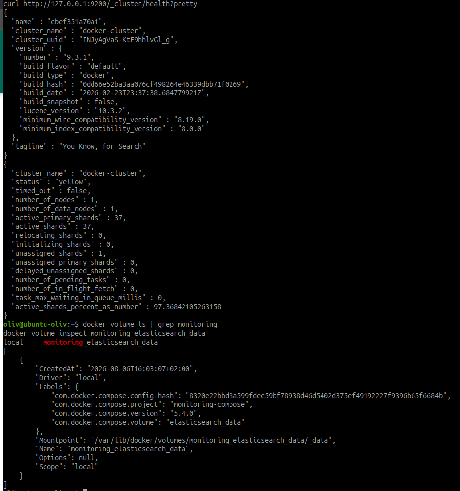

# Déployer Elasticsearch et Kibana

## Objectif

Déployer la plateforme de stockage et de visualisation des journaux, vérifier
sa persistance et accéder à l'interface Web de Kibana.

## 1. Vérifier les prérequis

```bash
free -h
df -h /home
sysctl vm.max_map_count
docker compose version
```

Elasticsearch nécessite de la mémoire et de nombreux espaces de mémoire
mappée. Pour cette version, la valeur recommandée de `vm.max_map_count` est
`1048576`.

Si elle est inférieure, la modification suivante nécessite les droits
d'administration :

```bash
sudo sysctl -w vm.max_map_count=1048576
```

## 2. Préparer le projet

```bash
cd ~/on-premise
mkdir -p monitoring-compose
cd monitoring-compose
```

Le projet contient :

```text
monitoring-compose/
├── compose.yaml
├── .env
├── .env.example
├── .gitignore
└── README.md
```

Le fichier `.env` définit les paramètres locaux :

```dotenv
STACK_VERSION=9.3.1
ELASTICSEARCH_PORT=9200
KIBANA_PORT=5601
```

Le même contenu est placé dans `.env.example`, tandis que `.gitignore`
contient :

```gitignore
.env
```

## 3. Configurer Docker Compose

```yaml
services:
  elasticsearch:
    image: docker.elastic.co/elasticsearch/elasticsearch:${STACK_VERSION}
    container_name: monitoring-elasticsearch
    restart: unless-stopped
    environment:
      discovery.type: single-node
      xpack.security.enabled: "false"
      ES_JAVA_OPTS: -Xms1g -Xmx1g
    ports:
      - "127.0.0.1:${ELASTICSEARCH_PORT}:9200"
    volumes:
      - elasticsearch_data:/usr/share/elasticsearch/data
    networks:
      - monitoring
    ulimits:
      memlock:
        soft: -1
        hard: -1
    healthcheck:
      test: ["CMD-SHELL", "curl --fail --silent http://localhost:9200/_cluster/health >/dev/null || exit 1"]
      interval: 10s
      timeout: 5s
      retries: 30
      start_period: 40s

  kibana:
    image: docker.elastic.co/kibana/kibana:${STACK_VERSION}
    container_name: monitoring-kibana
    restart: unless-stopped
    depends_on:
      elasticsearch:
        condition: service_healthy
    environment:
      ELASTICSEARCH_HOSTS: http://elasticsearch:9200
      SERVER_NAME: kibana.embedded.local
    ports:
      - "127.0.0.1:${KIBANA_PORT}:5601"
    networks:
      - monitoring

networks:
  monitoring:
    name: monitoring

volumes:
  elasticsearch_data:
    name: monitoring_elasticsearch_data
```

La sécurité Elastic est désactivée uniquement pour ce TP fonctionnel. Les deux
interfaces sont limitées à l'ordinateur local. Avant une exposition réseau,
l'authentification et TLS devront être activés avec les certificats de
`step-ca`.

## 4. Valider et démarrer

```bash
docker compose config
docker compose up -d
docker compose ps
```

Le premier téléchargement peut prendre plusieurs minutes. En cas de problème :

```bash
docker compose logs --tail=100 elasticsearch
docker compose logs --tail=100 kibana
```

## 5. Vérifier Elasticsearch

```bash
curl http://127.0.0.1:9200
curl http://127.0.0.1:9200/_cluster/health?pretty
```

Avec un seul nœud, l'état peut être `yellow` lorsque des répliques ne peuvent
pas être attribuées. Le service reste opérationnel pour le TP.

## 6. Ouvrir Kibana

```bash
curl -I http://127.0.0.1:5601
```

Ouvrir ensuite <http://127.0.0.1:5601> dans le navigateur et conserver une
capture de l'interface.


Cette capture confirme que Kibana est démarré, joignable depuis le navigateur
et connecté à une plateforme Elastic prête à recevoir des intégrations.

## 7. Vérifier le volume

```bash
docker volume ls | grep monitoring
docker volume inspect monitoring_elasticsearch_data
```

Les index Elasticsearch sont enregistrés dans ce volume et non dans la couche
éphémère du conteneur.



La sortie confirme la version Elasticsearch `9.3.1`, un nœud actif, tous les
shards primaires disponibles et la présence du volume
`monitoring_elasticsearch_data`. L'état `yellow` correspond à la réplique non
attribuable sur le nœud unique du TP ; il ne signale pas la perte d'un shard
primaire.

## 8. Tester le redémarrage et la persistance

Créer un index de preuve :

```bash
curl -X PUT http://127.0.0.1:9200/validation-persistance
curl http://127.0.0.1:9200/_cat/indices/validation-persistance?v
```

Recréer ensuite les conteneurs sans supprimer le volume :

```bash
docker compose down
docker compose up -d
docker compose ps
curl http://127.0.0.1:9200/_cat/indices/validation-persistance?v
```

Ne pas utiliser `docker compose down -v` : l'option `-v` supprimerait les
données Elasticsearch.

## Résultats

| Vérification | Résultat attendu | Résultat obtenu |
|---|---|---|
| Elasticsearch opérationnel | API accessible et cluster `green` ou `yellow` | Conforme : conteneur `healthy` |
| Kibana accessible | interface sur le port `5601` | Conforme : API Kibana accessible |
| Volume persistant | volume `monitoring_elasticsearch_data` présent | Conforme |
| Redémarrage | deux services de nouveau actifs | Conforme après `down` puis `up -d` |
| Persistance | index de validation toujours présent | Conforme |

Le 6 août 2026, le cluster est passé de `green` à `yellow` après la création de
l'index témoin. Le shard primaire est actif ; seule sa réplique reste non
attribuée, car le TP utilise un nœud unique. Aucun message d'erreur de démarrage
n'a été relevé. L'avertissement Kibana relatif à l'assistant IA concerne une
fonction nécessitant une licence supérieure et ne bloque pas la plateforme.

## Preuves visuelles intégrées

1. santé de l'API Elasticsearch et inspection du volume persistant ;
2. accès à l'interface Web de Kibana.

Une capture complémentaire de `docker compose ps` peut être ajoutée si le
formateur souhaite voir explicitement l'état des deux conteneurs sur une seule
preuve.

## Termes à retenir

- **Elasticsearch** : moteur qui indexe et recherche les événements.
- **Kibana** : interface de consultation et de visualisation des données.
- **Index** : ensemble logique de documents dans Elasticsearch.
- **Volume** : stockage persistant indépendant du conteneur.
- **Cluster health** : état de santé global du cluster Elasticsearch.

## Docs associées

- [Installation d'Elasticsearch avec Docker](https://www.elastic.co/docs/deploy-manage/deploy/self-managed/install-elasticsearch-with-docker)
- [Mémoire virtuelle requise par Elasticsearch](https://www.elastic.co/docs/deploy-manage/deploy/self-managed/vm-max-map-count)
- [Installation de Kibana avec Docker](https://www.elastic.co/guide/en/kibana/current/_image_types.html)
