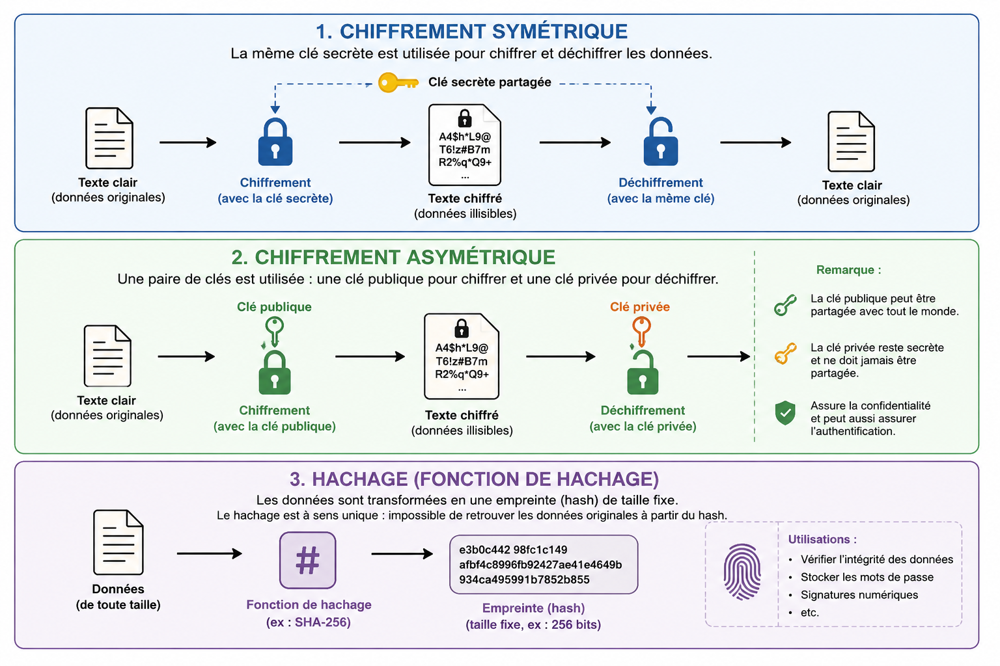

# CyberSécurité

## définition

Ensemble des moyens utilisés pour assurer la sécurité des systèmes et des données informatiques d'un État, d'une entreprise, etc.

## les chapeaux

- black hat : personnes qui attanques pour l'argent ou un gouvernement.
- white hat : celui qui pirate pour faire un rapport de sécurité à l'entreprise.
- grey hat : pirate sans autorisations juste pour trouver les failles et préviens s'il trouve.

## Les équipes cyber

- red Team: c'est une équipe qui attaque l'entreprise en interne
- blue Team: celle qui défend
- purple team: la fusion des 2 pour voir les résultats et comment défendre.

## CVE

le CVE (Common Vulnerability and Exposure) est une alerte de sécurité sur les failles de sécurités.

il fonctionne avec une note de 0 à 10.

Fourchette de scores :

0.0 : Aucun

0.1 – 3.9 : Faible

4.0 – 6.9 : Moyen

7.0 – 8.9 : Haut

9.0 – 10.0 : Critique

CVE utilise trois groupes de mesures clés pour calculer le score final :
Score de base

Ce score représente les propriétés inhérentes d'une vulnérabilité qui sont constantes dans le temps et dans les différents environnements. Il comprend des facteurs tels que la complexité de l'attaque, les privilèges requis, l'interaction avec l'utilisateur et l'impact potentiel.
Note temporelle

Ce score tient compte de facteurs qui peuvent évoluer dans le temps, tels que la disponibilité des correctifs, la maturité du code d'exploitation et la mesure de la confiance dans les rapports.
Score environnemental

Ce score reflète les caractéristiques spécifiques de l'environnement cible, telles que la présence de contrôles de sécurité, la valeur des actifs affectés et l'impact potentiel sur les objectifs de l'organisation.

## Acteur en France et place de l'AIS

### Les acteurs en France

- L’ANSSI est l’autorité française chargée de la cybersécurité et de la cyberdéfense. Elle a pour missions de protéger les systèmes informatiques, de mieux connaître les menaces, de partager les bonnes pratiques, d’accompagner les organisations,
de contrôler et certifier la sécurité de certains produits et prestataires.

- Le CERT-FR est le service de l’État chargé de surveiller les menaces informatiques et de réagir aux incidents de cybersécurité en France. Il a pour mission de surveiller les cybermenaces, d’aider à gérer les incidents,bde centraliser les alertes et demandes d’assistance, de protéger les systèmes numériques importants pour la nation. il répertorie les CVE.

- La CNIL protège les données personnelles en France et veille au respect du RGPD et de la loi Informatique et Libertés.
Elle a pour rôle d’informer et protéger les citoyens, d’aider les organismes à respecter les règles, d’anticiper les nouveaux usages du numérique, de contrôler et sanctionner en cas de non-conformité.

- cybermalveillance.gouv.fr :c'est une aide aux victimes de cyberattaques, sensibilise aux dangers du numérique et suit l’évolution des menaces en France.
Le site permet d’aider les victimes en ligne et de les orienter vers des professionnels en cybersécurité, de prévenir les risques grâce à des conseils, guides et supports de sensibilisation, d’analyser les menaces pour mieux adapter la prévention et l’assistance.

### La place de l'AIS

L'AIS participe à la sécurité au quotidien en administrant correctement les systèmes, les réseaux et les accès.

Il applique les bonnes pratiques : mises à jour, gestion des droits, mots de passe solides, sauvegardes, surveillance des logs et limitation des services inutiles.

Il n'est pas forcément celui qui attaque ou analyse toutes les failles en profondeur, mais il doit savoir repérer un comportement anormal, réagir proprement et transmettre les bonnes informations en cas d'incident.

## Les principales menaces et attaques

les menaces :

- L'hameçonnage ou phishing est une forme d'escroquerie sur internet. Le fraudeur se fait passer pour un organisme que vous connaissez (banque, service des impôts, CAF, etc.), en utilisant le logo et le nom de cet organisme.
- un malware  est un programme développé dans le but de nuire à un système informatique, sans le consentement de l'utilisateur dont l'ordinateur est infecté.
- Les rançongiciels, ou ransomware en anglais, désignent des programmes informatiques malveillants. Il s'agit de mettre votre ordinateur ou votre système d'information hors d'état de fonctionner de manière réversible en chiffrant vos données.

les attaques :

- **Attaques physiques** : elles visent directement le matériel ou les accès locaux. Exemple : vol d'un ordinateur, clé USB piégée, accès non autorisé à une salle serveur.
- **Attaques humaines** : elles exploitent surtout la confiance ou l'erreur humaine. Exemple : phishing, appel frauduleux, usurpation d'identité, mot de passe donné trop facilement.
- **Attaques réseau** : elles passent par les communications entre machines. Exemple : scan de ports, interception de données, attaque par déni de service, exploitation d'un service mal sécurisé, faille de sécurité logiciel.

!!! tip "À retenir"
    La sécurité ne concerne pas seulement les logiciels : elle dépend aussi des personnes, du matériel et du réseau.

## Cas concret : cyberattaque du CHU de Rouen

En novembre 2019, le CHU de Rouen a été touché par une attaque par rançongiciel.
L'attaque a fortement perturbé le système d'information de l'hôpital : plusieurs applications métiers sont devenues inaccessibles, des postes de travail ont été infectés et des fichiers présents sur des ordinateurs et des serveurs ont été chiffrés.

### Avant l'attaque

L'attaque est liée à un scénario classique de rançongiciel :

- une campagne d'hameçonnage peut servir de point d'entrée,
- un utilisateur ouvre un email ou une pièce jointe piégée,
- un malware s'installe discrètement sur une machine,
- les attaquants explorent ensuite le réseau interne,
- ils cherchent à obtenir plus de droits pour atteindre davantage de serveurs et de postes.

Dans le cas de Clop, l'ANSSI indique que le chiffrement est souvent précédé d'une phase de propagation manuelle dans le réseau, pendant plusieurs jours.
Cette phase est importante pour la défense, car elle peut laisser des traces détectables avant le déclenchement massif du rançongiciel.

### Pendant l'attaque

Le 15 novembre 2019 vers 19 h, l'attaque est détectée au CHU de Rouen.
Le rançongiciel chiffre des fichiers et bloque l'accès à de nombreuses applications.

Les premières actions de sécurité consistent à :

- identifier rapidement qu'il s'agit d'un rançongiciel,
- limiter la propagation dans le réseau,
- isoler les machines ou services touchés,
- protéger les sauvegardes,
- passer en mode dégradé pour continuer l'activité.

À l'hôpital, certains services ont dû fonctionner avec des procédures papier ou par téléphone, notamment pour les prescriptions, les comptes rendus et les admissions.
La DSI du CHU a mené les premières actions, puis l'ANSSI est intervenue en appui.

### Après l'attaque

Après la crise, l'objectif est de reconstruire progressivement le système d'information sans réinfecter les machines.

Les actions importantes sont :

- restaurer les services par ordre de priorité,
- vérifier les sauvegardes avant restauration,
- analyser les traces pour comprendre le chemin de l'attaque,
- changer les mots de passe et contrôler les comptes à privilèges,
- corriger les failles utilisées,
- renforcer la surveillance des logs,
- déposer plainte et documenter l'incident.

Le CHU de Rouen a indiqué qu'aucune fuite de données médicales ou personnelles n'avait été constatée à ce stade et qu'une plainte avait été déposée.

!!! tip "À retenir"
    Un rançongiciel ne se déclenche pas toujours dès l'entrée dans le réseau. Il peut y avoir une phase silencieuse où l'attaquant explore, se déplace et prépare le chiffrement. Les sauvegardes, les logs, la segmentation réseau et la réaction rapide sont donc essentiels.

Sources :

- CHU de Rouen : [Le point sur l'attaque informatique du 15 novembre 2019](https://www.chu-rouen.fr/le-point-sur-lattaque-informatique-du-15-novembre-2019/)
- CERT-FR / ANSSI : [Informations concernant le rançongiciel Clop](https://cert.ssi.gouv.fr/cti/CERTFR-2019-CTI-009/)
- Document apprenant : `cyberattaques_apprenant.pdf`

## Hygiène numérqiue

### mot de passe & MFA/2FA

Un bon mot de passe doit être **unique**, **long** et **difficile à deviner**.

L'authentification multifacteur (MFA) ajoute une couche de protection au processus de connexion. Pour accéder à leurs comptes ou à des applications, les utilisateurs doivent confirmer leur identité, par exemple en scannant leur empreinte ou en entrant un code reçu par téléphone.

Règles importantes :

- utiliser un mot de passe différent pour chaque compte,
- choisir au moins `12` caractères quand c'est possible,
- mélanger majuscules, minuscules, chiffres et caractères spéciaux,
- éviter les informations personnelles comme une date de naissance ou un prénom,
- activer la double authentification quand elle est disponible,
- changer le mot de passe en cas de doute ou pour les comptes sensibles.

### Gestionnaire de mot de passe

 s'agit d'une solution numérique avec laquelle l'utilisateur peut gérer ses mots de passe en centralisant l'ensemble de ses identifiants et mots de passe dans une base de données (dit portefeuille).

### Sauvegarde

Les sauvegardes permettent de récupérer les données en cas de panne, suppression accidentelle, vol ou ransomware.

Une bonne méthode est la règle **3-2-1-1** :

- `3` copies des données,
- `2` supports différents,
- `1` copie hors site,
- `1` copie hors ligne.

Bon réflexe :

- sauvegarder régulièrement,
- protéger les sauvegardes,
- vérifier que la sauvegarde s'est bien terminée,
- tester une restauration pour s'assurer que les données sont récupérables.

!!! warning "Important"
    Une sauvegarde non testée n'est pas totalement fiable. Il faut vérifier qu'on peut vraiment restaurer les données.

### Part feu

Les pare-feux filtrent les flux de trafic entrants, empêchant l'accès non autorisé aux données sensibles et déjouant les infections potentielles par des malwares. Les menaces internes telles que les acteurs malveillants connus ou les applications à risque.

Exemple de paramétrage pour un serveur web avec `ufw` :

```bash
sudo ufw default deny incoming   # bloque les connexions entrantes par défaut
sudo ufw default allow outgoing  # autorise les connexions sortantes
sudo ufw allow 22/tcp            # autorise SSH
sudo ufw allow 80/tcp            # autorise HTTP
sudo ufw allow 443/tcp           # autorise HTTPS
sudo ufw enable                  # active le pare-feu
sudo ufw status                  # affiche les règles actives
```

Dans cet exemple :

- le port `22` permet l'administration à distance avec SSH,
- le port `80` permet l'accès au site en HTTP,
- le port `443` permet l'accès au site en HTTPS,
- les autres connexions entrantes sont bloquées par défaut.

!!! warning "Attention"
    Avant d'activer un pare-feu à distance, il faut toujours autoriser SSH, sinon on risque de perdre l'accès au serveur.

### Mises à jour logiciels et OS

Les mises à jour servent à corriger des bugs et des failles de sécurité.

Un système non mis à jour peut garder des vulnérabilités connues, donc plus faciles à exploiter.

Bon réflexe :

- mettre à jour régulièrement l'OS,
- mettre à jour les logiciels installés,
- vérifier si un redémarrage est nécessaire,
- appliquer rapidement les correctifs de sécurité importants.

Exemple sur Debian ou Ubuntu :

```bash
sudo apt update
sudo apt upgrade
```

### Logs

Les logs sont des journaux qui enregistrent les événements d'une machine.

Ils permettent de comprendre ce qu'il s'est passé, par exemple :

- une erreur système,
- un service qui ne démarre pas,
- une tentative de connexion,
- un problème réseau,
- une action utilisateur.

On les trouve souvent dans :

```text
/var/log
```

Commandes utiles :

```bash
journalctl -xe
tail -f /var/log/syslog
```

!!! tip "À retenir"
    Quand un service ne fonctionne pas, les logs sont souvent le meilleur endroit pour commencer le diagnostic.

## Le chiffrement

### Cryptographie

La cryptographie est l'ensemble des techniques qui permettent de protéger une information.
Elle sert notamment à assurer la confidentialité, l'intégrité des données et l'authentification.
Le chiffrement fait partie de la cryptographie.

### Chiffrement

Le chiffrement consiste à transformer une information lisible en information illisible sans la bonne clé.
Il sert à protéger les données, par exemple pendant leur stockage ou pendant leur transmission sur un réseau.

Il existe deux grandes familles de chiffrement :

- le chiffrement **symétrique**, où la même clé sert à chiffrer et déchiffrer. Il est rapide et adapté aux gros volumes de données. Exemple : **AES**, utilisé pour protéger des fichiers, des connexions Wi-Fi ou des VPN.
- le chiffrement **asymétrique**, où deux clés différentes sont utilisées : une clé publique et une clé privée. Il est utile pour sécuriser les échanges sur Internet. Exemples : **RSA** et **ECC**.



Autres notions liées :

- **FPE** : chiffrement avec préservation du format. Les données restent dans le même format, par exemple un numéro de téléphone garde la forme d'un numéro de téléphone.
- **Hachage** : ce n'est pas vraiment du chiffrement, car on ne peut pas revenir au texte d'origine. Il sert surtout à vérifier l'intégrité d'une donnée ou à stocker des mots de passe de manière plus sûre.

### HTTPS

HTTPS est la version sécurisée de HTTP.
Il chiffre les échanges entre le navigateur et le site web, ce qui limite les risques d'interception ou de modification des données pendant le trajet.

### Le cadenas dans le navigateur

Le cadenas affiché dans le navigateur indique que la connexion avec le site utilise HTTPS.
Il ne veut pas dire que le site est forcément fiable, mais il montre que la communication est chiffrée et que le navigateur a pu vérifier le certificat du site.
