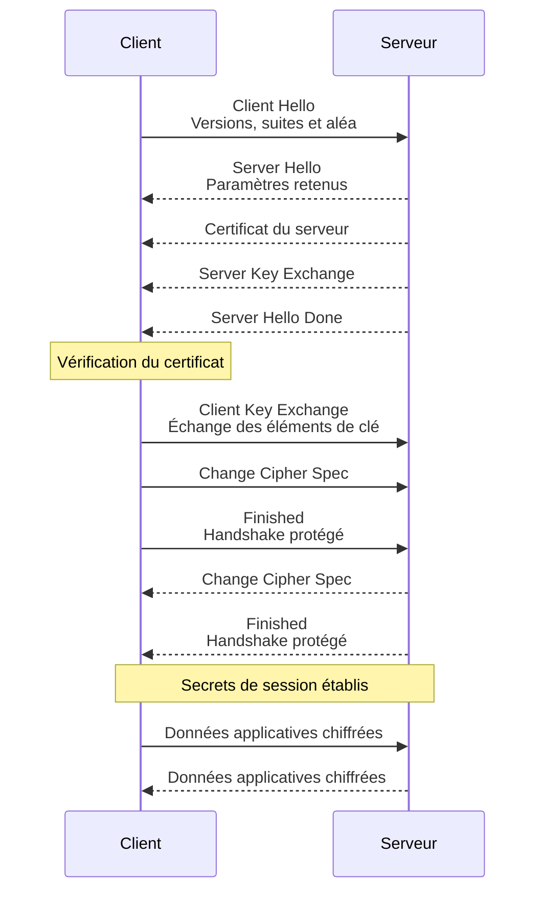

# Comprendre et vérifier une connexion TLS

## Objectif

Cette activité permet de comprendre ce que protège TLS, le rôle des
certificats et des clés, ainsi que les paramètres observables et vérifiables
avec OpenSSL.

## Partie 1 — Retour sur l'analyse ANSSI

Les recommandations les plus faciles à appliquer concernaient les versions
de protocoles et les algorithmes autorisés. Les points plus difficiles étaient
ceux qui nécessitaient de connaître la configuration effective, par exemple la
configuration d'un reverse proxy, la chaîne de certificats réellement
présentée ou les suites cryptographiques disponibles.

### Qu'est-ce qui était le plus difficile : comprendre la recommandation ou retrouver l'information dans la configuration ?

Retrouver l'information dans la configuration était le plus difficile. Une
recommandation peut être claire, mais sa vérification nécessite de connaître le
service concerné, le fichier de configuration, la version du logiciel et les
paramètres effectivement négociés avec un client.

---

## Partie 2 — Que protège TLS ?

| Propriété | TLS contribue-t-il à la protéger ? | Comment ? |
| --- | --- | --- |
| Confidentialité | Oui | Les données applicatives sont chiffrées avec une clé de session symétrique. |
| Intégrité | Oui | Les messages sont protégés contre les modifications grâce à un mécanisme d'intégrité authentifiée, généralement AEAD comme AES-GCM ou ChaCha20-Poly1305. |
| Disponibilité | Non, pas directement | TLS ne résiste pas à une panne, à une coupure réseau ou à une attaque par déni de service. |
| Authenticité du serveur | Oui, si la vérification est correctement effectuée | Le client vérifie le certificat, son nom, sa période de validité et sa chaîne de confiance. |

### TLS empêche-t-il un attaquant de rendre le serveur indisponible ?

Non. TLS protège principalement les échanges lorsqu'une connexion peut être
établie. Un attaquant peut toujours saturer le réseau ou le serveur, bloquer
les connexions ou exploiter une vulnérabilité du service.

### TLS protège-t-il les données avant leur envoi ou après leur réception ?

TLS protège les données pendant leur transport entre les deux extrémités. Les
données sont chiffrées avant de traverser le réseau et déchiffrées à leur
arrivée. Elles ne sont donc pas nécessairement protégées avant leur prise en
charge par TLS ni après leur déchiffrement par l'application.

---

## Partie 3 — Retrouver les briques cryptographiques dans TLS

| Brique | Où intervient-elle dans TLS ? | Pourquoi ? |
| --- | --- | --- |
| Aléa | Dans les valeurs aléatoires du handshake et dans la génération des clés de session. | Empêcher la prédiction et produire des secrets différents entre les sessions. |
| Chiffrement symétrique | Après le handshake, pour les données applicatives. | Protéger efficacement un grand volume de données avec de bonnes performances. |
| Cryptographie asymétrique | Pour authentifier le serveur et, selon le mécanisme utilisé, participer à l'établissement du secret. | Utiliser la clé publique du serveur et prouver la possession de sa clé privée. |
| Hash | Dans les signatures, la dérivation des clés et la vérification de l'intégrité du handshake. | Obtenir une empreinte ou une entrée de taille fixe difficile à inverser. |
| Signature | Dans le certificat et dans la preuve d'authenticité du serveur pendant le handshake. | Permettre de vérifier qu'une autorité ou le serveur a signé les informations correspondantes. |
| Certificat | Présenté par le serveur au client. | Lier une identité, notamment un nom DNS, à une clé publique et à une chaîne de confiance. |

### Pourquoi TLS n'utilise-t-il pas simplement la cryptographie asymétrique pour chiffrer toutes les données échangées ?

La cryptographie asymétrique est beaucoup plus coûteuse en calcul et moins
adaptée au chiffrement de gros volumes. TLS l'utilise donc surtout pour
l'authentification et l'établissement initial des secrets. Les données sont
ensuite chiffrées avec une clé symétrique, plus rapide et adaptée à une
connexion longue.

---

## Partie 4 — Comprendre l'établissement d'une connexion

1. Le client propose les versions TLS et les suites cryptographiques qu'il accepte, avec une valeur aléatoire.
2. Le serveur choisit les paramètres compatibles et présente son certificat. Il fournit également les éléments nécessaires à l'établissement du secret de session.
3. Le client vérifie que le certificat est valide, qu'il correspond au nom demandé et qu'il remonte à une autorité de certification de confiance.
4. Le client et le serveur exécutent l'échange de clés, généralement avec ECDHE en TLS moderne. Ils calculent indépendamment les mêmes secrets de session sans les transmettre directement sur le réseau.
5. Le serveur prouve qu'il possède la clé privée associée au certificat et les deux parties vérifient l'intégrité du handshake.
6. Les données applicatives sont alors protégées avec la cryptographie symétrique et le mécanisme d'intégrité négociés.

Le serveur présente donc son identité pendant le handshake, avant que les
données applicatives soient échangées. Le client la vérifie avec le certificat
et les autorités de certification qu'il considère fiables. Les secrets de
session sont établis pendant le handshake, puis utilisés par les deux parties
pour le chiffrement symétrique.



Pour le déroulement détaillé octet par octet, voir [The Illustrated TLS 1.2
Connection](https://tls12.xargs.org/).

---

## Partie 5 — Examiner un certificat

Commande utilisée, en remplaçant la cible par le service indiqué par le
formateur :

```bash
openssl s_client -connect serveur.example.org:443 -servername serveur.example.org -showcerts
```

Le certificat peut être extrait entre `-----BEGIN CERTIFICATE-----` et
`-----END CERTIFICATE-----`, puis examiné avec :

```bash
openssl x509 -in certificat.pem -text -noout
```

| Information | Valeur observée |
| --- | --- |
| Sujet / identité | Le sujet du certificat, notamment le nom commun éventuel ; pour un certificat moderne, les noms DNS sont surtout vérifiés dans `Subject Alternative Name`. |
| Émetteur | L'autorité de certification indiquée dans le champ `Issuer`. |
| Période de validité | Les champs `Not Before` et `Not After`, à comparer avec la date actuelle. |
| Clé publique | La clé publique contenue dans le certificat. |
| Algorithme de clé publique | Généralement `id-ecPublicKey` avec une courbe elliptique, ou RSA selon le certificat observé. |
| Algorithme de signature | L'algorithme utilisé par l'autorité pour signer le certificat, par exemple `ecdsa-with-SHA256` ou `sha256WithRSAEncryption`. |
| Noms DNS concernés | Les valeurs du champ `X509v3 Subject Alternative Name`, par exemple `DNS:serveur.example.org`. |

### Quel élément permet d'associer le certificat au nom du serveur utilisé ?

Le champ `Subject Alternative Name` doit contenir le nom DNS demandé par le
client. Le client compare ce nom au nom utilisé dans l'URL ou dans la commande
`-servername`.

### Qui a signé le certificat ?

L'autorité de certification indiquée dans le champ `Issuer`. Sa signature est
vérifiable avec la clé publique du certificat de l'autorité supérieure.

### Le certificat contient-il la clé privée du serveur ?

Non. Il contient la clé publique et l'identité certifiée. La clé privée doit
être conservée séparément par le serveur et ne doit jamais être communiquée au
client.

---

## Partie 6 — Observer la négociation TLS

Commande utilisée :

```bash
openssl s_client -connect serveur.example.org:443 -servername serveur.example.org
```

Les lignes `Protocol`, `Cipher`, `Server certificate` et `Verify return code`
permettent de relever les informations principales. La valeur exacte dépend de
la cible choisie et doit être remplacée par l'observation réalisée.

| Élément | Valeur |
| --- | --- |
| Version TLS | À relever dans la ligne `Protocol`, par exemple `TLSv1.3`. |
| Suite cryptographique | À relever dans la ligne `Cipher`, par exemple `TLS_AES_256_GCM_SHA384`. |
| Certificat | Nom du serveur, émetteur et chaîne présentée dans la section `Certificate chain`. |
| Vérification | `Verify return code: 0 (ok)` si la chaîne est valide et reconnue par les autorités locales. |

### Exemple observé : `www.station-drivers.com`

Commande utilisée :

```bash
openssl s_client -connect www.station-drivers.com:443 -servername www.station-drivers.com -showcerts
```

| Élément | Valeur observée |
| --- | --- |
| Version TLS | `TLSv1.3` |
| Suite cryptographique | `TLS_AES_256_GCM_SHA384` |
| Groupe d'échange de clés | `X25519MLKEM768` |
| Sujet du certificat | `CN=www.station-drivers.com` |
| Émetteur du certificat serveur | `C=US, O=Let's Encrypt, CN=YR1` |
| Clé publique du serveur | RSA 4096 bits |
| Signature du certificat | `sha256WithRSAEncryption` |
| Période de validité | Du 22 septembre 2026 au 21 décembre 2026 |
| Vérification | `Verify return code: 0 (ok)` et `Verification: OK` |
| ALPN | Aucun protocole applicatif négocié (`No ALPN negotiated`) |

Cette observation montre que la connexion TLS est établie et que le certificat
est validé. Le message HTTP `408 Request Time-out` affiché ensuite ne signale
pas un échec TLS : `openssl s_client` a ouvert la connexion mais n'a pas envoyé
de requête HTTP complète.

### Exemple observé : TLS 1.2 avec `tls-v1-2.badssl.com`

Cette cible BadSSL est prévue pour tester une connexion TLS 1.2 :

```bash
openssl s_client -connect tls-v1-2.badssl.com:1012 -servername tls-v1-2.badssl.com -showcerts
```

| Élément | Valeur observée |
| --- | --- |
| Version TLS | `TLSv1.2` |
| Suite cryptographique | `ECDHE-RSA-AES256-GCM-SHA384` |
| Échange de clés temporaire | ECDH avec la courbe `prime256v1`, 256 bits |
| Sujet du certificat | `CN=*.badssl.com` |
| Émetteur du certificat serveur | `C=US, O=Let's Encrypt, CN=YR2` |
| Clé publique du serveur | RSA 2048 bits |
| Signature du certificat | `sha256WithRSAEncryption` |
| Vérification | `Verify return code: 0 (ok)` et `Verification: OK` |
| Renégociation | Supportée (`Secure Renegotiation IS supported`) |
| ALPN | Aucun protocole applicatif négocié (`No ALPN negotiated`) |

### Comparaison des deux versions

| Élément | TLS 1.2 observé | TLS 1.3 observé |
| --- | --- | --- |
| Version | `TLSv1.2` | `TLSv1.3` |
| Suite cryptographique | `ECDHE-RSA-AES256-GCM-SHA384` | `TLS_AES_256_GCM_SHA384` |
| Échange de clés | ECDHE avec `prime256v1` | Groupe `X25519MLKEM768` |
| Renégociation | Possible et signalée comme supportée | Interdite par TLS 1.3 |
| Clé publique du certificat | RSA 2048 bits | RSA 4096 bits |
| Vérification | `Verify return code: 0 (ok)` | `Verify return code: 0 (ok)` |

Cette comparaison montre que TLS 1.3 simplifie et renforce la négociation :
les anciennes suites de chiffrement et certains mécanismes de TLS 1.2 ne sont
plus utilisés. Dans les deux cas, AES-GCM protège les données applicatives et
le certificat sert à authentifier le serveur.

### Utilisent-ils nécessairement les mêmes paramètres ?

Non. Deux services peuvent accepter des versions, certificats, courbes et
suites cryptographiques différents selon leur logiciel, leur configuration,
leur politique de sécurité et leur date de mise à jour.

### Qui choisit les paramètres effectivement utilisés pour une connexion ?

Le client et le serveur négocient les paramètres parmi les possibilités qu'ils
annoncent. Le serveur sélectionne généralement la version et la suite selon sa
configuration et les propositions compatibles du client. Le résultat dépend
donc des deux extrémités.

---

## Partie 7 — Tester une contrainte de configuration

Commandes utilisées :

```bash
openssl s_client -connect serveur.example.org:443 -servername serveur.example.org -tls1_2
openssl s_client -connect serveur.example.org:443 -servername serveur.example.org -tls1_3
```

### Les deux connexions fonctionnent-elles ?

La réponse dépend du service observé. Une connexion fonctionne seulement si la
version demandée est activée sur le serveur et compatible avec la version
d'OpenSSL utilisée par le client. Le résultat observé doit être noté avec la
version négociée et le code de vérification.

### Qu'est-ce que cela vous apprend sur la configuration du serveur ?

Un échec avec `-tls1_2` ou `-tls1_3` indique que cette version n'est pas
acceptée, qu'aucune suite compatible n'est disponible ou qu'un équipement
intermédiaire perturbe la négociation. Un succès montre seulement que la
version est disponible ; il ne prouve pas à lui seul que toute la configuration
est conforme.

### Pourquoi désactiver une ancienne version d'un protocole peut-il poser un problème opérationnel ?

Des clients anciens, des équipements intégrés ou des applications non mises à
jour peuvent ne pas prendre en charge la version conservée. Ils ne pourront
plus se connecter après la désactivation. Il faut donc inventorier les clients,
tester la compatibilité et prévoir une mise à jour ou une exception temporaire
maîtrisée.

---

## Partie 8 — Faire le lien avec les recommandations

| Recommandation | Élément TLS concerné | Comment le vérifier ? |
| --- | --- | --- |
| N'autoriser que des versions TLS encore supportées | Versions TLS activées | Tester avec `openssl s_client -tls1_2` et `-tls1_3`, puis vérifier la configuration du serveur. |
| Éviter les algorithmes et suites cryptographiques obsolètes | Suites négociables et algorithmes de signature | Observer la ligne `Cipher` avec OpenSSL et réaliser des tests ciblés avec les paramètres acceptés. |
| Utiliser un certificat valide correspondant au service | Nom DNS, dates et chaîne de certification | Examiner le certificat avec `openssl x509 -text -noout` et vérifier le nom, la période et la chaîne. |
| Protéger la clé privée du serveur | Fichier de clé privée et droits d'accès | Vérifier son emplacement, son propriétaire, ses permissions et les journaux d'accès, sans afficher son contenu. |

La vérification doit porter à la fois sur la configuration déclarée et sur le
résultat réellement négocié avec un client.

---

## Partie 9 — Synthèse

Lorsqu'un client ouvre une connexion TLS, le serveur présente un certificat
contenant son identité et sa clé publique. Le client vérifie que le certificat
correspond au nom du serveur, qu'il est dans sa période de validité et qu'il
est signé par une autorité de certification de confiance. Pendant le handshake,
les deux parties utilisent un échange de clés pour établir des secrets de
session ; ces secrets ne sont pas envoyés directement sur le réseau. Le serveur
prouve qu'il possède la clé privée associée à son certificat. Une fois le
handshake terminé, les données applicatives sont chiffrées avec une clé
symétrique et protégées contre les modifications.

### Quel élément important de TLS vous paraît maintenant plus clair qu'au début de la journée ?

La distinction entre le certificat et les secrets de session est maintenant
plus claire : le certificat sert principalement à authentifier le serveur et à
fournir sa clé publique, tandis que les clés de session, établies pendant le
handshake, servent ensuite à protéger rapidement les données échangées.
