# Ajouter une source de logs

## Objectif et travail demandé

Les métriques et les [sondes](creer-configurer-sondes.md) décrivent l’état de l’infrastructure AlpesNet. Cette activité ajoute les événements produits par Debian et Windows Server Core pour pouvoir rechercher ce qui s’est passé depuis un point central.

Identifier les sources, installer les collecteurs, configurer leur destination, générer un événement sur chaque système, le retrouver dans ELK et comparer les informations disponibles. Consigner les configurations, vérifications et difficultés dans le dossier de déploiement.

!!! note "Avancement documenté"
    Les événements de test Debian et Windows sont produits localement puis retrouvés dans Elasticsearch via Kibana. La vue Discover affiche les deux sources. Les recherches KQL ciblées retrouvent chacune un document dans Discover : le marqueur Linux, puis le marqueur Windows avec le code 1001. La collecte et la recherche des deux sources sont documentées. Le message initial `TEST_LAB_OBSERVABILITE` reste un test distinct généré par Logstash.

## 1. Sources et architecture retenues

| Machine | Source pertinente | Collecteur | Destination |
| --- | --- | --- | --- |
| Debian, `192.168.122.158` | Journal système journald : événements du système et des services | Filebeat installé sur Debian | Logstash, puis index `observabilite-linux` |
| Windows Server Core, `192.168.122.25` | Journaux Windows `Application` et `System` | Winlogbeat, service Windows | Logstash, puis index `observabilite-windows` |
| Supervision, **`192.168.122.80`** | Réception, indexation et consultation | Logstash / Elasticsearch / Kibana | Consultation dans Kibana Discover |

Recontrôler les IP et la synchronisation des horloges. Les événements de l’exercice seront volontairement générés et étiquetés comme **tests de collecte**, sans simuler un incident réel.

```text
Debian : journald → Filebeat ────┐
                                ├─ TLS mutuel / TCP 5044 → logstash-logs
Windows : Event Log → Winlogbeat┘                           │
                                                HTTPS + clé API
                                                           ↓
                                                    Elasticsearch
                                                           ↓
                                                    Kibana Discover
```

Prometheus ne reçoit pas ces journaux. Filebeat lit journald via `journalctl` ; Winlogbeat lit les canaux d’événements Windows. [Journald et Filebeat](https://www.elastic.co/docs/reference/beats/filebeat/filebeat-input-journald), [configuration Winlogbeat](https://www.elastic.co/docs/reference/beats/winlogbeat/configuration-winlogbeat-options)

Le service Compose **`logstash-logs`** fonctionne en continu. Le service historique **`logstash`**, avec le profil `test-logstash` et son générateur ponctuel, reste indépendant. Ne pas lancer le générateur pour collecter les événements des endpoints.

## 2. Préparer Elasticsearch et sa clé d’ingestion

Dans **Kibana → Dev Tools → Console**, avec le compte d’administration du laboratoire, exécuter les requêtes suivantes **une par une**. Le modèle prépare les champs utilisés pour les recherches, puis les deux index sont créés.

```http
PUT /_index_template/alpesnet-journaux
{
  "index_patterns": ["observabilite-linux", "observabilite-windows"],
  "priority": 200,
  "template": {
    "settings": {"number_of_shards": 1, "number_of_replicas": 0},
    "mappings": {
      "properties": {
        "@timestamp": {"type": "date"},
        "message": {"type": "text"},
        "host": {"properties": {"name": {"type": "keyword"}, "ip": {"type": "ip"}}},
        "agent": {"properties": {"type": {"type": "keyword"}, "version": {"type": "keyword"}}},
        "fields": {"properties": {"lab_source": {"type": "keyword"}}},
        "event": {"properties": {"code": {"type": "keyword"}, "provider": {"type": "keyword"}}},
        "winlog": {"properties": {"channel": {"type": "keyword"}, "provider_name": {"type": "keyword"}, "record_id": {"type": "keyword"}}}
      }
    }
  }
}

PUT /observabilite-linux

PUT /observabilite-windows

POST /_security/api_key
{
  "name": "logstash-journaux-alpesnet",
  "expiration": "7d",
  "role_descriptors": {
    "ingestion_journaux": {
      "cluster": ["monitor"],
      "indices": [{"names": ["observabilite-linux", "observabilite-windows"], "privileges": ["create_doc", "auto_configure"]}]
    }
  }
}
```

[Requêtes téléchargeables](../../assets/configs/supervision-optimisation-performances/it-1/beats/preparer-index.http).

Si un index existe déjà, le conserver et inspecter ses mappings ; le modèle ne modifie pas rétroactivement les champs d’un index existant. Les autres champs seront ajoutés par mapping dynamique. Ce modèle minimal ne fournit pas les tableaux de bord ni l’ensemble des mappings officiels Beats.

Les index sont fixes, avec un shard et zéro réplique pour le laboratoire à un nœud. **Aucune rétention automatique n’est configurée ici** : surveiller l’espace et prévoir une politique de conservation avant une collecte durable. La clé expire après sept jours ; noter son renouvellement dans le dossier.

Sur **`supervision`**, enregistrer la nouvelle clé sous la forme **`id:api_key`** — pas `encoded` :

```bash
cd ~/observabilite
umask 077
touch .env
chmod 600 .env
nano .env
```

Ajouter cette variable en conservant les autres :

```dotenv
LOGSTASH_LOGS_API_KEY=COLLER_ID:COLLER_API_KEY
```

Cette clé sert à Logstash pour écrire dans les deux index. Ne pas réutiliser la clé limitée à `observabilite-test`. Conserver `.env` localement et ne pas l’afficher dans une capture. [Authentification de la sortie Elasticsearch](https://www.elastic.co/docs/reference/logstash/plugins/plugins-outputs-elasticsearch)

## 3. Préparer les certificats Beats → Logstash

Les deux collecteurs vérifient le certificat du serveur ; Logstash exige un certificat client signé par l’autorité du laboratoire. La CA utilisée ici est **distincte** du certificat `http_ca.crt` d’Elasticsearch.

Télécharger le [script de génération des certificats](../../assets/configs/supervision-optimisation-performances/it-1/beats/generer-certificats.sh) sur le laptop. Le copier vers `~/observabilite/` sur supervision, par exemple depuis le **laptop**, en remplaçant le chemin local :

```bash
scp /chemin/vers/generer-certificats.sh oliv@192.168.122.80:~/observabilite/
```

Sur **`supervision`** :

```bash
cd ~/observabilite
bash generer-certificats.sh 192.168.122.80
sudo chown -R 1000:1000 tls-beats/server
sudo chmod 750 tls-beats/server
sudo chmod 640 tls-beats/server/ca.crt tls-beats/server/cert.pem tls-beats/server/key.pkcs8.pem
mkdir -p certs logstash/pipeline
sudo docker compose cp elasticsearch:/usr/share/elasticsearch/config/certs/http_ca.crt ./certs/http_ca.crt
sudo chmod 644 ./certs/http_ca.crt
```

Le script nécessite OpenSSL (`sudo apt install openssl` s’il manque), refuse d’écraser `tls-beats` et vérifie les signatures ainsi que l’adresse du certificat serveur. Les certificats serveur/clients durent **90 jours**, la CA **365 jours**. Le service Docker utilise explicitement UID/GID `1000:1000`, d’où les permissions du répertoire serveur.

| Répertoire | Utilisation |
| --- | --- |
| `tls-beats/ca` | Autorité et clé de signature, à conserver uniquement sur supervision |
| `tls-beats/server` | Certificat et clé de Logstash, montés dans le conteneur |
| `tls-beats/linux` | Certificat client à transférer uniquement sur Debian |
| `tls-beats/windows` | Certificat client à transférer uniquement sur Windows |

Transférer uniquement `ca.crt`, `cert.pem` et `key.pkcs8.pem` de chaque client. Ne pas transférer la clé de CA ni celle du serveur. Ne pas publier `tls-beats`, `.env` ou les clés privées dans Git ou les captures. Si l’IP de supervision change, réémettre son certificat avec la nouvelle adresse ; ne pas désactiver la vérification TLS.

## 4. Déployer le récepteur Logstash permanent

Sur **`supervision`**, créer `~/observabilite/logstash/pipeline/endpoints.conf` :

```text
input {
  beats {
    port => 5044
    ssl_enabled => true
    ssl_certificate => "/usr/share/logstash/config/beats-tls/cert.pem"
    ssl_key => "/usr/share/logstash/config/beats-tls/key.pkcs8.pem"
    ssl_certificate_authorities => ["/usr/share/logstash/config/beats-tls/ca.crt"]
    ssl_client_authentication => "required"
    event_loop_threads => 2
    executor_threads => 2
  }
}
filter {
  if [fields][lab_source] == "linux" {
    mutate { add_field => { "[@metadata][target_index]" => "observabilite-linux" } }
  } else if [fields][lab_source] == "windows" {
    mutate { add_field => { "[@metadata][target_index]" => "observabilite-windows" } }
  } else {
    drop { }
  }
}
output {
  elasticsearch {
    hosts => ["https://elasticsearch:9200"]
    api_key => "${LOGSTASH_LOGS_API_KEY}"
    ssl_enabled => true
    ssl_certificate_authorities => ["/usr/share/logstash/config/certs/http_ca.crt"]
    index => "%{[@metadata][target_index]}"
    action => "create"
    data_stream => false
    ilm_enabled => false
    manage_template => false
  }
}
```

[Pipeline téléchargeable](../../assets/configs/supervision-optimisation-performances/it-1/logstash/pipeline/endpoints.conf).

L’entrée accepte les clients certifiés. Le champ déclaré `fields.lab_source` choisit l’index ; il sert au routage du laboratoire, pas à garantir l’identité cryptographique d’un hôte. Les valeurs autres que `linux` et `windows` sont rejetées. L’identité réelle sera aussi contrôlée avec `host.name` et les métadonnées de l’événement. [Entrée Beats et paramètres TLS](https://www.elastic.co/docs/reference/logstash/plugins/plugins-inputs-beats)

Sauvegarder `compose.override.yaml`, puis ajouter **`logstash-logs` sous la clé `services:` existante** et **`logstash_logs_data` sous `volumes:`**, en préservant Elastic, le test Logstash et Blackbox :

```bash
cd ~/observabilite
cp -p compose.override.yaml "compose.override.yaml.bak-$(date +%Y%m%d-%H%M%S)"
nano compose.override.yaml
```

```yaml
# Fusionner ce service dans services: et le volume dans volumes: du Compose existant.
services:
  logstash-logs:
    image: docker.elastic.co/logstash/logstash:9.5.3
    user: "1000:1000"
    restart: unless-stopped
    mem_limit: 1536m
    depends_on:
      elasticsearch:
        condition: service_healthy
    ports:
      - "192.168.122.80:5044:5044"
    environment:
      LS_JAVA_OPTS: "-Xms512m -Xmx512m -XX:MaxDirectMemorySize=256m"
      PIPELINE_WORKERS: "1"
      PIPELINE_BATCH_SIZE: "50"
      XPACK_MONITORING_ENABLED: "false"
      LOGSTASH_LOGS_API_KEY: "${LOGSTASH_LOGS_API_KEY:?Renseigner LOGSTASH_LOGS_API_KEY dans .env}"
    command: ["-f", "/usr/share/logstash/pipeline/endpoints.conf"]
    volumes:
      - type: bind
        source: ./logstash/pipeline/endpoints.conf
        target: /usr/share/logstash/pipeline/endpoints.conf
        read_only: true
        bind:
          create_host_path: false
      - type: bind
        source: ./tls-beats/server
        target: /usr/share/logstash/config/beats-tls
        read_only: true
        bind:
          create_host_path: false
      - type: bind
        source: ./certs/http_ca.crt
        target: /usr/share/logstash/config/certs/http_ca.crt
        read_only: true
        bind:
          create_host_path: false
      - logstash_logs_data:/usr/share/logstash/data
    logging:
      driver: json-file
      options:
        max-size: "10m"
        max-file: "3"
volumes:
  logstash_logs_data:
```

[Extrait Compose téléchargeable](../../assets/configs/supervision-optimisation-performances/it-1/compose.logs.example.yaml). C’est un extrait à fusionner, pas un remplacement du fichier existant.

TCP 5044 est publié sur **`.80`**, pas uniquement sur `127.0.0.1`, car les endpoints doivent le joindre. Dans tout filtrage réseau existant, permettre Debian `.158` et Windows `.25` vers `.80:5044`. Le port Docker publié n’est pas nécessairement filtré par les règles UFW habituelles de l’hôte : la protection applicative repose ici sur le TLS mutuel. Ne pas ouvrir ce port sur Internet.

Valider, puis démarrer seulement si les contrôles réussissent :

```bash
sudo docker compose config --quiet && sudo docker compose pull logstash-logs
sudo docker compose run --rm --no-deps logstash-logs --config.test_and_exit -f /usr/share/logstash/pipeline/endpoints.conf && \
  sudo docker compose up -d logstash-logs
sudo docker compose ps logstash-logs
sudo docker compose logs --tail=80 logstash-logs
sudo docker stats --no-stream
```

**Attendu :** configuration valide, pipeline démarré, conteneur qui reste actif. La validation syntaxique ne démontre ni l’accès à Elasticsearch ni une ingestion. La limite de 1 536 Mio s’ajoute aux autres composants de la VM de 8 Gio ; surveiller mémoire et stockage. Le test ponctuel Logstash n’a pas besoin d’être relancé en parallèle.

### Relevés de fonctionnement

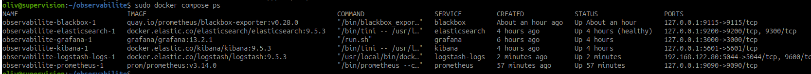

*Capture du 14 septembre 2026 — Les six services affichés sont actifs, Elasticsearch est healthy et `logstash-logs` publie TCP 5044 sur `192.168.122.80`.*

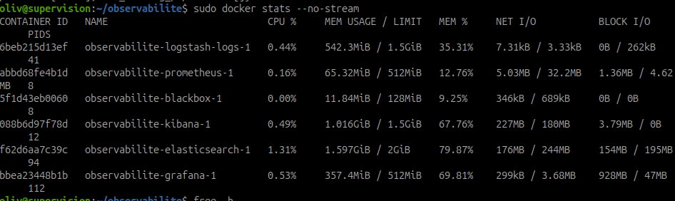

*Capture du 14 septembre 2026 — `logstash-logs` utilise environ 542,3 Mio sur une limite de 1,5 Gio. Ce relevé de ressources ne prouve pas encore l’ingestion des journaux.*

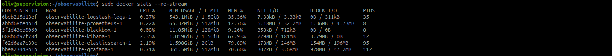

*Capture du 14 septembre 2026 — Logstash utilise environ 543,1 Mio sur 1,5 Gio à cet instant. La mesure ne constitue pas un test en charge.*

## 5. Collecter journald sur Debian avec Filebeat

### A. Installer et transférer les certificats

Sur **Debian à superviser** :

```bash
sudo apt update
sudo apt install curl ca-certificates
mkdir -p ~/installation-filebeat
cd ~/installation-filebeat
curl -fLO https://artifacts.elastic.co/downloads/beats/filebeat/filebeat-9.5.3-amd64.deb
curl -fLO https://artifacts.elastic.co/downloads/beats/filebeat/filebeat-9.5.3-amd64.deb.sha512
sha512sum -c filebeat-9.5.3-amd64.deb.sha512 && sudo dpkg -i filebeat-9.5.3-amd64.deb
sudo systemctl stop filebeat
sudo install -d -m 700 /etc/filebeat/certs
mkdir -m 700 -p ~/certs-filebeat
scp oliv@192.168.122.80:observabilite/tls-beats/linux/ca.crt ~/certs-filebeat/
scp oliv@192.168.122.80:observabilite/tls-beats/linux/cert.pem ~/certs-filebeat/
scp oliv@192.168.122.80:observabilite/tls-beats/linux/key.pkcs8.pem ~/certs-filebeat/
sudo install -m 600 ~/certs-filebeat/ca.crt ~/certs-filebeat/cert.pem ~/certs-filebeat/key.pkcs8.pem /etc/filebeat/certs/
```

Vérifier l’empreinte de l’hôte SSH au premier accès. Les URL de la version 9.5.3 ont été contrôlées lors de la rédaction ; consigner la version effectivement installée. [Installation officielle Filebeat](https://www.elastic.co/docs/reference/beats/filebeat/filebeat-installation-configuration)

### B. Configurer et démarrer

Toujours sur **Debian** :

```bash
sudo cp -p /etc/filebeat/filebeat.yml "/etc/filebeat/filebeat.yml.bak-$(date +%Y%m%d-%H%M%S)"
sudo nano /etc/filebeat/filebeat.yml
```

Pour cette première installation, utiliser ce fichier complet ; si Filebeat collecte déjà d’autres sources, fusionner les entrées et conserver une seule sortie active :

```yaml
filebeat.inputs:
  - type: journald
    id: alpesnet-journal-systeme
    seek: since
    since: -1h
    fields:
      lab_source: linux
processors:
  - add_host_metadata: ~
setup.ilm.enabled: false
setup.template.enabled: false
output.logstash:
  hosts: ["192.168.122.80:5044"]
  ssl.certificate_authorities: ["/etc/filebeat/certs/ca.crt"]
  ssl.certificate: "/etc/filebeat/certs/cert.pem"
  ssl.key: "/etc/filebeat/certs/key.pkcs8.pem"
logging.level: info
```

[Configuration Filebeat téléchargeable](../../assets/configs/supervision-optimisation-performances/it-1/beats/filebeat.yml).

Ne pas conserver en parallèle `output.elasticsearch`. Aucun module Filebeat n’est activé ici : l’entrée journald produit directement des événements. Le premier démarrage reprend au plus une heure d’historique ; le curseur conservé prend ensuite le relais. Ne pas changer l’ID ou effacer le registre pour résoudre un simple problème de transport.

```bash
sudo chown root:root /etc/filebeat/filebeat.yml
sudo chmod 600 /etc/filebeat/filebeat.yml
sudo filebeat test config -c /etc/filebeat/filebeat.yml
sudo filebeat test output -c /etc/filebeat/filebeat.yml
```

Si les deux contrôles réussissent :

```bash
sudo systemctl enable --now filebeat
sudo systemctl status filebeat --no-pager
sudo journalctl -u filebeat --since '-10 minutes' --no-pager
```

Un test de sortie réussi valide la connexion au récepteur, pas encore la présence d’un événement dans Elasticsearch. [Sortie Logstash de Filebeat](https://www.elastic.co/docs/reference/beats/filebeat/logstash-output)

### C. Générer et identifier un événement

Après démarrage de Filebeat, sur **Debian** :

```bash
LINUX_LOG_TEST="ALPESNET_LOG_LINUX_$(date -u +%Y%m%dT%H%M%SZ)"
logger -p user.notice -t alpesnet-lab "$LINUX_LOG_TEST test de collecte journald vers ELK"
printf '%s\n' "$LINUX_LOG_TEST"
sudo journalctl -t alpesnet-lab --since '-5 minutes' --no-pager
```

Copier l’identifiant unique affiché pour le rechercher plus loin. Le journal local doit montrer l’événement avant toute conclusion sur son transport.

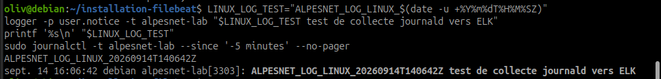

*Capture du 14 septembre 2026 — La génération avec `logger` et la lecture locale montrent le marqueur Linux à 16:06:42, soit 14:06:42 UTC dans l’identifiant.*

## 6. Collecter les événements Windows avec Winlogbeat

### A. Installer depuis Windows Core

Dans **Windows PowerShell administrateur**, utiliser une nouvelle installation si Winlogbeat n’existe pas déjà. S’il est installé, sauvegarder la configuration et adapter cette procédure sans écraser son répertoire.

```powershell
New-Item -ItemType Directory -Force C:\Temp | Out-Null
$BeatVersion = '9.5.3'
$BeatZip = "C:\Temp\winlogbeat-$BeatVersion-windows-x86_64.zip"
$BeatUrl = "https://artifacts.elastic.co/downloads/beats/winlogbeat/winlogbeat-$BeatVersion-windows-x86_64.zip"
Invoke-WebRequest -UseBasicParsing -Uri $BeatUrl -OutFile $BeatZip
Invoke-WebRequest -UseBasicParsing -Uri "$BeatUrl.sha512" -OutFile "$BeatZip.sha512"
$ExpectedHash = [regex]::Match((Get-Content "$BeatZip.sha512" -Raw), '[a-fA-F0-9]{128}').Value
if (-not $ExpectedHash -or (Get-FileHash $BeatZip -Algorithm SHA512).Hash -ne $ExpectedHash) { throw 'Empreinte SHA512 incorrecte' }
if (Test-Path 'C:\Program Files\Winlogbeat') { throw 'Winlogbeat existe déjà : examiner cette installation avant de continuer' }
Expand-Archive -Path $BeatZip -DestinationPath C:\Temp
Move-Item "C:\Temp\winlogbeat-$BeatVersion-windows-x86_64" 'C:\Program Files\Winlogbeat'
Set-Location 'C:\Program Files\Winlogbeat'
New-Item -ItemType Directory -Force .\certs | Out-Null
```

[Installation officielle Winlogbeat](https://www.elastic.co/docs/reference/beats/winlogbeat/winlogbeat-installation-configuration).

### B. Transférer le certificat client Windows

Vérifier la présence de `scp.exe` :

```powershell
Get-Command scp.exe -ErrorAction SilentlyContinue
```

S’il manque, installer **le client** OpenSSH (pas le serveur), puis vérifier le résultat :

```powershell
Add-WindowsCapability -Online -Name OpenSSH.Client~~~~0.0.1.0
```

Cette fonctionnalité nécessite une source Windows disponible. [Installation OpenSSH Microsoft](https://learn.microsoft.com/en-us/windows-server/administration/openssh/openssh_install_firstuse)

Depuis `C:\Program Files\Winlogbeat` :

```powershell
scp.exe oliv@192.168.122.80:observabilite/tls-beats/windows/ca.crt .\certs\ca.crt
scp.exe oliv@192.168.122.80:observabilite/tls-beats/windows/cert.pem .\certs\cert.pem
scp.exe oliv@192.168.122.80:observabilite/tls-beats/windows/key.pkcs8.pem .\certs\key.pkcs8.pem
icacls .\certs /inheritance:r /grant:r '*S-1-5-18:(OI)(CI)F' '*S-1-5-32-544:(OI)(CI)F' /T
icacls .\certs /grant '*S-1-5-18:RX' /T
```

Les SID accordent l’accès à SYSTEM et aux administrateurs, indépendamment de la langue du système. Vérifier la réussite de chaque copie ; ne pas remplacer les certificats par ceux du client Linux. [Options TLS Winlogbeat](https://www.elastic.co/docs/reference/beats/winlogbeat/configuration-ssl)

### C. Configurer sans interface graphique

Toujours dans **la même session PowerShell**, sauvegarder le fichier, puis le remplacer avec un here-string :

```powershell
Copy-Item .\winlogbeat.yml .\winlogbeat.yml.orig
@'
winlogbeat.event_logs:
  - name: Application
    ignore_older: 1h
  - name: System
    ignore_older: 1h
fields:
  lab_source: windows
processors:
  - add_host_metadata: ~
setup.ilm.enabled: false
setup.template.enabled: false
output.logstash:
  hosts: ["192.168.122.80:5044"]
  ssl.certificate_authorities: ['C:/Program Files/Winlogbeat/certs/ca.crt']
  ssl.certificate: 'C:/Program Files/Winlogbeat/certs/cert.pem'
  ssl.key: 'C:/Program Files/Winlogbeat/certs/key.pkcs8.pem'
logging.level: info
logging.to_files: true
logging.files:
  path: 'C:/Program Files/Winlogbeat-Data/logs'
  name: winlogbeat
  keepfiles: 3
'@ | Set-Content -Encoding utf8 .\winlogbeat.yml
```

[Configuration Winlogbeat téléchargeable](../../assets/configs/supervision-optimisation-performances/it-1/beats/winlogbeat.yml). La ligne de fermeture `'@` doit être seule, en début de ligne. Le canal Security est hors de ce premier périmètre ; il pourra être ajouté avec un besoin et des droits adaptés.

```powershell
.\winlogbeat.exe test config -c .\winlogbeat.yml -e
.\winlogbeat.exe test output -c .\winlogbeat.yml -e
```

Si les contrôles réussissent, installer et démarrer le service :

```powershell
Unblock-File .\install-service-winlogbeat.ps1
powershell.exe -NoProfile -ExecutionPolicy Bypass -File .\install-service-winlogbeat.ps1
Start-Service winlogbeat
Get-Service winlogbeat
Get-ChildItem 'C:\Program Files\Winlogbeat-Data\logs'
```

Le contournement de la politique d’exécution est limité au processus qui lance le script officiel téléchargé ; il ne modifie pas la politique globale. La configuration prévoit les journaux de Winlogbeat dans `C:\Program Files\Winlogbeat-Data\logs`. Lire le fichier le plus récent en cas d’erreur. [Démarrage Winlogbeat](https://www.elastic.co/docs/reference/beats/winlogbeat/winlogbeat-starting)

### Incident résolu : accès aux certificats sous LocalSystem

Les tests `test config` et `test output` réussissaient dans la session administrateur (connexion TLS 1.3 à Logstash), mais le service exécuté sous `LocalSystem` échouait avec un accès refusé à `certs/ca.crt` et au certificat client. L’utilisateur a confirmé le redémarrage après cet ajout de droits, dans PowerShell administrateur :

```powershell
icacls 'C:\Program Files\Winlogbeat\certs' /grant '*S-1-5-18:RX' /T
Start-Service winlogbeat
Get-Service winlogbeat
```

Vérifier que `icacls` ne signale aucun échec. Le SID désigne SYSTEM : la correction cible son accès au dossier et aux fichiers, sans ouvrir les clés à tous les utilisateurs. Une connexion réussie sous le compte administrateur ne valide pas les droits du compte de service.

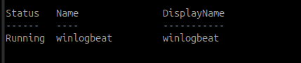

*Capture du 14 septembre 2026 — Le service est `Running` après la correction d’accès aux certificats confirmée par l’utilisateur. La capture montre l’état final, pas la commande de correction.*

### D. Générer un événement Application

Sur **Windows Core**, PowerShell administrateur :

```powershell
if (-not [System.Diagnostics.EventLog]::SourceExists('AlpesNet-Lab')) {
  New-EventLog -LogName Application -Source 'AlpesNet-Lab'
}
$WindowsLogTest = 'ALPESNET_LOG_WINDOWS_' + (Get-Date).ToUniversalTime().ToString('yyyyMMddTHHmmssZ')
Write-EventLog -LogName Application -Source 'AlpesNet-Lab' -EventId 1001 -EntryType Information -Message "$WindowsLogTest test de collecte Windows vers ELK"
$WindowsLogTest
Get-WinEvent -FilterHashtable @{LogName='Application'; ProviderName='AlpesNet-Lab'; Id=1001; StartTime=(Get-Date).AddMinutes(-5)} |
  Select-Object TimeCreated, Id, ProviderName, MachineName, Message
```

La source doit être enregistrée avant l’écriture ; ces commandes utilisent Windows PowerShell 5.1. Conserver l’identifiant unique et les champs locaux pour la comparaison. [Write-EventLog](https://learn.microsoft.com/en-us/powershell/module/microsoft.powershell.management/write-eventlog?view=powershell-5.1)

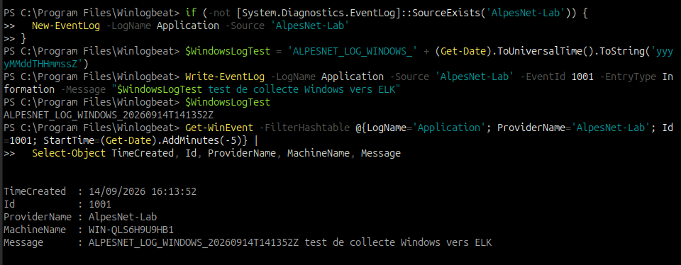

*Capture du 14 septembre 2026 — L’événement de test porte le code 1001, le fournisseur `AlpesNet-Lab` et le marqueur `ALPESNET_LOG_WINDOWS_20260914T141352Z`. Il est relu localement à 16:13:52.*

## 7. Retrouver les deux événements dans ELK

### A. Rechercher dans Dev Tools

Dans **Kibana → Dev Tools**, vérifier d’abord les deux index :

```http
GET /_cat/indices/observabilite-linux,observabilite-windows?v
```

Puis rechercher les marqueurs de test :

```http
GET /observabilite-linux,observabilite-windows/_search
{
  "size": 20,
  "sort": [{"@timestamp": "desc"}],
  "query": {
    "match_phrase": {"message": "test de collecte"}
  }
}
```

Cette recherche utilise le texte commun aux deux messages de test. Pour cibler un événement particulier, remplacer `test de collecte` par l’identifiant **complet réellement généré**, horodatage inclus.

**Attendu :** au moins un document de chaque système, avec message, `@timestamp`, `host.name`, `agent.type` et `fields.lab_source`. L’index vide ou le simple état actif d’un service ne valident pas la collecte.

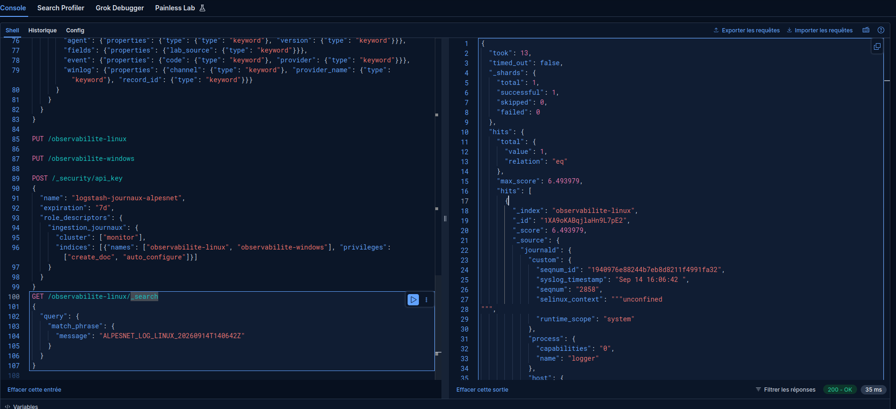

*Capture du 14 septembre 2026 — La recherche du marqueur `ALPESNET_LOG_LINUX_20260914T140642Z` retourne un document dans `observabilite-linux`, avec les métadonnées journald visibles.*

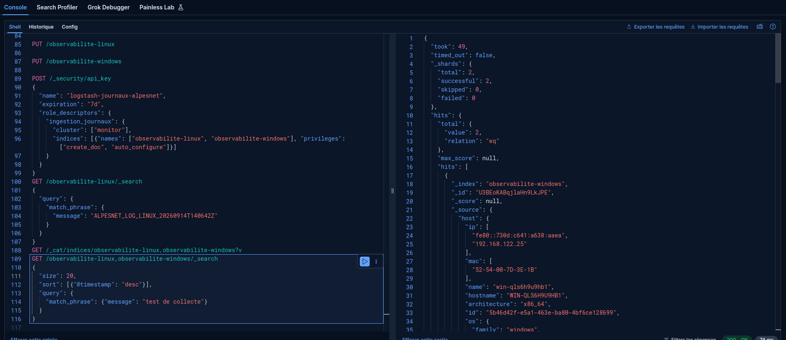

*Capture du 14 septembre 2026 — La requête sur les deux index recherche « test de collecte » et retourne deux documents. Le premier résultat visible appartient à `observabilite-windows`, avec l’adresse `192.168.122.25`.*

### B. Rechercher dans Discover

Dans **Kibana → Gestion de la Suite → Kibana → Data Views / Vues de données**, créer une nouvelle vue, puis la sélectionner dans **Discover**. Une vue gérée par Elastic ne se modifie pas ; créer ici la vue dédiée suivante :

- Nom : `Journaux AlpesNet`.
- Motif : `observabilite-linux,observabilite-windows` (les deux index, séparés par une virgule).
- Champ temporel : `@timestamp`.

Choisir une période couvrant les événements, par exemple la dernière heure, puis actualiser. En KQL, remplacer les exemples par les identifiants complets affichés sur les machines :

```kql
fields.lab_source: "linux" and message: "IDENTIFIANT_LINUX_COMPLET"
```

```kql
fields.lab_source: "windows" and event.code: "1001" and message: "IDENTIFIANT_WINDOWS_COMPLET"
```

Ouvrir le document et ajouter les colonnes `@timestamp`, `host.name`, `agent.type`, `fields.lab_source`, `message`, puis `winlog.channel` et `event.code` pour Windows. Comparer le message, l’heure et la machine à la sortie locale. Les heures peuvent s’afficher en UTC dans l’API et en heure locale dans Kibana.

Si la vue ne propose pas les champs, vérifier que les événements sont déjà indexés et actualiser la liste des champs. Cette activité utilise une vue personnalisée, pas les dashboards préconfigurés Beats. [Vues de données Kibana](https://www.elastic.co/docs/explore-analyze/find-and-organize/data-views)

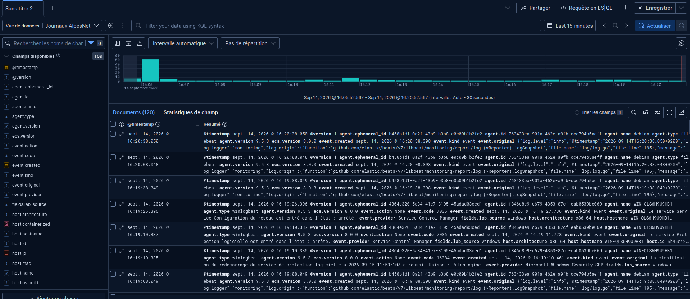

*Capture du 14 septembre 2026 — La vue `Journaux AlpesNet` affiche 120 documents sur la période sélectionnée. Des événements Filebeat/Debian et Winlogbeat/Windows sont visibles ; ce total dépend de la période et ne représente pas uniquement les deux tests.*

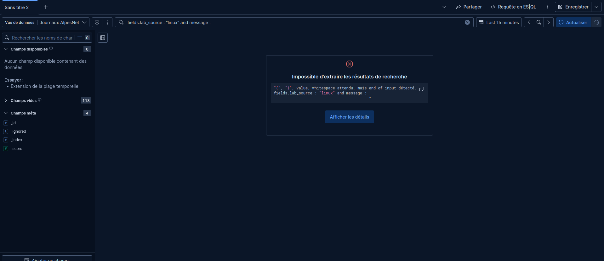

*Capture du 14 septembre 2026 — La requête se termine par `and message:` sans valeur. Kibana signale une erreur de syntaxe, pas une absence de journaux. Les requêtes complètes ci-dessous corrigent la saisie ; une nouvelle capture confirme ensuite la recherche Linux réussie.*

### Corriger la recherche KQL incomplète

Remplacer toute la requête par l’une des lignes suivantes, puis cliquer sur **Actualiser**. Choisir les **dernières 24 heures** pendant la séance du 14 septembre, ou une période absolue couvrant le 14 septembre 2026 de 16:00 à 16:30 pour consulter ces tests plus tard.

```kql
fields.lab_source: "linux" and message: "ALPESNET_LOG_LINUX_20260914T140642Z"
```

```kql
fields.lab_source: "windows" and event.code: "1001" and message: "ALPESNET_LOG_WINDOWS_20260914T141352Z"
```

Ne pas laisser `message:` sans texte. Une requête invalide produit une erreur ; une requête valide sans résultat impose ensuite de vérifier période, index et valeur recherchée. Les captures prouvent les recherches dans Dev Tools, la vue commune Discover et les filtres ciblés Linux et Windows. La correction de la requête KQL est validée.

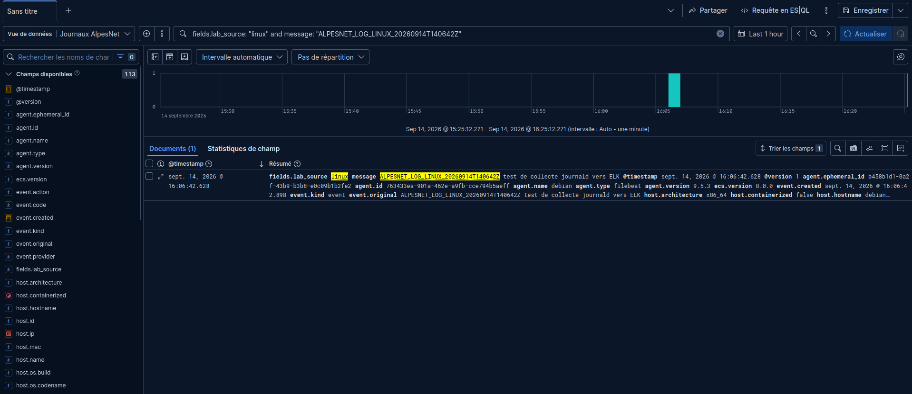

*Capture du 14 septembre 2026 à 16:25 — La vue `Journaux AlpesNet`, sur la dernière heure, retrouve exactement un document pour `ALPESNET_LOG_LINUX_20260914T140642Z`. Le résultat affiche `fields.lab_source: linux`, Filebeat 9.5.3, Debian et l’horodatage local 16:06:42.628. La recherche KQL fonctionne après ajout de la valeur manquante.*

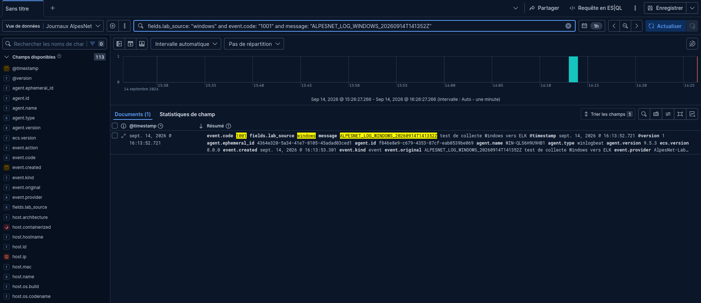

*Capture du 14 septembre 2026 à 16:26 — La vue `Journaux AlpesNet` retrouve un document avec `fields.lab_source: windows`, `event.code: 1001` et le marqueur `ALPESNET_LOG_WINDOWS_20260914T141352Z`. Le résultat affiche Winlogbeat 9.5.3, le fournisseur `AlpesNet-Lab` et l’horodatage local 16:13:52.721, cohérent avec l’événement généré sur Windows Core.*

### Autre correction rencontrée : plusieurs sorties Filebeat

Le diagnostic `more than one namespace configured accessing 'output'` indiquait plusieurs sorties dans `filebeat.yml`. Conserver le seul bloc `output.logstash` et retirer ou commenter tout le bloc `output.elasticsearch`, paramètres compris. Refaire `test config` et `test output`, puis redémarrer Filebeat pour appliquer la configuration.

## 8. Comparer les sources et diagnostiquer

| Information | Journald / Filebeat | Event Log / Winlogbeat |
| --- | --- | --- |
| Origine | `host.name`, métadonnées hôte | `host.name`, `winlog.computer_name` si présent |
| Collecteur | `agent.type: filebeat` | `agent.type: winlogbeat` |
| Date de l’événement | `@timestamp`, à comparer au journal local | `@timestamp`, à comparer à `TimeCreated` |
| Message | `message`, marqueur et texte du journal | `message`, texte de l’événement |
| Contexte spécifique | Identifiant syslog, unité systemd, priorité selon l’événement | Canal, fournisseur, code et identifiant d’enregistrement |
| Recherche de test | Marqueur unique Linux | Marqueur unique Windows, code 1001, fournisseur AlpesNet-Lab |

Tous les champs ne sont pas présents dans tous les événements. Lire le document réellement indexé ; `fields.lab_source` est notre étiquette, tandis que `agent.type` décrit le collecteur et `host.name` l’hôte rapporté.

| Symptôme | Contrôle utile |
| --- | --- |
| Aucun événement local | Vérifier la commande de génération et la source interrogée |
| Timeout vers Logstash | Vérifier `.80`, TCP 5044, publication Docker et filtrage ; sur Windows : `Test-NetConnection 192.168.122.80 -Port 5044` |
| Erreur TLS | Vérifier CA, certificat propre au client, permissions de clé, dates et IP du certificat serveur |
| Beats connecté, index vide | Examiner `docker compose logs --tail=100 logstash-logs`, droits/expiration de clé, `fields.lab_source`, erreurs de mapping |
| Erreur 401/403 Elasticsearch | Vérifier la nouvelle clé `id:api_key` et ses droits sur les deux index |
| Fichier introuvable | Vérifier les chemins et extensions `.yml`, `.conf`, `.pem` et les montages |
| Événement indexé mais absent de Discover | Vérifier vue de données, période, filtre KQL, horloges et actualisation |
| Retard ou doublons | Examiner les reprises et registres ; une relance ne prouve pas une livraison exactement une fois |

Ne pas lancer `filebeat setup` ou `winlogbeat setup` pour corriger ce parcours : les index sont préparés manuellement et la sortie active est Logstash. Ne pas effacer les registres de lecture ni les journaux pour forcer une reprise.

## 9. Validation et dossier de déploiement

| Critère | Linux | Windows |
| --- | --- | --- |
| Origine et source des journaux identifiées | ☑ | ☑ |
| Système concerné identifié | ☑ | ☑ |
| Composant de collecte installé et actif | ☑ | ☑ |
| Destination et trajet documentés | ☑ | ☑ |
| Événement réellement présent dans Elasticsearch | ☑ | ☑ |
| Champs disponibles examinés et comparés au journal local | ☑ | ☑ |
| Recherche réussie dans Kibana Dev Tools et Discover | ☑ | ☑ |

Consigner versions, IP, sources, index, fichiers, chemins de certificats, échéances de renouvellement, configuration réseau, commandes, identifiants de test, résultats et corrections. Ne pas inclure les valeurs secrètes.

Conserver une preuve locale de chaque événement puis sa recherche dans Kibana avec origine et horodatage visibles. Faire des captures ciblées sur les événements de test pour éviter d’exposer d’autres journaux. Relever également `df -h`, la taille des index et la consommation de `logstash-logs` ; planifier la conservation avant de laisser tourner cette collecte à long terme.

## Questions de fin d’étape

**Comment vérifier qu’une source est correctement collectée ?** Suivre un événement identifié depuis le journal local jusqu’au document retrouvé dans Elasticsearch et Kibana ; vérifier le collecteur et les erreurs à chaque étape.

**Comment identifier l’origine dans ELK ?** Croiser `host.name`, le collecteur, le canal ou l’unité, le fournisseur et les champs de source avec l’inventaire. Ne pas confondre l’hôte producteur et le serveur Logstash.

**Quelles informations permettent de retrouver un événement particulier ?** Un marqueur unique, une période, un hôte, une source, un code d’événement et le contenu du message.

**Pourquoi centraliser les journaux ?** Pour effectuer des recherches communes, rapprocher les événements de plusieurs machines et consulter les événements déjà reçus sans se connecter successivement aux endpoints. La centralisation ne garantit pas à elle seule la réception pendant une coupure ou la conservation indéfinie.

**Quelles différences entre Linux et Windows ?** Journald associe messages et métadonnées système ; Event Log organise ses événements en canaux, fournisseurs, codes et enregistrements. Les collecteurs traduisent ces données en documents interrogeables, en conservant des champs propres à chaque source.

## Point de contrôle

- [x] Les journaux de l’endpoint Linux sont collectés.
- [x] Les journaux de l’endpoint Windows sont collectés.
- [x] Les événements sont présents dans ELK.
- [x] Un événement de chaque système est retrouvé par recherche.
- [x] La source de chaque événement est identifiée.

[Retour au sommaire de l’itération](index.md)
