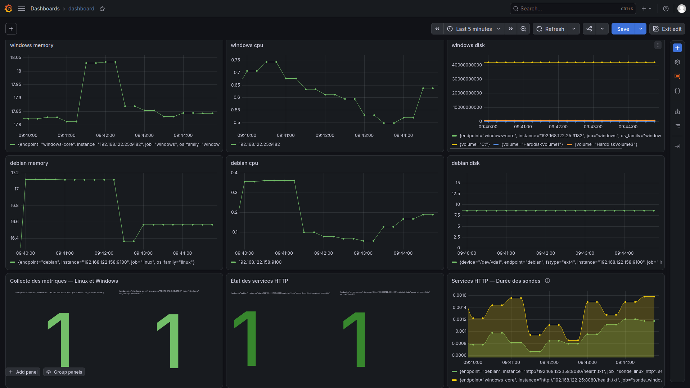
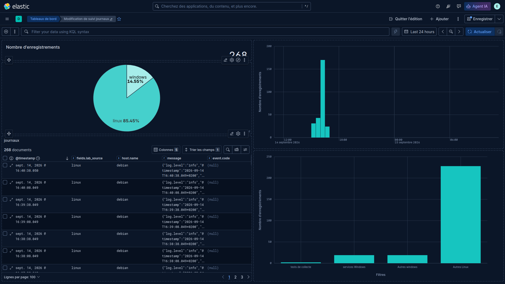
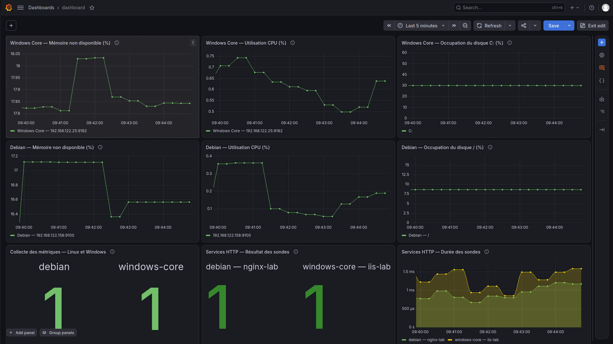
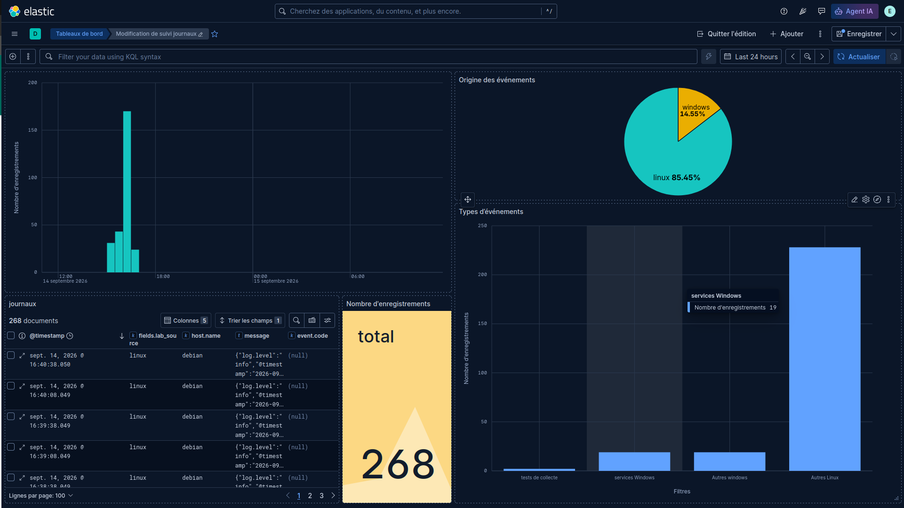
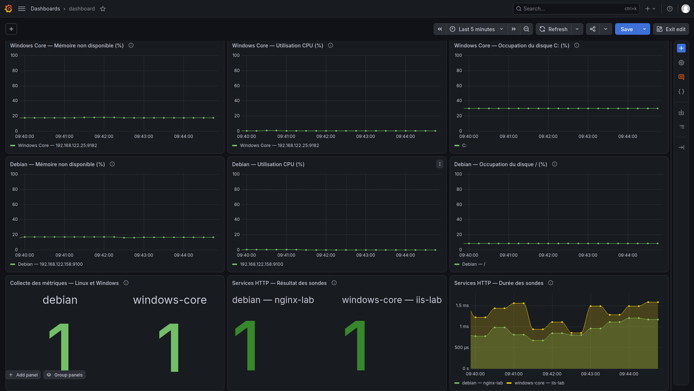
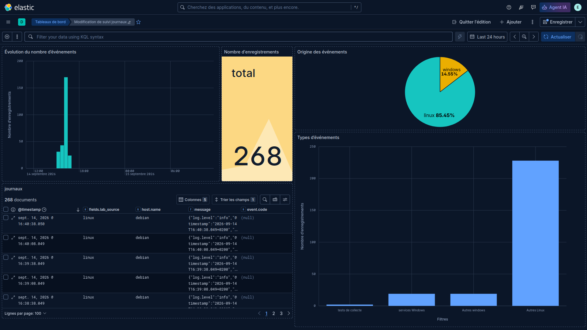

# Améliorer les dashboards — Livrable L2

## Objectif et travail demandé

La première version des dashboards Grafana et Kibana doit maintenant être évaluée comme un véritable outil d’exploitation. L’objectif est de transformer les données collectées en une vision claire, structurée et exploitable de l’infrastructure d’AlpesNet.

Reprendre les deux dashboards et rechercher :

- les informations difficiles à interpréter ;
- les informations inutiles ;
- les informations manquantes ;
- les visualisations inadaptées ;
- les unités ou libellés peu clairs ;
- les informations qui demandent trop de temps pour être comprises.

Apporter les améliorations nécessaires, les tester et consigner les choix dans le dossier de déploiement et de configuration. La construction reste manuelle dans les interfaces.

!!! note "Point de départ et limites des preuves"
    Les premières captures restent dans les feuilles [Grafana](construire-dashboard-grafana.md) et [Kibana](construire-dashboard-kibana.md). Les captures successives du 15 septembre documentent les améliorations ci-dessous. Les plus récentes, à 11:48, montrent les échelles de ressources Grafana de 0 à 100, le titre de l’histogramme Kibana et son tableau élargi. Les étapes antérieures sont conservées pour expliquer les améliorations. Des réglages restent à terminer. Les deux écrans sont en édition ; leur enregistrement final et leur réouverture ne sont pas attestés. Cette activité prépare L2 ; elle ne vaut pas validation par le formateur.

## 1. Évaluer chaque panneau comme un outil d’exploitation

Commencer par une capture avant modification et relever la période, les filtres et les endpoints affichés. Pour chaque panneau, répondre à ces questions :

| Question | Décision attendue |
| --- | --- |
| À quelle question d’exploitation répond-il ? | Garder une finalité claire : disponibilité, ressources, évolution ou recherche d’un événement |
| La donnée permet-elle de répondre à cette question ? | Vérifier requête, source, calcul, unité et périmètre |
| Peut-on identifier la machine sans ouvrir l’éditeur ? | Ajouter une légende et un titre compréhensibles |
| L’information est-elle déjà présentée ailleurs ? | Retirer le doublon si aucune lecture complémentaire n’est apportée |
| Que signifient zéro, absence de données et couleur ? | Donner une interprétation explicite ; ne pas transformer une absence en succès |
| Comment approfondir une valeur inhabituelle ? | Prévoir la requête Prometheus ou la recherche Discover correspondante |

Corriger d’abord les calculs et périmètres, ensuite les unités et représentations, puis la disposition. Une présentation soignée ne suffit pas si la donnée est mal calculée.

## 2. Améliorations prioritaires dans Grafana

Reprendre les [requêtes et réglages de la feuille Grafana](construire-dashboard-grafana.md#3-construire-ou-modifier-les-visualisations). Les constats ci-dessous proviennent de la capture de 09:41 ; actualiser leur statut après intervention.

| Constat de départ | Modification à réaliser | Vérification attendue |
| --- | --- | --- |
| Le disque Windows mélange occupation et tailles de volumes | Retirer les anciennes requêtes de taille ; conserver l’occupation de `C:` en pourcentage | Une unité %, un volume identifié, échelle 0–100 |
| La mémoire Windows affiche des octets disponibles ; Debian affiche la RAM totale constante | Utiliser les calculs de part de mémoire non disponible documentés | Titre « Mémoire non disponible (%) », calcul expliqué, valeur comparée à la source |
| Le CPU Debian montre de faibles valeurs négatives | Examiner la requête, les séries et la fenêtre de calcul | Résultat expliqué et calcul corrigé si nécessaire ; ne pas masquer le défaut par un simple écrêtage |
| La collecte des endpoints atteint visuellement 2 | Vérifier somme et empilement ; séparer les endpoints | Un état 0/1 par endpoint, nom visible, absence distincte |
| Les états HTTP se superposent | Afficher des états identifiables par service | Distinguer disponibilité de la collecte et résultat de la sonde |
| L’axe du disque Debian amplifie une faible variation | Utiliser %, bornes 0–100 pour la vue d’ensemble | Lecture de la capacité occupée sans exagération visuelle |
| La durée des sondes manque de contexte | Afficher secondes et légende du service | Ne pas confondre durée de contrôle et fréquence de collecte |

Dans chaque panneau, examiner les requêtes et les transformations avant de changer le titre. Garder les détails par cœur CPU ou volume secondaire dans une vue d’approfondissement si leur présence surcharge la synthèse.

Organiser les états en haut, les ressources ensuite et les courbes utiles au diagnostic à proximité. Garder le même ordre Linux/Windows, des titres explicites et des unités cohérentes. Le choix de représentation dépend de la donnée et de l’usage. [Présentation des dashboards Grafana](https://grafana.com/docs/grafana/latest/fundamentals/dashboards-overview/)

**Justifications possibles à expliquer au formateur :** un état individuel permet de localiser immédiatement l’endpoint concerné ; une courbe CPU permet de distinguer un pic bref d’une charge persistante. Les neuf panneaux existants suffisent si leurs données et leur présentation répondent aux besoins.

### Mode d’emploi — où coller les requêtes

Pour chaque panneau ci-dessous :

1. Ouvrir son menu **⋮ → Edit**.
2. Dans **Queries**, sélectionner la source **Prometheus**, puis le mode **Code**.
3. Remplacer entièrement la requête **A** par le bloc PromQL indiqué. Ne pas coller les délimiteurs `promql` ou les accents graves.
4. Retirer les anciennes requêtes **B/C…** devenues inutiles dans ce panneau. Dans **Transformations**, retirer les anciennes sommes ou transformations qui mélangent les séries ; les requêtes ci-dessous fournissent directement les valeurs à afficher.
5. Cliquer sur **Run queries**, puis régler les champs à droite selon les tableaux.
6. Revenir au dashboard avec **Back to dashboard / Apply**, selon le bouton proposé, puis **Save**. Enregistrer sous **AlpesNet — État et performances** si le dashboard est encore sans nom.

Les blocs PromQL vont dans **Queries → Code**, jamais dans le titre ni dans le terminal. Les légendes vont dans **Queries → A → Options → Legend → Custom** de la requête. Le mode **Range** affiche une évolution ; **Instant** fournit la valeur au terme de la période sélectionnée. [Éditeur Prometheus de Grafana](https://grafana.com/docs/grafana/latest/datasources/prometheus/query-editor/)

### Trouver le champ de légende — sous le graphique

Le texte de la légende se règle dans **la requête Prometheus, sous le graphique** :

1. Ouvrir le panneau avec **Edit**.
2. Sous l’aperçu du graphique, ouvrir l’onglet **Queries** et repérer la requête **A** contenant le code PromQL.
3. Sous la zone de code de **A**, déplier **Options**.
4. Repérer **Legend**, cliquer sur **Auto**, puis choisir **Custom**.
5. Dans le champ de texte qui apparaît, coller la légende du panneau. Pour le disque Windows :

    ```text
    Windows Core — {{volume}}
    ```

6. Cliquer sur **Run queries**. Avec le label `volume="C:"`, la légende attendue est **Windows Core — C:**.

**Repère pour éviter la confusion :** si l’écran présente **Legend → Visibility, Mode (List/Table), Placement (Bottom/Right), Values**, c’est la colonne de droite. Elle règle la présentation de la légende ; le champ **Custom** se trouve dans **Queries → A → Options**, sous le graphique. Les boutons **Query options** communs au panneau sont également distincts des **Options** de la requête A.

Si le nom ne change pas malgré la saisie, vérifier qu’un **Standard options → Display name** ou un override existant ne remplace pas le nom issu de la requête. Ne pas saisir `{{volume}}` dans ce champ à la place du réglage de légende décrit ici.

### Réglages communs aux six panneaux CPU, mémoire et disque

| Zone de l’éditeur | Valeur à sélectionner ou saisir |
| --- | --- |
| Visualization | `Time series` |
| Queries → Options → Type | `Range` |
| Queries → A → Options → Legend → Custom | Utiliser la légende indiquée sous chaque requête |
| Standard options → Unit | `Percent (0-100)` |
| Standard options → Min | `0` |
| Standard options → Max | `100` |
| Standard options → Decimals | `1` |
| Standard options → No value | `Sans données` |
| Graph styles → Stack series | `Off` |
| Connect null values | `Never` |

Les unités et bornes sont des réglages d’affichage, pas des corrections de calcul. Examiner une éventuelle valeur CPU négative avant de fixer la borne visuelle à zéro. L’option **No value** concerne les valeurs nulles ; une réponse entièrement vide peut rester affichée **No data**, ce qui n’est pas un succès. [Options standard](https://grafana.com/docs/grafana-cloud/visualizations/panels-visualizations/configure-standard-options/)

### A. CPU Debian

Dans **Queries → A → Code** :

```promql
100 * (1 - avg by (instance) (rate(node_cpu_seconds_total{job="linux",mode="idle"}[2m])))
```

- **Panel options → Title** : `Debian — Utilisation CPU (%)`
- **Queries → A → Options → Legend → Custom** : `Debian — {{instance}}`
- **Panel options → Description** : `Part moyenne du temps CPU non inactif sur 2 minutes, tous processeurs confondus.`

Si une valeur négative persiste, copier la même requête dans **Explore** et consulter le résultat numérique sans bornes visuelles. Pour repérer les taux d’inactivité supérieurs à 1, utiliser temporairement cette requête de diagnostic dans Explore :

```promql
rate(node_cpu_seconds_total{job="linux",mode="idle"}[2m]) > 1
```

Un résultat identifie une série à examiner ; une réponse vide signifie qu’aucune série ne dépasse 1 à cet instant. Vérifier la période du défaut, les scrapes et les compteurs avant de conclure. Ne pas ajouter `clamp_min` pour dissimuler le symptôme.

### B. CPU Windows

Dans **Queries → A → Code** :

```promql
100 * (1 - avg by (instance) (rate(windows_cpu_time_total{job="windows",mode="idle"}[2m])))
```

- **Title** : `Windows Core — Utilisation CPU (%)`
- **Queries → A → Options → Legend → Custom** : `Windows Core — {{instance}}`
- **Description** : `Part moyenne du temps CPU non inactif sur 2 minutes, tous processeurs confondus.`

### C. Mémoire Debian

Dans **Queries → A → Code**, remplacer la métrique de RAM totale :

```promql
100 * (1 - node_memory_MemAvailable_bytes{job="linux"} / node_memory_MemTotal_bytes{job="linux"})
```

- **Title** : `Debian — Mémoire non disponible (%)`
- **Queries → A → Options → Legend → Custom** : `Debian — {{instance}}`
- **Description** : `100 × (1 − MemAvailable / MemTotal). La mémoire récupérable est prise en compte par MemAvailable.`

### D. Mémoire Windows

Dans **Queries → A → Code**, remplacer la métrique d’octets disponibles :

```promql
100 * (1 - windows_memory_available_bytes{job="windows"} / windows_memory_physical_total_bytes{job="windows"})
```

- **Title** : `Windows Core — Mémoire non disponible (%)`
- **Queries → A → Options → Legend → Custom** : `Windows Core — {{instance}}`
- **Description** : `Part de mémoire physique non disponible selon Windows. La capacité totale est collectée, sans valeur fixée dans la formule.`

`windows_memory_physical_total_bytes` est la métrique relevée précédemment dans ce lab. Une métrique absente doit être vérifiée dans Prometheus ; ne pas remplacer silencieusement le dénominateur par une quantité de RAM supposée.

### E. Disque Debian

Dans **Queries → A → Code** :

```promql
100 * (1 - node_filesystem_free_bytes{job="linux",mountpoint="/",fstype!="rootfs"} / node_filesystem_size_bytes{job="linux",mountpoint="/",fstype!="rootfs"})
```

- **Title** : `Debian — Occupation du disque / (%)`
- **Queries → A → Options → Legend → Custom** : `Debian — {{mountpoint}}`
- **Description** : `Part des blocs occupés sur le système de fichiers racine. Les blocs réservés peuvent expliquer un écart avec le pourcentage affiché par df.`

### F. Disque Windows

Dans **Queries → A → Code** :

```promql
100 * (1 - windows_logical_disk_free_bytes{job="windows",volume="C:"} / windows_logical_disk_size_bytes{job="windows",volume="C:"})
```

- **Title** : `Windows Core — Occupation du disque C: (%)`
- **Queries → A → Options → Legend → Custom** : `Windows Core — {{volume}}`
- **Description** : `Part occupée du volume C:. Les autres volumes ne sont pas inclus dans ce panneau.`

Vérifier que les anciennes requêtes affichant les tailles en octets ont été retirées. Une seule série est attendue pour `C:` sur l’endpoint Windows du lab.

### G. Collecte des deux endpoints

Conserver un seul panneau avec une valeur distincte pour chaque endpoint. Dans **Queries → A → Code** :

```promql
up{job=~"linux|windows"}
```

| Zone | Valeur |
| --- | --- |
| Title | `Collecte des métriques — Linux et Windows` |
| Description | `1 : scrape réussi ; 0 : scrape en échec. Ne prouve pas la disponibilité des applications.` |
| Visualization | `Stat` |
| Queries → Options → Type | `Instant` uniquement, pas Both |
| Queries → Options → Format | `Time series` |
| Queries → A → Options → Legend → Custom | `{{endpoint}}` |
| Value options → Show | `Calculate` |
| Value options → Calculation | `Last` |
| Value options → Fields | Champs numériques / `Numeric fields` |
| Stat styles → Text mode | `Value and name` |
| Stat styles → Graph mode | `None` |
| Standard options → Unit | `None` |
| Standard options → Decimals | `0` |
| Standard options → No value | `Sans données` |

Dans **Value mappings → Add value mappings**, ajouter :

| Type | Valeur | Texte | Couleur |
| --- | --- | --- | --- |
| Value | `0` | `Collecte en échec` | Rouge |
| Value | `1` | `Collecte OK` | Vert |
| Special | `Null` | `Sans données` | Gris |

Le calcul **Last** s’applique à chaque série ; ne pas ajouter de transformation qui les somme. Les labels `endpoint` du lab distinguent `debian` et `windows-core`. Si un nom manque, vérifier ce label ou utiliser la légende `{{job}} — {{instance}}`.

### H. État des services HTTP

Dans **Queries → A → Code** :

```promql
probe_success{job=~"sonde_.*"} and on(job, instance) (up{job=~"sonde_.*"} == 1)
```

Reprendre les réglages **Stat / Instant / Last / Value and name / Graph mode None** du panneau précédent et modifier :

- **Title** : `Services HTTP — Résultat des sondes`
- **Queries → A → Options → Legend → Custom** : `{{endpoint}} — {{service}}`
- **Description** : `1 : contrôle réussi ; 0 : contrôle échoué. Le résultat est écarté lorsque la collecte de la sonde échoue.`
- **Value mappings**, valeur `0` : texte `Sonde en échec`, rouge ; valeur `1` : texte `Service OK`, vert.

Une série absente peut disparaître du panneau multivaleur : vérifier que les deux services attendus sont présents, ainsi que le panneau de collecte. Ne pas remplacer les données absentes par `1` ni reprendre une ancienne valeur pour fabriquer un état actuel.

### I. Durée des sondes

Dans **Queries → A → Code** :

```promql
probe_duration_seconds{job=~"sonde_.*"} and on(job, instance) (up{job=~"sonde_.*"} == 1)
```

| Zone | Valeur |
| --- | --- |
| Title | `Services HTTP — Durée des sondes` |
| Description | `Durée totale du contrôle, à interpréter avec son résultat : une sonde rapide peut aussi échouer.` |
| Visualization / Type | `Time series` / `Range` |
| Queries → A → Options → Legend → Custom | `{{endpoint}} — {{service}}` |
| Standard options → Unit | `seconds (s)` |
| Min / Max | `0` / laisser Max vide |
| Stack series / Connect null values | `Off` / `Never` |

Le résultat source est en secondes : ne pas multiplier par 1 000 tout en gardant cette unité. Grafana peut afficher automatiquement des millisecondes pour les petites valeurs.

### Période et actualisation Grafana

Dans le sélecteur de période du dashboard, choisir **Last 1 hour** et régler l’actualisation à **30s**. Dans **Queries → Query options**, laisser **Relative time** et **Time shift** vides pour que les panneaux suivent la période commune. Enregistrer le dashboard et vérifier son affichage après réouverture.

Ces requêtes reprennent les métriques du lab ; leur saisie dans le dashboard et leur résultat actuel restent à vérifier. Une réponse vide impose de vérifier la collecte et la période, pas de remplacer arbitrairement la formule.


## 3. Améliorations prioritaires dans Kibana

| Constat de départ | Modification ou contrôle | Résultat attendu |
| --- | --- | --- |
| Plusieurs titres sont automatiques ou absents | Nommer les cinq panneaux selon leur rôle | Total, évolution, origine, types et derniers événements identifiables |
| Certains libellés des quatre catégories sont masqués | Élargir le graphique ou raccourcir les étiquettes | « Tests », « États services Windows », « Autres Windows », « Autres Linux » lisibles ; description détaillée conservée |
| Linux domine le volume de journaux | Garder la vue globale, puis filtrer Windows pour examiner ses événements | Les petits volumes restent analysables sans supprimer les journaux Linux |
| L’ancien filtre « Autres » ne concernait que Windows | Conserver le renommage et la quatrième catégorie ajoutée | Périmètre explicite, absence de double comptage |
| Le tableau contient des messages longs, parfois structurés en JSON | Donner davantage de largeur au message ; garder les détails dans le document développé | Heure, source, machine et début du message immédiatement lisibles |
| Les graphes montrent les journaux de la veille | Identifier la période comme historique ; produire de nouveaux tests pour la collecte actuelle | Ne pas présenter l’historique comme un état temps réel |

Sur les données historiques des captures, vérifier au survol les quatre catégories attendues : **2 tests + 19 changements d’état Windows + 19 autres Windows + 228 autres Linux = 268 événements**. La dernière capture montre quatre barres et l’infobulle Windows à 19 ; relever les autres valeurs avant de valider la somme.

Ne pas supprimer une source de la collecte uniquement pour rendre un graphique plus équilibré. Les événements répétitifs peuvent être filtrés dans une vue de travail identifiée, tout en restant recherchables dans Discover. Un code d’événement n’est pas un niveau de gravité et le nombre d’événements n’est pas le nombre d’incidents.

Pour approfondir, utiliser la même période et filtrer sur `fields.lab_source`, `host.name` ou un marqueur, puis développer le document dans Discover. Effacer les filtres temporaires avant de revenir à la synthèse. [Filtres des dashboards Kibana](https://www.elastic.co/docs/explore-analyze/dashboards/using), [exploration des documents dans Discover](https://www.elastic.co/docs/explore-analyze/discover/discover-get-started)

**Justifications possibles :** le camembert compare les parts Linux/Windows ; les barres comparent des types d’événements ; le tableau permet de lire et retrouver un message précis. Le fond vert d’un compteur de journaux ne signifie pas que l’infrastructure est saine.

### Mode d’emploi — champs à modifier dans Kibana

Ouvrir le dashboard en édition, puis le panneau concerné avec son **crayon / Modifier**. Les libellés ci-dessous reprennent ceux de l’interface française observée. Dans chaque visualisation, conserver la vue **Journaux AlpesNet**.

Pour nommer le panneau, renseigner son titre lors de **Enregistrer et revenir**, ou dans ses paramètres de titre sur le dashboard. Le champ **Nom** d’une dimension renomme la valeur ou la légende ; il ne remplace pas nécessairement le titre du panneau. Si un réglage masque le titre, le désactiver.

### A. Compteur d’événements

| Zone | Valeur à saisir ou sélectionner |
| --- | --- |
| Type de visualisation | `Indicateur` |
| Indicateur principal → Méthode | `Fonction rapide` |
| Fonctions | `Compte` |
| Champ | `Enregistrements` |
| Apparence → Nom | `Événements sur la période` |
| Format de valeur | Nombre, sans décimales |
| Graphique d’arrière-plan | `Aucune` |
| Titre du panneau | `Événements sur la période` |

Si la méthode **Formule** est utilisée à la place de Fonction rapide, saisir uniquement :

```text
count()
```

Ne pas saisir cette formule dans la barre KQL. En cas de `N/A`, vérifier d’abord les documents disponibles sur la période dans Discover.

### B. Évolution temporelle

| Zone | Valeur |
| --- | --- |
| Type | `Vertical à barres` |
| Axe horizontal → Fonction | `Histogramme des dates` |
| Axe horizontal → Champ | `@timestamp` |
| Intervalle | Automatique |
| Axe vertical → Fonction / Champ | `Compte` / `Enregistrements` |
| Axe vertical → Nom | `Événements par intervalle` |
| Titre | `Évolution du nombre d’événements` |

Ne pas choisir **Compte** de `event.code` : les documents Linux sans ce champ seraient exclus. Conserver la période commune du dashboard.

### C. Répartition par source

| Zone | Valeur |
| --- | --- |
| Type | `Camembert` |
| Section → Fonction | `Valeurs les plus élevées` |
| Section → Champs | `fields.lab_source` |
| Nombre de valeurs | `2` |
| Classer par / Sens | `Alphabétique` / `Croissant` |
| Apparence → Nom de la section | `Source` |
| Indicateur → Fonction / Champ | `Compte` / `Enregistrements` |
| Titre | `Origine des événements — Linux et Windows` |

Les deux valeurs correspondent au périmètre actuel du lab. Contrôler séparément les événements sans source : la sélection de deux valeurs ne doit pas les rendre invisibles dans le bilan.

### D. Types d’événements — les quatre filtres complets

Dans **Vertical à barres → Axe horizontal → Filtres**, conserver exactement les quatre catégories ci-dessous. Remplacer les anciens filtres, sans garder une cinquième catégorie « Tous les enregistrements ». Le code va dans le champ de recherche de **chaque filtre**, et son nom dans **Étiquette** ; il ne va pas dans la barre KQL globale.

**Étiquette : `Tests`**

```kql
(fields.lab_source: "linux" and log.syslog.appname: "alpesnet-lab") or (fields.lab_source: "windows" and event.provider: "AlpesNet-Lab" and event.code: "1001")
```

**Étiquette : `États services Windows`**

```kql
fields.lab_source: "windows" and event.provider: "Service Control Manager" and event.code: "7036"
```

**Étiquette : `Autres Windows`**

```kql
fields.lab_source: "windows" and not ((event.provider: "AlpesNet-Lab" and event.code: "1001") or (event.provider: "Service Control Manager" and event.code: "7036"))
```

**Étiquette : `Autres Linux`**

```kql
fields.lab_source: "linux" and not log.syslog.appname: "alpesnet-lab"
```

Si les suggestions cachent le champ Étiquette, fermer uniquement la liste de suggestions avec **Échap**. Vérifier ensuite :

| Zone | Valeur |
| --- | --- |
| Axe vertical → Fonction | `Compte` |
| Axe vertical → Champ | `Enregistrements` |
| Axe vertical → Nom | `Nombre d’événements` |
| Titre | `Types d’événements — classement du lab` |
| Description | `Tests de collecte, changements d’état des services Windows et autres événements par système. Ce classement ne représente pas la gravité.` |

Sur le dashboard, élargir ce panneau pour lire les quatre étiquettes. Conserver la vue globale pour le bilan ; filtrer Windows temporairement pour comparer ses petites catégories. Les filtres sont déjà appliqués dans la capture corrigée : cette recette permet de les relire et d’en raccourcir les noms sans changer leur sens.

### E. Tableau des derniers événements

Dans la session **Discover** utilisée par le panneau, conserver ces colonnes dans cet ordre :

```text
@timestamp
fields.lab_source
host.name
message
event.code
```

Cette liste est un aide-mémoire : ajouter les champs un par un via le sélecteur de colonnes, ne pas coller le bloc dans KQL. Régler le tri de `@timestamp` en **décroissant**, retirer les colonnes superflues et élargir `message`. Enregistrer la session puis vérifier le panneau du dashboard. Titre : **`Derniers événements Linux et Windows`**. Développer un document pour lire le message complet.

### F. Recherches à copier pour contrôler le périmètre

Dans la **barre KQL globale** du dashboard ou de Discover, tester une recherche à la fois :

**Windows uniquement :**

```kql
fields.lab_source: "windows"
```

**Linux uniquement :**

```kql
fields.lab_source: "linux"
```

**Sources manquantes ou hors du périmètre :**

```kql
not (fields.lab_source: "linux" or fields.lab_source: "windows")
```

La dernière recherche doit être examinée si elle retourne des documents : ils ne sont pas couverts par les quatre catégories. Effacer la barre KQL et les filtres temporaires pour enregistrer la vue d’ensemble.

**Test historique Linux :**

```kql
fields.lab_source: "linux" and message: "ALPESNET_LOG_LINUX_20260914T140642Z"
```

**Test historique Windows :**

```kql
fields.lab_source: "windows" and event.code: "1001" and message: "ALPESNET_LOG_WINDOWS_20260914T141352Z"
```

Pour ces anciens tests, saisir les bornes absolues **14 septembre 2026, 16:00 à 16:30** en heure de Paris (14:00 à 14:30 UTC). Le filtre relatif **Last 24 hours** ne les retrouvera plus quand ils sortiront de la fenêtre. Ces bornes de test ne sont pas celles du bilan historique complet à 268 événements.

Pour l’exploitation courante : **Last 1 hour**, actualisation **30 secondes**. Pour présenter les captures historiques, conserver leur période annoncée. Le choix de période et le rafraîchissement se règlent en haut du dashboard. Enregistrer sous **AlpesNet — Journaux Linux et Windows**, quitter l’édition puis rouvrir pour contrôler les réglages.


## 4. Tester la lisibilité et la capacité de diagnostic

Réaliser les essais suivants après les modifications. Garder une période commune pour comparer les valeurs ; pour les captures avant/après, privilégier une période absolue identique et les mêmes filtres.

| Essai | Manipulation | Preuve attendue |
| --- | --- | --- |
| Lecture rapide | Demander à un collègue d’identifier endpoints, état, période et KPI sans explication préalable | Noter les hésitations et le temps réellement observé, sans inventer une mesure |
| Plusieurs endpoints | Afficher Linux et Windows ensemble, puis séparément | Noms visibles, couleurs et unités stables, aucun état masqué par l’autre |
| Variation de performance | Reprendre un test maîtrisé de la [simulation](simulation-croisee-observabilite.md) ou une période déjà documentée | Identifier la variation CPU et retrouver la série concernée |
| Indisponibilité d’un service | Reprendre le [test de sonde](creer-configurer-sondes.md), puis restaurer le service | Distinguer `probe_success=0` d’un échec de collecte ; constater le retour au nominal |
| Journalisation récente | Générer un nouveau marqueur Linux et Windows selon la [procédure de collecte](ajouter-source-logs.md) | Retrouver chacun dans le dashboard puis Discover, avec source et horaire |
| Approfondissement | Partir d’une valeur inhabituelle et retrouver sa donnée source | Même endpoint, période et unité ; hypothèse appuyée par les données |
| Persistance | Enregistrer les dashboards, les quitter puis les rouvrir | Titres, panneaux et réglages conservés ; filtres temporaires retirés |

Les tests de panne ou de charge se font dans le lab, avec une durée bornée et une procédure de retour au nominal. Ne pas perturber une simulation en cours d’un autre binôme. Un exercice annoncé de validation L2 ne remplace pas une simulation à l’aveugle.

Une variation inhabituelle constitue un indice à analyser. Expliquer la référence utilisée (état nominal, historique ou seuil justifié) avant de conclure à une anomalie. La couleur d’un panneau ne constitue pas à elle seule une alerte configurée.

## Captures des améliorations — 15 septembre 2026

### Grafana — états séparés et courbes mémoire modifiées



*Capture du fichier à 11:11:23 — Neuf panneaux sont visibles. Le sélecteur indique « Last 5 minutes », tandis que les axes affichent environ 09:40–09:44 : conserver ces repères tels qu’affichés, sans déduire la fraîcheur de la collecte de l’heure du fichier.*

| Élément | Amélioration visible | Réglage restant / section à utiliser |
| --- | --- | --- |
| Mémoire Linux/Windows | Courbes autour de 16–18, au lieu des tailles en milliards d’octets | Les pourcentages ne sont pas affichés : contrôler les formules puis appliquer les réglages C/D, unité %, titres et bornes |
| CPU | Une courbe par endpoint, positive sur l’extrait affiché | La capture ne prouve pas la résolution du défaut sur toutes les périodes ; vérifier les requêtes A/B et ajouter l’unité % |
| Collecte | Deux valeurs distinctes à 1 | Section G : légende `{{endpoint}}`, correspondances « Collecte OK / Collecte en échec » ; les labels bruts sont encore trop petits |
| Services HTTP | Deux valeurs distinctes à 1 | Section H : légende `{{endpoint}} — {{service}}`, textes d’état et contrôle de présence des deux séries |
| Disque Windows | Les tailles des volumes restent affichées, notamment environ 42 milliards pour C: | Section F : remplacer la requête A par l’occupation en %, retirer les anciennes requêtes de taille et examiner les transformations |
| Disque Debian | Valeur autour de 8,6 | Section E : afficher l’unité %, le volume et les bornes 0–100 |
| Durée des sondes | Deux courbes visibles et titre explicite | Section I : secondes et légendes courtes ; préciser le service de chaque courbe |

La capture prouve la séparation des états et une modification de l’affichage mémoire. Elle ne montre pas le code des requêtes : comparer les valeurs à Prometheus avant de valider les calculs. Le nom global « dashboard » et plusieurs titres génériques restent à préciser.

### Kibana — quatre catégories lisibles et tableau trié



*Capture du fichier à 11:19:02 — Le dashboard est nommé « suivi journaux » et affiché en édition sur « Last 24 hours ». Le compteur et le tableau indiquent 268 documents ; la répartition reste 85,45 % Linux et 14,55 % Windows. Les documents visibles sont datés du 14 septembre : cette capture illustre l’historique.*

Les quatre étiquettes sont maintenant lisibles : « tests de collecte », « services Windows », « Autres windows » et « Autres Linux ». Le tableau « journaux » conserve les cinq colonnes utiles et affiche le tri décroissant de `@timestamp`. Ces changements facilitent l’identification des catégories et la lecture des événements récents de la période.

À terminer : donner un titre explicite à l’histogramme, au camembert et au classement ; augmenter légèrement la hauteur du compteur pour que le nombre ne soit pas masqué par les commandes d’édition ; vérifier au survol les valeurs exactes des quatre barres. La valeur attendue sur le jeu de données documenté reste **2 + 19 + 19 + 228 = 268**, mais aucune infobulle n’est ouverte sur cette capture.

Les anciennes captures et celles-ci ne garantissent pas des bornes temporelles identiques : pour une comparaison chiffrée stricte, fixer la même période absolue et les mêmes filtres. Une nouvelle collecte et la persistance après enregistrement restent à tester séparément.

### Grafana à 11:36 — légendes, disque Windows et unité des durées



*Capture du fichier à 11:36:48 — Les neuf panneaux ont des titres explicites. Les états identifient `debian`, `windows-core` et les services `nginx-lab` / `iis-lab`. Le panneau du disque Windows ne montre plus les tailles des autres volumes : une seule série C: est visible autour de 30. La durée des sondes affiche désormais des unités temporelles (secondes et sous-multiples) et des légendes par service.*

| Correction | État visible sur cette capture |
| --- | --- |
| Noms dans les panneaux Stat | Réalisé : endpoints et services sont lisibles, avec deux valeurs à 1 dans chaque panneau |
| Titres des ressources | Réalisé : OS, indicateur, volume et pourcentage annoncé sont identifiables |
| Anciennes séries de tailles Windows | Retirées de l’affichage ; la série C: est cohérente avec une occupation proche de 30 % |
| Légendes mémoire et durée | Lisibles, sans les longs ensembles de labels bruts |
| Unité des durées | Visible : ms et µs pour les petites valeurs ; ne pas multiplier à nouveau les données par 1 000 |

**À finaliser :** les axes CPU, mémoire et disque affichent encore des nombres sans suffixe `%`, et les bornes communes 0–100 ne sont pas visibles. Vérifier **Standard options → Unit = Percent (0-100), Min = 0, Max = 100**. Les valeurs 1 des Stat peuvent être remplacées par les textes prévus dans **Value mappings**. Le CPU Debian conserve une légende limitée à l’adresse ; ajouter `Debian — {{instance}}` dans les options de la requête si souhaité.

Les axes affichent toujours environ 09:40–09:44 malgré le sélecteur « Last 5 minutes » : cette capture permet de comparer la présentation, pas de valider la fraîcheur. Le code exact des requêtes, leur actualisation et l’enregistrement final restent à vérifier.

### Kibana à 11:43 — titres, couleurs et compteur entièrement visible



*Capture du fichier à 11:43:34 — La période est « Last 24 hours ». Les titres « Origine des événements » et « Types d’événements » sont visibles. Le compteur affiche entièrement 268, comme le tableau. Le camembert distingue Linux (85,45 %) et Windows (14,55 %) par deux couleurs ; les quatre catégories restent lisibles. L’infobulle confirme 19 événements pour « services Windows ».*

La réorganisation rend le compteur et les titres plus visibles. Elle réduit toutefois la largeur du tableau : le nom `fields.lab_source` revient à la ligne et les messages sont davantage tronqués. Pour la lecture d’exploitation, agrandir le tableau ou placer le compteur dans un espace plus compact en haut. Le titre de l’histogramme temporel reste à afficher : **Évolution du nombre d’événements**.

Le compteur comporte désormais un arrière-plan graphique et une teinte jaune. S’ils n’ont pas de signification d’exploitation définie, revenir à **Indicateur principal → Graphique d’arrière-plan → Aucune** pour privilégier le nombre. Cette couleur ne constitue pas un niveau d’alerte.

Les événements visibles restent datés du 14 septembre. Le dashboard est en édition : confirmer l’enregistrement et la réouverture après les derniers réglages. Les vues précédentes sont conservées comme étapes avant ces modifications ; leurs points « à terminer » décrivent l’état de leur capture respective.

### Bilan visuel à 11:48 — échelles et titres harmonisés



*Capture du 15 septembre à 11:48:38 — Les six graphiques CPU, mémoire et disque affichent maintenant des bornes de 0 à 100. Les titres précisent le pourcentage, les endpoints et les volumes. Les états de collecte et les sondes restent séparés et nommés ; les durées affichent leurs unités temporelles.*

Les petites variations de ressources ne sont plus amplifiées par une échelle très resserrée. Le disque Windows conserve une seule série C: autour de 30 ; la mémoire est autour de 16–18 et le CPU reste faible sur l’extrait. Les graduations ne portent pas de suffixe `%` visible : la capture atteste les bornes et les titres, pas le contenu exact du réglage Unit. Pour approfondir une petite variation, consulter sa valeur au survol et la donnée source.



*Capture du 15 septembre à 11:48:32 — Le titre « Évolution du nombre d’événements » est désormais visible. Le compteur 268 reste lisible en haut, et le tableau a retrouvé la largeur de la colonne de gauche. Les panneaux « Origine des événements » et « Types d’événements » conservent leurs titres et leurs catégories lisibles.*

| Besoin d’exploitation | Avant | Après visible à 11:48 |
| --- | --- | --- |
| Comparer les ressources | Échelles différentes et parfois très resserrées | Six échelles communes 0–100, titres en % |
| Identifier le graphique temporel des journaux | Titre absent | Titre explicite au-dessus de l’histogramme |
| Lire les champs des événements | Tableau rétréci par le compteur latéral | Tableau élargi sous le graphique temporel, cinq colonnes conservées |
| Lire le volume total | Compteur partiellement masqué lors d’une étape précédente | 268 entièrement visible, cohérent avec le total du tableau |

Ces captures constituent les preuves les plus récentes des améliorations de présentation. Les réserves anciennes sur les bornes, le titre de l’histogramme et la largeur du tableau sont levées par ces vues. Elles restent en édition : enregistrer puis rouvrir les deux dashboards pour vérifier la persistance. La collecte actuelle, les tests de diagnostic et la validation individuelle CA-05 restent distincts de cette vérification visuelle.

## 5. Tracer les améliorations dans le dossier

Compléter une ligne par amélioration et associer des captures avant/après. Les exemples proposés dans les sections précédentes restent à marquer comme réalisés seulement après vérification.

| Dashboard et panneau | Besoin ou difficulté | Modification réalisée | Pourquoi ce choix ? | Test et résultat | Preuve datée |
| --- | --- | --- | --- | --- | --- |
| À compléter | | | | | |
| À compléter | | | | | |

Pour chaque KPI, conserver aussi sa définition, sa source, sa requête ou son filtre, son unité, sa période et ses limites d’interprétation. Noter les difficultés restantes plutôt que de les masquer.

## Critères de réussite

- [ ] Le dashboard présente uniquement des informations utiles à l’exploitation.
- [ ] Il permet une lecture rapide.
- [ ] Il distingue clairement les différents KPI.
- [ ] Les représentations sont adaptées aux données.
- [ ] Il permet d’identifier une anomalie ou une évolution inhabituelle à analyser.
- [ ] Il permet d’approfondir l’observation.
- [ ] Il reste lisible avec plusieurs endpoints.

## Livrable L2 — Tableaux de bord de supervision

Ce livrable valide la transformation des données collectées en une vision claire, structurée et exploitable de l’infrastructure. Il comprend :

- un **dashboard Grafana** représentant les principaux indicateurs de fonctionnement et de performance ;
- un **dashboard Kibana** permettant d’exploiter et de visualiser les journaux collectés.

Les dashboards doivent permettre d’identifier rapidement l’état de l’infrastructure, les évolutions significatives et les éventuelles anomalies. Selon la consigne du module, ce livrable constitue une preuve de mise en œuvre de la compétence **CA-05** et doit pouvoir être présenté et justifié **individuellement** au formateur.

| Élément à présenter | Contenu attendu |
| --- | --- |
| Grafana enregistré | États des endpoints et services, CPU, mémoire, stockage, performance et évolution temporelle |
| Kibana enregistré | Total, évolution, sources, types et événements récents, avec recherches exploitables |
| Dossier de déploiement | Sources, requêtes, filtres, unités, réglages, choix et limites |
| Preuves de fonctionnement | Captures datées, périodes visibles, endpoints identifiés, essais et résultats |
| Amélioration démontrée | Avant/après et explication du gain pour l’exploitation |
| Analyse individuelle | Observation d’un événement, accès aux données et interprétation justifiée |

Les captures complètent la démonstration des dashboards accessibles ; elles ne suffisent pas à prouver une collecte actuelle. Les exports éventuellement conservés doivent correspondre aux dashboards réellement enregistrés, pas uniquement à un modèle préparé.

## Validation individuelle — Auto-évaluation

Avant de demander la validation au formateur, je suis capable de :

- [ ] Identifier les KPI pertinents pour l’exploitation.
- [ ] Justifier le choix d’un KPI.
- [ ] Identifier la source d’un KPI.
- [ ] Construire un dashboard Grafana.
- [ ] Représenter correctement les métriques.
- [ ] Afficher plusieurs endpoints.
- [ ] Représenter une évolution temporelle.
- [ ] Construire un dashboard Kibana exploitable.
- [ ] Identifier une anomalie à partir d’un dashboard.
- [ ] Améliorer un dashboard à partir d’un besoin d’exploitation.
- [ ] Expliquer les choix de conception de mon dashboard.

**Si tous ces critères ne peuvent pas être cochés, reprendre les activités de la séquence avant de poursuivre.**

## Validation par le formateur

Préparer une démonstration individuelle permettant de :

- présenter les dashboards Grafana et Kibana ;
- expliquer les KPI retenus et leurs sources ;
- justifier au moins deux choix de visualisation ;
- identifier une anomalie ou une évolution inhabituelle ;
- retrouver les données permettant de l’analyser ;
- expliquer une amélioration apportée au dashboard ;
- démontrer que les dashboards permettent d’identifier rapidement une anomalie.

Présenter le dossier de déploiement et expliquer les principaux choix de configuration. Partir de la vue globale, montrer une observation significative, retrouver sa donnée source, puis expliquer une amélioration avant/après. Distinguer les faits observés, les hypothèses et les limites.

| Suivi de validation | À compléter |
| --- | --- |
| Apprenant et date | |
| Dashboards présentés | |
| Deux choix de visualisation justifiés | |
| Anomalie ou évolution analysée et preuve | |
| Amélioration démontrée | |
| Retour du formateur et décision | |
| Actions complémentaires | |

[Retour à l’itération](index.md) · [Dashboard Grafana](construire-dashboard-grafana.md) · [Dashboard Kibana](construire-dashboard-kibana.md) · [Simulation croisée](simulation-croisee-observabilite.md)
