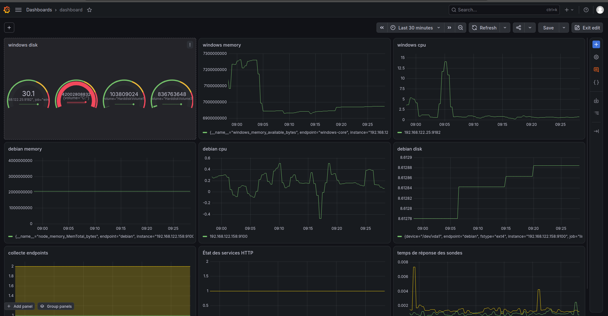

# Construire un premier dashboard Grafana

## Objectif et travail demandé

À partir des métriques collectées dans Prometheus, construire un premier dashboard Grafana permettant de suivre l’état et les performances des endpoints Linux et Windows Core d’AlpesNet.

Le dashboard doit montrer la disponibilité des endpoints, l’utilisation CPU, mémoire et stockage, une information réseau ou de performance, ainsi que l’évolution d’au moins un indicateur dans le temps.

Créer le dashboard, ajouter les visualisations, sélectionner les données et les représentations adaptées, organiser les panneaux, donner des titres explicites, vérifier unités, périodes et actualisation, puis tester les deux endpoints. Répéter les ajustements jusqu’à obtenir un résultat complet et lisible. Consigner le travail dans le dossier de déploiement et de configuration.

!!! note "Préparation et preuves"
    Le fichier JSON est une aide facultative ; l’utilisateur construit les visualisations à la main. La capture du 15 septembre montre neuf panneaux avec des données. Plusieurs requêtes et réglages restent à corriger avant validation finale ; l’import du JSON n’est pas attesté. Cette activité est distincte de la [simulation croisée](simulation-croisee-observabilite.md), à réaliser quand l’autre binôme sera prêt.

## 1. Choisir les KPI et organiser l’écran

| Besoin | KPI retenu | Représentation | Unité et interprétation |
| --- | --- | --- | --- |
| Disponibilité des endpoints | `up` des jobs Linux/Windows | Deux panneaux Stat | 1 = collecte réussie, 0 = échec ; ne prouve pas toute la santé de l’hôte |
| Disponibilité applicative | `probe_success` des deux sondes HTTP | Deux Stat et une courbe d’historique | 1 = réponse attendue, 0 = échec du contrôle |
| Utilisation CPU | Part moyenne de temps non inactif | Une courbe par endpoint | Pourcentage, 0 à 100 |
| Utilisation mémoire | Part de RAM non disponible | Une courbe par endpoint | Pourcentage, estimation expliquée ci-dessous |
| Utilisation stockage | Part occupée de `/` ou `C:` | Une courbe par endpoint | Pourcentage, un système de fichiers identifié |
| Performance du service | Durée des sondes HTTP | Courbe avec une série par service | Secondes ; durée d’un contrôle, pas fréquence de collecte |
| Évolution temporelle | Courbes CPU, mémoire, stockage et sondes | Séries temporelles | Période commune, par défaut dernière heure |

Disposition du JSON : quatre états en haut, CPU sur la deuxième ligne, mémoire sur la troisième, stockage sur la quatrième, puis historique et durée des sondes. Debian reste à gauche et Windows à droite pour faciliter la comparaison.

Utiliser des noms de machines ou services dans les légendes. Ne pas convertir une absence de données en zéro ou en succès. Aucune alerte automatique n’est créée par cet import.

## 2. Importer le dashboard préparé

[Télécharger le dashboard AlpesNet — Observation croisée (JSON)](../../assets/configs/supervision-optimisation-performances/it-1/grafana/alpesnet-observation-croisee.json).

Le fichier contient 12 panneaux : deux états de collecte, deux sondes HTTP, CPU Linux/Windows, utilisation mémoire Linux/Windows, occupation du stockage sur `/` et `C:`, historique et durée des sondes. L’actualisation est de 30 secondes, la période initiale d’une heure. Aucun événement confidentiel n’est intégré.

1. Sur le **laptop**, ouvrir les tunnels si ces ports ne sont pas déjà transférés :

    ```bash
    ssh -N -L 3000:127.0.0.1:3000 -L 5601:127.0.0.1:5601 oliv@192.168.122.80
    ```

2. Ouvrir `http://127.0.0.1:3000` et se connecter à Grafana.
3. Dans **Connections → Data sources**, vérifier ou créer une source **Prometheus**, URL `http://prometheus:9090`, intervalle de scrape **30s**, puis **Save & test**. Réutiliser la source existante si elle convient.
4. Aller dans **Dashboards → New → Import**, charger le JSON téléchargé et choisir cette source dans le champ **Prometheus** demandé.
5. Importer dans le dossier souhaité. Si ce dashboard existe déjà, examiner celui-ci avant de confirmer son remplacement ; on peut aussi changer son UID pour conserver une copie.
6. Vérifier les quatre états, les courbes CPU et ressources, puis enregistrer les adaptations éventuelles. Le lien vers Discover utilise le tunnel 5601 ; les logs restent dans Kibana.

Le JSON utilise un paramètre de source résolu lors de l’import dans l’interface. Il ne nécessite ni import d’un dashboard public par numéro, ni redémarrage des conteneurs. [Importer un dashboard Grafana](https://grafana.com/docs/grafana/latest/visualizations/dashboards/build-dashboards/import-dashboards/)

**Vérification du 15 septembre 2026 :** l’API de santé Grafana répond (version 13.2.1, base OK), et les requêtes des panneaux ont été contrôlées directement sur Prometheus. L’import du JSON n’est pas attesté. La réalisation manuelle à neuf panneaux est présentée ci-dessous avec les ajustements restants. Les panneaux de sondes masquent les résultats lorsque leur collecte échoue, pour ne pas présenter une ancienne valeur comme un état actuel. « Sans données » n’est pas un succès.

## 3. Construire ou modifier les visualisations

Pour un apprentissage pas à pas, partir d’un dashboard vide avec **Dashboards → New dashboard → Add visualization**, ou ouvrir un panneau importé avec **Edit**. Choisir la source Prometheus, passer l’éditeur en mode **Code**, saisir une requête ci-dessous, vérifier les valeurs puis régler le titre, l’unité et la légende. Enregistrer après chaque groupe de panneaux. [Création de dashboards Grafana](https://grafana.com/docs/grafana/latest/visualizations/dashboards/build-dashboards/create-dashboard/)

### Où saisir le texte de la légende ?

Dans l’éditeur du panneau, aller **sous le graphique**, puis ouvrir **Queries → requête A → Options → Legend**. Passer de **Auto** à **Custom** et coller le texte demandé, par exemple `{{instance}}` ou `Windows Core — {{volume}}`. Cliquer sur **Run queries** pour vérifier le résultat.

La section **Legend** dans la colonne de droite, avec **Visibility**, **List/Table**, **Bottom/Right** et **Values**, règle uniquement la présentation. Le champ de saisie du nom se trouve dans les options de la requête, pas dans cette section. Voir le [chemin détaillé dans la feuille L2](ameliorer-dashboards.md#trouver-le-champ-de-legende-sous-le-graphique). [Éditeur Prometheus](https://grafana.com/docs/grafana/latest/datasources/prometheus/query-editor/)

### Disponibilité : distinguer collecte et service

```promql
up{job=~"linux|windows"}
```

Pour un panneau Stat par endpoint, filtrer sur `job="linux"` ou `job="windows"`. Utiliser une requête instantanée, avec correspondances 0 → Échec et 1 → OK. Le JSON fournit ces deux panneaux séparés.

Pour les contrôles HTTP :

```promql
probe_success{job=~"sonde_.*"} and on(job, instance) (up{job=~"sonde_.*"} == 1)
```

La condition écarte une valeur de sonde quand son scrape échoue. Un résultat absent s’affiche « Sans données ». La même requête en mode temporel alimente l’historique ; ne pas relier artificiellement les trous de collecte.

### CPU : transformer les compteurs en pourcentages

Debian :

```promql
100 * (1 - avg by (instance) (rate(node_cpu_seconds_total{job="linux",mode="idle"}[2m])))
```

Windows :

```promql
100 * (1 - avg by (instance) (rate(windows_cpu_time_total{job="windows",mode="idle"}[2m])))
```

Choisir **Time series**, unité **Percent (0–100)**, légende `{{instance}}`. La moyenne porte sur les processeurs exposés ; un seul processus peut ne charger qu’une partie de la capacité de la VM. `rate` utilise ici deux minutes de mesures et lisse la variation : attendre plusieurs scrapes après le démarrage. [Fonction rate](https://prometheus.io/docs/prometheus/latest/querying/functions/#rate)

### Mémoire : estimer la part non disponible

Debian :

```promql
100 * (1 - node_memory_MemAvailable_bytes{job="linux"} / node_memory_MemTotal_bytes{job="linux"})
```

Windows :

```promql
100 * (1 - windows_memory_available_bytes{job="windows"} / windows_memory_physical_total_bytes{job="windows"})
```

Choisir **Time series**, unité **Percent (0–100)**. Ce KPI est la part de mémoire non disponible, calculée selon les informations de chaque OS ; il ne correspond pas à la somme des mémoires des processus. Sur Linux, `MemAvailable` prend en compte la mémoire récupérable : ne pas remplacer ce champ par `MemFree` sans changer l’interprétation.

La métrique Windows `windows_memory_physical_total_bytes` a été relevée sur le Prometheus du laboratoire. Ne pas saisir une quantité de RAM en dur dans la formule : elle deviendrait fausse après modification de la VM.

### Stockage : mesurer l’occupation du volume choisi

Debian, système de fichiers `/` :

```promql
100 * (1 - node_filesystem_free_bytes{job="linux",mountpoint="/",fstype!="rootfs"} / node_filesystem_size_bytes{job="linux",mountpoint="/",fstype!="rootfs"})
```

Windows, volume `C:` :

```promql
100 * (1 - windows_logical_disk_free_bytes{job="windows",volume="C:"} / windows_logical_disk_size_bytes{job="windows",volume="C:"})
```

Choisir **Time series**, unité **Percent (0–100)**, avec le volume dans le titre. Sur Debian, le calcul utilise les blocs libres ; `node_filesystem_avail_bytes`, utilisé dans la feuille précédente, représente l’espace disponible pour un utilisateur non privilégié et peut différer à cause des blocs réservés. Ne pas additionner `/tmp` en mémoire au disque racine.

### Performance et historique

```promql
probe_duration_seconds{job=~"sonde_.*"}
```

Afficher la durée en **secondes** avec une légende `{{endpoint}}`. Par exemple, `0.001` seconde correspond à une milliseconde : laisser Grafana adapter l’affichage à partir de l’unité déclarée. Cet indicateur couvre le besoin « réseau ou performance » sans ajouter un collecteur.

Les courbes conservent l’évolution, contrairement à un Stat instantané. Pour comprendre une panne, rapprocher la durée de `probe_success` : une sonde rapide peut aussi avoir échoué.

## 4. Vérifier périodes, unités et actualisation

- Choisir **Last 1 hour** pour la première consultation ; utiliser une période absolue pour revoir un exercice passé.
- Régler l’actualisation du dashboard sur **30s** et l’intervalle déclaré de la source Prometheus sur **30s**, cohérent avec la collecte du laboratoire.
- Vérifier que l’heure affichée correspond au fuseau du navigateur. Les timestamps stockés sont indépendants de ce choix d’affichage.
- Vérifier titres et légendes, pourcentages de 0 à 100, secondes pour les sondes, absence de confusion entre utilisé, libre et disponible.
- Comparer une valeur dans Grafana avec la même requête dans Prometheus à un instant proche. De petites différences sont possibles si les évaluations ne se font pas au même instant.

L’actualisation de la page ne déclenche pas elle-même une nouvelle collecte. Une courbe CPU calculée sur deux minutes ne devient pas instantanée parce que le dashboard s’actualise toutes les 30 secondes.

## 5. Tester puis améliorer le dashboard

Vérifier les deux endpoints au repos, puis réaliser si nécessaire un test contrôlé sur une seule machine, en gardant les collecteurs actifs. Les procédures de [sondes](creer-configurer-sondes.md) décrivent une panne réversible ; la feuille de [simulation](simulation-croisee-observabilite.md) propose une charge CPU bornée. Ces essais de mise au point peuvent être connus de l’opérateur : ils ne constituent pas encore la simulation croisée.

| Contrôle | Debian | Windows Core | Preuve attendue |
| --- | --- | --- | --- |
| État de collecte présent et récent | ☐ | ☐ | Stat et Target cohérents |
| CPU visible, unité correcte | ☐ | ☐ | Courbe et comparaison Prometheus |
| Utilisation mémoire visible | ☐ | ☐ | Valeur numérique et définition du calcul |
| Occupation du stockage visible | ☐ | ☐ | `/` ou `C:` identifié |
| Performance HTTP visible | ☐ | ☐ | Série de durée associée au service |
| Évolution dans le temps lisible | ☐ | ☐ | Historique sur la période choisie |
| Actualisation observée sur plusieurs cycles | ☐ | ☐ | Valeurs ou horodatages récents |

Si un panneau est vide, vérifier la source sélectionnée lors de l’import, les labels `job`, les métriques réellement exposées et la période. Pour une courbe CPU, attendre plusieurs collectes. Une erreur de source n’est pas corrigée en remplaçant les valeurs absentes par zéro.

Ajuster une visualisation, comparer de nouveau les deux endpoints, enregistrer et recommencer jusqu’à obtenir un résultat lisible. Restaurer l’état nominal après tout test. Une couleur de seuil ajoutée manuellement reste une convention d’affichage tant que le seuil n’est pas justifié et qu’aucune règle d’alerte n’est configurée.

### Réalisation manuelle — neuf panneaux observés



*Capture du 15 septembre 2026 à 09:41 — Les neuf panneaux couvrent les familles de KPI attendues et affichent des données Linux/Windows. La période sélectionnée est de 30 minutes. L’écran est encore en édition ; l’enregistrement final et l’actualisation automatique ne sont pas démontrés.*

| Panneau observé | Constat | Ajustement à réaliser manuellement |
| --- | --- | --- |
| Windows disk | Une valeur proche de 30,1 et trois tailles de volumes en octets coexistent | Supprimer les anciennes requêtes de taille ; garder uniquement l’occupation de `C:` en %, bornes 0–100 |
| Windows memory | La légende indique `windows_memory_available_bytes`, valeurs en milliards d’octets | Remplacer la requête par le calcul de mémoire non disponible de la section 3, unité Percent (0–100) |
| Debian memory | La légende indique `node_memory_MemTotal_bytes`, ligne constante | Remplacer la RAM totale par le calcul d’utilisation mémoire de la section 3 |
| CPU Windows / Debian | Les courbes ne sont plus des compteurs simplement croissants ; Debian présente cependant de faibles valeurs négatives | Vérifier la requête exacte, les données source et la fenêtre de calcul ; une valeur négative ne représente pas une utilisation physique. Ne pas la masquer pour conclure que le calcul est validé |
| Debian disk | Une variation proche de 8,61 est visible, avec un axe très resserré | Vérifier le calcul d’occupation, ajouter l’unité % et des bornes 0–100 pour éviter d’exagérer visuellement la variation |
| Collecte endpoints | Le graphe affiche notamment un niveau à 2 | Vérifier si les séries sont empilées ou agrégées. Afficher chaque endpoint séparément, sans somme ni empilement, avec une valeur 0 ou 1 |
| État des services HTTP | Les courbes se superposent à 1 | Afficher une valeur par endpoint et sa légende ; Stat instantané avec 0 = Échec, 1 = OK, absence = Sans données |
| Temps de réponse des sondes | Plusieurs séries temporelles sont visibles | Régler l’unité secondes et la légende `{{endpoint}}` |

Pour corriger un panneau, ouvrir **Edit**, examiner toutes les requêtes A/B/C et les transformations, puis supprimer les anciennes séries devenues inutiles. Changer le titre ne remplace pas la requête. La disposition à neuf panneaux convient : aucun ajout n’est nécessaire pour couvrir les critères demandés une fois ces corrections faites.

Terminer par un nom explicite, l’actualisation **30s**, **Save**, puis une vérification hors du mode édition. Comparer les valeurs aux requêtes Prometheus avant de cocher la validation.

## 6. Dossier de déploiement et de configuration

Consigner le nom et l’UID du dashboard, sa source Prometheus, les requêtes, les hôtes/volumes retenus, les unités, la période, l’actualisation, les correspondances de valeurs, les éventuels seuils et leur justification. Conserver le JSON exporté après les adaptations.

Ajouter une capture d’ensemble et les preuves des tests, avec les résultats et corrections. Les vérifications des requêtes sur Prometheus ne remplacent pas une capture du dashboard affiché dans Grafana.

- [ ] Dashboard créé et enregistré.
- [ ] Disponibilité des deux endpoints visible.
- [ ] Utilisations CPU, mémoire et stockage visibles pour les deux systèmes.
- [x] Au moins un KPI réseau ou performance visible : courbes de durée des sondes, unité à finaliser.
- [x] Évolution d’au moins un indicateur présentée dans le temps : courbes sur la période sélectionnée.
- [ ] Titres, unités, périodes et actualisation vérifiés.
- [ ] Tests sur plusieurs endpoints et corrections documentés.

[Retour au sommaire de l’itération](index.md) · [Préparer ensuite la simulation croisée](simulation-croisee-observabilite.md)

## Suite des améliorations — Livrable L2

La capture de 11:11 montre les états séparés et des courbes mémoire modifiées. Le disque Windows, les unités et les légendes restent à terminer. Voir la [capture et le bilan L2](ameliorer-dashboards.md#grafana-etats-separes-et-courbes-memoire-modifiees).

**Dernière capture :** À 11:36, les titres et les légendes sont précisés, le disque Windows affiche une seule série et la durée des sondes possède son unité. Les axes en pourcentage, les textes d’état et la validation finale restent à terminer. Voir le [bilan actualisé L2](ameliorer-dashboards.md#grafana-a-1136-legendes-disque-windows-et-unite-des-durees).

**Actualisation à 11:48 :** La capture de 11:48 montre désormais les six échelles de ressources de 0 à 100 ; les remarques antérieures sur les bornes décrivent les étapes précédentes. Voir les [dernières preuves L2](ameliorer-dashboards.md#bilan-visuel-a-1148-echelles-et-titres-harmonises).
