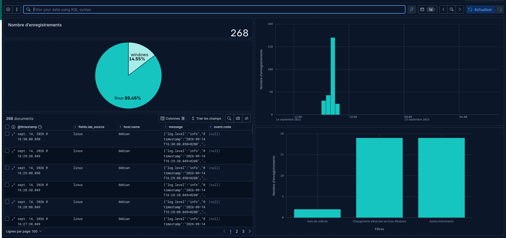
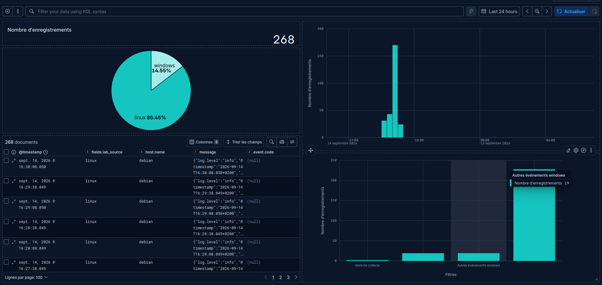
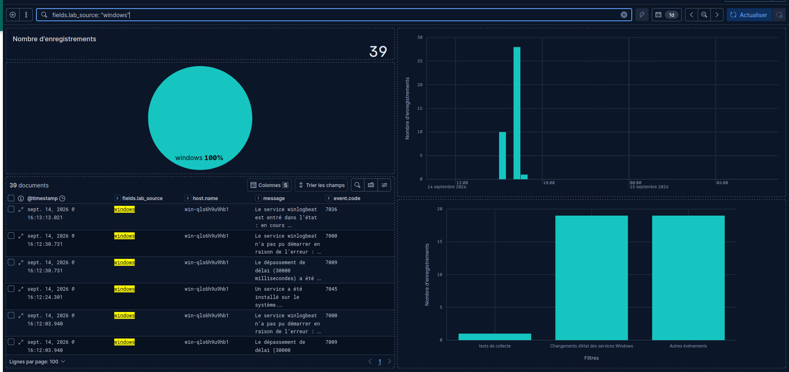
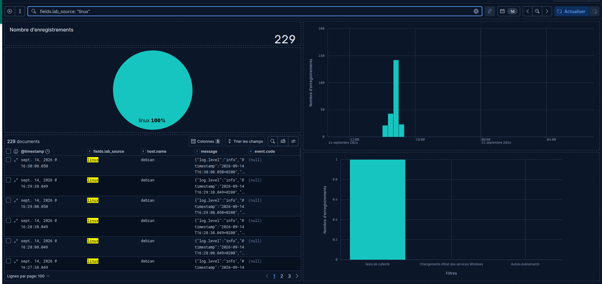
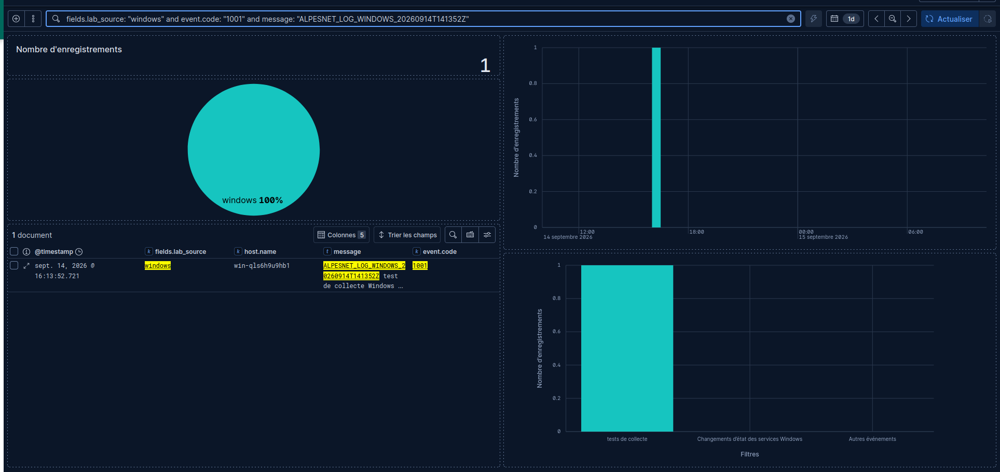
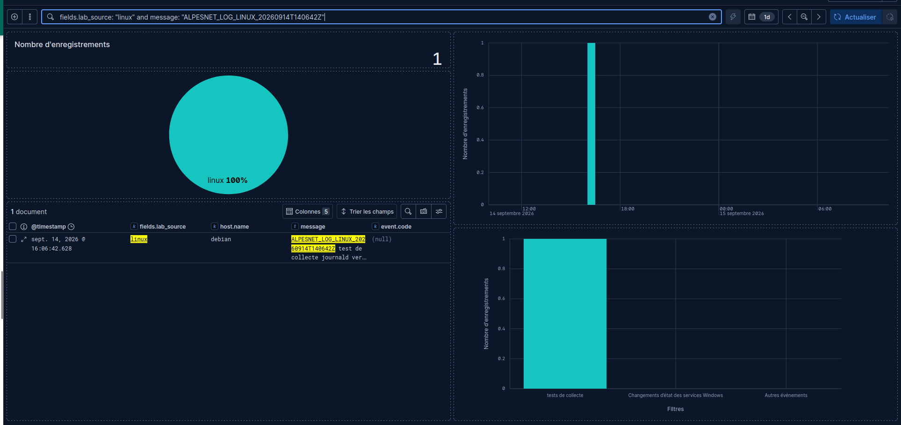

# Construire un dashboard Kibana

## Objectif et travail demandé

Les journaux Linux et Windows Core sont centralisés dans ELK. Construire **à la main** un dashboard permettant à l’équipe Infrastructure d’AlpesNet de voir rapidement le volume, l’origine, les types et les derniers événements de son infrastructure.

Sélectionner les données pertinentes, créer les visualisations, les organiser et leur donner des titres explicites. Vérifier la distinction Linux/Windows, la représentation des événements et le fonctionnement avec des événements récents. Adapter les panneaux difficiles à interpréter et consigner les choix dans le dossier de déploiement et de configuration.

!!! note "État de l’activité"
    La [collecte et les recherches Linux/Windows](ajouter-source-logs.md) disposent de preuves du 14 septembre 2026. Les captures du 15 septembre attestent une construction manuelle avec cinq panneaux et la recherche des anciens tests. La fenêtre de 24 heures montre les événements du 14 septembre ; elle ne prouve pas une collecte active le 15. La capture de 10:25 confirme l’ajout d’une quatrième catégorie et le libellé « Autres événements Windows ». L’enregistrement puis la réouverture du dashboard restent à confirmer.

## 1. Ouvrir Kibana et préparer les données

Depuis le navigateur du laptop, ouvrir `http://127.0.0.1:5601`. Si le tunnel Kibana n’est pas déjà ouvert, lancer sur le **laptop** et garder ce terminal ouvert :

```bash
ssh -N -L 5601:127.0.0.1:5601 oliv@192.168.122.80
```

Dans **Analyse / Analytics → Discover**, sélectionner la vue existante **Journaux AlpesNet** :

| Paramètre | Valeur du laboratoire |
| --- | --- |
| Index inclus | `observabilite-linux,observabilite-windows` |
| Champ temporel | `@timestamp` |
| Source Linux | `fields.lab_source: "linux"` |
| Source Windows | `fields.lab_source: "windows"` |
| Machine | `host.name` |
| Contenu | `message` |

Utiliser la dernière heure, effacer les anciennes recherches de marqueurs et retirer les filtres qui limitent à une machine. Vérifier séparément les deux sources, puis revenir à une recherche vide. Réutiliser cette vue dans chaque panneau ; ne pas modifier la vue gérée « All logs ».

Pour retrouver les anciens tests, choisir une période absolue **14 septembre 2026, 16:00–16:30**, si Kibana affiche l’heure de Paris. Les mêmes bornes en UTC sont **14:00–14:30**. Revenir ensuite à la dernière heure pour l’exploitation.

## 2. Créer le dashboard

Dans **Analyse / Analytics → Dashboards**, choisir **Create dashboard / Créer un dashboard**, puis enregistrer sous **AlpesNet — Journaux Linux et Windows**.

Prévoir cette disposition :

| Position | Titre du panneau | Visualisation |
| --- | --- | --- |
| Haut, à gauche | Événements sur la période | Metric : nombre entier |
| Haut, à droite, large | Évolution du nombre d’événements | Histogramme temporel |
| Milieu, à gauche | Origine des événements | Camembert Linux/Windows |
| Milieu, à droite | Types d’événements — classement du lab | Barres verticales par catégorie |
| Bas, pleine largeur | Derniers événements Linux et Windows | Tableau Discover enregistré |

Pour les quatre premiers panneaux, utiliser **Add → Visualization / Ajouter une visualisation**, puis **Lens** et la vue **Journaux AlpesNet**. Selon l’écran, le bouton peut s’appeler **Create visualization**. Après chaque panneau, choisir **Save and return / Enregistrer et revenir** et donner le titre prévu. [Création de visualisations Lens](https://www.elastic.co/docs/explore-analyze/visualize/lens)

## 3. Panneau 1 — Événements sur la période

Choisir **Indicateur** (Metric en anglais) et l’opération **Compte**, champ **Enregistrements** (Count of records en anglais). Si l’éditeur propose **Formula**, `count()` donne le décompte attendu. Ne pas utiliser une somme sur `event.code` : ce champ est un identifiant, pas une quantité.

Afficher un nombre entier, sans unité de stockage ni pourcentage. Ajouter la description : « Nombre de documents correspondant aux filtres et à la période sélectionnés ». [Paramètres des métriques Kibana](https://www.elastic.co/docs/explore-analyze/visualize/charts/metric-charts)

Comparer avec le nombre de documents dans Discover, à période et filtres identiques. Ce nombre représente les événements indexés, **pas le nombre d’incidents**. Plusieurs journaux peuvent concerner un seul incident ; une duplication de collecte peut aussi augmenter le décompte.

## 4. Panneau 2 — Évolution du nombre d’événements

Choisir un graphique à **barres verticales** :

- axe horizontal : `@timestamp`, opération **Date histogram**, intervalle automatique ;
- axe vertical : **Count of records**, titre « Événements par intervalle » ;
- facultatif : décomposition **Top values** de `fields.lab_source`, pour distinguer les deux sources.

Garder l’axe vertical à partir de zéro. Sur une période d’une heure, vérifier que les intervalles permettent de voir les variations. Un pic de dix minutes et un pic d’une minute ne se comparent pas directement : noter l’intervalle réellement affiché. Le dernier intervalle peut être incomplet.

Survoler une barre pour lire sa date et son décompte. Une hausse indique davantage de journaux ; rechercher les messages avant de conclure à un incident. [Tutoriel officiel de construction de visualisations](https://www.elastic.co/docs/explore-analyze/kibana-data-exploration-learning-tutorial)

## 5. Panneau 3 — Origine des événements

Choisir **Camembert** dans l’interface française observée : taille des parts = **Count of records** ; découpage = **Valeurs les plus élevées** (Top values en anglais) de `fields.lab_source`, au moins deux valeurs.

Afficher la légende, les nombres et, si lisibles, les pourcentages. Conserver une couleur par source sur tout le dashboard. Activer l’inclusion des documents sans valeur et la catégorie « Other / Autres » si ces options sont proposées, pour ne pas masquer des journaux mal étiquetés.

Vérifier que Linux et Windows apparaissent sur une période contenant leurs événements. Si le champ n’est pas disponible pour une agrégation, vérifier son type dans la vue : la configuration du lab prévoit un champ `keyword`. Utiliser sa variante `.keyword` seulement si elle existe réellement et contient les valeurs. Ne pas remplacer silencieusement le champ par `agent.type`, qui indique le collecteur.

La somme des parts doit correspondre au total du premier panneau. Une part manquante impose de vérifier période, filtres et présence de `fields.lab_source`.

## 6. Panneau 4 — Types d’événements

Les champs de gravité ne sont pas encore harmonisés entre journald et Windows. Le test Linux porte une priorité syslog ; Windows possède notamment un fournisseur et un code d’événement. Un code `1001` n’est pas un niveau de gravité.

Pour cette première version, choisir une répartition **par type**, avec un classement explicite propre au lab. Dans Lens, prendre **Vertical à barres**, axe vertical **Compte → Enregistrements**, puis axe horizontal **Filtres**. Ajouter les quatre filtres KQL ci-dessous avec leur libellé. La fonction Filters permet de définir plusieurs groupes KQL. [Filtres dans Lens](https://www.elastic.co/guide/en/kibana/current/lens.html#_apply_filters)

**Tests de collecte AlpesNet** :

```kql
(fields.lab_source: "linux" and log.syslog.appname: "alpesnet-lab") or (fields.lab_source: "windows" and event.provider: "AlpesNet-Lab" and event.code: "1001")
```

**Windows — changements d’état de services** :

```kql
fields.lab_source: "windows" and event.provider: "Service Control Manager" and event.code: "7036"
```

**Autres événements Windows** :

```kql
fields.lab_source: "windows" and not ((event.provider: "AlpesNet-Lab" and event.code: "1001") or (event.provider: "Service Control Manager" and event.code: "7036"))
```

**Autres événements Linux** :

```kql
fields.lab_source: "linux" and not log.syslog.appname: "alpesnet-lab"
```

Pour compléter le graphique existant, renommer sa catégorie « Autres événements » en **« Autres événements Windows »** et vérifier son filtre ci-dessus, puis ajouter le quatrième filtre Linux. Conserver **Compte → Enregistrements** comme métrique. L’ajout est visible dans la capture de 10:25 ci-dessous ; les captures précédentes conservent les trois catégories initiales.

Les sources et codes utilisés correspondent aux événements observés dans le lab. Vérifier leurs valeurs dans un document développé dans Discover avant de saisir les filtres. La première catégorie suppose que `alpesnet-lab` et `AlpesNet-Lab` restent réservés aux tests.

Ces quatre catégories couvrent les documents étiquetés Linux ou Windows et se séparent pour les valeurs simples du lab. Vérifier séparément les documents sans source ou avec une autre source si le périmètre évolue. Leur somme doit égaler le total. Une catégorie à zéro peut simplement ne contenir aucun événement sur la période. « Autres » ne signifie ni succès ni erreur.

Ajouter cette description au panneau : « Classement fonctionnel du laboratoire ; ne représente pas la gravité ». Une future amélioration pourra normaliser `log.level` dans la collecte, après vérification des correspondances Linux/Windows, tout en conservant les valeurs d’origine.

## 7. Panneau 5 — Derniers événements

Dans **Discover**, choisir **Journaux AlpesNet**, effacer la recherche et les filtres de test. Ajouter les colonnes :

| Colonne | Utilité |
| --- | --- |
| `@timestamp` | Heure de l’événement |
| `fields.lab_source` | Linux ou Windows |
| `host.name` | Machine d’origine |
| `message` | Contenu exploitable |
| `event.code` | Identifiant d’événement, notamment Windows |

Trier `@timestamp` **du plus récent au plus ancien**. Garder un tableau lisible ; développer une ligne pour consulter `event.provider`, `log.syslog.appname`, `winlog.channel` ou `agent.type`. Un champ absent sur un système est normal s’il appartient à l’autre source.

Enregistrer la session sous **AlpesNet — Derniers événements**. Si le dialogue propose **Add to dashboard**, choisir le dashboard existant. Sinon, revenir au dashboard en édition et utiliser **Add from library / Ajouter depuis la bibliothèque**, puis sélectionner cette session. La session mémorise notamment colonnes, tri, vue et recherche : vérifier qu’aucun filtre de marqueur n’y reste enregistré. [Enregistrer une session Discover et l’ajouter au dashboard](https://www.elastic.co/docs/explore-analyze/discover/save-open-search)

Le tableau présente les documents récents dans la limite d’affichage ; son nombre de lignes visibles n’est pas le total des événements.

## 8. Harmoniser la période, les filtres et l’actualisation

Régler le dashboard sur **Last 1 hour / Dernière heure**, actualisation **30 secondes**, puis enregistrer. Tous les panneaux doivent suivre la période du dashboard ; supprimer les périodes personnalisées des panneaux si elles ont été activées.

Tester successivement dans la barre KQL :

```kql
fields.lab_source: "linux"
```

```kql
fields.lab_source: "windows"
```

Les cinq panneaux doivent suivre le filtre, y compris le tableau. Effacer ensuite la recherche pour retrouver les deux sources. Les filtres, la recherche et la période déterminent les événements présentés ; toujours les conserver visibles dans les captures. [Filtrer un dashboard Kibana](https://www.elastic.co/docs/explore-analyze/dashboards/using)

L’actualisation de l’écran ne règle pas la fréquence d’envoi de Filebeat/Winlogbeat. Une collecte interrompue peut laisser un dashboard rempli d’anciens documents : examiner l’heure du dernier événement.

## 9. Tester avec les événements du laboratoire

### Retrouver les preuves existantes

Sur la période absolue du 14 septembre indiquée au début, rechercher tour à tour les deux marqueurs déjà retrouvés dans Discover :

```kql
fields.lab_source: "linux" and message: "ALPESNET_LOG_LINUX_20260914T140642Z"
```

```kql
fields.lab_source: "windows" and event.code: "1001" and message: "ALPESNET_LOG_WINDOWS_20260914T141352Z"
```

Pour chaque recherche, vérifier le total, la source, la catégorie « Tests de collecte AlpesNet » et le message du tableau. Les preuves précédentes montraient un document par marqueur ; confirmer le résultat actuel sans supposer que les données sont toujours conservées.

### Vérifier la remontée récente

Revenir à la dernière heure et générer un **nouveau** test sur chaque endpoint en reprenant les commandes de la [mise en situation de collecte](ajouter-source-logs.md). Conserver les nouveaux marqueurs et horaires.

1. Vérifier l’événement localement, puis rechercher son marqueur sur le dashboard.
2. Observer son apparition dans le tableau et les panneaux de comptage.
3. Comparer heure, machine, source et message avec l’événement local.
4. Noter le délai observé ; ne pas confondre date de l’événement et date de son affichage.
5. Effacer le marqueur avant d’enregistrer la vue générale.

Pour comparer les décomptes avant/après, utiliser une période fixe englobant les tests. Sur une fenêtre glissante, des événements anciens peuvent sortir pendant que les nouveaux entrent ; les autres journaux continuent également d’arriver.

Si un panneau reste vide, ouvrir Discover avec la même vue, période et recherche. Si le document y est présent, vérifier les champs et filtres du panneau. S’il manque aussi dans Discover, reprendre le diagnostic de collecte de la feuille précédente.

## 10. Captures du 15 septembre — consultation sur 24 heures

L’utilisateur indique ne pas avoir d’événements du jour et a choisi **24 heures** (`1d`) pour montrer les graphes. Les documents visibles datent du **14 septembre 2026**. Ces captures valident la consultation historique ; un nouveau test reste nécessaire pour confirmer la collecte actuelle.

### Vue d’ensemble des cinq panneaux



*Capture à 10:21:36 — 268 documents, dont 229 Linux (85,45 %) et 39 Windows (14,55 %). Le compteur et le tableau concordent. L’histogramme montre l’activité de la veille ; le tableau présente les documents visibles du plus récent au plus ancien.*

!!! note "Périmètre du graphique confirmé par l’utilisateur"
    Le graphique affiche **2 tests + 19 changements d’état Windows + 19 autres événements Windows = 40**. L’utilisateur confirme que le filtre « Autres » cible Windows : les **228 autres événements Linux** sont volontairement hors de cette sélection, sans être absents d’Elasticsearch. Renommer cette catégorie pour expliciter son périmètre. Avec la quatrième catégorie proposée ci-dessus, le résultat attendu sur les mêmes données est **2 + 19 + 19 + 228 = 268** ; la capture suivante montre désormais cet ajout.

La barre Linux sera nettement plus haute. Conserver les vrais décomptes ; pour examiner les petites catégories, utiliser temporairement le filtre global Windows, puis l’effacer pour retrouver l’ensemble des sources.

### Après correction — quatre catégories



*Capture du 15 septembre à 10:25:27 — La période « Last 24 hours » et le total de 268 documents sont visibles. Le graphique présente maintenant quatre barres ; l’infobulle confirme « Autres événements Windows » à 19. La grande barre ajoutée est cohérente avec les 228 autres événements Linux attendus sur ce jeu de données.*

L’ajout de la catégorie Linux est réalisé. Pour consigner les valeurs exactes, survoler chaque barre : le résultat attendu reste **2 + 19 + 19 + 228 = 268**. La capture ne montre qu’une infobulle à la fois. Certains libellés de l’axe sont masqués faute de place : élargir le panneau ou raccourcir les étiquettes (« Tests », « États services Windows », « Autres Windows », « Autres Linux ») en conservant une description explicite.

### Distinction des sources



*Capture à 10:20:20 — Filtre Windows : 39 événements et 100 % Windows. Le classement montre 1 test, 19 changements d’état et 19 autres, soit 39.*



*Capture à 10:20:28 — Filtre Linux : 229 événements et 100 % Linux. Le classement n’affiche qu’un test : sa catégorie « Autres » cible Windows, comme confirmé par l’utilisateur. Les 228 autres événements Linux n’étaient pas encore couverts par une catégorie dédiée à cet instant.*

### Recherche des événements de test historiques



*Capture à 10:20:40 — Un document retrouvé pour `ALPESNET_LOG_WINDOWS_20260914T141352Z`, code 1001, le 14 septembre à 16:13:52.721. Le compteur, la source, le tableau et la catégorie de test suivent la recherche.*



*Capture à 10:20:47 — Un document retrouvé pour `ALPESNET_LOG_LINUX_20260914T140642Z`, le 14 septembre à 16:06:42.628. L’absence de `event.code` sur ce document Linux est normale.*

Les titres explicites des panneaux restent à finaliser : les captures montrent principalement les libellés automatiques. Conserver la période de 24 heures pour ces preuves, puis revenir à une période récente et générer de nouveaux tests pour vérifier la fraîcheur des données.

## 11. Dossier de déploiement et de configuration

| Élément à consigner | Preuve ou information à conserver |
| --- | --- |
| Dashboard | Nom, lien interne, date d’enregistrement |
| Données | Vue, index, champ temporel et champs utilisés |
| Visualisations | Titres, opérations, filtres KQL et raison du choix |
| Affichage | Période, fuseau horaire, intervalle du graphique et actualisation |
| Validation Linux/Windows | Marqueurs, horaires locaux, événements retrouvés |
| Cohérence | Comparaison avec Discover et somme des répartitions |
| Difficultés | Symptôme, diagnostic, correction et résultat vérifié |
| Améliorations | Champs à harmoniser, filtres ou présentation à améliorer |

Conserver une capture générale avec les cinq panneaux et la période visible, puis une preuve filtrée par source montrant un événement identifiable. Ne cocher que les points effectivement vérifiés dans Kibana.

## Questions de fin d’étape

| Question | Réponse attendue |
| --- | --- |
| Une information présente dans les journaux est-elle nécessairement utile dans un dashboard ? | Non. La synthèse privilégie volume, origine, temps et contenu utile ; les détails restent consultables dans Discover. |
| Quels champs identifient rapidement la source ? | `fields.lab_source` et `host.name` ; `agent.type` précise le collecteur, `event.provider` ou `log.syslog.appname` le producteur. |
| Quelle différence entre Grafana et Kibana ? | Dans ce lab, Grafana présente les métriques Prometheus et les sondes ; Kibana présente et permet de rechercher les événements Elasticsearch. Cette répartition est un choix d’architecture, pas une limite absolue des outils. |
| Que rendre visible immédiatement ? | Période et filtres actifs, total, évolution, sources, types et événements récents. |
| Le dashboard permet-il de repérer rapidement une anomalie ? | Il aide à repérer un pic, une source silencieuse ou des messages inhabituels ; confirmer en examinant les documents et les métriques. Un pic seul ne prouve pas un incident. |
| Quelle amélioration faciliterait l’exploitation ? | Ajouter un filtre par machine/source, afficher la dernière réception par source et harmoniser les niveaux de gravité. Prioriser selon les difficultés réellement rencontrées. |

## Point de contrôle

- [x] Je peux donner le nombre d’événements sur la période sélectionnée.
- [x] Je peux dire si les événements proviennent principalement de Linux ou de Windows.
- [ ] Je peux repérer une variation du volume et rechercher les événements associés.
- [ ] Je peux expliquer les types affichés et les limites du classement.
- [x] Je peux retrouver les événements les plus récents et identifier leur source.
- [x] Les tests historiques Linux et Windows du 14 septembre sont visibles dans le dashboard sur 24 heures.
- [ ] De nouveaux tests confirment la collecte actuelle.
- [x] Le graphique présente quatre catégories après ajout des autres événements Linux.
- [ ] Les valeurs exactes des quatre catégories ont été relevées et leur somme comparée au total.
- [ ] Les cinq panneaux suivent les mêmes filtres et la même période.
- [ ] Le dashboard est enregistré, rouvert et les preuves ajoutées au dossier.

[Retour à l’itération](index.md) · [Dashboard Grafana](construire-dashboard-grafana.md) · [Simulation croisée](simulation-croisee-observabilite.md)

## Suite des améliorations — Livrable L2

La capture de 11:19 montre les quatre catégories lisibles et le tableau trié. Les titres des panneaux et la présentation du compteur restent à terminer. Voir la [capture et le bilan L2](ameliorer-dashboards.md#kibana-quatre-categories-lisibles-et-tableau-trie).

**Dernière capture :** À 11:43, les titres des répartitions et le compteur à 268 sont visibles dans une nouvelle disposition. Le titre temporel et la largeur du tableau restent à améliorer. Voir le [bilan actualisé L2](ameliorer-dashboards.md#kibana-a-1143-titres-couleurs-et-compteur-entierement-visible).

**Actualisation à 11:48 :** La capture de 11:48 montre le titre de l’histogramme ajouté, le tableau élargi et le compteur 268 entièrement visible ; les remarques antérieures sur ces points sont levées. Voir les [dernières preuves L2](ameliorer-dashboards.md#bilan-visuel-a-1148-echelles-et-titres-harmonises).
