# Créer et configurer les sondes

## Objectif et travail demandé

Les [endpoints Linux et Windows Core](integrer-endpoints-linux-windows.md) remontent leurs métriques dans Prometheus. L’équipe Infrastructure d’AlpesNet souhaite maintenant vérifier que les services répondent correctement depuis la plateforme de supervision.

La mission consiste à choisir un service sur chaque système, définir le contrôle adapté, configurer deux sondes, vérifier leurs résultats et documenter un cycle **disponible → indisponible → disponible**.

!!! note "Avancement documenté"
    Les captures attestent les services web, Blackbox et les deux sondes en état nominal dans Prometheus. Le timeout d’accès Windows puis sa résolution sont documentés. Les nouvelles captures attestent les indisponibilités provoquées (HTTP 404 sur Debian, site IIS arrêté) et `probe_success=0` pour les deux sondes. Les captures de 15:09 montrent ensuite leur retour à `1` : le cycle de panne et de rétablissement est documenté pour chaque sonde.

## 1. Choisir les services et les critères

Réutiliser en priorité un service applicatif déjà disponible. Son existence n’étant pas encore documentée dans ces VM, cette procédure propose deux petits sites de laboratoire : **Nginx sur Debian** et **IIS sur Windows Server Core**. Si un site existe déjà, adapter son URL et son contenu attendu au lieu de le remplacer.

| Environnement | Service proposé | URL de contrôle dans ce laboratoire | Réponse attendue |
| --- | --- | --- | --- |
| Debian | Site Nginx, TCP 8080 | `http://192.168.122.158:8080/health.txt` | HTTP 200 et `ALPESNET_LINUX_OK` dans le corps |
| Windows Server Core | Site IIS `AlpesNet-Sonde`, TCP 8080 | `http://192.168.122.25:8080/health.txt` | HTTP 200 et `ALPESNET_WINDOWS_OK` dans le corps |

Les IP viennent des captures du 14 septembre 2026 ; les recontrôler. La VM `supervision` utilise `192.168.122.80`. Vérifier que le port 8080 et les noms de fichiers/sites proposés sont libres avant création.

| Mécanisme | Ce qu’il contrôle | Limite |
| --- | --- | --- |
| ICMP | Réponse réseau d’une machine | Ne valide pas son application ; peut être filtré |
| TCP | Acceptation d’une connexion sur un port | Ne prouve pas que la réponse applicative est correcte |
| HTTP avec code et contenu | Réponse à une requête et présence du texte attendu | Une page statique ne teste pas les dépendances d’une application métier |

Le choix retenu est **Blackbox Exporter**, interrogé par Prometheus depuis le réseau Docker de `supervision`. Aucun nouvel agent de sonde n’est nécessaire sur les endpoints. [Projet officiel Blackbox Exporter](https://github.com/prometheus/blackbox_exporter)

```text
Prometheus → blackbox:9115/probe → site Nginx sur Debian
                               → site IIS sur Windows Core
           ← probe_success et durée du contrôle
```

Le test valide ici le service web et la ressource attendue. Pour une application réelle, choisir une route de santé qui représente les fonctions utiles et leurs dépendances.

## 2. Préparer le service Linux

Sur **la VM Debian à superviser**, uniquement si aucun service pertinent n’est disponible :

```bash
sudo ss -lntp 'sport = :8080'
sudo apt update
sudo apt install nginx curl
sudo mkdir -p /var/www/alpesnet-sonde
printf '%s\n' 'ALPESNET_LINUX_OK' | sudo tee /var/www/alpesnet-sonde/health.txt
sudo chmod 755 /var/www/alpesnet-sonde
sudo chmod 644 /var/www/alpesnet-sonde/health.txt
sudo nano /etc/nginx/conf.d/alpesnet-sonde.conf
```

Créer ce **nouveau fichier**, sans remplacer les autres sites :

```nginx
server {
    listen 8080;
    server_name _;
    root /var/www/alpesnet-sonde;

    location = /health.txt {
        try_files $uri =404;
    }

    location / {
        return 404;
    }
}
```

Valider la configuration, puis appliquer seulement si elle est valide :

```bash
sudo nginx -t && sudo systemctl enable --now nginx && sudo systemctl reload nginx
curl --fail --max-time 10 -i http://127.0.0.1:8080/health.txt
```

**Attendu :** HTTP 200 et `ALPESNET_LINUX_OK`. La sélection de la ressource repose sur une correspondance exacte de chemin. [Configuration Nginx : location](https://nginx.org/en/docs/http/ngx_http_core_module.html#location)

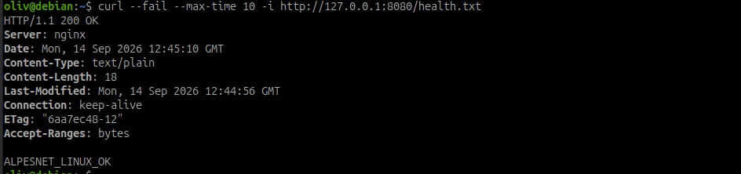

*Capture du 14 septembre 2026 — Sur Debian, `/health.txt` répond HTTP 200 et affiche le marqueur complet `ALPESNET_LINUX_OK`.*

Dans le pare-feu existant, autoriser TCP 8080 depuis `192.168.122.80`. Si UFW est **déjà actif** avec une politique entrante restrictive :

```bash
sudo ufw allow from 192.168.122.80 to any port 8080 proto tcp
sudo ufw status verbose
```

Avec nftables, adapter la politique existante. Conserver SSH et l’accès virt-manager ; ne pas activer un nouveau pare-feu sans préserver l’administration.

## 3. Préparer le service Windows Core

Sur **Windows Server Core**, utiliser **Windows PowerShell administrateur** (`powershell` depuis `cmd`). Pour un site existant, relever d’abord son URL et ses paramètres. Pour créer le site de laboratoire :

```powershell
Get-NetTCPConnection -LocalPort 8080 -State Listen -ErrorAction SilentlyContinue
Get-WindowsFeature Web-Server, Web-Scripting-Tools
Install-WindowsFeature -Name Web-Server, Web-Scripting-Tools
```

Vérifier `Success` et `Restart Needed` avant de continuer ; redémarrer si demandé. L’installation de rôles est disponible en PowerShell. [Install-WindowsFeature](https://learn.microsoft.com/en-us/powershell/module/servermanager/install-windowsfeature?view=windowsserver2025-ps)

```powershell
Import-Module WebAdministration
Get-Website
New-Item -ItemType Directory -Force -Path C:\inetpub\alpesnet-sonde | Out-Null
Set-Content -Path C:\inetpub\alpesnet-sonde\health.txt -Value 'ALPESNET_WINDOWS_OK' -Encoding ascii
icacls C:\inetpub\alpesnet-sonde /grant '*S-1-5-17:(OI)(CI)RX'
New-Website -Name 'AlpesNet-Sonde' -Port 8080 -PhysicalPath C:\inetpub\alpesnet-sonde
Start-Website -Name 'AlpesNet-Sonde'
New-NetFirewallRule -Name 'AlpesNet-Sonde-HTTP' -DisplayName 'AlpesNet sonde HTTP depuis supervision' -Direction Inbound -Action Allow -Protocol TCP -LocalPort 8080 -RemoteAddress 192.168.122.80 -Profile Any
```

Ces commandes de création sont à exécuter une fois : si le site ou la règle existe déjà, examiner puis adapter l’existant. Le SID `S-1-5-17` correspond au compte anonyme IUSR ; l’autorisation donne lecture/exécution au dossier de test. Le site utilise ici l’authentification anonyme standard d’IIS. [New-Website](https://learn.microsoft.com/en-us/powershell/module/webadministration/new-website?view=windowsserver2025-ps)

```powershell
Get-Website -Name 'AlpesNet-Sonde'
Get-Service W3SVC
Invoke-WebRequest -UseBasicParsing -Uri 'http://127.0.0.1:8080/health.txt' |
  Select-Object StatusCode, Content
Get-NetFirewallRule -Name 'AlpesNet-Sonde-HTTP' | Get-NetFirewallAddressFilter
```

**Attendu :** site démarré, HTTP 200 et `ALPESNET_WINDOWS_OK`. Vérifier aussi qu’une autre règle plus large ne rend pas TCP 8080 accessible à davantage de sources.

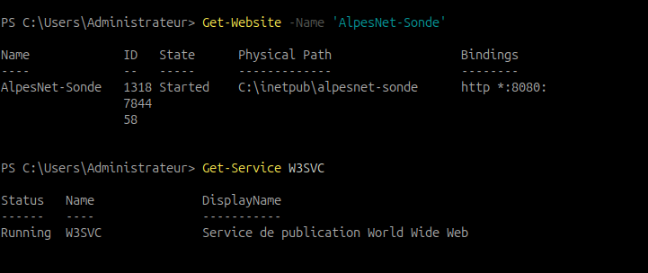

*Capture du 14 septembre 2026 — Le site `AlpesNet-Sonde` est `Started` avec le binding `*:8080:` ; le service `W3SVC` est `Running`.*

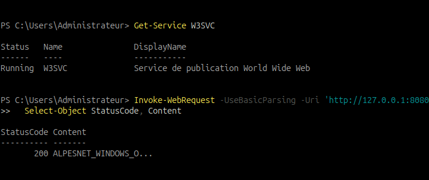

*Capture du 14 septembre 2026 — La requête locale retourne HTTP 200. Le contenu est tronqué par l’affichage PowerShell ; la capture du test depuis supervision montre ensuite le marqueur complet.*

## 4. Vérifier le réseau depuis supervision

Sur **`supervision`** :

```bash
curl --fail --max-time 10 -i http://192.168.122.158:8080/health.txt
curl --fail --max-time 10 -i http://192.168.122.25:8080/health.txt
```

Obtenir les deux réponses attendues avant de poursuivre. Les sondes partiront ensuite du conteneur Blackbox : le test direct depuis la VM ne remplace pas cette validation. Avec le bridge Docker habituel, la source est généralement traduite vers l’IP de `supervision` ; le vérifier si le réseau diffère.

### Incident rencontré : supervision en `.80`, règle restée en `.81`

L’utilisateur a confirmé que l’IP actuelle de `supervision` est **192.168.122.80**. Le test local IIS répondait HTTP 200, mais l’accès depuis supervision expirait. La règle Windows affichait encore `.81`.

Sur **Windows Core, PowerShell administrateur**, la correction de la règle existante est :

```powershell
Get-NetFirewallRule -Name 'AlpesNet-Sonde-HTTP' |
  Get-NetFirewallAddressFilter |
  Set-NetFirewallAddressFilter -RemoteAddress 192.168.122.80
Get-NetFirewallRule -Name 'AlpesNet-Sonde-HTTP' |
  Get-NetFirewallAddressFilter
```

Rejouer ensuite le test HTTP depuis supervision. Vérifier également les restrictions déjà créées sur les ports 9100 et 9182, ainsi que TCP 8080 sur Debian : elles doivent correspondre à la source réelle. Les consignes ont été corrigées en `.80` ; les anciennes captures sont conservées comme historique.

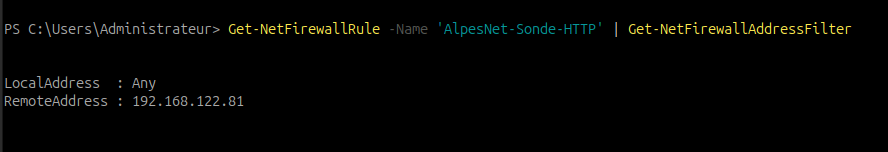

*Capture du 14 septembre 2026 — La règle autorise encore `192.168.122.81`, alors que l’adresse actuelle de supervision est `.80`. Cette capture documente la configuration à corriger, pas la règle finale.*

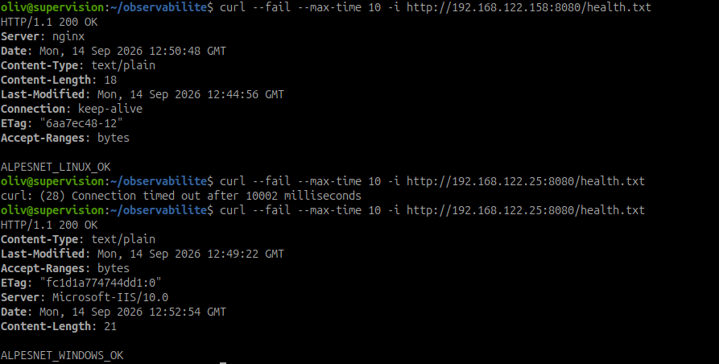

*Capture du 14 septembre 2026 — Debian répond HTTP 200. Le premier appel Windows expire, puis le nouvel appel réussit avec HTTP 200 et `ALPESNET_WINDOWS_OK`. La commande de modification du pare-feu n’est pas visible.*

## 5. Ajouter Blackbox Exporter au Compose existant

Sur **`supervision`** :

```bash
cd ~/observabilite
cp -p compose.yaml "compose.yaml.bak-$(date +%Y%m%d-%H%M%S)"
mkdir -p blackbox
nano blackbox/blackbox.yml
```

Copier dans ce fichier la [configuration des modules à télécharger](../../assets/configs/supervision-optimisation-performances/it-1/blackbox/blackbox.yml) :

```yaml
modules:
  http_linux:
    prober: http
    timeout: 5s
    http:
      method: GET
      preferred_ip_protocol: ip4
      follow_redirects: false
      valid_status_codes: [200]
      fail_if_body_not_matches_regexp: ['ALPESNET_LINUX_OK']
  http_windows:
    prober: http
    timeout: 5s
    http:
      method: GET
      preferred_ip_protocol: ip4
      follow_redirects: false
      valid_status_codes: [200]
      fail_if_body_not_matches_regexp: ['ALPESNET_WINDOWS_OK']
```

Chaque module attend HTTP 200 et son marqueur de contenu. Les redirections sont refusées ; le contrôle dure au maximum 5 secondes. [Paramètres officiels des sondes](https://github.com/prometheus/blackbox_exporter/blob/v0.28.0/CONFIGURATION.md)

Éditer **`compose.yaml`** et ajouter le service `blackbox` sous la clé **`services:` existante**, au même niveau que `prometheus` et `grafana`. Conserver les autres services et volumes, ainsi que `compose.override.yaml` contenant Elastic.

```yaml
# Exemple à fusionner dans compose.yaml : ne remplace pas les autres services.
services:
  blackbox:
    image: quay.io/prometheus/blackbox-exporter:v0.28.0
    restart: unless-stopped
    mem_limit: 128m
    ports:
      - "127.0.0.1:9115:9115"
    volumes:
      - type: bind
        source: ./blackbox/blackbox.yml
        target: /config/blackbox.yml
        read_only: true
        bind:
          create_host_path: false
    command: ["--config.file=/config/blackbox.yml"]
    logging:
      driver: json-file
      options:
        max-size: "10m"
        max-file: "3"
```

[Extrait Compose téléchargeable](../../assets/configs/supervision-optimisation-performances/it-1/compose.sondes.example.yaml). Cet exemple est à fusionner : son nom ne provoque pas de chargement automatique. La version est figée sur une [publication officielle](https://github.com/prometheus/blackbox_exporter/releases/tag/v0.28.0).

```bash
sudo docker compose config --quiet && sudo docker compose pull blackbox && sudo docker compose up -d blackbox
sudo docker compose ps blackbox
sudo docker compose logs --tail=50 blackbox
```

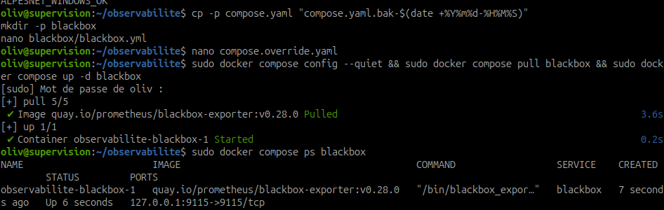

*Capture du 14 septembre 2026 — L’image `v0.28.0` est téléchargée et le conteneur démarre, avec le port publié sur `127.0.0.1:9115`. La commande d’édition visible vise `compose.override.yaml` ; ce fichier est également chargé automatiquement avec `compose.yaml`.*

Dans la réalisation capturée, le service a été ajouté à `compose.override.yaml`. C’est une autre possibilité : le placer sous `services:` dans un seul des deux fichiers, en préservant les services existants.

Le fichier source doit bien exister et s’appeler **`blackbox.yml`**. Le montage refuse de créer un dossier à sa place. Le port 9115 est publié uniquement sur la boucle locale de la VM ; Prometheus utilise le nom Docker `blackbox` sur leur réseau commun.

Tester chaque module depuis **`supervision`** :

```bash
curl --fail --max-time 10 --get 'http://127.0.0.1:9115/probe' \
  --data-urlencode 'module=http_linux' \
  --data-urlencode 'target=http://192.168.122.158:8080/health.txt'
curl --fail --max-time 10 --get 'http://127.0.0.1:9115/probe' \
  --data-urlencode 'module=http_windows' \
  --data-urlencode 'target=http://192.168.122.25:8080/health.txt'
```

**Attendu dans chaque réponse :** `probe_success 1` et `probe_http_status_code 200`. Le succès de `curl` indique seulement que l’exporter a répondu : toujours lire `probe_success`.

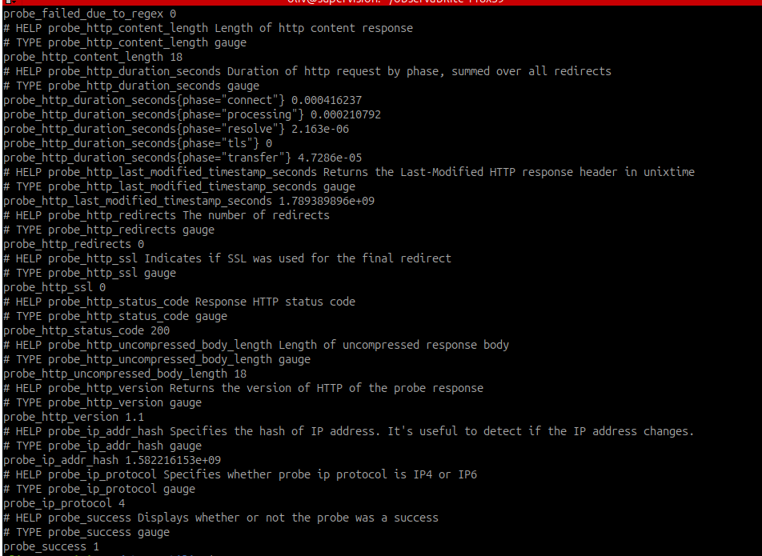

*Capture du 14 septembre 2026 — L’extrait identifié comme Debian affiche HTTP 200, `probe_success 1` et `probe_failed_due_to_regex 0`. L’URL de l’appel n’est pas visible dans cet extrait.*


*Capture du 14 septembre 2026 — L’extrait identifié comme Windows affiche HTTP 200, `probe_success 1` et `probe_failed_due_to_regex 0`. Les labels des captures Prometheus ci-dessous permettent d’identifier les cibles.*

Pour diagnostiquer un échec, reprendre la commande et ajouter `--data-urlencode 'debug=true'`. Consulter aussi les journaux Blackbox. Après modification du fichier de modules, appliquer avec `sudo docker compose up -d --no-deps --force-recreate blackbox`, puis refaire les tests.

## 6. Déclarer les sondes dans Prometheus

Sur **`supervision`** :

```bash
cd ~/observabilite
cp -p prometheus/prometheus.yml "prometheus/prometheus.yml.bak-$(date +%Y%m%d-%H%M%S)"
nano prometheus/prometheus.yml
```

Ajouter ces **trois jobs dans la liste `scrape_configs` existante**. Ne pas remplacer les jobs `linux`, `windows` et `prometheus`, ni créer une deuxième clé `scrape_configs`.

```yaml
# Ajouter ces jobs à scrape_configs, en conservant les jobs existants.
scrape_configs:
  - job_name: sonde_linux_http
    scrape_interval: 30s
    scrape_timeout: 10s
    metrics_path: /probe
    params:
      module: [http_linux]
    static_configs:
      - targets: ['http://192.168.122.158:8080/health.txt']
        labels:
          endpoint: debian
          service: nginx-lab
    relabel_configs:
      - source_labels: [__address__]
        target_label: __param_target
      - source_labels: [__param_target]
        target_label: instance
      - target_label: __address__
        replacement: blackbox:9115

  - job_name: sonde_windows_http
    scrape_interval: 30s
    scrape_timeout: 10s
    metrics_path: /probe
    params:
      module: [http_windows]
    static_configs:
      - targets: ['http://192.168.122.25:8080/health.txt']
        labels:
          endpoint: windows-core
          service: iis-lab
    relabel_configs:
      - source_labels: [__address__]
        target_label: __param_target
      - source_labels: [__param_target]
        target_label: instance
      - target_label: __address__
        replacement: blackbox:9115

  - job_name: blackbox
    static_configs:
      - targets: ['blackbox:9115']
```

[Jobs téléchargeables](../../assets/configs/supervision-optimisation-performances/it-1/prometheus/sondes-jobs-example.yml). Recontrôler les IP avant utilisation.

Le relabelling transmet l’URL au paramètre `target`, la conserve comme label `instance`, puis adresse la requête à Blackbox. Le job `blackbox` lit `/metrics` pour observer l’exporter lui-même ; les deux autres lisent `/probe` pour déclencher les contrôles. [Modèle multi-cibles Prometheus](https://prometheus.io/docs/guides/multi-target-exporter/)

L’intervalle est de **30 secondes**, le timeout Prometheus de **10 secondes**, celui des modules de **5 secondes**. Ce décalage laisse le temps de retourner un résultat d’échec avant l’expiration du scrape.

```bash
sudo docker compose run --rm --no-deps --entrypoint promtool prometheus \
  check config /etc/prometheus/prometheus.yml && \
  sudo docker compose up -d --no-deps --force-recreate prometheus
sudo docker compose logs --since=2m --tail=50 prometheus
```

Dans le navigateur du laptop, via l’accès Prometheus déjà utilisé, ouvrir **Status → Target health**, puis **Query**. Attendre au moins deux cycles et exécuter séparément :

```promql
probe_success{job=~"sonde_.*"}
```

```promql
probe_http_status_code{job=~"sonde_.*"}
```

```promql
probe_duration_seconds{job=~"sonde_.*"}
```

```promql
up{job=~"sonde_.*|blackbox"}
```

| Résultat | Interprétation |
| --- | --- |
| `up=1`, `probe_success=1` | Résultat collecté et contrôle réussi |
| `up=1`, `probe_success=0` | Résultat collecté, mais service, réseau ou critère de réponse en défaut |
| `up=0` | Échec de collecte du résultat ; examiner exporter, configuration, réseau et timeout |
| Série absente | Vérifier chargement des jobs, labels et période ; ne pas l’interpréter comme un succès |

Une cible de sonde peut donc rester **UP dans Targets pendant une panne du site**. Dans Grafana Explore, sélectionner la source Prometheus et utiliser `probe_success` pour afficher l’état du service.

### Résultats nominaux observés

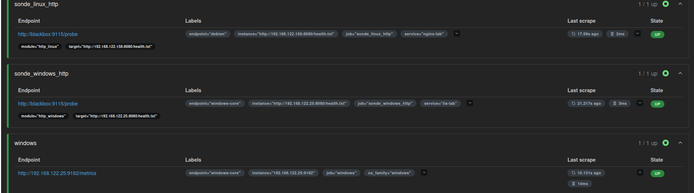

*Capture du 14 septembre 2026 — Les deux jobs de sonde sont `UP` et utilisent `/probe` sur Blackbox avec les modules et URL attendus. Cela valide la collecte des résultats ; le succès du contrôle est montré par `probe_success`.*

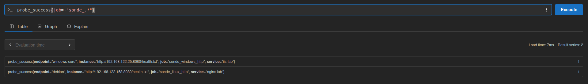

*Capture du 14 septembre 2026 — Les séries Linux et Windows retournent toutes deux `probe_success=1` au moment de la capture.*

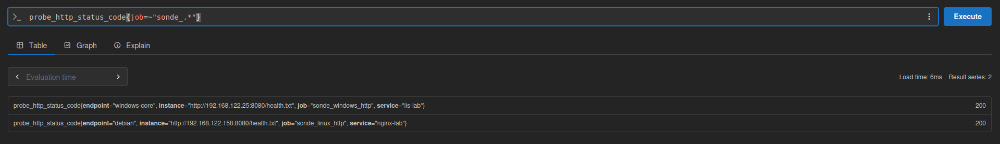

*Capture du 14 septembre 2026 — Les deux cibles retournent HTTP 200 dans Prometheus.*

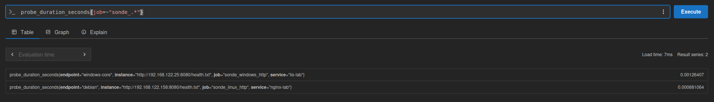

*Capture du 14 septembre 2026 — Les durées affichées sont environ 0,88 ms pour Linux et 1,26 ms pour Windows. Ce sont des durées de sondes ponctuelles, pas leur intervalle de déclenchement.*

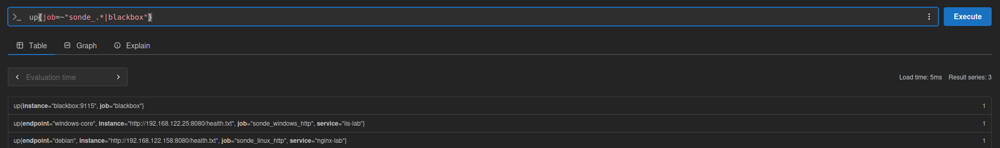

*Capture du 14 septembre 2026 — Les deux jobs de sondes et le job `blackbox` ont `up=1`. Les résultats des contrôles et les métriques de l’exporter sont donc collectés à cet instant.*

## 7. Provoquer une indisponibilité et vérifier le rétablissement

Effectuer les essais **un endpoint à la fois**, sur les services de laboratoire. Garder la console virt-manager disponible. Ne pas arrêter les exporters, Blackbox ou Prometheus : ils doivent continuer à observer la panne.

### A. Relever l’état nominal

Vérifier les réponses HTTP, les deux `probe_success=1` et les `up=1`. Noter l’heure avec `date -Is` sur Linux ou `Get-Date -Format o` sur Windows. Dans Prometheus, passer la requête `probe_success{job=~"sonde_.*"}` en **Graph** sur les 15 dernières minutes.

### B. Rendre le service Debian indisponible

Pour limiter l’exercice à la ressource dédiée, sur **Debian**, renommer temporairement le fichier (le nom de sauvegarde doit être libre) :

```bash
sudo mv /var/www/alpesnet-sonde/health.txt /var/www/alpesnet-sonde/health.txt.indisponible
curl --max-time 10 -i http://127.0.0.1:8080/health.txt
```

**Attendu :** HTTP 404. Garder cet état au moins deux cycles (environ 60 secondes), puis vérifier `probe_success=0` pour Linux, avec `up=1`. Windows doit rester à `1`.

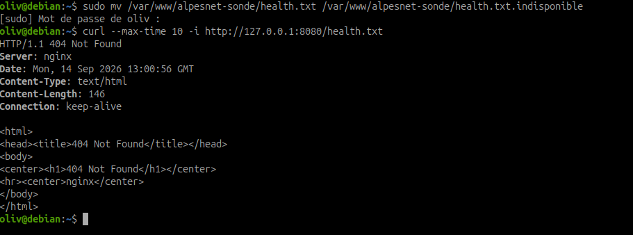

*Capture du 14 septembre 2026 — Le fichier `health.txt` est renommé en `health.txt.indisponible`. La requête locale retourne HTTP 404 : Nginx répond toujours, mais la ressource attendue est absente.*

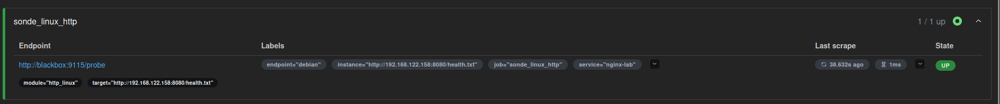

*Capture du 14 septembre 2026 — La cible de sonde Linux reste `UP`. Cela atteste une collecte réussie du résultat Blackbox, pas le succès du contrôle HTTP.*

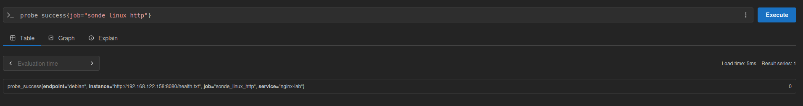

*Capture du 14 septembre 2026 — La requête `probe_success{job="sonde_linux_http"}` retourne `0` pour la ressource Debian. Cette capture, postérieure à celle du test Windows, ne démontre pas encore le rétablissement Linux.*

Rétablir sur **Debian** :

```bash
sudo mv /var/www/alpesnet-sonde/health.txt.indisponible /var/www/alpesnet-sonde/health.txt
curl --fail --max-time 10 -i http://127.0.0.1:8080/health.txt
```

Vérifier le retour à HTTP 200 et `probe_success=1` dans les cycles suivants. Cette panne de ressource démontre qu’un Nginx toujours actif peut ne plus rendre le service attendu.


*Capture du 14 septembre 2026 à 15:09:42 — `probe_success{job="sonde_linux_http"}` retourne `1` après le test de panne. Le contrôle de la réponse HTTP et du contenu attendu réussit de nouveau.*

### C. Arrêter le site Windows puis le rétablir

Sur **Windows Core**, dans PowerShell administrateur :

```powershell
Import-Module WebAdministration
Stop-Website -Name 'AlpesNet-Sonde'
Get-Website -Name 'AlpesNet-Sonde'
```

Attendre au moins deux cycles ; vérifier `probe_success=0` pour Windows, `up=1` et Linux toujours à `1`. Selon la réponse d’HTTP.sys et les bindings présents, l’échec peut être HTTP ou réseau : relever le résultat réel, sans imposer un code précis.

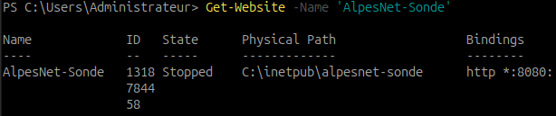

*Capture du 14 septembre 2026 — `Get-Website` affiche le site `AlpesNet-Sonde` dans l’état `Stopped`. La capture atteste l’arrêt du site, sans prouver un arrêt global du service IIS.*

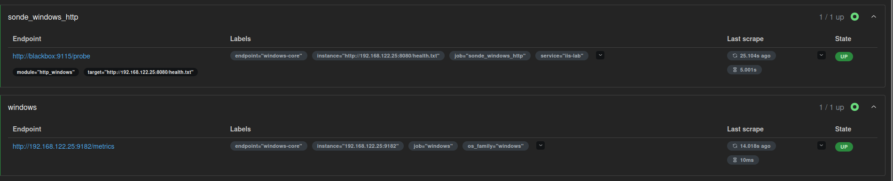

*Capture du 14 septembre 2026 — Le job de sonde et windows_exporter restent `UP`. La collecte de la sonde dure 5,001 s, durée cohérente avec le timeout du module ; le résultat d’échec est confirmé par la requête `probe_success` suivante.*

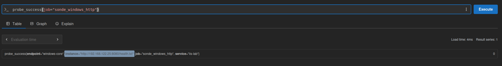

*Capture du 14 septembre 2026 — La requête `probe_success{job="sonde_windows_http"}` retourne `0` pour le site Windows. La panne est donc bien remontée dans Prometheus malgré l’état UP de la collecte.*

Rétablir sur **Windows Core** :

```powershell
Start-Website -Name 'AlpesNet-Sonde'
Invoke-WebRequest -UseBasicParsing -Uri 'http://127.0.0.1:8080/health.txt' |
  Select-Object StatusCode, Content
```

Vérifier HTTP 200, le marqueur et `probe_success=1` dans les cycles suivants. L’arrêt ciblé du site évite d’arrêter tous les sites IIS.

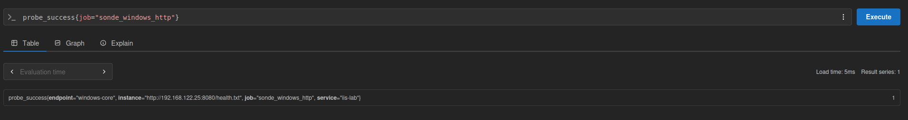

*Capture du 14 septembre 2026 à 15:09:36 — `probe_success{job="sonde_windows_http"}` retourne `1` après le test de panne. Le contrôle de la réponse HTTP et du contenu attendu réussit de nouveau.*

### D. Vérifier le critère de contenu

En complément, sur Debian, sauvegarder `health.txt` sous un nom libre, remplacer provisoirement son contenu par `MAINTENANCE`, puis restaurer la sauvegarde. Avec HTTP 200 mais sans le marqueur attendu, la sonde doit retourner `probe_success=0`, puis revenir à `1` après restauration. Conserver une capture si ce test est réalisé.

Un échec très court entre deux contrôles peut passer inaperçu. Mesurer le délai réellement observé ; les 30 secondes sont un intervalle de contrôle, pas une preuve de détection instantanée.

### Bilan des preuves de panne

Les captures successives documentent **1 → 0 → 1** pour chaque sonde : état nominal initial, échec après indisponibilité, puis succès après restauration. Les dernières captures montrent Windows à `1` à 15:09:36 et Linux à `1` à 15:09:42 (horaires des fichiers de capture, pas mesures du délai de détection).

Pour revoir les deux états ensemble, exécuter dans Prometheus :

```promql
probe_success{job=~"sonde_.*"}
```

Le graphe sur la période couvrant l’exercice peut compléter ces preuves ponctuelles. Le test confirme la détection des pannes et du rétablissement ; la capture Linux à `0` est postérieure au test Windows, donc l’isolation des essais (un service rétabli avant de couper l’autre) n’est pas établie par les captures. La fréquence réelle et le délai exact de détection restent à mesurer.

## 8. Validation et dossier de déploiement

| Contrôle à documenter | Sonde Linux | Sonde Windows |
| --- | --- | --- |
| Élément contrôlé : machine, site, URL et port | ☑ | ☑ |
| Type de contrôle : HTTP 200 et texte attendu | ☑ | ☑ |
| État retourné : `probe_success`, code HTTP et durée | ☑ | ☑ |
| Fréquence : 30 s configurées et actualisation observée | ☐ | ☐ |
| Résultat effectivement reçu dans Prometheus | ☑ | ☑ |
| Service disponible : résultat à `1` | ☑ | ☑ |
| Indisponibilité provoquée : résultat à `0` | ☑ | ☑ |
| Rétablissement : retour à `1` | ☑ | ☑ |

Consigner les composants et versions, IP, règles réseau, URL, critères, fichiers, fréquence, timeouts, commandes de panne et de restauration, heures, résultats, délais observés et difficultés résolues.

Conserver pour chaque système : une preuve locale du service, les résultats nominaux, la panne avec `up` et `probe_success`, le rétablissement et le graphe **1 → 0 → 1**. Une capture de Targets seule ne suffit pas. Vérifier en fin d’exercice que les deux services fonctionnent et qu’aucun fichier ne reste renommé.

## Questions de fin d’étape

**Quelle différence entre métriques d’endpoint et vérification d’un service ?** Les premières décrivent les ressources et l’état interne ; la sonde exécute un contrôle depuis un point réseau donné pour vérifier une réponse attendue.

**Que voit la sonde qu’une métrique système ne vérifie pas nécessairement ?** Un port inaccessible, une réponse HTTP incorrecte ou une ressource manquante malgré un système qui dispose encore de CPU et de RAM.

**Comment déterminer que la sonde fonctionne correctement ?** Tester le succès, provoquer un échec connu, vérifier sa remontée, restaurer puis constater le retour au succès. Vérifier séparément la collecte des résultats.

**Que doit produire la sonde lorsque le service devient indisponible ?** Un résultat d’échec explicite (`probe_success=0`), avec les mesures et informations utiles au diagnostic. La collecte du résultat devrait continuer (`up=1`).

**Comment vérifier le retour à l’état nominal ?** Contrôler localement la réponse attendue et observer de nouveaux résultats à `1` après le rétablissement, sur plusieurs cycles.

## Point de contrôle

- [x] Une sonde est fonctionnelle pour le service Linux en état nominal.
- [x] Une sonde est fonctionnelle pour le service Windows Core en état nominal.
- [x] L’indisponibilité puis le retour à l’état nominal sont détectés et documentés pour les deux services.

[Retour au sommaire de l’itération](index.md)
