# Déployer et valider la plateforme d'observabilité

!!! note "Adresse de supervision actualisée"
    L’adresse actuelle confirmée par l’utilisateur est `192.168.122.80`. Les relevés initiaux ci-dessous conservent `.81` comme historique ; utiliser `.80` pour les accès SSH et les autorisations réseau actuelles.

## Objectif et travail demandé

L'équipe Infrastructure dispose des besoins identifiés lors de la séquence précédente. La mission consiste à mettre en place la plateforme qui centralisera l'observation de l'infrastructure :

- déployer **Prometheus**, **Grafana** et **ELK** ;
- configurer les paramètres nécessaires à leur fonctionnement ;
- vérifier l'accès aux interfaces et le fonctionnement des composants ;
- documenter les éléments nécessaires à leur exploitation.

!!! note "Procédure à réaliser"
    Les relevés fournis le 14 septembre 2026 confirment la VM et le fonctionnement de Docker et Compose. L’accès authentifié à Kibana et une réponse Elasticsearch `green` sont désormais confirmés par les retours fournis. Les captures confirment aussi le démarrage de Prometheus, les trois interfaces et la recherche du message de test Logstash. La source Grafana, l’auto-collecte et la persistance restent à valider selon les preuves disponibles. Les commandes, configurations et tests sont à appliquer au laboratoire, puis à accompagner de résultats réels.

## 1. Préparer l'emplacement et les ressources

Le laboratoire repose sur le **laptop et virt-manager**, avec une VM Debian et une VM Windows Server à superviser. La **VM dédiée `supervision` existe désormais** : les relevés fournis confirment Debian 13.7 sous KVM/QEMU, à l'adresse `192.168.122.81`. L'administration sans bureau graphique reste l'organisation proposée ; le relevé ne permet pas à lui seul de vérifier les logiciels de bureau installés.

La méthode proposée réutilise **Docker Compose**, étudié dans les modules précédents. Elle permet de regrouper la configuration des cinq composants : Prometheus, Grafana, Elasticsearch, Logstash et Kibana. Ce choix de déploiement reste à consigner dans le dossier.

| Élément à relever | Valeur réelle |
| --- | --- |
| Nom et version de la VM de supervision | `supervision` — Debian GNU/Linux 13 (trixie), version complète 13.7 ; noyau `6.12.107+deb13-amd64`, x86-64. |
| Adresse ou nom DNS de la VM | `192.168.122.81/24` sur `enp1s0`, interface UP ; stabilité de cette adresse à vérifier. |
| vCPU, RAM et disque attribués | vCPU non fournis ; RAM attribuée : **8 Gio, confirmés par l’utilisateur** ; relevé initial avant augmentation : 1,9 Gio visibles, dont 1,6 Gio disponibles ; swap : 1,1 Gio non utilisé. Système de fichiers racine `/dev/vda1` : 19 Gio, dont 16 Gio disponibles (10 % utilisés). La capacité totale du disque virtuel reste à vérifier. |
| Réseau virt-manager et accès depuis le laptop | KVM/QEMU confirmé ; sous-réseau observé `192.168.122.0/24`. Nom du réseau virt-manager et accès aux futures interfaces à vérifier. |
| Versions Docker et Compose | Docker Engine Community 29.8.0, client et serveur répondent ; Docker Compose v5.5.1. |
| Versions des cinq composants | À compléter ; fixer les versions des images pour pouvoir reproduire l'installation |
| Répertoire du projet | Proposition : `~/observabilite` dans la VM de supervision |

### Relevé initial fourni — 14 septembre 2026 à 10:08 CEST

L'horloge est synchronisée, le service NTP est actif et le fuseau est `Europe/Paris`. Les identifiants machine, de démarrage et l'adresse IPv6 locale ne sont pas repris : ils ne sont pas nécessaires à ce constat.

Les avertissements `hostnamectl` concernant l'UUID matériel et le numéro de série indiquent un refus d'accès à ces informations ; les autres propriétés sont bien affichées. Ils ne signalent pas à eux seuls une panne de la VM. Le pont `docker0` est affiché DOWN ; vérifier les conteneurs et réseaux avec `sudo docker ps -a` et `sudo docker network ls` avant d'en déduire un problème Docker.

**Dimensionnement actualisé :** après le relevé initial à environ 2 Gio et un passage à 4 Gio, l’utilisateur confirme **8 Gio attribués à la VM**. La consommation après ce changement reste à relever. Le nombre de vCPU et l’agrandissement éventuel du disque ne sont pas confirmés.

Les fichiers proposés fixent les plafonds suivants pour le laboratoire :

| Composant | Limite mémoire du conteneur |
| --- | --- |
| Prometheus | 512 Mio |
| Grafana | 512 Mio |
| Elasticsearch | 2 Gio |
| Kibana | 1,5 Gio |
| Logstash | 1,5 Gio, dont un tas Java fixé à 512 Mio |

Le total des plafonds est de **6 Gio**, laissant environ 2 Gio hors de ces plafonds pour Debian et les autres besoins. Ce sont des limites, pas des réservations ni des consommations mesurées. Vérifier le comportement avec `free -h` et `sudo docker stats --no-stream`. Elasticsearch conserve le dimensionnement automatique de son tas Java selon sa limite de conteneur.

Pour compléter les relevés, utiliser `nproc`, `lsblk` et `sysctl vm.max_map_count` dans la VM. Vérifier `free -h` et `nproc` sur le laptop avant de lui réserver davantage de ressources.

Dans la VM, relever les informations de départ :

```bash
cat /etc/os-release
hostnamectl
ip -br address
free -h
df -h
timedatectl
sudo docker version
sudo docker compose version
```

Si Docker manque, suivre l'[installation officielle sur Debian](https://docs.docker.com/engine/install/debian/). Adapter la mémoire aux besoins cumulés des composants, notamment Elasticsearch et Logstash, tout en conservant des ressources pour le laptop et les VM supervisées.

Pour Elasticsearch, contrôler également `sysctl vm.max_map_count` dans la VM qui héberge Docker, puis appliquer et rendre persistant le réglage demandé par la documentation de la version choisie. [Prérequis mémoire virtuelle Elastic](https://www.elastic.co/docs/deploy-manage/deploy/self-managed/vm-max-map-count)

## 2. Préparer les fichiers et les accès

Créer le dossier du projet dans la VM. Organisation proposée :

```text
observabilite/
├── compose.yaml
├── prometheus/
│   └── prometheus.yml
├── logstash/
│   ├── config/
│   └── pipeline/
├── certs/
└── notes-exploitation.md
```

Le fichier `compose.yaml` de départ est fourni à l’étape 3 pour Prometheus et Grafana. Les composants ELK seront ajoutés dans un second temps à partir des exemples officiels cités plus bas. Prévoir un réseau Docker commun, des configurations montées en lecture seule lorsque possible et des volumes persistants pour les données. Stocker les secrets séparément et les exclure de Git ; ne pas publier une sortie de configuration contenant les mots de passe interpolés.

Pour ce premier laboratoire, publier les interfaces sur **la boucle locale de la VM**, puis utiliser un tunnel SSH depuis le laptop. Exemple de syntaxe Compose : `127.0.0.1:3000:3000` pour Grafana. Cela permet de consulter les interfaces sans les ouvrir à tout le réseau.

| Composant | Port interne usuel | Accès prévu |
| --- | --- | --- |
| Prometheus | 9090 | Interface et API via le tunnel |
| Grafana | 3000 | Interface web via le tunnel |
| Elasticsearch | 9200 | API HTTPS authentifiée ; conserver la validation du certificat |
| Kibana | 5601 | Interface web via le tunnel |
| Logstash | Selon le pipeline | Pas d'interface web utilisateur ; entrée de collecte à définir plus tard |

Depuis le **laptop**, remplacer `UTILISATEUR` et `IP_SUPERVISION`, puis maintenir la session ouverte :

```bash
ssh -N -o ExitOnForwardFailure=yes \
  -L 9090:127.0.0.1:9090 \
  -L 3000:127.0.0.1:3000 \
  -L 5601:127.0.0.1:5601 \
  UTILISATEUR@IP_SUPERVISION
```

Le navigateur du laptop utilisera alors `http://127.0.0.1:9090`, `http://127.0.0.1:3000` et `http://127.0.0.1:5601`, si HTTP est retenu pour ces interfaces derrière le tunnel. En cas de port local déjà utilisé, changer le premier numéro de la redirection et l'URL correspondante.

## 3. Déployer Prometheus

À partir de l'[installation officielle Docker](https://prometheus.io/docs/prometheus/latest/installation/), définir le service `prometheus` avec une version explicite de l'image `prom/prometheus`, le fichier monté dans `/etc/prometheus/prometheus.yml` et un volume persistant dans `/prometheus`.

### Fichiers à créer dans la VM `supervision`

La VM dispose désormais de **8 Gio attribués, confirmés par l’utilisateur**. Ce Compose démarre le socle métriques ; le complément ajoute les composants Elastic. Prometheus et Grafana conservent chacun une limite de 512 Mio, à ajuster si les mesures le justifient.

Dans le terminal de la **VM** :

```bash
mkdir -p ~/observabilite/prometheus
cd ~/observabilite
nano compose.yaml
```

Coller ce contenu dans `~/observabilite/compose.yaml`. Si un fichier existe déjà, le compléter en conservant les autres services, sans créer une deuxième clé `services`.

```yaml
services:
  prometheus:
    image: prom/prometheus:v3.14.0
    restart: unless-stopped
    mem_limit: 512m
    ports:
      - "127.0.0.1:9090:9090"
    volumes:
      - ./prometheus/prometheus.yml:/etc/prometheus/prometheus.yml:ro
      - prometheus_data:/prometheus
    command:
      - --config.file=/etc/prometheus/prometheus.yml
      - --storage.tsdb.path=/prometheus
      - --storage.tsdb.retention.time=3d
      - --storage.tsdb.retention.size=1GB
    logging:
      driver: json-file
      options:
        max-size: "10m"
        max-file: "3"

  grafana:
    image: grafana/grafana:13.2.1
    restart: unless-stopped
    mem_limit: 512m
    ports:
      - "127.0.0.1:3000:3000"
    volumes:
      - grafana_data:/var/lib/grafana
    environment:
      GF_USERS_ALLOW_SIGN_UP: "false"
    logging:
      driver: json-file
      options:
        max-size: "10m"
        max-file: "3"

volumes:
  prometheus_data:
  grafana_data:
```

Les services partagent automatiquement le réseau du projet Compose. La rétention Prometheus est limitée à trois jours ou au seuil de taille, selon la première limite atteinte ; le seuil de 1 Go ne plafonne pas tous les fichiers annexes du volume. La rotation des journaux Docker réduit leur croissance.

Les versions sont explicites pour rendre l'exemple reproductible ; elles proviennent des publications officielles [Prometheus](https://github.com/prometheus/prometheus/releases/tag/v3.14.0) et [Grafana](https://github.com/grafana/grafana/releases/tag/v13.2.1). Le téléchargement et le fonctionnement restent à valider sur la VM.

Ensuite :

```bash
nano prometheus/prometheus.yml
```

Coller cette configuration dans `~/observabilite/prometheus/prometheus.yml`, puis enregistrer les deux fichiers :


```yaml
global:
  scrape_interval: 30s

scrape_configs:
  - job_name: prometheus
    static_configs:
      - targets: ['localhost:9090']
```

L'intervalle de 30 secondes est un choix pédagogique pour le test. Ici, `localhost` désigne le conteneur Prometheus lui-même. Documenter aussi la rétention retenue et la capacité du volume. L'auto-collecte permet de tester le fonctionnement avant d'intégrer les serveurs. [Premiers pas Prometheus](https://prometheus.io/docs/introduction/first_steps/)

Les fichiers sont aussi téléchargeables : [compose.yaml](../../assets/configs/supervision-optimisation-performances/it-1/compose.yaml) et [prometheus.yml](../../assets/configs/supervision-optimisation-performances/it-1/prometheus/prometheus.yml). Conserver l'arborescence indiquée.

### Valider et démarrer Prometheus

Depuis `~/observabilite` dans la VM :

```bash
sudo docker compose config --quiet
sudo docker compose pull prometheus grafana
```

Puis vérifier la configuration et démarrer Prometheus :

```bash
sudo docker compose run --rm --no-deps --entrypoint promtool prometheus \
  check config /etc/prometheus/prometheus.yml
sudo docker compose up -d prometheus
sudo docker compose ps
# Attendre quelques secondes si le service démarre encore.
curl --fail http://127.0.0.1:9090/-/healthy
curl --fail http://127.0.0.1:9090/-/ready
```

Les deux requêtes s'exécutent dans la VM. Le contrôle `ready` doit répondre HTTP 200 lorsque Prometheus peut servir les requêtes. [API de contrôle Prometheus](https://prometheus.io/docs/prometheus/latest/management_api/)

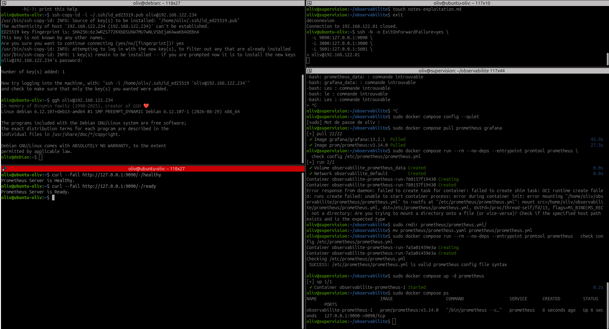

*Capture fournie du 14 septembre 2026 — La capture montre le renommage de `prometheus.yaml` en `prometheus.yml`, la validation réussie avec `promtool`, le conteneur démarré et les réponses Healthy/Ready. Le terminal du laptop montre également le tunnel SSH.*

Dans l'interface, vérifier la cible `prometheus`, attendre au moins un cycle de collecte et exécuter :

```promql
up{job="prometheus"}
```

**Résultat attendu :** valeur `1`, avec des données récentes. Ce test valide l'auto-collecte, pas encore la supervision de Debian ou Windows Server.

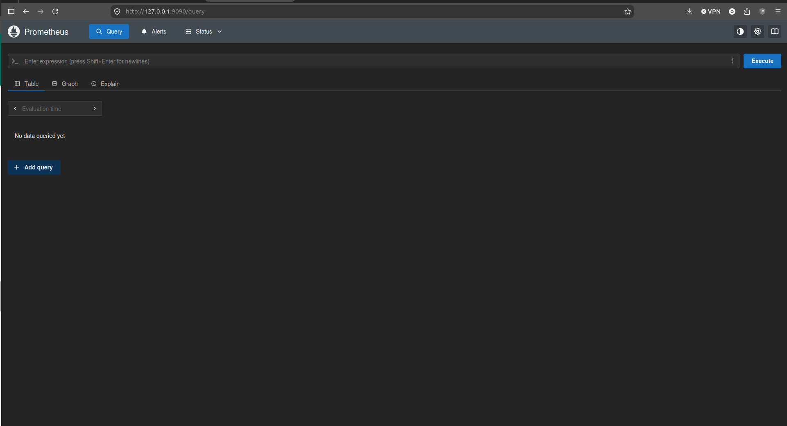

*Capture fournie du 14 septembre 2026 — L’interface Query est accessible sur le port local 9090. Aucune requête n’a encore été exécutée sur cette capture : elle ne prouve pas la valeur de `up`.*

## 4. Déployer Grafana et le relier à Prometheus

Créer le service `grafana` à partir de l'image officielle `grafana/grafana`, avec une version explicite et un volume persistant dans `/var/lib/grafana`. Démarrer le service et ouvrir son interface via le tunnel. Initialiser le compte administrateur et conserver son secret hors du dossier publié. [Installation Docker Grafana](https://grafana.com/docs/grafana/latest/setup-grafana/installation/docker/)

Le service est déjà défini dans le Compose de l'étape 3. Depuis `~/observabilite` dans la VM :

```bash
sudo docker compose up -d grafana
sudo docker compose ps
sudo docker compose logs --tail=50 grafana
```

Depuis le **laptop**, ouvrir un tunnel (ou conserver celui de l'étape 2, sans lancer un deuxième tunnel sur les mêmes ports) :

```bash
ssh -N -o ExitOnForwardFailure=yes \
  -L 9090:127.0.0.1:9090 \
  -L 3000:127.0.0.1:3000 \
  oliv@192.168.122.80
```

Accéder à Prometheus sur `http://127.0.0.1:9090` et à Grafana sur `http://127.0.0.1:3000`. Sur un volume Grafana neuf avec les paramètres par défaut, se connecter avec `admin` / `admin`, puis changer immédiatement le mot de passe à l'invite. Avec un volume existant, utiliser le compte déjà configuré. Ne pas copier le nouveau mot de passe dans la documentation.

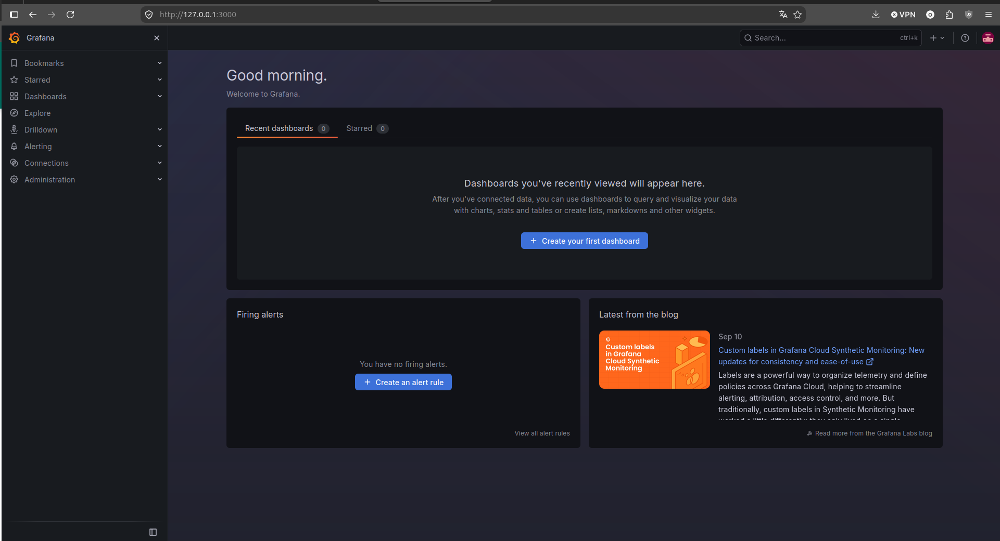

*Capture fournie du 14 septembre 2026 — L’accueil Grafana est affiché sur le port local 3000. Cette capture ne montre ni la validation de la source Prometheus ni un panneau de métriques.*

Ajouter une source de données **Prometheus** avec l'URL `http://prometheus:9090`, si les deux services partagent le réseau Docker et portent les noms proposés. Utiliser **Save & test**, puis exécuter `up{job="prometheus"}` dans Explore et enregistrer un premier panneau.

Ne pas mettre `localhost:9090` dans Grafana conteneurisé : cette adresse désignerait le conteneur Grafana. [Configurer la source Prometheus](https://grafana.com/docs/grafana/latest/datasources/prometheus/configure/)

**Résultat attendu :** la même métrique récente est visible dans Prometheus et dans Grafana.

## 5. Déployer Elasticsearch et Kibana

### Ajouter le complément Compose

Conserver le `compose.yaml` de Prometheus/Grafana. Dans **le même dossier `~/observabilite`**, créer **`compose.override.yaml`** : Docker Compose charge automatiquement ces deux fichiers lors des commandes sans option `-f`. Si un override existe déjà, fusionner son contenu sans écraser les autres services.

```bash
cd ~/observabilite
nano compose.override.yaml
```

```yaml
# Complément chargé automatiquement avec compose.yaml, dans le même dossier.
services:
  elasticsearch:
    image: docker.elastic.co/elasticsearch/elasticsearch:9.5.3
    hostname: elasticsearch
    restart: unless-stopped
    mem_limit: 2g
    environment:
      discovery.type: single-node
      xpack.ml.enabled: "false"
    ports:
      - "127.0.0.1:9200:9200"
    volumes:
      - elasticsearch_data:/usr/share/elasticsearch/data
      - elasticsearch_config:/usr/share/elasticsearch/config
    healthcheck:
      test:
        - CMD-SHELL
        - >-
          test -f config/certs/http_ca.crt &&
          [ "$$(curl -s --cacert config/certs/http_ca.crt -o /dev/null
          -w '%{http_code}' https://localhost:9200)" = "401" ]
      interval: 10s
      timeout: 5s
      retries: 30
      start_period: 60s
    logging:
      driver: json-file
      options:
        max-size: "10m"
        max-file: "3"

  kibana:
    image: docker.elastic.co/kibana/kibana:9.5.3
    restart: unless-stopped
    mem_limit: 1536m
    depends_on:
      elasticsearch:
        condition: service_healthy
    ports:
      - "127.0.0.1:5601:5601"
    volumes:
      - kibana_data:/usr/share/kibana/data
      - kibana_config:/usr/share/kibana/config
    logging:
      driver: json-file
      options:
        max-size: "10m"
        max-file: "3"

volumes:
  elasticsearch_data:
  elasticsearch_config:
  kibana_data:
  kibana_config:
```

[Télécharger compose.override.yaml](../../assets/configs/supervision-optimisation-performances/it-1/compose.override.yaml).

Ce complément utilise un nœud Elasticsearch avec sa configuration automatique de sécurité, puis l'inscription de Kibana par jeton. Les volumes de configuration conservent les certificats et les paramètres d'inscription ; ce parcours est destiné à une première installation sur des volumes neufs. Il ne modifie pas les identifiants d'une installation existante. [Parcours officiel Elastic Docker](https://www.elastic.co/docs/deploy-manage/deploy/self-managed/install-elasticsearch-docker-basic)

Les limites proposées donnent **2 Gio à Elasticsearch** et **1,5 Gio à Kibana**, en plus des deux plafonds de 512 Mio du socle métriques. Le bloc Logstash est ajouté à l’étape 6. Les versions Elastic restent identiques et explicites ; ces nouveaux plafonds restent à appliquer aux conteneurs de la VM.

### Préparer le noyau et lancer les composants

Vérifier `sysctl vm.max_map_count`. Si la valeur est inférieure à `1048576`, appliquer le réglage dans **la VM de supervision**, qui héberge Docker :

```bash
sudo sysctl -w vm.max_map_count=1048576
```

Pour le conserver au redémarrage, créer ou modifier `/etc/sysctl.d/99-elasticsearch.conf` avec la ligne `vm.max_map_count=1048576`. [Prérequis mémoire virtuelle Elastic](https://www.elastic.co/docs/deploy-manage/deploy/self-managed/vm-max-map-count)

Puis, depuis `~/observabilite` :

```bash
sudo docker compose config --quiet
sudo docker compose config --services
sudo docker compose pull elasticsearch kibana
sudo docker compose up -d elasticsearch kibana
sudo docker compose ps
```

La liste des services doit inclure les quatre composants. Elasticsearch peut prendre quelques minutes pour démarrer. Son healthcheck attend une réponse **401 sans identifiants**, avec validation du certificat : cela confirme que l'API HTTPS exige une authentification, pas encore la santé des index. Kibana démarre après ce contrôle.

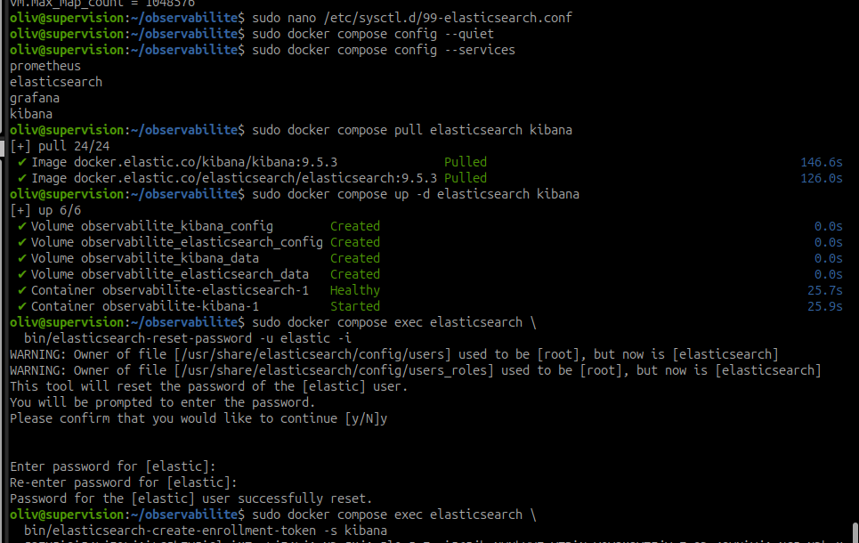

*Capture fournie du 14 septembre 2026 — Les images Elastic 9.5.3 sont téléchargées, Elasticsearch est Healthy et Kibana Started. La réinitialisation du mot de passe `elastic` est confirmée sans que sa valeur soit affichée.*

### Initialiser l'accès et inscrire Kibana

Dans la VM, lorsque Elasticsearch est prêt, choisir le mot de passe de l'administrateur initial :

```bash
sudo docker compose exec elasticsearch \
  bin/elasticsearch-reset-password -u elastic -i
```

Cette commande définit ou remplace réellement le mot de passe `elastic`. L'utiliser pour l'initialisation, pas à chaque redémarrage. Conserver le secret dans le coffre personnel.

Générer ensuite le jeton destiné à Kibana :

```bash
sudo docker compose exec elasticsearch \
  bin/elasticsearch-create-enrollment-token -s kibana
```

Copier le jeton uniquement dans l'écran d'inscription de Kibana ; ne pas le publier dans les captures ou le dossier de déploiement. Le regénérer s'il a expiré.

Depuis le **laptop**, si le tunnel précédent ne comprend pas déjà le port 5601 :

```bash
ssh -N -o ExitOnForwardFailure=yes \
  -L 5601:127.0.0.1:5601 oliv@192.168.122.80
```

Ouvrir `http://127.0.0.1:5601`, coller le jeton d'inscription et suivre l'assistant. Si un code de vérification est demandé :

```bash
sudo docker compose exec kibana bin/kibana-verification-code
```

Après inscription, se connecter à l'interface avec **`elastic`** et le mot de passe défini. L'inscription crée l'accès technique de Kibana à Elasticsearch ; le mot de passe humain n'est pas à mettre dans le Compose.

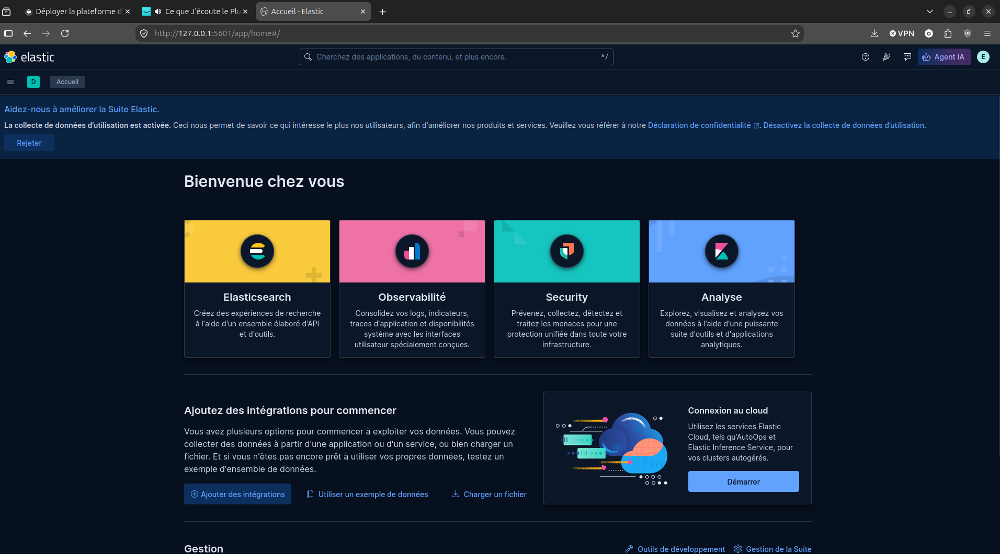

*Capture fournie du 14 septembre 2026 — La page d’accueil Kibana est accessible après connexion ; la capture illustre l’accès à l’interface, avant le contrôle de santé du cluster.*

### Stabiliser l'adresse interne après inscription

L'inscription peut enregistrer une IP Docker susceptible de changer. Après inscription réussie, conserver le nom stable `elasticsearch` pour les prochaines recréations. Dans la VM :

```bash
sudo docker compose exec kibana sed -i \
  's|^elasticsearch.hosts:.*|elasticsearch.hosts: ["https://elasticsearch:9200"]|' \
  /usr/share/kibana/config/kibana.yml
sudo docker compose exec kibana grep '^elasticsearch.hosts:' \
  /usr/share/kibana/config/kibana.yml
sudo docker compose restart kibana
```

La ligne vérifiée doit contenir `https://elasticsearch:9200`. Le nom d'hôte du conteneur Elasticsearch est fixé avant génération des certificats. Si la ligne est absente ou si TLS échoue, examiner l'inscription et le certificat avant de continuer ; ne pas désactiver sa vérification.

### Vérifier Elasticsearch et Kibana

Copier uniquement le certificat public de l'autorité, puis interroger Elasticsearch depuis la VM :

```bash
mkdir -p ~/observabilite/certs
sudo docker compose cp \
  elasticsearch:/usr/share/elasticsearch/config/certs/http_ca.crt \
  ./certs/http_ca.crt
curl --fail --cacert ./certs/http_ca.crt --user elastic \
  'https://localhost:9200/_cluster/health?pretty'
```

`curl` demande le mot de passe. Attendre une réponse JSON ; un statut `red` nécessite un diagnostic. Sur un seul nœud, un état `yellow` peut provenir de répliques non allouées : en vérifier la raison plutôt que d'ignorer l'avertissement.

Dans Kibana, ouvrir **Dev Tools**, puis exécuter :

```text
GET /_cluster/health
```

Ce test confirme un échange authentifié Kibana → Elasticsearch. Vérifier aussi les services et les ressources :

```bash
sudo docker compose ps
sudo docker compose logs --tail=50 elasticsearch kibana
sudo docker stats --no-stream
```

Ne partager que des extraits expurgés des secrets. Les volumes conservent données et configuration ; ne pas utiliser `docker compose down -v` pour un simple arrêt. Consigner l'accès à Kibana et le résultat de l'API comme preuves après réussite réelle. **Logstash reste à ajouter et à tester à l'étape suivante.**

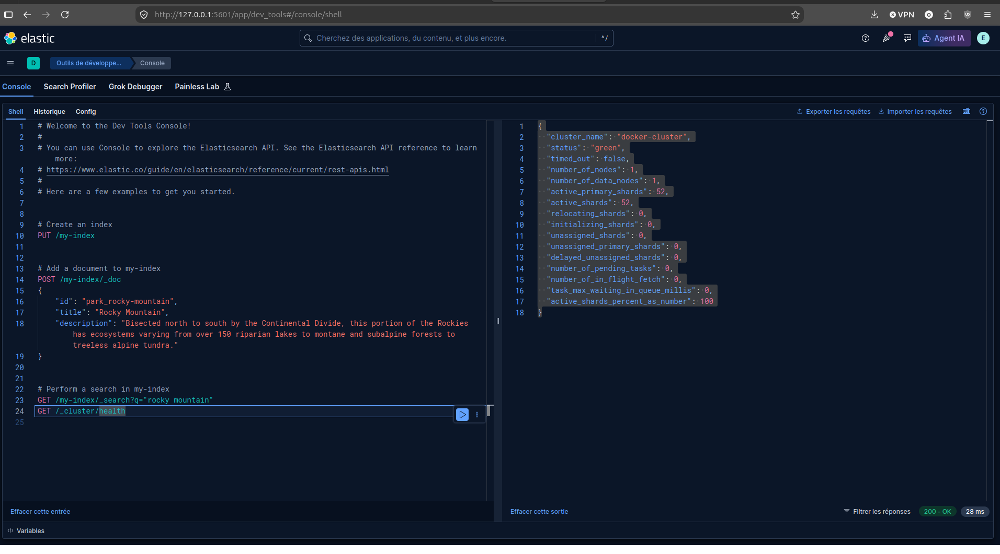

*Capture fournie du 14 septembre 2026 — La requête `GET /_cluster/health` renvoie HTTP 200, un état `green`, un nœud et 52 shards actifs, sans shard non attribué.*

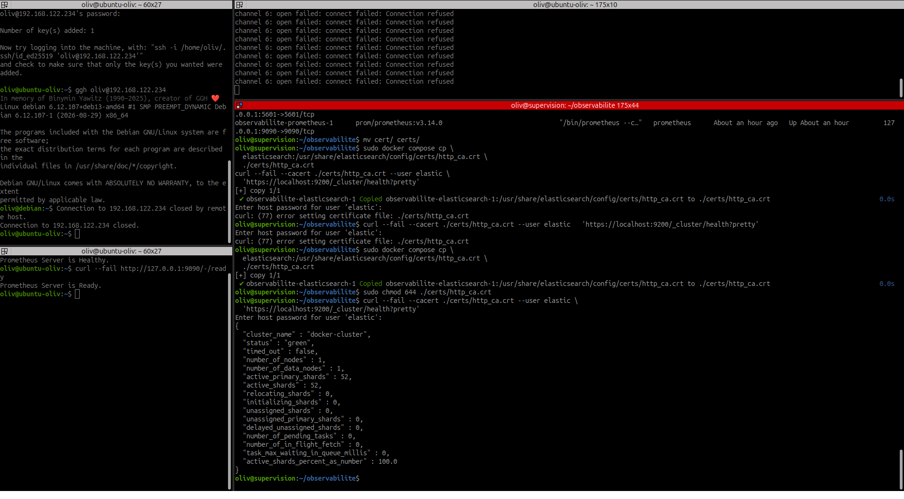

*Capture fournie du 14 septembre 2026 — Après l’erreur curl 77, la capture montre la copie du certificat public, le réglage de ses droits et une réponse HTTPS authentifiée avec un cluster `green`.*

### Résultats transmis — Elasticsearch et Kibana

L’utilisateur confirme une connexion à Kibana et l’affichage du dashboard. Après les étapes d’inscription et de redémarrage, il transmet la réponse suivante au contrôle de santé demandé (heure exacte du contrôle non fournie) :

| Indicateur | Résultat transmis |
| --- | --- |
| Cluster | `docker-cluster` |
| État | `green` |
| Délai dépassé | `false` |
| Nœuds / nœuds de données | 1 / 1 |
| Shards primaires actifs / shards actifs | 52 / 52 |
| Shards non attribués | 0 |
| Shards en initialisation ou déplacement | 0 / 0 |
| Tâches en attente | 0 |
| Shards actifs | 100 % |

Ce relevé confirme une réponse de l’API et l’allocation complète des shards au moment du contrôle. Il ne démontre ni une redondance entre nœuds, ni la collecte des journaux Linux/Windows, ni le passage d’un événement par Logstash.

**Difficultés rencontrées :** une erreur 503 de récupération de licence a été suivie d’un accès à l’écran de connexion après actualisation. Une réponse vide du navigateur a ensuite été signalée pendant le redémarrage de Kibana après modification de `elasticsearch.hosts`. Sans journaux de diagnostic, la cause exacte de ces erreurs n’est pas établie ; ne pas les présenter comme une panne de licence confirmée.

## 6. Déployer et tester Logstash

### Ce que l'on cherche à vérifier

**Logstash transporte et peut transformer des événements.** Pour cette première manipulation, il va fabriquer un seul message fictif, l'envoyer à Elasticsearch et s'arrêter. Tu chercheras ensuite ce message dans Kibana.

```text
Logstash : crée TEST_LAB_OBSERVABILITE
    → Elasticsearch : stocke le message dans observabilite-test
        → Kibana : permet de retrouver le message
```

Aucun journal Debian ou Windows n'est encore collecté. L'objectif est de vérifier le chemin que les vrais journaux emprunteront plus tard. Un **pipeline** est la configuration de ce chemin : `input` pour l'entrée, `filter` pour les transformations éventuelles, `output` pour la destination.

### A. Préparer l'index et l'accès dans Kibana

Dans **Kibana → Dev Tools → Console**, connecté avec `elastic`, exécuter d'abord :

```http
PUT /observabilite-test
{
  "settings": {
    "number_of_shards": 1,
    "number_of_replicas": 0
  },
  "mappings": {
    "properties": {
      "@timestamp": { "type": "date" },
      "message": { "type": "text" }
    }
  }
}
```

Cet index est la destination du test. Zéro réplique est un choix explicite pour cet index jetable sur un seul nœud, pas une règle de production. Si Elasticsearch indique que l'index existe déjà, le conserver et poursuivre : inutile de le supprimer.

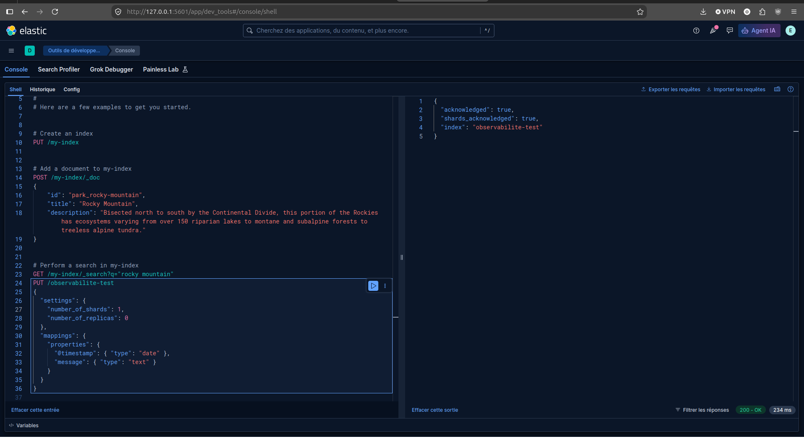

*Capture fournie du 14 septembre 2026 — Elasticsearch confirme la création de `observabilite-test` avec `acknowledged: true` et `shards_acknowledged: true`.*

Dans la même console, créer une clé limitée à l'ingestion dans cet index :

```http
POST /_security/api_key
{
  "name": "logstash-test-laboratoire",
  "expiration": "7d",
  "role_descriptors": {
    "ingestion_test": {
      "cluster": ["monitor"],
      "indices": [
        {
          "names": ["observabilite-test"],
          "privileges": ["create_doc", "auto_configure"]
        }
      ]
    }
  }
}
```

La réponse contient notamment `id`, `api_key` et `encoded`. Pour Logstash, assembler **`id:api_key`**, avec les vraies valeurs séparées par deux-points, sans utiliser `encoded`. Garder cette valeur secrète. Elle expire au bout de sept jours ; elle ne sert ni à se connecter à Kibana ni à inscrire un composant. [Authentification Logstash et format des clés API](https://www.elastic.co/docs/reference/logstash/secure-connection)

### B. Enregistrer la clé dans la VM

Dans le terminal de la **VM `supervision`** :

```bash
cd ~/observabilite
umask 077
touch .env
chmod 600 .env
nano .env
```

Ajouter ou remplacer uniquement cette ligne, en conservant les éventuelles autres variables :

```dotenv
LOGSTASH_API_KEY=COLLER_ICI_ID:COLLER_ICI_API_KEY
```

Remplacer les deux mentions par les valeurs reçues, sans espaces. Le fichier `.env` reste local : ne pas le copier dans les cours, une capture ou Git. Ajouter `.env` au `.gitignore` du projet si ce dossier est versionné. Ne pas afficher `docker compose config` sans `--quiet`, car la configuration développée contient la clé.

### C. Préparer le certificat et le pipeline

Toujours dans la VM :

```bash
cd ~/observabilite
mkdir -p certs logstash/pipeline
sudo docker compose cp \
  elasticsearch:/usr/share/elasticsearch/config/certs/http_ca.crt \
  ./certs/http_ca.crt
sudo chmod 644 ./certs/http_ca.crt
nano logstash/pipeline/test.conf
```

Le certificat est public et permet à Logstash de vérifier l'identité d'Elasticsearch. Le pipeline doit être un **fichier** nommé exactement `test.conf`. Y coller :

```text
input {
  generator {
    message => "TEST_LAB_OBSERVABILITE"
    count => 1
  }
}

output {
  elasticsearch {
    hosts => ["https://elasticsearch:9200"]
    api_key => "${LOGSTASH_API_KEY}"
    ssl_enabled => true
    ssl_certificate_authorities => ["/usr/share/logstash/config/certs/http_ca.crt"]
    index => "observabilite-test"
    action => "create"
    data_stream => false
    ilm_enabled => false
    manage_template => false
  }
  stdout { codec => rubydebug }
}
```

`generator` crée un événement par lancement. La sortie Elasticsearch utilise HTTPS et la clé locale ; `stdout` permet de voir le message dans les logs. L'index est déjà créé à l'étape A, et la gestion automatique des modèles et du cycle de vie est désactivée pour ce test limité. [Entrée Generator](https://www.elastic.co/docs/reference/logstash/plugins/plugins-inputs-generator), [sortie Elasticsearch](https://www.elastic.co/docs/reference/logstash/plugins/plugins-outputs-elasticsearch).

### D. Ajouter Logstash au Compose existant

Ouvrir **`~/observabilite/compose.override.yaml`**. Sous la clé `services:`, après Kibana et **avant la section finale `volumes:`**, ajouter ce bloc. `logstash:` doit être aligné sur `kibana:` et `elasticsearch:`. Ne pas créer une seconde clé `services:`.

```yaml
  logstash:
    image: docker.elastic.co/logstash/logstash:9.5.3
    profiles: ["test-logstash"]
    restart: "no"
    mem_limit: 1536m
    depends_on:
      elasticsearch:
        condition: service_healthy
    environment:
      LS_JAVA_OPTS: "-Xms512m -Xmx512m"
      PIPELINE_WORKERS: "1"
      PIPELINE_BATCH_SIZE: "50"
      XPACK_MONITORING_ENABLED: "false"
      LOGSTASH_API_KEY: "${LOGSTASH_API_KEY:-}"
    command: ["-f", "/usr/share/logstash/pipeline/test.conf"]
    volumes:
      - type: bind
        source: ./logstash/pipeline/test.conf
        target: /usr/share/logstash/pipeline/test.conf
        read_only: true
        bind:
          create_host_path: false
      - type: bind
        source: ./certs/http_ca.crt
        target: /usr/share/logstash/config/certs/http_ca.crt
        read_only: true
        bind:
          create_host_path: false
    logging:
      driver: json-file
      options:
        max-size: "10m"
        max-file: "3"
```

Le profil `test-logstash` empêche les démarrages généraux de relancer automatiquement ce test. Les commandes ci-dessous désignent explicitement `logstash`, ce qui active le service. `restart: "no"` évite une boucle lorsque le générateur a terminé. Les montages refusent de créer un dossier si un fichier manque, pour éviter le problème `.yml`/`.yaml` rencontré avec Prometheus.

Avec la VM passée à **8 Gio**, Logstash dispose d’un plafond de **1,5 Gio** et d’un tas Java de **512 Mio** pour ce premier test. Le reste permet notamment les allocations hors tas ; suivre la consommation réelle avant une collecte permanente. [Configuration Docker Logstash](https://www.elastic.co/docs/reference/logstash/docker-config)

Fichiers téléchargeables : [compose.override.yaml complet](../../assets/configs/supervision-optimisation-performances/it-1/compose.override.yaml) et [test.conf](../../assets/configs/supervision-optimisation-performances/it-1/logstash/pipeline/test.conf). Le téléchargement complet contient Elasticsearch, Kibana et Logstash ; préserver les adaptations locales en cas de remplacement.

### Appliquer les nouveaux plafonds après le passage à 8 Gio

Si les anciens plafonds ont déjà été copiés sur la VM, modifier dans `compose.override.yaml` : `mem_limit: 2g` pour Elasticsearch, `mem_limit: 1536m` pour Kibana et Logstash, et `LS_JAVA_OPTS: "-Xms512m -Xmx512m"` pour Logstash.

Depuis `~/observabilite`, appliquer aux deux services déjà installés :

```bash
sudo docker compose config --quiet
sudo docker compose up -d elasticsearch kibana
```

`up -d` recrée les conteneurs dont la configuration change en conservant leurs volumes. L’accès à Kibana peut être interrompu pendant le redémarrage. Un simple `restart` ne recharge pas les modifications du Compose. Attendre le retour de Kibana, puis poursuivre avec le test Logstash ci-dessous.

### E. Vérifier la configuration puis envoyer le message

Dans la VM, depuis `~/observabilite` :

```bash
chmod 644 logstash/pipeline/test.conf
test -f logstash/pipeline/test.conf && echo "Pipeline présent"
test -r certs/http_ca.crt && echo "Certificat lisible"
sudo docker compose config --quiet
sudo docker compose pull logstash
sudo docker compose run --rm --no-deps logstash \
  --config.test_and_exit -f /usr/share/logstash/pipeline/test.conf
```

Attendre une validation de configuration, sans erreur. Ce contrôle vérifie la syntaxe ; il ne garantit pas encore que l'écriture dans Elasticsearch est autorisée. S'il échoue, corriger l'erreur avant de poursuivre.

Lancer ensuite le vrai test :

```bash
sudo docker compose up -d logstash
sudo docker compose logs -f --tail=80 logstash
```

Attendre l'apparition du message et vérifier l'absence d'erreurs d'envoi. `Ctrl+C` quitte uniquement le suivi des logs. Après traitement, un arrêt **`Exited (0)`** est normal pour ce pipeline à événement unique ; un arrêt non nul ou une erreur d'écriture est à diagnostiquer. Consulter l'état avec `sudo docker compose ps -a logstash`.

#### Montrer la présence de Logstash au formateur

Un conteneur arrêté reste visible avec `sudo docker compose ps -a logstash`. Pour afficher son image et son résultat d’exécution, depuis `~/observabilite` :

```bash
sudo docker inspect "$(sudo docker compose ps -a -q logstash)" \
  --format 'Image={{.Config.Image}} | Etat={{.State.Status}} | CodeSortie={{.State.ExitCode}}'
```


*Capture fournie du 14 septembre 2026 — l’image `docker.elastic.co/logstash/logstash:9.5.3` est identifiée, l’état est `exited` et le code de sortie vaut `0`. Cela atteste une fin sans erreur du processus ; la capture de recherche à l’étape F complète la preuve en montrant le message indexé.*

À expliquer au formateur : « Logstash est déployé en conteneur. Le pipeline de test émet un seul événement, puis s’arrête normalement. Une collecte permanente nécessitera une entrée continue. »

### F. Retrouver le message dans Kibana

Dans **Dev Tools**, exécuter :

```http
GET /observabilite-test/_search
{
  "query": {
    "match": {
      "message": "TEST_LAB_OBSERVABILITE"
    }
  }
}
```

**Résultat attendu :** au moins un document dans `hits.hits`, avec le message et son `@timestamp`. Attendre quelques secondes et relancer la recherche si l'index vient d'être alimenté. Plusieurs documents sont possibles si le test a été relancé.

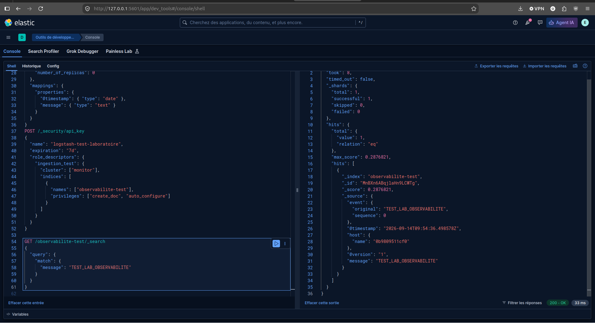

*Capture fournie du 14 septembre 2026 — La recherche renvoie HTTP 200 et un document contenant `TEST_LAB_OBSERVABILITE`, horodaté `2026-09-14T09:54:36.498Z`. La requête visible à gauche décrit les droits d’une clé ; aucune valeur de clé API n’est affichée.*

Pour le visualiser : ouvrir **Discover**, créer une vue de données `observabilite-test`, choisir **`@timestamp`** comme champ temporel, puis rechercher `message: "TEST_LAB_OBSERVABILITE"`. Sélectionner une période qui couvre l'heure du test.

La présence du message dans les logs Logstash seule ne valide pas l'envoi : c'est sa lecture depuis Elasticsearch et Kibana qui termine le contrôle.

### G. Conserver la preuve et terminer le test

Noter l'heure, l'index, le message retrouvé et les erreurs éventuelles. Garder une capture Discover sans clé API. Le pipeline et le Compose sont des fichiers de configuration à conserver ; le secret reste hors du dossier publié.

Si Grafana a été arrêté, le relancer avec `sudo docker compose up -d grafana`. Le service Logstash de test reste arrêté ; une collecte permanente nécessitera une vraie entrée et une politique de redémarrage adaptée lors de l'intégration des systèmes.

| Erreur | Premier contrôle |
| --- | --- |
| Fichier introuvable ou montage incorrect | Vérifier les noms exacts `test.conf` et `http_ca.crt`, leur type et leur emplacement. |
| Certificat illisible ou erreur TLS | Vérifier la copie de la CA et le nom `elasticsearch`, sans désactiver la validation. |
| Réponse 401 | Clé au format `id:api_key`, valeur correcte dans `.env`, clé non expirée. |
| Réponse 403 | Privilèges de la clé et nom exact de l'index précréé. |
| Arrêt 137 ou mémoire insuffisante | Vérifier `free -h`, les limites du conteneur et la pression mémoire de la VM. |
| Message absent de Discover | Vérifier d'abord `_search`, puis la vue de données et la période sélectionnée. |

**Validation observée :** la capture de recherche montre un document correspondant au message fictif émis par le pipeline de test. Le parcours Logstash → Elasticsearch → Kibana est validé pour cet essai. La visualisation dans Discover et la collecte des journaux réels restent à documenter.

## 7. Contrôler le démarrage et la persistance

Pour contrôler les services permanents depuis le répertoire Compose de la VM, utiliser les commandes suivantes. Logstash est ici un test ponctuel sous profil ; il peut être arrêté avec succès et ne doit pas être relancé à chaque contrôle général.

```bash
sudo docker compose config --quiet
sudo docker compose up -d
sudo docker compose ps
sudo docker compose logs --tail=100 prometheus grafana elasticsearch logstash kibana
sudo docker stats --no-stream
```

Ces commandes supposent les noms de services utilisés dans cette feuille. Examiner les journaux localement et masquer les secrets avant toute capture ou copie dans le dossier.

### Captures des contrôles d’exploitation

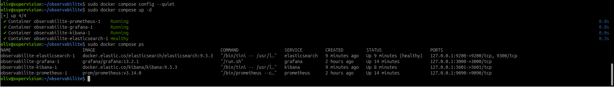

*Capture fournie du 14 septembre 2026 — Prometheus, Grafana et Kibana sont démarrés ; Elasticsearch est indiqué Healthy. Les ports publiés sont liés à 127.0.0.1. Logstash, prévu comme test ponctuel, ne figure pas parmi les conteneurs actifs ; cette capture seule ne précise pas son code de sortie.*

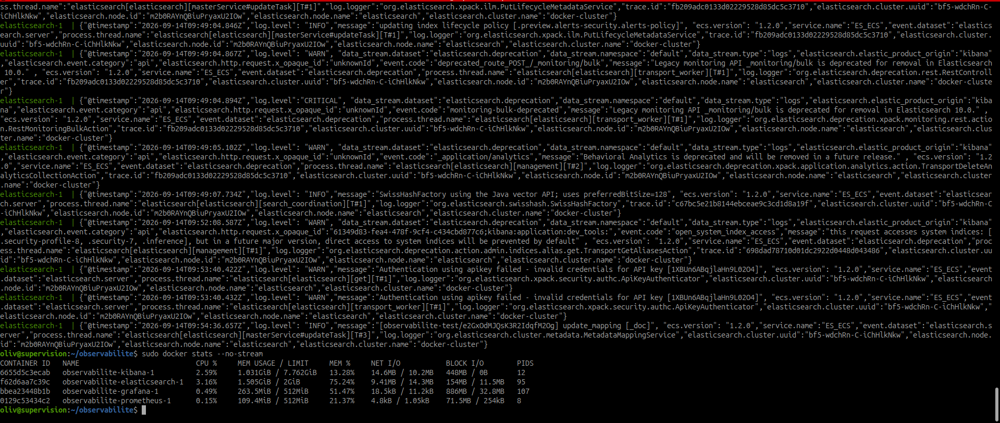

*Capture fournie du 14 septembre 2026 — Le relevé montre environ 1,505 Gio pour Elasticsearch sur une limite de 2 Gio, 1,031 Gio pour Kibana sur 7,762 Gio affichés, 263,5 Mio pour Grafana et 109,4 Mio pour Prometheus. La limite Kibana observée diffère du plafond de 1,5 Gio prévu ; la correction est documentée juste après. Les journaux incluent des erreurs d’authentification antérieures au message de test retrouvé ; ils ne suffisent pas à conclure à un échec actuel de la chaîne.*

### Correction réalisée — une unité de mémoire mal saisie

!!! note "La minute maladresse de votre serviteur"
    Votre serviteur a saisi `1536g` au lieu de `1536m` dans `mem_limit` pour Kibana. Une petite lettre, une grosse différence ! L’erreur a été repérée grâce au contrôle des limites, corrigée dans le Compose, puis vérifiée après recréation du conteneur.

La faute de saisie est confirmée par l’utilisateur. Après correction en `mem_limit: 1536m` et application avec `sudo docker compose up -d kibana`, le nouveau relevé `docker stats --no-stream` affiche **1,239 Gio utilisés sur une limite de 1,5 Gio (82,61 %)** pour Kibana. Le plafond attendu est donc bien appliqué au moment de cette capture.

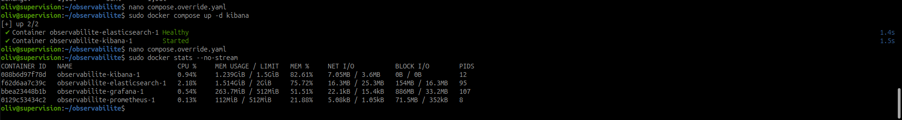

*Capture fournie du 14 septembre 2026 — recréation de Kibana et vérification de sa limite à 1,5 Gio. Elasticsearch reste plafonné à 2 Gio ; Grafana et Prometheus à 512 Mio chacun.*

**À retenir :** relire la valeur et son unité, puis contrôler la limite réellement appliquée. `docker compose config --quiet` peut accepter une valeur syntaxiquement correcte mais beaucoup trop élevée pour le besoin.

Après les tests fonctionnels, effectuer un redémarrage contrôlé avec `sudo docker compose restart prometheus grafana elasticsearch kibana`. Vérifier à nouveau l'auto-collecte, le panneau Grafana enregistré et l'événement de test conservé dans Elasticsearch. Contrôler également les volumes déclarés : un simple redémarrage réussi ne prouve pas la résistance à une suppression des conteneurs. Définir la politique de redémarrage automatique et la procédure de sauvegarde des configurations et données.

## 8. Trace à conserver dans le dossier de déploiement

| Rubrique | Contenu à renseigner |
| --- | --- |
| Emplacement | VM, adresse, réseau, répertoire Compose, noms des services et volumes. |
| Versions | Versions exactes des images et références des documentations utilisées. |
| Configuration | Collecte, rétention, ressources, pipeline, index, source Grafana, chemins des certificats. |
| Accès | URL, tunnel SSH, profils autorisés ; référence du coffre de secrets sans leurs valeurs. |
| Vérifications | Date, commande ou action, résultat attendu, résultat observé et capture utile. |
| Difficultés | Symptôme, diagnostic, correction et résultat du nouveau test. |
| Exploitation | Démarrage, arrêt, consultation des logs, sauvegarde, restauration et suivi du stockage. |

### Repères de diagnostic

| Symptôme | Première recherche |
| --- | --- |
| Interface inaccessible | Service actif, port publié, tunnel ouvert et absence de conflit de port local. |
| Grafana ne joint pas Prometheus | URL de la source et réseau partagé ; distinguer laptop, VM et conteneur. |
| Elasticsearch ne démarre pas | Journaux, mémoire, espace disque, permissions des volumes et prérequis noyau. |
| Erreur TLS ou authentification | Autorité de confiance, nom du certificat, identité utilisée et permissions. |
| Kibana sans événement | Pipeline actif, sortie Logstash, index réellement créé, vue de données et période. |
| Conteneur qui redémarre | Code de sortie, erreurs de configuration et pression mémoire de la VM ou du laptop. |

## Question de fin d'étape

**Comment vérifier qu'une plateforme d'observabilité est réellement opérationnelle avant d'y intégrer des systèmes à superviser ?**

Vérifier successivement les composants, leurs accès, leurs échanges et la conservation des données. La preuve minimale combine une métrique auto-collectée par Prometheus et consultable dans Grafana, puis un événement de test traversant Logstash, Elasticsearch et Kibana. Compléter par des contrôles de fraîcheur, de redémarrage et de configuration du stockage. Une page de connexion accessible ou un conteneur « Up » ne suffit pas.

## Point de contrôle

- [ ] Prometheus fonctionne et collecte ses propres métriques.
- [ ] Grafana interroge Prometheus et affiche une donnée récente.
- [x] Accès authentifié à Kibana confirmé par l’utilisateur.
- [x] Elasticsearch répond au contrôle de santé avec un état `green`.
- [x] Le parcours Logstash → Elasticsearch → Kibana est validé pour le message de test.
- [x] Les interfaces Prometheus, Grafana et Kibana sont accessibles depuis le laptop (captures fournies).
- [x] Le message fictif `TEST_LAB_OBSERVABILITE` est retrouvé dans Elasticsearch depuis Kibana après le test Logstash.
- [ ] Les paramètres et la persistance sont vérifiés et documentés.
- [ ] Les composants sont prêts pour l'étape d'intégration des systèmes ; les futures entrées et leurs accès restent à configurer selon les sources.

Cocher uniquement après vérification réelle. Cette validation concerne le socle du laboratoire ; elle ne vaut pas validation d'une architecture de production.

[Retour au sommaire de l'itération](index.md)
