# Intégrer les endpoints Linux et Windows Server Core

## Objectif et travail demandé

La mission AlpesNet consiste à intégrer un endpoint Linux et un endpoint Windows à la plateforme : identifier les données disponibles, choisir et installer les composants de collecte, déclarer les cibles, configurer les métriques, vérifier leur remontée et documenter les configurations.

Cette activité réutilise [la plateforme déjà déployée](deployer-plateforme-observabilite.md). Elle porte sur les **métriques système** : l’intégration des journaux réels à ELK fera l’objet d’une configuration distincte.

!!! note "Avancement documenté"
    Les captures du 14 septembre 2026 montrent les exporters en fonctionnement, des sorties de métriques et les deux cibles Linux et Windows `UP` dans Prometheus. Les nouvelles requêtes Prometheus attestent aussi les noms et OS exposés, la RAM disponible, l’espace disque et le nombre d’échantillons collectés. Les comparaisons avec les relevés locaux, l’affichage dans Grafana et les contrôles de fréquence et d’erreurs restent à compléter.

## 1. Identifier les machines et les données

| Machine | Rôle | Adresse à retenir |
| --- | --- | --- |
| `supervision` | Prometheus et outils d’observabilité, VM de 8 Gio | `192.168.122.80` |
| VM Debian | Endpoint Linux à observer | `192.168.122.158` |
| VM Windows Server **Core** | Endpoint Windows à observer | `192.168.122.25` |

Sur **Debian à superviser**, exécuter :

```bash
hostnamectl
cat /etc/os-release
ip -br address
```

Sur **Windows Server Core**, ouvrir **PowerShell en administrateur**. Depuis une invite `cmd`, lancer `powershell`, puis :

```powershell
hostname
Get-CimInstance Win32_OperatingSystem | Select-Object Caption, Version, BuildNumber
Get-ItemProperty 'HKLM:\SOFTWARE\Microsoft\Windows NT\CurrentVersion' |
  Select-Object InstallationType
Get-NetIPConfiguration
```

Relever le nom réel et l’adresse IPv4 de chaque invité. Le nom de la VM dans virt-manager peut différer du nom déclaré par son système. Stabiliser les adresses ou utiliser des noms DNS résolus depuis Prometheus avant une collecte durable.

Les premières données recherchées sont : CPU, mémoire disponible, espace disque, trafic réseau, identité et version du système. Les droits du compte de service et les collecteurs activés déterminent les données effectivement accessibles.

## 2. Comprendre le chemin de collecte

```text
Prometheus dans la VM supervision
  ├── HTTP → IP_DEBIAN:9100/metrics → Node Exporter → mesures Linux
  └── HTTP → IP_WINDOWS:9182/metrics → windows_exporter → mesures Windows
```

Un **exporter** expose les métriques du système. Prometheus vient les lire régulièrement : c’est une collecte par interrogation (*scrape*). Les exporters seront installés directement dans les invités, pour mesurer ces systèmes plutôt qu’un conteneur isolé. [Guide Node Exporter](https://prometheus.io/docs/guides/node-exporter/)

Dans ce laboratoire privé, autoriser les connexions entrantes uniquement depuis la VM de supervision vers TCP **9100** sur Debian et TCP **9182** sur Windows. Avec le réseau Docker bridge habituel, le trafic sortant est généralement traduit vers l’adresse de la VM supervision ; vérifier ce point si le réseau diffère. Ne pas ouvrir ces interfaces sur Internet.

## 3. Installer Node Exporter sur Debian

Toutes les commandes de cette section s’exécutent sur **la VM Debian à superviser**, pas sur `supervision`.

```bash
sudo apt update
sudo apt install prometheus-node-exporter curl
sudo systemctl enable --now prometheus-node-exporter
sudo systemctl status prometheus-node-exporter --no-pager
dpkg-query -W prometheus-node-exporter
curl --fail --max-time 10 http://127.0.0.1:9100/metrics
```

Le paquet Debian fournit Node Exporter. Consigner la version installée ; elle peut différer de la dernière publication du projet amont. [Paquet officiel Debian trixie](https://packages.debian.org/trixie/prometheus-node-exporter)

**Résultat attendu :** service actif et texte contenant des lignes `# HELP`, `# TYPE` et des métriques `node_...`. Le service doit continuer à fonctionner après fermeture de la session SSH.

Vérifier l’écoute et les paramètres réellement utilisés :

```bash
sudo ss -lntp 'sport = :9100'
sudo systemctl cat prometheus-node-exporter
sudo journalctl -u prometheus-node-exporter --since '-10 minutes' --no-pager
```


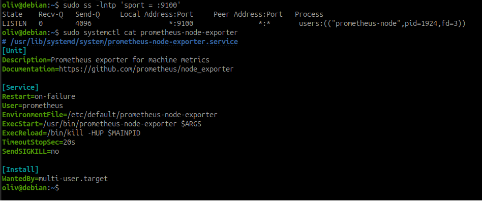

*Capture du 14 septembre 2026 — Sur Debian, le processus écoute sur `*:9100`. L’unité utilise le compte `prometheus` et le fichier de paramètres `/etc/default/prometheus-node-exporter`.*

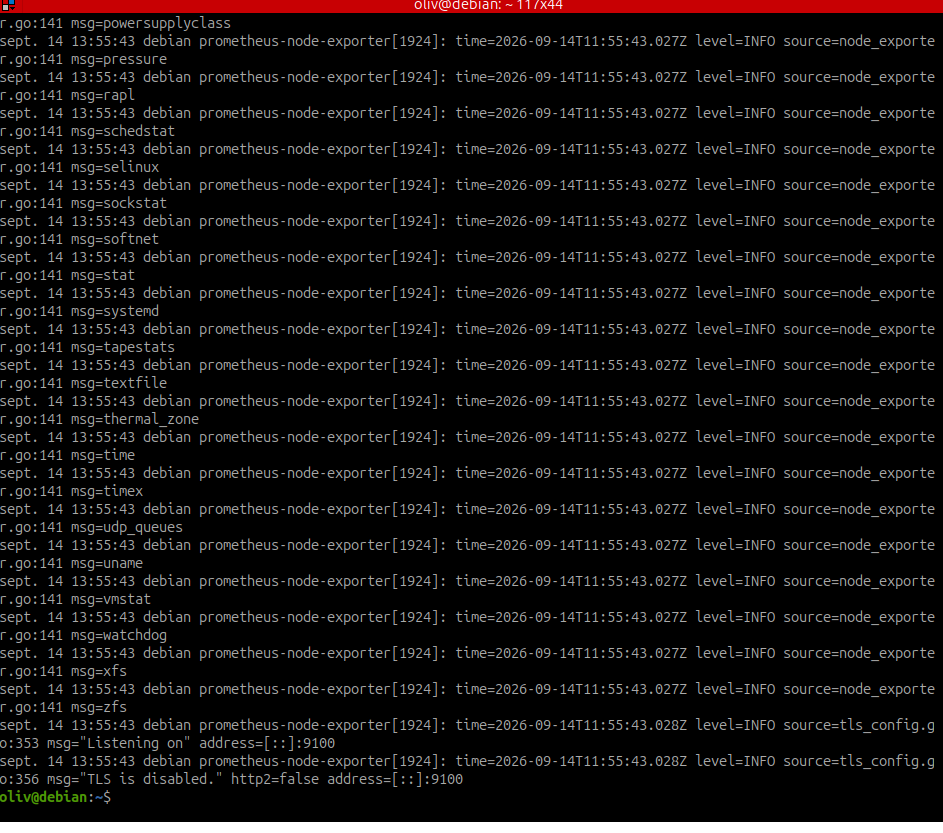

*Capture du 14 septembre 2026 — L’extrait liste les collecteurs au démarrage et confirme l’écoute sur `[::]:9100`, avec TLS désactivé dans ce laboratoire.*

Si l’écoute est limitée à `127.0.0.1`, ajuster `--web.listen-address` dans les paramètres utilisés par l’unité pour écouter sur l’adresse réseau de Debian ou sur `:9100`, puis redémarrer le service. Lire l’unité avant de modifier son fichier de paramètres.

Adapter le pare-feu **déjà en place** pour autoriser TCP 9100 depuis `192.168.122.80`. Si UFW est déjà installé et actif avec une politique entrante restrictive :

```bash
sudo ufw allow from 192.168.122.80 to any port 9100 proto tcp
sudo ufw status verbose
```

Ne pas activer un nouveau pare-feu à l’aveugle pendant une connexion SSH. Si nftables est utilisé, intégrer la règle à la politique existante et conserver l’accès d’administration. La règle ne doit pas être annulée par une autorisation plus large déjà présente.

## 4. Installer windows_exporter sur Windows Server Core

### Télécharger le MSI depuis PowerShell

Le parcours utilise **PowerShell administrateur**, sans navigateur ni bureau dans Windows. L’image Windows Server Core reste telle quelle.

```powershell
New-Item -ItemType Directory -Force -Path C:\Temp | Out-Null
$ExporterVersion = '0.31.8'
$ExporterMsi = "C:\Temp\windows_exporter-$ExporterVersion-amd64.msi"
$ExporterUrl = "https://github.com/prometheus-community/windows_exporter/releases/download/v$ExporterVersion/windows_exporter-$ExporterVersion-amd64.msi"
Invoke-WebRequest -UseBasicParsing -Uri $ExporterUrl -OutFile $ExporterMsi
Get-FileHash -Algorithm SHA256 -Path $ExporterMsi
```

Comparer l’empreinte à celle publiée pour cet artefact avant l’installation. Conserver version et empreinte dans le dossier. Cette version explicite rend la procédure reproductible. [Publication windows_exporter 0.31.8](https://github.com/prometheus-community/windows_exporter/releases/tag/v0.31.8)

### Installer le service et limiter l’accès réseau

Dans **la même session PowerShell**, adapter l’adresse de supervision si nécessaire, puis :

```powershell
$ExporterArgs = @(
  '/i', $ExporterMsi,
  '/qn', '/norestart',
  'ENABLED_COLLECTORS=cpu,memory,logical_disk,net,os,system,service',
  'LISTEN_PORT=9182',
  'ADDLOCAL=FirewallException',
  'REMOTE_ADDR=192.168.122.80',
  '/L*v', 'C:\Temp\windows-exporter-install.log'
)
$ExporterInstall = Start-Process msiexec.exe -ArgumentList $ExporterArgs -Wait -PassThru
$ExporterInstall.ExitCode
```

Le MSI installe un service Windows et la règle de pare-feu demandée. `REMOTE_ADDR` limite cette exception à la supervision. Le code `0` indique une installation réussie ; `3010` demande un redémarrage. Pour un autre code, consulter le journal d’installation avant de poursuivre. [Installation et options du projet windows_exporter](https://github.com/prometheus-community/windows_exporter#installation)

### Vérifier sans interface graphique

```powershell
Get-Service windows_exporter
Get-NetTCPConnection -LocalPort 9182 -State Listen
(Invoke-WebRequest -UseBasicParsing -Uri 'http://127.0.0.1:9182/metrics').Content |
  Select-String -Pattern 'windows_os_info|windows_os_hostname|windows_memory_available_bytes'
```


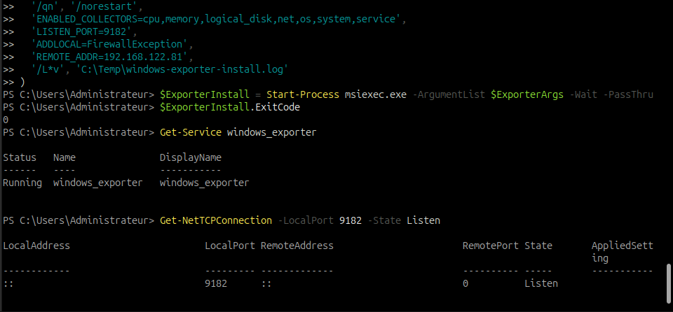

*Capture du 14 septembre 2026 — Le MSI retourne le code `0`, le service est `Running` et le port TCP 9182 est en écoute. La commande contient la restriction réseau à `192.168.122.81` ; le contrôle de la règle effective reste distinct.*

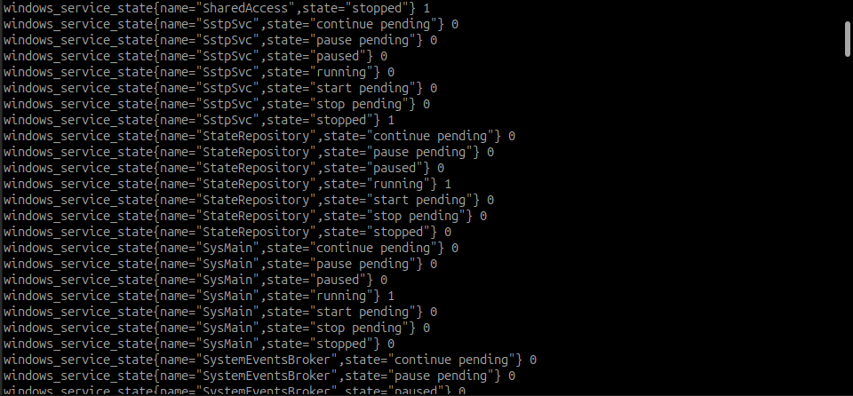

*Capture du 14 septembre 2026 — La sortie expose `windows_service_state` avec les labels `name` et `state`. Pour un service, la valeur `1` désigne l’état indiqué : un service arrêté peut être mesuré correctement. La commande et l’adresse interrogée ne sont pas visibles dans cet extrait.*

Le service doit être `Running`. Pour voir les paramètres du service et l’exception réseau :

```powershell
Get-CimInstance Win32_Service -Filter "Name='windows_exporter'" |
  Select-Object Name, State, StartMode, PathName
Get-NetFirewallRule | Where-Object DisplayName -Match 'windows.?exporter' |
  Get-NetFirewallAddressFilter
```

Vérifier que la portée distante correspond à l’adresse de supervision. Examiner aussi les règles préexistantes : une autre autorisation plus large peut laisser passer davantage de sources.

## 5. Tester l’accès depuis la VM supervision

Dans **`supervision`**, remplacer les deux valeurs par les IP relevées à l’étape 1 :

```bash
curl --fail --max-time 10 http://IP_DEBIAN:9100/metrics
curl --fail --max-time 10 http://IP_WINDOWS:9182/metrics
```


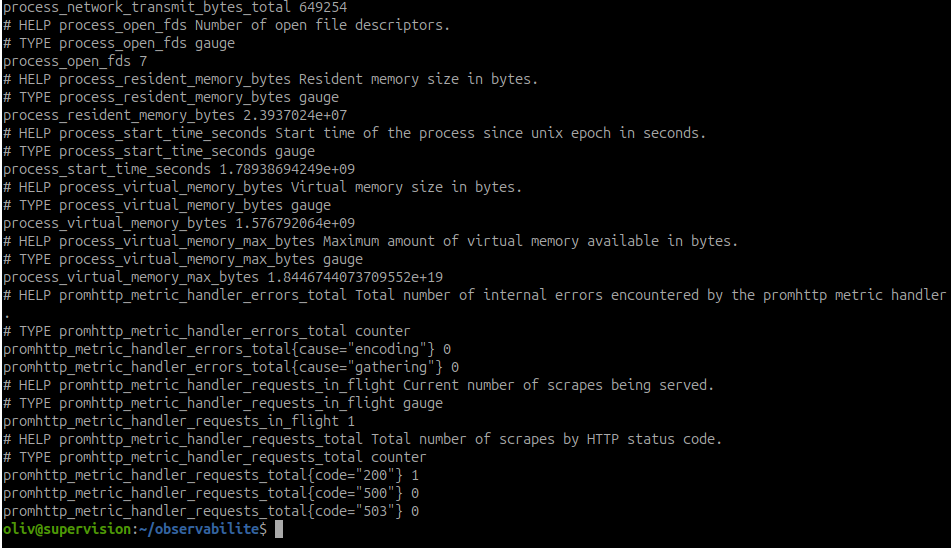

*Capture du 14 septembre 2026 — La capture identifiée comme Debian montre la fin de la réponse de métriques et l’invite de `supervision`. Elle affiche notamment les métriques du processus exporter et du gestionnaire HTTP ; l’URL appelée n’est pas visible.*

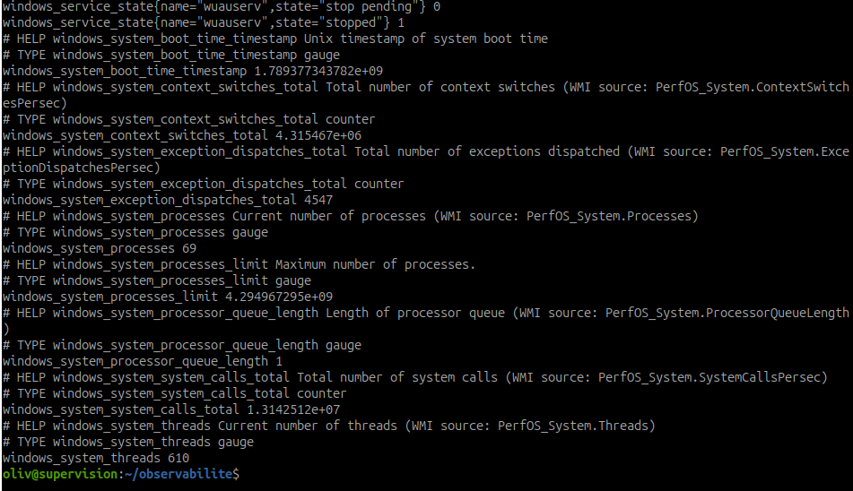

*Capture du 14 septembre 2026 — La sortie affiche des métriques `windows_system_*`, notamment 69 processus et 610 threads à cet instant. L’invite confirme le terminal de `supervision` ; l’URL appelée n’est pas visible.*

Si le test local fonctionnait mais que ce test échoue, examiner adresse d’écoute, routage, adresse de la cible et pare-feu. Ce contrôle part de la VM ; la validation définitive ci-dessous part du processus Prometheus dans son conteneur.

## 6. Déclarer les deux cibles dans Prometheus

Sur **`supervision`**, conserver une copie de la configuration avant modification :

```bash
cd ~/observabilite
cp -p prometheus/prometheus.yml "prometheus/prometheus.yml.bak-$(date +%Y%m%d-%H%M%S)"
nano prometheus/prometheus.yml
```

Adapter les deux adresses et les noms d’inventaire dans cet exemple. Conserver les autres jobs déjà ajoutés : il ne doit y avoir qu’une clé `scrape_configs`.

```yaml
global:
  scrape_interval: 30s
  scrape_timeout: 10s

scrape_configs:
  - job_name: prometheus
    static_configs:
      - targets: ['localhost:9090']

  - job_name: linux
    metrics_path: /metrics
    static_configs:
      - targets: ['IP_DEBIAN:9100']
        labels:
          endpoint: debian
          os_family: linux

  - job_name: windows
    metrics_path: /metrics
    static_configs:
      - targets: ['IP_WINDOWS:9182']
        labels:
          endpoint: windows-core
          os_family: windows
```

[Configuration téléchargeable à adapter](../../assets/configs/supervision-optimisation-performances/it-1/prometheus/endpoints-example.yml).

Les labels `endpoint` et `os_family` sont des **déclarations d’inventaire** : ils ne prouvent pas l’OS installé. Les comparer aux informations exposées par les exporters. Le label `instance`, créé à partir de la cible, conserve ici l’adresse et le port. Le délai maximal de collecte proposé est de 10 secondes, pour un intervalle de 30 secondes. [Configuration Prometheus](https://prometheus.io/docs/prometheus/latest/configuration/)

Les textes `IP_DEBIAN` et `IP_WINDOWS` sont des marqueurs à remplacer : `promtool` peut accepter ces noms même s’ils ne désignent aucune machine réelle. Prometheus ne substitue pas les variables d’un `.env` dans ce fichier.

Valider, puis appliquer **si la validation réussit** :

```bash
sudo docker compose run --rm --no-deps --entrypoint promtool prometheus \
  check config /etc/prometheus/prometheus.yml
sudo docker compose up -d --no-deps --force-recreate prometheus
sudo docker compose logs --since=2m --tail=50 prometheus
```

La recréation recharge aussi le montage du fichier après sa modification ; le volume nommé conserve les données. Seul Prometheus est concerné. Ne pas supprimer les volumes.


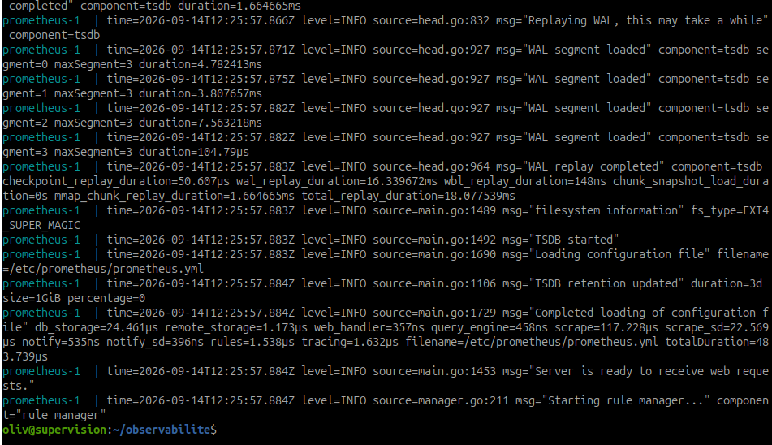

*Capture du 14 septembre 2026 — Les journaux confirment le chargement de `/etc/prometheus/prometheus.yml` et indiquent que le serveur est prêt à recevoir des requêtes web. Le succès des collectes se vérifie ensuite dans les cibles.*

## 7. Valider dans Prometheus puis Grafana

Depuis le **navigateur du laptop**, conserver le tunnel SSH de la feuille précédente et ouvrir `http://127.0.0.1:9090`. Dans **Status → Target health** (ou **Targets** selon la version), vérifier les jobs `linux` et `windows`, l’URL, le dernier scrape, sa durée et les éventuelles erreurs.


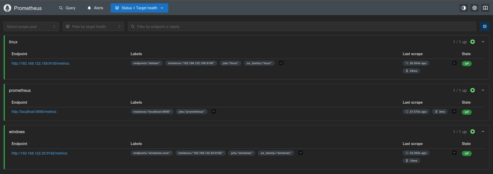

*Capture du 14 septembre 2026 — Les trois cibles sont `UP` : Debian sur `192.168.122.158:9100`, Windows sur `192.168.122.25:9182` et Prometheus sur `localhost:9090`. Les durées affichées sont respectivement 25 ms, 10 ms et 3 ms. Cela prouve une collecte réussie à cet instant, sans démontrer à lui seul la santé de tous les services ni la continuité dans le temps.*

Attendre au moins deux cycles, puis exécuter :

```promql
up{job=~"linux|windows"}
```

**Attendu :** une série à `1` pour chaque endpoint. `up=1` prouve le succès de la collecte HTTP, pas la santé complète du serveur. Une cible absente n’est pas équivalente à une cible présente avec `up=0`.

### Principales métriques à identifier

| Usage | Debian / Node Exporter | Windows Server Core / windows_exporter |
| --- | --- | --- |
| Nom | `node_uname_info` : label `nodename` | `windows_os_hostname` : label `hostname` |
| OS | `node_os_info` si exposée ; `node_uname_info` pour le noyau | `windows_os_info` : produit, version et build |
| CPU | `node_cpu_seconds_total` | `windows_cpu_time_total` |
| Mémoire disponible | `node_memory_MemAvailable_bytes` | `windows_memory_available_bytes` |
| Espace disque libre | `node_filesystem_avail_bytes` | `windows_logical_disk_free_bytes` |
| Réseau reçu | `node_network_receive_bytes_total` | `windows_net_bytes_received_total` |
| Erreurs de collecteurs | `node_scrape_collector_success` | `windows_exporter_collector_success` si exposée |

Les noms dépendent des versions et des collecteurs activés : vérifier le texte `/metrics`, notamment ses descriptions `HELP`. Les compteurs CPU sont des temps cumulés, pas des pourcentages instantanés. [Node Exporter](https://github.com/prometheus/node_exporter), [OS Windows](https://github.com/prometheus-community/windows_exporter/blob/v0.31.8/docs/collector.os.md), [CPU Windows](https://github.com/prometheus-community/windows_exporter/blob/v0.31.8/docs/collector.cpu.md), [mémoire Windows](https://github.com/prometheus-community/windows_exporter/blob/v0.31.8/docs/collector.memory.md), [disques Windows](https://github.com/prometheus-community/windows_exporter/blob/v0.31.8/docs/collector.logical_disk.md).

Pour lire la RAM disponible en Gio :

```promql
node_memory_MemAvailable_bytes{job="linux"} / 1024^3
```

```promql
windows_memory_available_bytes{job="windows"} / 1024^3
```

Pour les contrôles de collecte :

```promql
scrape_samples_scraped{job=~"linux|windows"}
```

```promql
scrape_duration_seconds{job=~"linux|windows"}
```

Vérifier un nombre d’échantillons positif et une durée inférieure au timeout. Comparer le dernier scrape avant et après un cycle. Dans Grafana, utiliser la source Prometheus de la plateforme et exécuter les mêmes requêtes dans **Explore** ; une page d’accueil Grafana ne suffit pas à valider cette connexion.

### Résultats observés dans Prometheus

Les captures suivantes montrent les données effectivement interrogées. Les valeurs de ressources correspondent à cet instant et évolueront avec l’activité des VM.

#### Identité et système d’exploitation

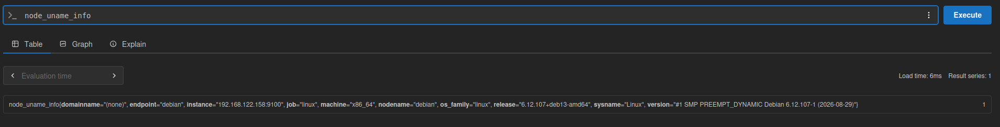

*Capture du 14 septembre 2026 — `node_uname_info` retourne le nom `debian`, l’architecture `x86_64` et le noyau `6.12.107+deb13-amd64` pour la cible `192.168.122.158:9100`.*

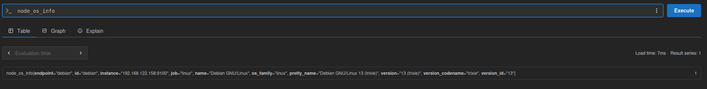

*Capture du 14 septembre 2026 — `node_os_info` identifie **Debian GNU/Linux 13 (trixie)**. La valeur `1` accompagne les informations portées par les labels ; ce n’est pas une mesure de performance.*

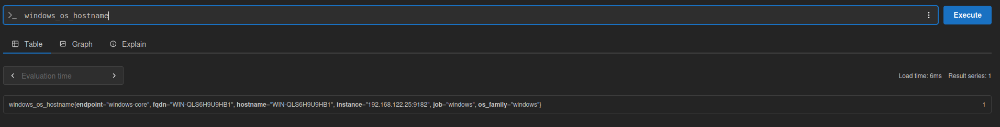

*Capture du 14 septembre 2026 — `windows_os_hostname` fournit le nom réel du serveur, distinct du label d’inventaire `endpoint="windows-core"`, pour la cible `192.168.122.25:9182`.*

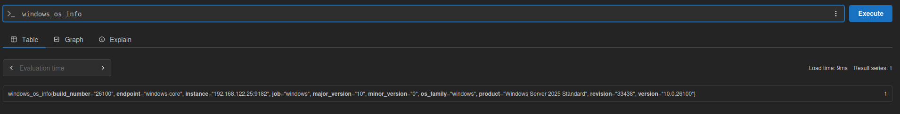

*Capture du 14 septembre 2026 — `windows_os_info` indique **Windows Server 2025 Standard**, version `10.0.26100`, build `26100`, révision `33438`. Le mode Core a été confirmé par l’utilisateur ; cette métrique seule ne l’établit pas.*

#### Mémoire disponible

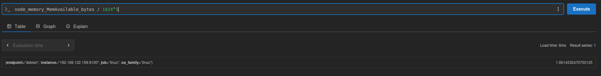

*Capture du 14 septembre 2026 — La requête `node_memory_MemAvailable_bytes / 1024^3` retourne environ **1,66 Gio disponibles** au moment de la capture.*

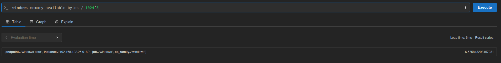

*Capture du 14 septembre 2026 — La requête `windows_memory_available_bytes / 1024^3` retourne environ **6,58 Gio disponibles** au moment de la capture. Il s’agit de mémoire disponible, pas de la quantité totale installée.*

#### Espace disque

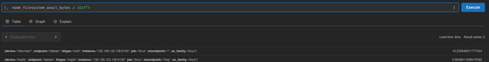

*Capture du 14 septembre 2026 — La requête `node_filesystem_avail_bytes / 1024^3` affiche environ **16,23 Gio disponibles sur `/`** (`/dev/vda1`, ext4) et **0,96 Gio sur `/tmp`** (tmpfs). Le tmpfs est un système de fichiers en mémoire : ne pas additionner ces valeurs pour estimer l’espace du disque virtuel.*

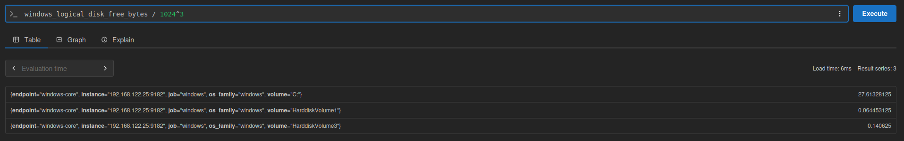

*Capture du 14 septembre 2026 — La requête `windows_logical_disk_free_bytes / 1024^3` affiche environ **27,61 Gio libres sur `C:`**, ainsi que deux autres volumes. Examiner les labels de volume pour interpréter chaque série ; ces valeurs seules ne donnent pas le pourcentage d’occupation.*

#### Volume de collecte

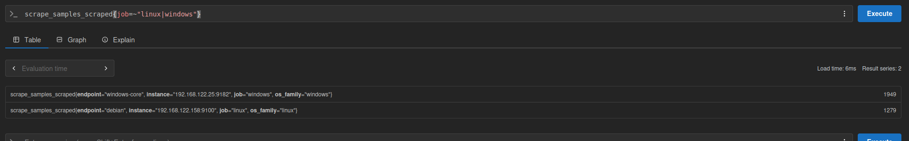

*Capture du 14 septembre 2026 — `scrape_samples_scraped{job=~"linux|windows"}` affiche **1 279 échantillons pour Debian** et **1 949 pour Windows** lors de la collecte représentée. Ce nombre compte les échantillons, y compris les différentes combinaisons de labels, et non autant de types de métriques différents.*

## 8. Distinguer panne système et échec de collecte

| Observation | Interprétation et vérification |
| --- | --- |
| Cible absente | Vérifier le fichier monté, les jobs et l’application de la configuration. |
| `up=0`, machine joignable | Tester le service exporter, son écoute, le pare-feu et `/metrics`. |
| `up=0`, machine non joignable | Vérifier aussi virt-manager, la console de l’invité et le réseau ; un ping seul ne suffit pas. |
| `up=1`, collecteur en échec | L’exporter répond mais une partie des données peut manquer ; examiner ses journaux et permissions. |
| `up=1`, RAM disponible faible | La collecte fonctionne ; examiner la pression mémoire du système et son évolution. |
| Prometheus reçoit des données, Grafana non | Examiner source de données, requête, filtres de labels et période Grafana. |

## 9. Validation et dossier de déploiement

Les cases cochées attestent les informations disponibles dans Prometheus sur les captures. Les comparaisons locales et les contrôles complémentaires mentionnés restent à consigner ; une capture ponctuelle ne prouve pas la continuité de la collecte.

| Information à valider | Endpoint Linux | Endpoint Windows Core | Preuve attendue |
| --- | --- | --- | --- |
| Nom ou identifiant | ☑ | ☑ | Noms exposés visibles dans `node_uname_info` et `windows_os_hostname` ; correspondance locale à consigner |
| État de disponibilité de la collecte | ☑ | ☑ | Deux cibles `UP` dans la capture du 14 septembre, au moment du contrôle |
| Système d’exploitation | ☑ | ☑ | Debian 13 et Windows Server 2025 Standard exposés ; comparaison au relevé local à consigner |
| Adresse réseau | ☐ | ☐ | Cible `instance=IP:port` et adresse locale relevée |
| Remontée des métriques | ☑ | ☑ | Requêtes RAM et disque avec résultats, et nombre d’échantillons positif pour les deux systèmes |
| Fréquence d’actualisation | ☐ | ☐ | Intervalle configuré et dernier scrape qui avance |
| Éventuelles erreurs de collecte | ☐ | ☐ | Erreur de cible, collecteurs et journaux examinés |

Consigner les versions installées, machines, IP, ports, collecteurs, règles réseau, fichiers modifiés, fréquence, commandes de validation, résultats, difficultés et corrections. Ne pas confondre les valeurs attendues avec les résultats mesurés.

## Questions de fin d’étape

**Comment la plateforme sait-elle quelles données récupérer sur un endpoint ?** La configuration indique l’adresse, le port, le chemin `/metrics` et la fréquence. Les collecteurs activés dans l’exporter déterminent les mesures exposées.

**Quel composant fournit les métriques d’un système ?** Node Exporter sur Linux et windows_exporter sur Windows dans cette activité.

**Comment vérifier qu’un endpoint est correctement intégré ?** Confirmer son identité, sa présence dans les cibles, `up=1`, des mesures pertinentes et récentes, puis l’absence d’erreurs non expliquées.

**Comment distinguer problème de l’endpoint et problème de collecte ?** Croiser la console système, le service exporter, les contrôles réseau et les erreurs Prometheus. Une collecte réussie peut montrer un système en difficulté ; une collecte échouée ne prouve pas qu’il est arrêté.

**Quelles différences entre Linux et Windows ?** Paquet Debian et service systemd d’un côté ; MSI silencieux, service Windows et pare-feu administrés en PowerShell de l’autre. Les noms de métriques et les collecteurs diffèrent, mais Prometheus les interroge suivant le même principe HTTP. Windows Server Core ne nécessite pas de bureau graphique pour ce travail.

## Point de contrôle

- [x] L’endpoint Linux est intégré : cible présente et `UP` sur la capture.
- [x] L’endpoint Windows Server Core est intégré : cible présente et `UP` sur la capture.
- [x] Les données des deux systèmes remontent effectivement : résultats RAM, disque et échantillons dans Prometheus.
- [x] Les premières métriques sont identifiées et interprétées : identité, OS, RAM disponible, espace disque et nombre d’échantillons. Les mesures CPU et réseau restent à explorer.
- [ ] La fréquence, la fraîcheur et les erreurs de collecte sont vérifiées.

[Retour au sommaire de l’itération](index.md)
