# Configurer et tester les alertes

## Objectif et travail demandé

Transformer les [conditions et seuils définis](definir-seuils-criticite.md) en règles actives, identifier l’élément concerné et sa criticité, recevoir une notification, puis vérifier le retour au nominal. Réutiliser les dashboards Grafana et Kibana de l’itération 1 et consigner les configurations dans le dossier de déploiement.

!!! note "Avancement attesté au 16 septembre 2026"
    Les captures ci-dessous montrent la validation des configurations, le démarrage des services, les cinq règles chargées, puis les cycles CPU Debian et IIS. Pour IIS, le récepteur journalise aussi `firing` puis `resolved`, avec HTTP 200 pour les deux POST d’Alertmanager. Les règles de collecte et de stockage restent non testées en panne.

## 1. Où configurer quoi ?

| Composant | Rôle | Emplacement sur la VM supervision |
| --- | --- | --- |
| Prometheus | Évaluer les expressions et leur durée `for` | `~/observabilite/prometheus/rules/alertes.yml` |
| Prometheus | Charger les règles et déclarer Alertmanager | `~/observabilite/prometheus/prometheus.yml` |
| Alertmanager | Regrouper et transmettre les alertes | `~/observabilite/alertmanager/alertmanager.yml` |
| Récepteur local | Recevoir les notifications HTTP et les écrire dans les logs Docker | `~/observabilite/alert-receiver/server.py` |
| Compose | Déployer ces composants et leurs volumes | `~/observabilite/compose.override.yaml` existant |

**Circuit retenu : Prometheus → Alertmanager → webhook local → journal Docker.** Le destinataire du lab est l’administrateur qui consulte ce journal. Il s’agit d’un canal de test réellement vérifiable, sans mail ni messagerie externe ; en exploitation, un canal consulté par l’équipe d’astreinte serait nécessaire. Grafana sert à observer les métriques ; les règles de cette fiche sont créées dans Prometheus, pas dans l’éditeur d’alertes Grafana.

Les deux criticités utilisent ici le même récepteur. `severity` distingue l’urgence et `team` le responsable, sans routage différent implicite. Alertmanager gère la transmission et le regroupement. [Documentation Alertmanager](https://prometheus.io/docs/alerting/latest/alertmanager/)

## 2. Préparer les fichiers sur supervision

Sur **`oliv@supervision` (`192.168.122.80`)**, dans le terminal :

```bash
cd ~/observabilite
mkdir -p prometheus/rules alertmanager alert-receiver
ALERT_BACKUP="sauvegarde-avant-alertes-$(date +%Y%m%d-%H%M%S)"
mkdir -m 700 "$ALERT_BACKUP"
cp -p compose.yaml compose.override.yaml prometheus/prometheus.yml "$ALERT_BACKUP/"
```

Conserver cette sauvegarde sur la VM. Elle permet de restaurer les fichiers en cas de mauvaise fusion. Ne pas remplacer la configuration existante des endpoints, sondes ou journaux.

### A. Fichier des règles

```bash
nano prometheus/rules/alertes.yml
```

Coller **tout** ce YAML dans ce nouveau fichier :

```yaml
groups:
  - name: alpesnet-infrastructure
    interval: 30s
    rules:
      - alert: CollecteEndpointEnEchec
        expr: up{job=~"linux|windows"} == 0
        for: 2m
        labels:
          severity: warning
          team: infrastructure
        annotations:
          summary: 'Collecte perdue : {{ $labels.endpoint }}'
          description: 'La cible {{ $labels.instance }} ({{ $labels.job }}) ne répond plus à la collecte depuis 2 min.'
          action: 'Vérifier Targets, réseau, exporter et état de la VM ; consulter le dashboard Grafana.'

      - alert: ServiceHTTPIndisponible
        expr: |
          (probe_success{job=~"sonde_.*"} == 0)
          and on(job, instance) (up{job=~"sonde_.*"} == 1)
        for: 1m
        labels:
          severity: critical
          team: infrastructure
        annotations:
          summary: 'HTTP en échec : {{ $labels.endpoint }} / {{ $labels.service }}'
          description: 'La sonde de {{ $labels.instance }} échoue depuis 1 min, avec une collecte valide.'
          action: 'Tester HTTP, contrôler nginx ou le site IIS et rechercher les journaux de cet endpoint dans Kibana.'

      - alert: StockagePresquePlein
        expr: |
          (100 * (1 - node_filesystem_free_bytes{job="linux",mountpoint="/",fstype!="rootfs"}
          / node_filesystem_size_bytes{job="linux",mountpoint="/",fstype!="rootfs"}) > 85)
          or
          (100 * (1 - windows_logical_disk_free_bytes{job="windows",volume="C:"}
          / windows_logical_disk_size_bytes{job="windows",volume="C:"}) > 85)
        for: 10m
        labels:
          severity: warning
          team: infrastructure
        annotations:
          summary: 'Stockage presque plein : {{ $labels.endpoint }}'
          description: 'Cible {{ $labels.instance }}, volume {{ $labels.mountpoint }}{{ $labels.volume }} : {{ printf "%.1f" $value }} % utilisés, > 85 % depuis 10 min.'
          action: 'Vérifier espace libre et croissance ; identifier les fichiers concernés avant nettoyage ou extension.'

      - alert: CPUEleve
        expr: |
          (100 * (1 - avg by (instance, job, endpoint) (
            rate(node_cpu_seconds_total{job="linux",mode="idle"}[2m])
          )) > 80)
          or
          (100 * (1 - avg by (instance, job, endpoint) (
            rate(windows_cpu_time_total{job="windows",mode="idle"}[2m])
          )) > 80)
        for: 2m
        labels:
          severity: warning
          team: infrastructure
        annotations:
          summary: 'CPU élevé : {{ $labels.endpoint }}'
          description: 'Cible {{ $labels.instance }} : CPU moyen {{ printf "%.1f" $value }} %, > 80 % depuis 2 min ; calcul sur 2 min.'
          action: 'Identifier le processus, confronter au travail prévu et à la durée des sondes dans Grafana.'

      - alert: CollecteSondeEnEchec
        expr: up{job=~"sonde_.*"} == 0
        for: 2m
        labels:
          severity: warning
          team: infrastructure
        annotations:
          summary: 'Résultat de sonde inaccessible : {{ $labels.endpoint }}'
          description: 'Collecte en échec depuis 2 min pour {{ $labels.instance }} ; disponibilité du service inconnue.'
          action: 'Vérifier Targets, Blackbox, réseau et paramètres de sonde avant de conclure sur le service.'
```

[Télécharger le fichier des règles](../../assets/configs/supervision-optimisation-performances/it-2/prometheus/alertes.yml).

Les quatre règles principales reprennent les seuils du cours. `CollecteSondeEnEchec` couvre la perte de visibilité que l’alerte HTTP ne doit pas confondre avec une panne du site. Les annotations contiennent les premières actions ; leur valeur peut évoluer sans changer l’identité de l’alerte. Ne pas placer une valeur CPU variable dans les labels.

La règle est **inactive**, puis **pending** tant que `for` n’est pas écoulé, puis **firing** si la condition persiste. L’évaluation du groupe se fait toutes les 30 secondes. Une série absente n’est pas automatiquement un échec : vérifier que les cibles attendues restent déclarées et les métriques présentes. [Règles d’alerte Prometheus](https://prometheus.io/docs/prometheus/latest/configuration/alerting_rules/)

### B. Récepteur de notifications

```bash
nano alert-receiver/server.py
```

Coller ce code Python. Aucune installation Python n’est nécessaire sur la VM : il s’exécutera dans son conteneur.

```python
"""Récepteur pédagogique interne : notifications dans les logs Docker."""
import json
from datetime import datetime, timezone
from http.server import BaseHTTPRequestHandler, ThreadingHTTPServer


class Handler(BaseHTTPRequestHandler):
    def do_POST(self):
        if self.path != "/alerts":
            self.send_error(404)
            return
        try:
            size = int(self.headers.get("Content-Length", "0"))
            if not 0 < size <= 1048576:
                raise ValueError("Taille invalide")
            payload = json.loads(self.rfile.read(size))
            alerts = payload["alerts"]
            if not isinstance(alerts, list) or not all(isinstance(a, dict) for a in alerts):
                raise ValueError("Liste attendue")
        except (ValueError, KeyError, TypeError):
            self.send_error(400)
            return
        for alert in alerts:
            print(json.dumps({
                "received_at": datetime.now(timezone.utc).isoformat(),
                "status": alert.get("status"),
                "labels": alert.get("labels", {}),
                "annotations": alert.get("annotations", {}),
                "startsAt": alert.get("startsAt"),
                "endsAt": alert.get("endsAt"),
            }, ensure_ascii=False), flush=True)
        self.send_response(200)
        self.end_headers()
        self.wfile.write(b"OK\n")


if __name__ == "__main__":
    ThreadingHTTPServer(("0.0.0.0", 8080), Handler).serve_forever()
```

[Télécharger le récepteur](../../assets/configs/supervision-optimisation-performances/it-2/alert-receiver/server.py).

C’est un petit récepteur pédagogique réservé au réseau Docker. Il n’expose aucun port sur le laptop et ne remplace pas un service de notification professionnel. Ses journaux tournants constituent des preuves à sauvegarder avant leur rotation.

### C. Routage Alertmanager

```bash
nano alertmanager/alertmanager.yml
```

```yaml
route:
  receiver: journal-local
  group_by: [alertname, job, instance]
  group_wait: 10s
  group_interval: 30s
  repeat_interval: 1h
receivers:
  - name: journal-local
    webhook_configs:
      - url: http://alert-receiver:8080/alerts
        send_resolved: true
```

[Télécharger la configuration Alertmanager](../../assets/configs/supervision-optimisation-performances/it-2/alertmanager/alertmanager.yml).

`group_wait` attend 10 s avant la première notification d’un nouveau groupe ; `group_interval` espace ses mises à jour de 30 s ; `repeat_interval` répète une alerte persistante après 1 h. `send_resolved: true` transmet aussi sa résolution. Ces délais s’ajoutent à la collecte et à l’évaluation : ne pas attendre une réception exactement à l’expiration de `for`. [Configuration du routage et des webhooks](https://prometheus.io/docs/alerting/latest/configuration/)

### D. Compléter le Compose existant

```bash
nano compose.override.yaml
```

**Le bloc suivant est un fragment à fusionner, pas un remplacement du fichier.** Dans le `services:` déjà présent, ajouter `alertmanager` et `alert-receiver`. Pour `prometheus`, ajouter le volume des règles dans sa liste `volumes:` existante, ou créer cette entrée de service dans l’override si elle n’y est pas. Conserver les autres volumes, ports, commandes et services.

Ajouter `alertmanager_data:` dans le `volumes:` de premier niveau existant, ou créer cette section s’il n’y en a pas. Ne pas créer deux clés `services:`, deux services `prometheus:` ou deux clés `volumes:` au même niveau.

```yaml
# Fragment à fusionner dans compose.override.yaml, sans remplacer ses services.
services:
  prometheus:
    volumes:
      - ./prometheus/rules:/etc/prometheus/rules:ro

  alertmanager:
    image: prom/alertmanager:v0.28.1
    restart: unless-stopped
    mem_limit: 128m
    ports:
      - "127.0.0.1:9093:9093"
    volumes:
      - ./alertmanager/alertmanager.yml:/etc/alertmanager/alertmanager.yml:ro
      - alertmanager_data:/alertmanager
    command:
      - --config.file=/etc/alertmanager/alertmanager.yml
      - --storage.path=/alertmanager
      - --cluster.listen-address=
    logging:
      driver: json-file
      options:
        max-size: "10m"
        max-file: "3"

  alert-receiver:
    image: python:3.13-slim
    restart: unless-stopped
    mem_limit: 128m
    user: "65534:65534"
    read_only: true
    volumes:
      - ./alert-receiver/server.py:/app/server.py:ro
    command: ["python", "-u", "/app/server.py"]
    logging:
      driver: json-file
      options:
        max-size: "10m"
        max-file: "3"

volumes:
  alertmanager_data:
```

[Télécharger le fragment Compose](../../assets/configs/supervision-optimisation-performances/it-2/compose.alertes.example.yaml). Son nom d’exemple n’est **pas chargé automatiquement** par Compose : cette procédure demande de fusionner son contenu dans `compose.override.yaml`.

La version Alertmanager est fixée à [v0.28.1](https://github.com/prometheus/alertmanager/releases/tag/v0.28.1) pour cet exemple reproductible ; ce n’est pas une affirmation de dernière version. Les images Prometheus, Grafana et ELK du lab restent celles du Compose existant.

### E. Déclarer les règles et Alertmanager dans Prometheus

```bash
nano prometheus/prometheus.yml
```

Ajouter ces deux sections **à la racine du YAML**, au même niveau que `global:` et `scrape_configs:`. Si elles existent déjà, compléter leurs listes. Garder tous les jobs actuels.

```yaml
rule_files:
  - /etc/prometheus/rules/*.yml

alerting:
  alertmanagers:
    - static_configs:
        - targets: ['alertmanager:9093']
```

`alertmanager` est le nom du service sur le réseau Docker ; `localhost` désignerait le conteneur Prometheus. La déclaration suit le [schéma de configuration Prometheus](https://prometheus.io/docs/prometheus/latest/configuration/configuration/).

## 3. Valider puis démarrer

Toujours depuis **`~/observabilite` sur supervision**. Exécuter chaque commande séparément ; corriger toute erreur avant la suivante.

```bash
sudo docker compose config --quiet
sudo docker compose pull alertmanager alert-receiver
sudo docker compose run --rm --no-deps --entrypoint promtool prometheus check rules /etc/prometheus/rules/alertes.yml
sudo docker compose run --rm --no-deps --entrypoint promtool prometheus check config /etc/prometheus/prometheus.yml
sudo docker compose run --rm --no-deps --entrypoint amtool alertmanager check-config /etc/alertmanager/alertmanager.yml
sudo docker compose run --rm --no-deps alert-receiver python -c 'import ast; ast.parse(open("/app/server.py").read()); print("Syntaxe Python OK")'
```

Attendu : configurations valides, **5 règles**, syntaxe Python correcte. `promtool` valide les règles mais ne prouve pas la réception d’une notification. [Vérification des fichiers de règles](https://prometheus.io/docs/prometheus/latest/configuration/recording_rules/)

```bash
sudo docker compose up -d alert-receiver alertmanager
sudo docker compose up -d --force-recreate --no-deps prometheus
sudo docker compose ps prometheus alertmanager alert-receiver
sudo docker compose logs --tail=60 prometheus alertmanager alert-receiver
curl --fail http://127.0.0.1:9090/-/ready
curl --fail http://127.0.0.1:9093/-/ready
```

Le redéploiement de Prometheus charge les nouveaux volumes et la configuration ; ses données restent dans son volume nommé. Une courte interruption de collecte est possible. Aucun `down -v` n’est nécessaire.

Contrôles supplémentaires depuis supervision :

```bash
curl --fail http://127.0.0.1:9090/api/v1/alertmanagers
curl --fail http://127.0.0.1:9090/api/v1/rules?type=alert
```

Vérifier un Alertmanager actif à `alertmanager:9093`, le groupe `alpesnet-infrastructure`, les cinq règles, leur santé `ok` et aucune erreur d’évaluation. Attendre au moins une évaluation. Une règle inactive peut aussi venir de métriques absentes : vérifier les endpoints et sondes dans **Targets**, puis les données récentes dans Grafana.

### Captures — Validation et démarrage

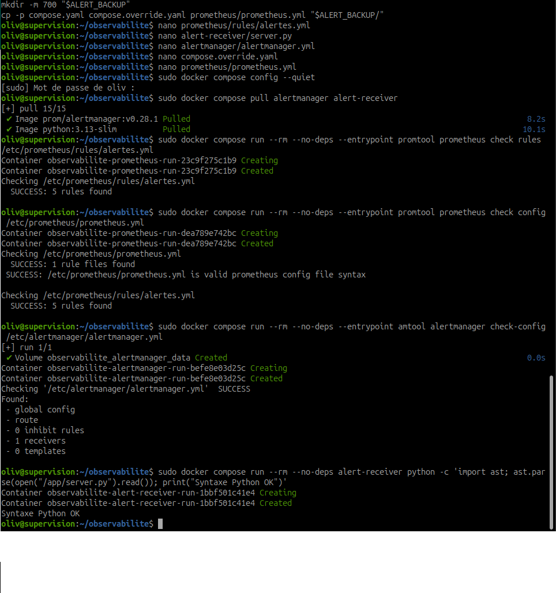

*16 septembre 2026, 13:56:07 — Les vérifications affichent SUCCESS, cinq règles et « Syntaxe Python OK ». Elles attestent la validation des fichiers, pas la réception des notifications.*

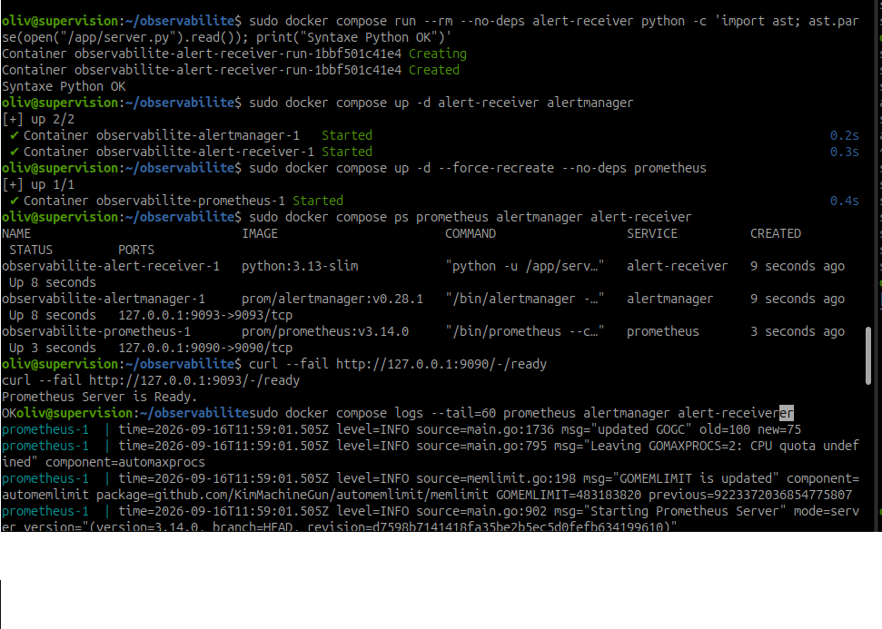

*13:59:33 — Prometheus, Alertmanager et alert-receiver sont Up ; les sondes de disponibilité répondent « Prometheus Server is Ready. » et « OK ».*

## 4. Ouvrir les interfaces et suivre les notifications

Sur le **laptop Ubuntu**, ouvrir un terminal dédié à ce tunnel et le laisser ouvert :

```bash
ssh -N -o ExitOnForwardFailure=yes -L 9093:127.0.0.1:9093 oliv@192.168.122.80
```

Ouvrir **[Alertmanager](http://127.0.0.1:9093)** dans le navigateur du laptop. Garder le tunnel précédent pour **[Prometheus — Alerts](http://127.0.0.1:9090/alerts)** et Grafana. Si le port 9093 est déjà transféré, réutiliser ce tunnel. Les règles inactives sont visibles côté Prometheus ; Alertmanager reçoit les alertes déclenchées.

Sur **supervision**, dans un autre terminal :

```bash
cd ~/observabilite
sudo docker compose logs -f --since=5m alert-receiver
```

À la réception, chercher les lignes JSON contenant `"status": "firing"`, puis `"status": "resolved"`. Contrôler `alertname`, `severity`, `endpoint`, `instance`, `summary`, `description` et `action`. `received_at` est l’heure de réception UTC ; les heures affichées dans le navigateur peuvent être en heure locale. Ctrl+C arrête seulement le suivi des logs.

### Captures — État avant le test

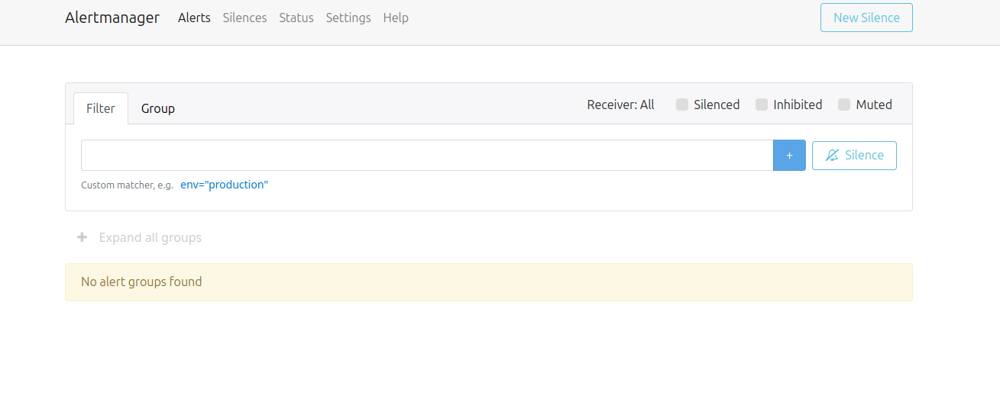

*14:02:01 — Alertmanager affiche « No alert groups found » avant le test.*

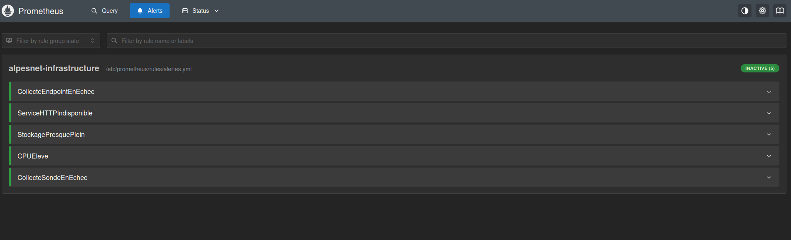

*14:03:40 — Le groupe alpesnet-infrastructure contient les cinq règles, toutes Inactive. Cet état initial est cohérent avec l’absence d’alerte dans Alertmanager.*

## 5. Test 1 — Charge CPU sur Debian

**État normal :** cible Debian `up=1`, CPU récent inférieur au seuil, règle `CPUEleve` inactive. Ouvrir le panneau CPU Debian dans Grafana et la page Alerts de Prometheus.

Sur **l’endpoint Debian `192.168.122.158`**, pas sur supervision ni sur le laptop :

```bash
sudo apt update
sudo apt install stress-ng
stress-ng --cpu "$(nproc)" --cpu-load 100 --timeout 5m --metrics-brief
```

La commande sollicite tous les vCPU et s’arrête automatiquement après 5 min ; Ctrl+C permet un arrêt anticipé. Relever l’heure de début.

Dans **Grafana → Explore → Prometheus → Code**, pour observer la valeur même sous le seuil :

```promql
100 * (1 - avg by (instance, job, endpoint) (
  rate(node_cpu_seconds_total{job="linux",mode="idle"}[2m])
))
```

| Étape | Résultat attendu, à prouver |
| --- | --- |
| Montée en charge | Valeur moyenne > 80 % ; `CPUEleve` passe en `pending` |
| Condition maintenue 2 min | `firing`, labels `endpoint=debian`, `severity=warning` |
| Notification | Présence dans Alertmanager et ligne `firing` dans le récepteur |
| Fin du stress | CPU redescend progressivement ; laisser passer la fenêtre de calcul |
| Rétablissement | Règle inactive, notification `resolved`, `up=1` et CPU au niveau habituel |

Le calcul sur 2 min et `for: 2m` sont distincts. Cinq minutes donnent normalement le temps de déclencher ; si la moyenne ne dépasse pas 80 % assez longtemps, analyser la courbe et la collecte avant de conclure à une erreur. Relever les temps réels, pas un délai théorique inventé. [Options stress-ng](https://manpages.debian.org/trixie/stress-ng/stress-ng.1.en.html)

### Captures — Test CPU réalisé le 16 septembre 2026

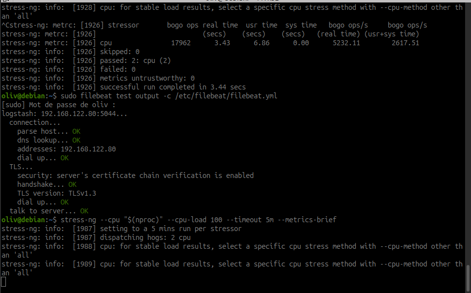

*14:07:51 — Le terminal montre le lancement de stress-ng à 100 % sur les deux vCPU, avec une limite de cinq minutes. Il montre aussi un test de connexion Filebeat vers Logstash réussi ; ce contrôle ne prouve pas la réception d’une notification Alertmanager.*

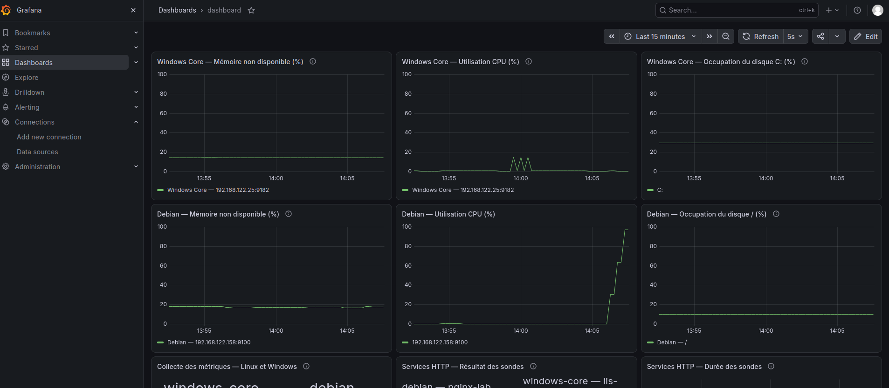

*14:07:40 — La courbe CPU Debian monte près de 100 %, tandis que les autres panneaux fournissent le contexte de supervision. Cette mesure seule ne prouve pas le déclenchement de l’alerte.*

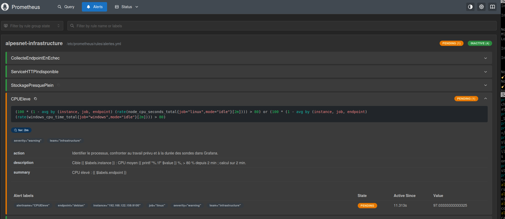

*14:07:32 — CPUEleve est Pending, avec endpoint=debian et severity=warning. La valeur est d’environ 97,03 % ; le délai for: 2m est visible. Les heures correspondent aux prises de capture, pas nécessairement au début des actions.*

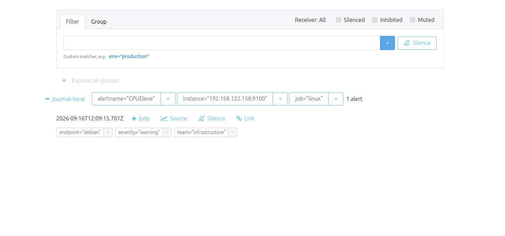

*14:09:37 — Alertmanager affiche CPUEleve, endpoint=debian, severity=warning et le récepteur journal-local. L’alerte a donc atteint Alertmanager ; cette vue ne prouve pas que le webhook a reçu la notification. L’horodatage interne est en UTC.*

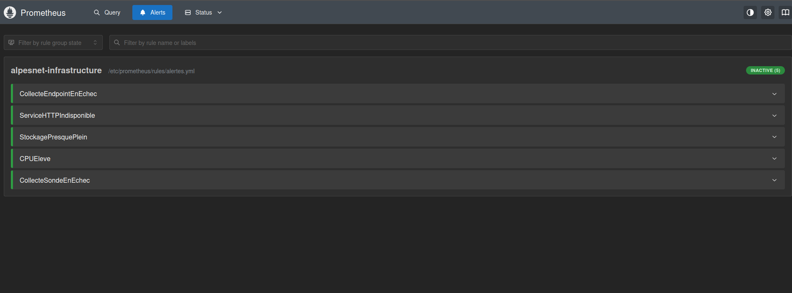

*14:13:55 — Les cinq règles sont Inactive, dont CPUEleve. Cette capture atteste le retour de la règle à l’état inactif ; la valeur CPU est corroborée par la vue Grafana de 14:19:43 intégrée au test IIS, qui affiche aussi la collecte endpoint Debian à 1.*

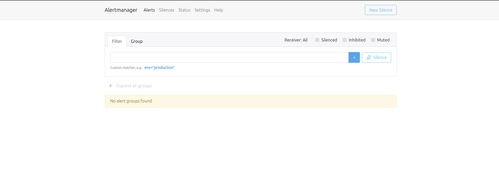

*14:14:01 — Alertmanager affiche de nouveau « No alert groups found ». Associée à la capture précédente, cette vue documente la disparition de l’alerte après le test, sans attester la réception de resolved dans le récepteur.*

## 6. Test 2 — Indisponibilité du site IIS sur Windows Core

Dans **PowerShell administrateur sur Windows Core `192.168.122.25`**, vérifier l’état nominal :

```powershell
Import-Module WebAdministration
Get-Website -Name 'AlpesNet-Sonde'
Invoke-WebRequest -UseBasicParsing -Uri 'http://127.0.0.1:8080/health.txt' |
  Select-Object StatusCode, Content
```

Attendu : site `Started`, réponse 200 et contenu attendu. Vérifier dans Prometheus :

```promql
probe_success{job="sonde_windows_http"}
```

Attendu : **1**, avec `up{job="sonde_windows_http"}=1`. Puis arrêter uniquement le site de test :

```powershell
Stop-Website -Name 'AlpesNet-Sonde'
Get-Website -Name 'AlpesNet-Sonde'
```

Attendre la transition `pending` puis `firing` après 1 min de condition persistante et la notification. Selon la réponse IIS, la sonde peut échouer par statut HTTP ou contenu incorrect ; un timeout n’est pas obligatoire.

Vérifier `probe_success=0` mais **`up=1`** pour la sonde : Prometheus arrive toujours à récupérer le résultat Blackbox. L’exporter Windows peut également rester UP. L’alerte attendue est `ServiceHTTPIndisponible`, `severity=critical`, `endpoint=windows-core`, `service=iis-lab`, avec l’URL du site dans `instance`.

Après avoir conservé la preuve `firing`, rétablir le site, **y compris si l’alerte n’est pas apparue** :

```powershell
Start-Website -Name 'AlpesNet-Sonde'
Get-Website -Name 'AlpesNet-Sonde'
Invoke-WebRequest -UseBasicParsing -Uri 'http://127.0.0.1:8080/health.txt' |
  Select-Object StatusCode, Content
```

Attendu : 200, `probe_success=1`, règle inactive, alerte retirée des alertes actives d’Alertmanager et notification `resolved`. La disparition seule ne suffit pas : contrôler aussi les données et la réponse du service.

Pour approfondir, utiliser le dashboard Kibana avec `fields.lab_source: "windows"` et la plage horaire du test. Relever les événements effectivement collectés ; l’arrêt d’un site IIS ne garantit pas à lui seul un événement dans les canaux Winlogbeat actuellement sélectionnés.

### Captures — Test IIS réalisé le 16 septembre 2026

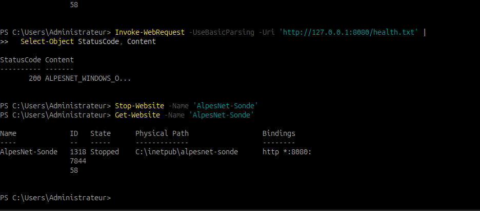

*Capture à 14:20:46 — Le terminal conserve une réponse locale 200, puis Stop-Website et Get-Website affichant le site Stopped. Le contenu HTTP est tronqué à l’écran. L’heure de capture n’est pas l’heure d’exécution des commandes ; aucun redémarrage du site n’est visible.*

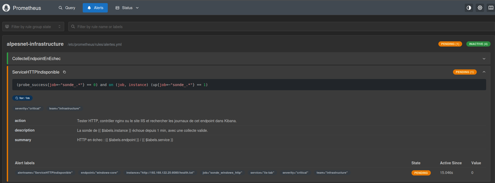

*14:19:34 — La règle est Pending avec for: 1m, endpoint=windows-core, service=iis-lab et severity=critical. Son expression associe probe_success=0 à up=1 pour le job de sonde : l’échec HTTP est détecté avec une collecte de sonde valide.*

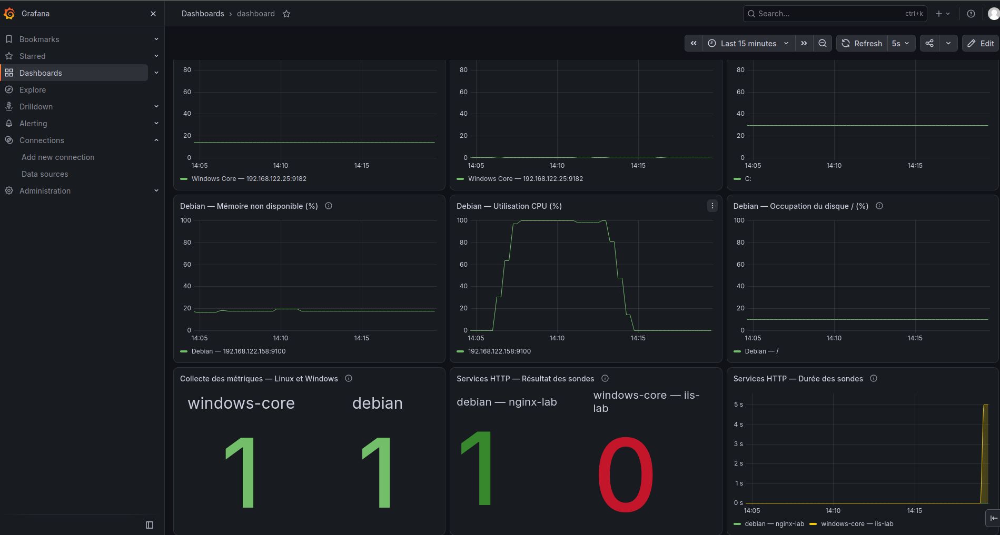

*14:19:43 — La sonde HTTP IIS vaut 0 tandis que la sonde Nginx vaut 1. Les panneaux de collecte des endpoints Windows et Debian valent 1 ; ce sont des contrôles distincts de la collecte des sondes. La durée de la sonde IIS atteint environ 5 s, sans établir à elle seule la cause exacte. Le CPU Debian est revenu près de zéro après le plateau du test précédent.*

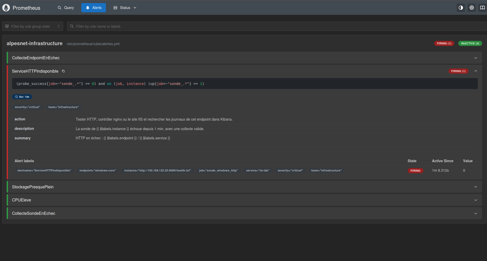

*14:20:29 — ServiceHTTPIndisponible est Firing, avec la cible HTTP Windows Core, le service iis-lab et la criticité critical. Les quatre autres règles sont Inactive.*

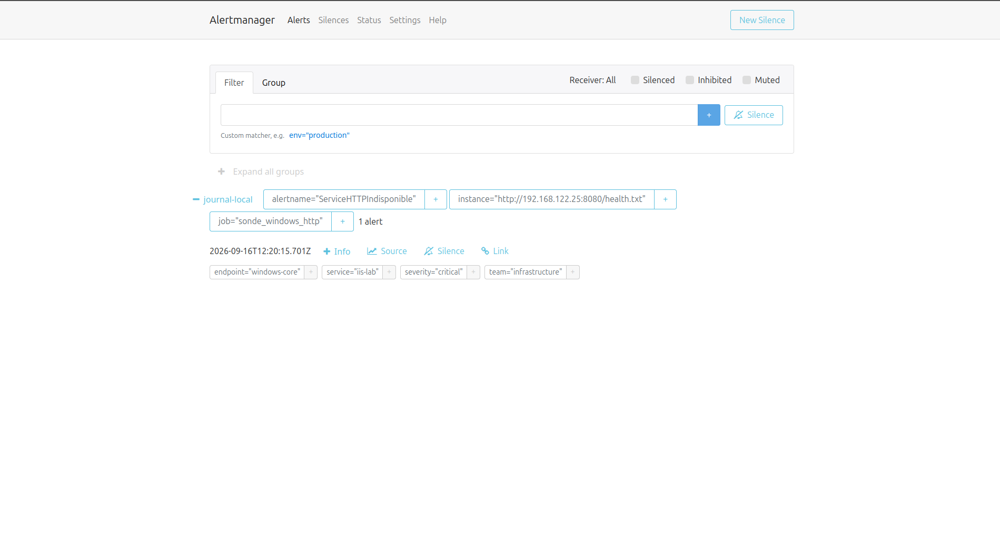

*14:20:36 — Alertmanager affiche ServiceHTTPIndisponible pour windows-core / iis-lab, avec severity=critical et le récepteur journal-local. L’horodatage interne est en UTC. Cette présence atteste la transmission vers Alertmanager, pas la livraison au webhook.*

### Captures — Retour au nominal du site IIS

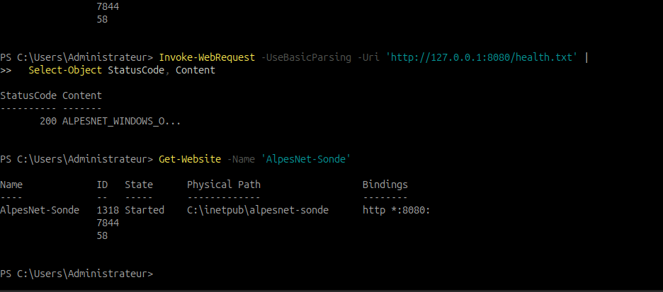

*14:22:04 — Get-Website affiche AlpesNet-Sonde Started et la requête locale retourne HTTP 200. Le contenu est tronqué dans le terminal ; la commande de démarrage n’est pas visible, mais son résultat est constaté.*

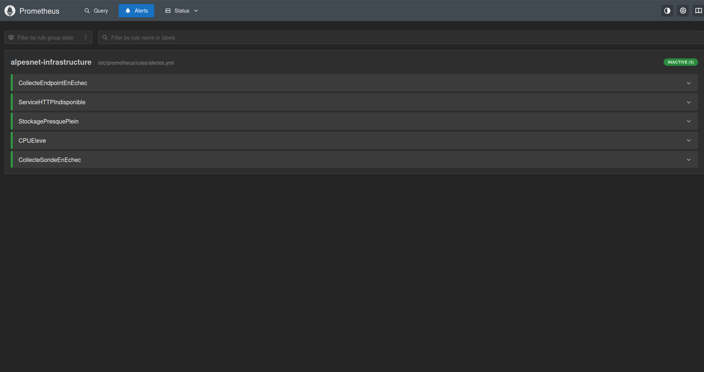

*14:22:19 — Les cinq règles sont Inactive, dont ServiceHTTPIndisponible.*

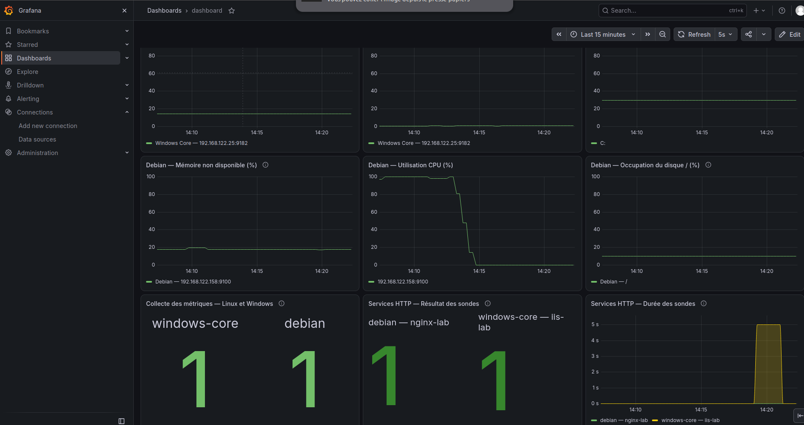

*14:22:22 — Grafana affiche les deux sondes HTTP à 1 et la collecte des endpoints à 1. La durée de la sonde IIS redescend après le plateau autour de 5 s. Cette vue confirme la reprise du contrôle distant, en complément de la réponse locale 200.*

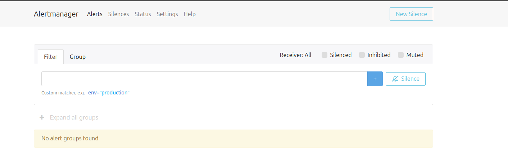

*14:22:42 — Alertmanager affiche « No alert groups found ». L’alerte HTTP a disparu ; cette vue ne constitue pas une preuve de livraison de la notification resolved au récepteur.*

**Bilan du test IIS :** arrêt du site, déclenchement HTTP, transmission vers Alertmanager, notifications `firing` et `resolved`, puis retour au nominal sont attestés. Les horaires d’interface restent ceux des captures ; les logs du récepteur apportent leurs propres horodatages UTC. La stabilité sur une période prolongée reste à observer.


*Le récepteur enregistre `firing` à 12:20:25 UTC et `resolved` à 12:21:25 UTC pour Windows Core / IIS. Les deux POST `/alerts` répondent HTTP 200, ce qui atteste la livraison au canal local configuré.*

## 7. Vérifier l’exploitabilité et dépanner

| Observation | Contrôle à effectuer |
| --- | --- |
| Pas de règle dans Prometheus | Montage `rules`, section `rule_files`, validation `promtool`, recréation du conteneur |
| Inactive malgré le stress | Valeur CPU sans `>80`, jobs/labels, durée du dépassement, collecte ; `for` ne se teste pas avec une simple capture instantanée |
| Règle `pending` | Attendre la persistance prévue ; une condition qui disparaît remet l’attente à zéro |
| `firing` sans alerte dans Alertmanager | API `alertmanagers`, DNS du service, logs Prometheus, section `alerting` |
| Alerte visible mais aucune notification | Attendre `group_wait`, vérifier silences actifs, route, logs Alertmanager/récepteur |
| Notification de résolution absente | Vérifier `send_resolved`, attendre la mise à jour du groupe, confirmer qu’un `firing` avait été reçu |
| Alerte disparue, service toujours indisponible | Vérifier données absentes, collecte et configuration ; ne pas déclarer la panne résolue |
| CPU/stockage élevés mais attendus | Revoir seuil/durée et impact ; documenter une maintenance si nécessaire |

```bash
sudo docker compose logs --since=10m prometheus alertmanager alert-receiver
```

Ne pas remplir volontairement le disque pour tester la règle de stockage. Les deux essais ci-dessus répondent à la mise en situation ; les règles de collecte et de stockage restent **non testées en panne** tant qu’une preuve dédiée n’est pas produite.

Pendant une maintenance planifiée, créer au besoin un **silence borné** dans Alertmanager avec les labels concernés, un auteur et un motif, puis vérifier son expiration. Un silence empêche la notification, pas l’évaluation de la règle. Ne pas laisser un silence actif pendant les tests. Le redémarrage du lab ne prouve pas que tous les services sont prêts ; contrôler leur santé. La supervision ne peut pas notifier son propre arrêt lorsque toute la VM est éteinte.

## 8. Dossier de déploiement et preuves

Conserver les fichiers, leur emplacement, les seuils et durées, le destinataire/canal, les accès par tunnel et ce relevé **à compléter** :

| Scénario | Heure normale / anomalie | Heure pending / firing | Criticité et élément | Réception firing | Rétablissement / resolved | Conclusion et capture |
| --- | --- | --- | --- | --- | --- | --- |
| CPU Debian | Règles inactives à 14:03:40 ; charge visible à 14:07:40 | Pending observé à 14:07:32 ; alerte dans Alertmanager à 14:09:37 | `warning`, Debian | Journal du récepteur à fournir | Règles inactives à 14:13:55 ; Alertmanager vide à 14:14:01 ; notification `resolved` à vérifier | Captures du test 1 et courbe de 14:19:43 : CPU revenu près de zéro, collecte endpoint à 1 ; notifications à compléter |
| Site IIS | HTTP local 200 puis site Stopped visibles dans le terminal ; sonde à 0 à 14:19:43 | Pending à 14:19:34 ; Firing à 14:20:29 | `critical`, Windows Core / IIS | `firing` reçu à 12:20:25 UTC, POST HTTP 200 | `resolved` reçu à 12:21:25 UTC ; Started, HTTP 200, sonde à 1 et Alertmanager vide ensuite | Cycle complet et canal local attestés |

Les heures du tableau sont celles des captures du 16 septembre 2026, pas des mesures exactes des transitions.

Pour chaque essai, garder la courbe ou la sonde, l’alerte développée avec labels et annotations, la notification `firing`, puis la valeur nominale et la notification `resolved`. Sauvegarder les logs utiles avant leur rotation :

```bash
cd ~/observabilite
mkdir -p preuves-alertes
sudo docker compose logs --no-color --since=30m alert-receiver > "preuves-alertes/notifications-$(date +%Y%m%d-%H%M%S).log"
```

## Questions de fin d’étape

| Question | Vérification et réponse attendue |
| --- | --- |
| L’alerte arrive-t-elle au moment attendu ? | Comparer les heures avec collecte, lissage éventuel, évaluation, `for` et délais de notification. |
| Identifie-t-on rapidement le problème ? | Nom explicite, endpoint, cible/service, valeur ou état, durée, responsable et première action sont visibles. |
| La criticité est-elle cohérente ? | Justifier par l’impact : CPU soutenu à analyser ; service attendu indisponible à traiter en priorité. |
| L’alerte disparaît-elle correctement ? | Prouver condition levée, données toujours présentes, service rétabli et réception `resolved`. |
| Peut-elle fonctionner techniquement et rester peu exploitable ? | Oui : intitulé vague, mauvais destinataire, seuil bruyant ou absence de procédure peuvent rendre un déclenchement inutile. |

## Point de contrôle

- [ ] Les règles sont chargées, évaluées sans erreur et leurs sources sont présentes.
- [x] Au moins deux situations ont été provoquées puis rétablies : CPU Debian et site IIS, captures du 16 septembre.
- [x] Le déclenchement est démontré, avec l’identification de l’élément concerné : CPU Debian et HTTP Windows Core.
- [x] Le niveau de criticité et les informations fournies sont explicites : CPU `warning`, HTTP `critical`, cibles identifiées.
- [x] La réception locale des notifications est démontrée pour le test IIS.
- [x] Le retour au nominal et la notification de résolution sont démontrés pour le test IIS.
- [ ] Le dossier contient configurations, heures, résultats, difficultés et corrections.

[Suite — Construire la procédure de réponse, livrable L3](construire-procedure-reponse.md) · [Seuils et criticité](definir-seuils-criticite.md) · [Sommaire de l’itération](index.md)
