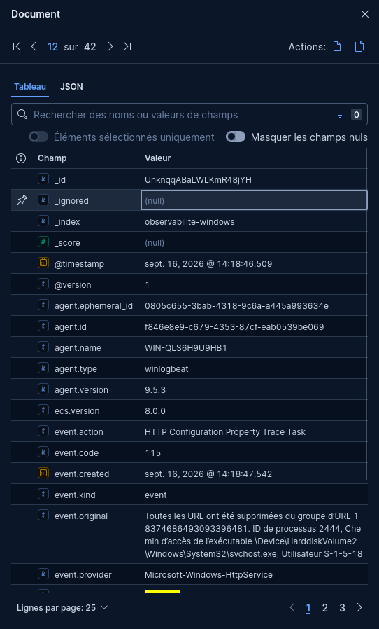
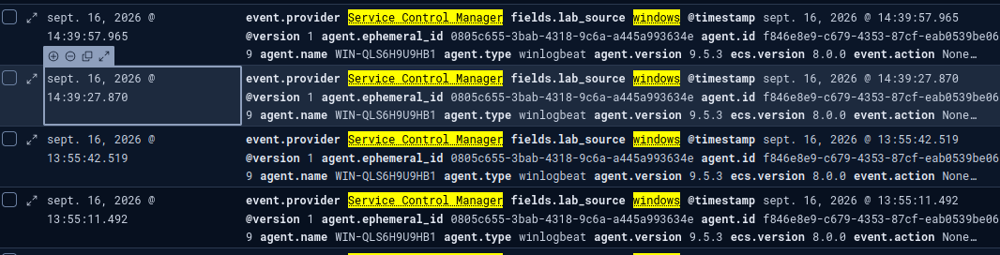
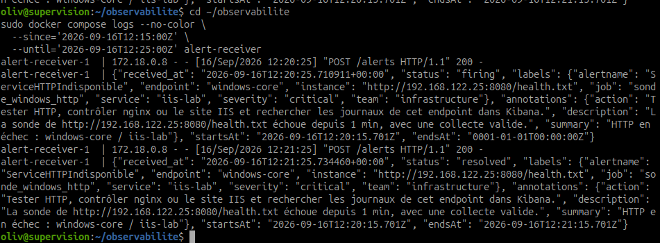

# Corréler les métriques, les sondes et les journaux

## Objectif et travail demandé

Reconstituer la chronologie de l’alerte **`ServiceHTTPIndisponible` sur Windows Core / IIS** en rapprochant les métriques, les sondes, les journaux disponibles, les dashboards et les contrôles locaux. L’objectif est d’expliquer ce qui s’est produit avant, pendant et après l’incident, tout en signalant les informations absentes.

Cette feuille s’appuie sur l’[alerte analysée](partir-alerte-rechercher-situation.md), les [hypothèses vérifiées](formuler-verifier-hypotheses.md) et les [captures du test IIS](configurer-tester-alertes.md#captures-test-iis-realise-le-16-septembre-2026).

!!! note "État des preuves"
    Les captures documentent maintenant Prometheus, Grafana, Alertmanager, PowerShell, Kibana et le journal du webhook. Kibana montre un événement `Microsoft-Windows-HttpService` à 14:18:46.509 relatif à la suppression des URL d’un groupe ; cet événement est compatible avec l’arrêt HTTP observé, sans identifier seul la commande ou son auteur. Le webhook confirme la réception de `firing` puis `resolved`.

## 1. Préparer la corrélation

Utiliser une plage absolue commune : **16 septembre 2026, 14:15–14:25 heure de Paris**, soit **12:15–12:25 UTC**. Vérifier le fuseau de chaque interface avant de comparer les heures.

| Source | Repère temporel utilisé | Précaution |
| --- | --- | --- |
| Prometheus / Grafana | Heure affichée par le navigateur | Conserver la résolution et la plage du graphique |
| Alertmanager | `startsAt` en UTC et heure de capture locale | `startsAt` n’est ni l’heure d’arrêt du site ni celle de livraison au webhook |
| PowerShell | État et commandes visibles dans la capture | La capture ne montre pas l’heure d’exécution de chaque commande |
| Kibana | `@timestamp`, éventuellement `event.ingested` | Vérifier fuseau, retard d’ingestion et canaux réellement collectés |
| Captures | Heure incluse dans le nom du fichier | Elle date la capture, pas forcément l’action visible |

## 2. Chronologie corrélée

| Heure | Métriques | Sondes | Journaux / contrôle local | Observation |
| --- | --- | --- | --- | --- |
| Avant 14:19:34, heure exacte inconnue | Collecte endpoint Windows visible à 1 sur la période | La condition HTTP commence nécessairement avant l’état `pending`, mais son premier échantillon n’est pas capturé | PowerShell conserve une réponse HTTP 200 antérieure puis `Stop-Website` et l’état `Stopped` ; aucune heure de commande affichée | Le site fonctionnait, puis il a été arrêté volontairement dans le cadre du test |
| 14:18:46.509 | Collecte endpoint Windows toujours visible sur la période | — | Kibana : `Microsoft-Windows-HttpService`, code 115, suppression des URL d’un groupe HTTP | Événement centralisé antérieur au `pending`, cohérent avec le retrait de l’écoute HTTP ; il ne suffit pas seul à identifier la commande |
| 14:19:34 | Les autres règles sont inactives | `ServiceHTTPIndisponible` est `pending`, valeur 0, avec `for: 1m` | Événement HttpService disponible en amont | Prometheus détecte l’échec HTTP avec une collecte de sonde valide et attend la persistance |
| 14:19:43 | Collectes Windows et Debian à 1 ; pas de hausse manifeste des ressources Windows dans la vue | Sonde IIS à 0, sonde Nginx à 1 ; durée IIS proche de 5 s | La recherche `Service Control Manager` montre des événements visibles à 13:55 et 14:39, hors de la fenêtre précise de l’incident | Le défaut est ciblé sur le contrôle HTTP IIS ; aucun événement SCM visible ne doit être attribué à cette séquence |
| 14:20:15.701 UTC affiché dans Alertmanager, soit 14:20:15.701 Paris | — | Condition HTTP toujours active | — | `startsAt` d’Alertmanager fournit un repère interne, sans dater exactement l’arrêt du site |
| 14:20:25.710911 | — | Alerte active | `alert-receiver` enregistre `status=firing` et répond HTTP 200 au POST d’Alertmanager | La notification `firing` est effectivement livrée au webhook |
| 14:20:29 | Quatre autres règles inactives | `ServiceHTTPIndisponible` est `firing` dans l’interface | Notification `firing` déjà horodatée dans le récepteur | La condition a persisté assez longtemps pour déclencher l’alerte critique |
| 14:20:36 | — | Alerte toujours active | Alertmanager affiche le groupe associé à `journal-local` | L’état visible dans Alertmanager est cohérent avec la notification reçue |
| Capture 14:20:46 | — | — | PowerShell montre le site `Stopped` après `Stop-Website` | L’état local confirme la cause connue du test, mais la capture tardive ne fixe pas l’heure de l’arrêt |
| 14:21:25.734460 | — | La condition est résolue selon la notification | `alert-receiver` enregistre `status=resolved` et répond HTTP 200 | Alertmanager a transmis la résolution au webhook ; l’heure précède les captures de contrôle finales |
| Capture 14:22:04 | — | La reprise distante n’est pas encore montrée dans cette capture | PowerShell montre le site `Started` et une réponse HTTP locale 200 | Le service IIS répond à nouveau localement ; la commande de démarrage elle-même n’est pas visible |
| 14:22:19 | Les cinq règles sont inactives | La condition HTTP n’est plus active | Aucun autre événement pertinent n’est documenté à cet instant | Prometheus constate la fin de la condition |
| 14:22:22 | Collectes Windows et Debian à 1 | Sondes IIS et Nginx à 1 ; durée IIS redescendue | — | La reprise est confirmée depuis le chemin de supervision, pas seulement en local |
| 14:22:42 | — | Plus d’alerte active | Alertmanager affiche « No alert groups found » | La disparition de l’alerte confirme visuellement l’état déjà transmis comme résolu |

### Ce que cette chronologie permet d’affirmer

- Le site IIS répondait avant le test, puis a été arrêté volontairement.
- Prometheus a continué à collecter le résultat de la sonde et l’endpoint Windows est resté observable.
- La sonde IIS est passée à 0 tandis que la sonde Nginx restait à 1.
- L’alerte est passée par `pending`, puis `firing`, avant d’être visible dans Alertmanager.
- Kibana a enregistré un événement HttpService compatible avec la suppression des URL du groupe HTTP avant le `pending`.
- Le webhook a reçu les notifications `firing` et `resolved`, avec une réponse HTTP 200 aux deux POST.
- Après reprise du site, la réponse locale, la sonde distante, les règles et Alertmanager sont revenus au nominal.

La chronologie ne fournit pas l’heure exacte de `Stop-Website`, de `Start-Website` ni du premier échantillon en échec. L’événement HttpService renforce la chronologie, mais ne suffit pas à attribuer l’action à un utilisateur.

## 3. Rechercher les journaux sur la même période

Dans **Kibana → Discover**, sélectionner **Journaux AlpesNet**, utiliser la plage absolue définie plus haut, puis commencer par :

```kql
fields.lab_source: "windows"
```

Afficher si disponibles : `@timestamp`, `host.name`, `event.provider`, `event.code`, `winlog.channel` et `message`. Trier du plus ancien au plus récent pour suivre la séquence.

Examiner ensuite les fournisseurs réellement présents. Ce filtre peut être testé, sans présumer qu’il contiendra l’arrêt d’un site IIS :

```kql
fields.lab_source: "windows" and event.provider: "Service Control Manager"
```

L’arrêt d’un **site IIS** n’est pas nécessairement l’arrêt d’un **service Windows**. Si aucun événement pertinent n’apparaît, noter précisément :

- la période et le fuseau utilisés ;
- le nom d’hôte filtré ;
- les canaux Windows effectivement collectés ;
- le nombre de documents trouvés ;
- la conclusion limitée : « aucun événement pertinent trouvé dans les journaux disponibles ».

Pour le journal du récepteur local, sur la VM supervision :

```bash
cd ~/observabilite
sudo docker compose logs --no-color \
  --since='2026-09-16T12:15:00Z' \
  --until='2026-09-16T12:25:00Z' alert-receiver
```

Rechercher `ServiceHTTPIndisponible`, `windows-core`, `"status": "firing"` et `"status": "resolved"`. La capture obtenue atteste les deux états ainsi que les réponses HTTP 200 du récepteur.

### Résultats conservés



*Capture à 15:15:28 — Document Kibana horodaté à 14:18:46.509 : fournisseur `Microsoft-Windows-HttpService`, code 115, action « HTTP Configuration Property Trace Task ». Le message indique que toutes les URL ont été supprimées d’un groupe d’URL. Cet événement précède l’état `pending` observé et soutient la chronologie, sans prouver seul la commande exacte ni son auteur.*



*Capture à 15:17:01 — La recherche affiche des événements `Service_Control_Manager` pour la source Windows, notamment à 13:55 et 14:39. Les lignes visibles ne correspondent pas à la fenêtre 14:15–14:25 du déclenchement IIS ; elles ne sont donc pas utilisées comme cause de cet incident.*



*Capture à 15:17:25 — `alert-receiver` reçoit `firing` à 12:20:25.710911 UTC puis `resolved` à 12:21:25.734460 UTC pour `ServiceHTTPIndisponible`, cible Windows Core / IIS. Les deux requêtes POST `/alerts` obtiennent HTTP 200. En heure de Paris ce jour-là : 14:20:25 et 14:21:25.*

| Heure | Source de journal | Événement ou absence observée | Apport au diagnostic |
| --- | --- | --- | --- |
| 14:18:46.509 | Kibana / `Microsoft-Windows-HttpService` | Code 115 : suppression des URL du groupe HTTP | Renforce le lien temporel avec l’arrêt du site, sans attribuer seul l’action |
| 13:55 et 14:39 pour les lignes visibles | Kibana / `Service_Control_Manager` | Événements visibles hors fenêtre 14:15–14:25 | Ne pas les rattacher à l’incident IIS observé |
| 14:20:25.710911 et 14:21:25.734460 | `alert-receiver` | `firing`, puis `resolved`, deux POST HTTP 200 | Prouve la livraison des notifications et leur ordre |

## 4. Réponses aux questions

| Question | Réponse pour le cas IIS |
| --- | --- |
| Quelle source a détecté le problème ? | La sonde Blackbox a produit `probe_success=0` ; Prometheus a évalué cette donnée et déclenché `ServiceHTTPIndisponible`. |
| Quelle source a permis de mieux le comprendre ? | Grafana a montré IIS à 0, Nginx à 1 et la collecte Windows à 1 : le problème était ciblé, sans perte générale de supervision visible. |
| Quelle source a permis d’identifier la cause ? | La capture PowerShell montrant `Stop-Website` puis le site `Stopped`, dans ce test contrôlé. |
| Une seule source aurait-elle suffi ? | Non. L’alerte détecte le symptôme, Grafana précise le périmètre, PowerShell établit la cause du test et le retour croisé confirme le rétablissement. |
| Les sources sont-elles cohérentes dans le temps ? | Oui dans l’ordre général arrêt → échec → alerte → reprise → retour nominal. Les heures exactes des commandes manquent, donc la durée précise ne peut pas être calculée. |
| Quelle information manque ? | Les heures exactes des commandes, le détail Blackbox pendant l’échec et une attribution explicite de l’action dans les journaux. |

## 5. Quelle succession d’événements explique la situation observée ?

Le site de test **`AlpesNet-Sonde`** répondait initialement en HTTP 200. Il a ensuite été arrêté volontairement avec `Stop-Website`. Kibana a enregistré à 14:18:46 un événement HttpService indiquant la suppression des URL d’un groupe HTTP. Windows Core et son exporter sont restés observables, mais Blackbox n’a plus obtenu le résultat HTTP attendu sur le port 8080. Prometheus a donc placé `ServiceHTTPIndisponible` en `pending`, puis en `firing` après la minute de persistance configurée. Alertmanager a reçu l’alerte critique et le webhook a enregistré `firing` à 14:20:25.

Le site a ensuite été remis en état `Started`. Le webhook a reçu `resolved` à 14:21:25. La requête locale a retrouvé HTTP 200, puis la sonde distante est revenue à 1. Prometheus a replacé les cinq règles à l’état inactif et l’alerte a disparu d’Alertmanager. Cette succession explique les observations conservées ; les heures exactes des commandes restent inconnues.

```text
IIS répond → arrêt volontaire / retrait des URL HTTP → sonde IIS = 0
→ pending → firing → webhook reçoit firing → reprise IIS
→ webhook reçoit resolved → HTTP 200 → sonde IIS = 1
→ règle inactive → alerte retirée
```

## 6. Trace à conserver dans le rapport

| Élément | Contenu |
| --- | --- |
| Point de départ | Alerte, labels, condition, criticité et première heure observée |
| Période | Plage absolue, fuseau et résolution des graphiques |
| Métriques | Valeurs avant, pendant et après, y compris collecte de l’endpoint |
| Sondes | Résultat IIS, résultat de comparaison Nginx et durée de sonde |
| Journaux | Requêtes Kibana, documents retenus ou absence documentée, logs du récepteur |
| Contrôles locaux | État IIS, réponse HTTP, commandes visibles et limites temporelles |
| Conclusion | Succession d’événements, cause retenue, hypothèses écartées et informations manquantes |

## Point de contrôle

- [x] Utilisation d’une alerte comme point de départ du diagnostic.
- [x] Consultation des métriques dans le dashboard Grafana.
- [x] Consultation d’une sonde HTTP avant, pendant et après le défaut.
- [x] Recherche d’informations dans Kibana et dans le journal du récepteur, avec captures conservées.
- [x] Corrélation temporelle des informations disponibles, avec leurs limites.
- [x] Formulation d’une hypothèse argumentée et confirmation de la cause du test.

Les six points reposent désormais sur les captures du 16 septembre 2026. Les limites restantes portent sur l’heure exacte des commandes et l’attribution de l’action dans les journaux.

[Formuler et vérifier des hypothèses](formuler-verifier-hypotheses.md) · [Analyse initiale](partir-alerte-rechercher-situation.md) · [Sommaire de l’itération](index.md)

[Suite — Identifier la cause probable](identifier-cause-probable.md)
