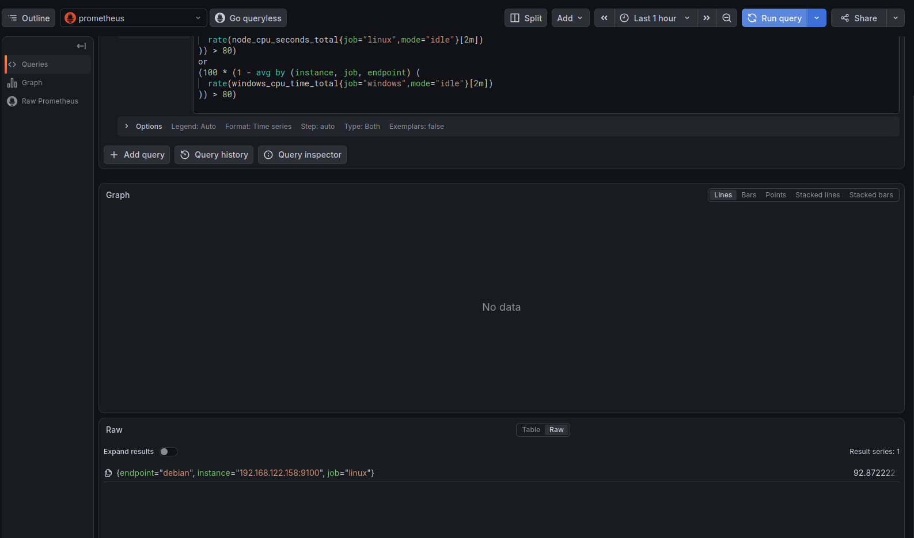

# Définir les seuils et la criticité

## Objectif et travail demandé

Pour chacune des [situations sélectionnées](identifier-situations-alerte.md), définir une condition de déclenchement, une durée, un niveau de criticité et une action attendue. Réutiliser les métriques, les sondes et les dashboards de l’itération 1.

Réfléchir à la valeur du seuil, à la durée pendant laquelle la condition doit être vraie, aux conséquences possibles et au responsable de l’intervention. Conserver les choix et leur justification dans le dossier de déploiement et de configuration.

!!! note "Seuils proposés, configuration à venir"
    Cette feuille précise les quatre alertes candidates du lab. Les valeurs ci-dessous sont des hypothèses de travail à tester, pas des standards universels. Aucun chargement de règle ni envoi de notification n’est réalisé par cette activité. Les seuils doivent être confirmés après observation de l’état nominal, du démarrage des VM et des essais contrôlés.

## 1. Tableau à compléter

| Élément supervisé | Indicateur | Condition de déclenchement | Criticité proposée | Justification | Action attendue |
| --- | --- | --- | --- | --- | --- |
| Endpoint Debian ou Windows Core attendu en service | `up` du job `linux` ou `windows` | `up == 0` pendant 2 minutes | Avertissement (`warning`) | La collecte est perdue ; 2 minutes filtrent certains échecs transitoires sans laisser longtemps la machine sans visibilité | Infrastructure : contrôler cible Prometheus, réseau, exporter et état de la VM ; escalader si un service est affecté |
| HTTP nginx ou IIS attendu disponible | `probe_success` et `up` du job de sonde | `probe_success == 0` avec `up == 1`, pendant 1 minute | Critique (`critical`) pendant la période d’exploitation du service | Le contrôle fonctionnel échoue alors que son résultat est collecté ; délai court car le service peut être inaccessible | Responsable du service : vérifier réponse HTTP, service, configuration et journaux ; rétablir puis vérifier le retour au nominal |
| Racine `/` de Debian ou volume `C:` Windows | Pourcentage d’occupation | Occupation strictement supérieure à 85 % pendant 10 minutes | Avertissement (`warning`) | Laisser une marge avant saturation et éviter une sollicitation pour un dépassement bref ; vérifier aussi les octets libres et la croissance | Système/stockage : identifier la croissance, estimer le temps restant et planifier nettoyage maîtrisé ou extension |
| CPU Debian ou Windows Core | Utilisation moyenne des vCPU, calculée sur 2 minutes | CPU strictement supérieur à 80 % pendant 2 minutes | Avertissement (`warning`) | Repérer une charge soutenue et limiter les pics transitoires ; seuil à confronter aux tâches attendues | Système/applicatif : identifier le processus, vérifier l’impact et la charge prévue ; ne pas arrêter un processus sans diagnostic |

**Pourquoi ces valeurs ?** Les états binaires ne demandent pas de seuil arbitraire : 0 désigne l’échec. Leur durée dépend du temps d’interruption tolérable. Pour le stockage, 85 % est un point de départ qui laisse 15 % de capacité libre au seuil ; cette marge ne garantit pas le même délai d’intervention sur tous les disques.

Exemple de calcul, sans mesure réelle du lab : un volume de 20 Gio occupé à 85 % conserve 3 Gio libres. À une croissance régulière de 1 Gio/heure, cette marge représente environ trois heures ; à 3 Gio/minute, elle ne représente qu’une minute. Dans ce dernier cas, attendre 10 minutes serait inadapté : abaisser le seuil ou utiliser une condition de croissance/espace restant et renforcer la criticité.

## 2. Définir la criticité à partir de l’impact

| Niveau | Quand le retenir ? | Réponse attendue |
| --- | --- | --- |
| Information / suivi | Événement attendu, variation brève sans conséquence, capacité encore suffisante | Conserver dans le dashboard ou les journaux ; pas de notification urgente |
| Avertissement — `warning` | Risque réel ou perte de visibilité demandant une action, sans interruption importante démontrée | Analyser et agir dans le délai disponible ; réévaluer si le risque augmente |
| Critique — `critical` | Service important indisponible ou saturation imminente avec impact immédiat | Intervention prioritaire par le responsable, suivi jusqu’au rétablissement |

Les valeurs `warning` et `critical` sont des conventions de labels pour ce lab ; elles ne déclenchent pas automatiquement un canal ou un délai de notification. Ce routage sera défini lors de la configuration.

Une même métrique peut correspondre à des criticités différentes selon le service et l’horaire. Une indisponibilité IIS volontaire pendant un exercice ne se traite pas comme l’interruption imprévue d’un service requis. À l’inverse, une perte de collecte peut devenir urgente si elle prive l’équipe de visibilité pendant un incident majeur.

Éviter les alertes sans action concrète et conserver un lien vers les données permettant de chercher la cause. [Principes d’alerte Prometheus](https://prometheus.io/docs/practices/alerting/)

## 3. Conditions à copier pour examiner les données

### Emplacement des champs

Dans **Grafana → Explore → source Prometheus → Code**, coller uniquement le bloc **PromQL**, puis **Run query**. Ces requêtes retournent les séries correspondant à la condition ; elles ne configurent pas l’alerte.

Pour la future règle Prometheus, conserver séparément :

| Nom de règle (`alert`) | Expression (`expr`) | Durée (`for`) | Label `severity` |
| --- | --- | --- | --- |
| `CollecteEndpointEnEchec` | Bloc A ci-dessous | `2m` | `warning` |
| `ServiceHTTPIndisponible` | Bloc B ci-dessous | `1m` | `critical` |
| `StockagePresquePlein` | Bloc C ci-dessous | `10m` | `warning` |
| `CPUEleve` | Bloc D ci-dessous | `2m` | `warning` |

Les champs `alert`, `for` et `severity` ne vont pas dans la zone PromQL. Ce tableau prépare la saisie de la configuration ultérieure ; il ne constitue pas un fichier de règles complet.

### A. Collecte d’un endpoint

```promql
up{job=~"linux|windows"} == 0
```

Une série présente avec la valeur **0** signale ici un échec. Pour une règle Prometheus, c’est la présence de la série retournée qui active la condition, pas une valeur nécessairement égale à 1. Ne pas ajouter `bool` à cette expression : il conserverait aussi des séries ne correspondant pas à l’échec.

Pour afficher les deux états au lieu de filtrer les échecs, retirer `== 0`. Vérifier qu’il existe bien une cible pour chaque endpoint attendu ; une cible supprimée ne devient pas automatiquement une série à 0.

### B. Disponibilité HTTP

```promql
(probe_success{job=~"sonde_.*"} == 0)
and on(job, instance)
(up{job=~"sonde_.*"} == 1)
```

La condition signifie « contrôle échoué, résultat correctement collecté ». Si la collecte Blackbox échoue, cette expression écarte la sonde ; il faut surveiller séparément cet échec :

```promql
up{job=~"sonde_.*"} == 0
```

Une réponse vide à la première requête ne suffit donc pas à prouver que les deux services sont disponibles. Une cible absente ou une métrique manquante doit être traitée comme une perte de visibilité, pas comme un succès.

### C. Stockage

```promql
(100 * (1 - node_filesystem_free_bytes{job="linux",mountpoint="/",fstype!="rootfs"}
/ node_filesystem_size_bytes{job="linux",mountpoint="/",fstype!="rootfs"}) > 85)
or
(100 * (1 - windows_logical_disk_free_bytes{job="windows",volume="C:"}
/ windows_logical_disk_size_bytes{job="windows",volume="C:"}) > 85)
```

Le seuil est strict : **85 % exactement ne satisfait pas `> 85`**. Les séries retournées conservent leur valeur d’occupation. Pour observer le niveau nominal, retirer les deux comparaisons `> 85`.

Le calcul reprend celui des dashboards. Sur Linux, les blocs libres et l’espace disponible à un utilisateur non privilégié diffèrent éventuellement à cause des blocs réservés : vérifier le contexte d’écriture du service avant de valider la marge retenue. L’absence de métrique disque ne doit pas être interprétée comme une occupation nulle.

### D. CPU durablement élevé — test simple sur Debian

**Seuil proposé : CPU moyen > 80 % pendant 2 minutes**, criticité `warning`. Le calcul utilise une fenêtre de 2 minutes et fait la moyenne sur les vCPU de chaque endpoint. Il reprend le principe du dashboard : part du temps CPU non inactif. Une charge élevée n’est pas à elle seule la preuve d’un incident ; vérifier durée, tâche en cours et impact sur le service.

Dans **Grafana → Explore → Prometheus → Code**, saisir :

```promql
(100 * (1 - avg by (instance, job, endpoint) (
  rate(node_cpu_seconds_total{job="linux",mode="idle"}[2m])
)) > 80)
or
(100 * (1 - avg by (instance, job, endpoint) (
  rate(windows_cpu_time_total{job="windows",mode="idle"}[2m])
)) > 80)
```

Pour la future règle : nom **`CPUEleve`**, expression ci-dessus, **`for: 2m`**, label **`severity: warning`**. L’expression conserve uniquement les endpoints dépassant le seuil. Retirer les deux comparaisons `> 80` pour afficher aussi leur niveau au repos. `rate` calcule l’évolution des compteurs avant leur agrégation. [Fonctions Prometheus](https://prometheus.io/docs/prometheus/latest/querying/functions/#rate)

**Pourquoi 80 % / 2 minutes ?** Cette valeur permet de tester une charge soutenue en conservant une marge théorique de 20 % ; le délai évite un déclenchement sur certains pics courts. Il s’agit d’un seuil pédagogique à adapter au fonctionnement normal de la machine. Une tâche de calcul attendue à 100 % peut être saine ; une application lente avec un seul cœur saturé peut au contraire nécessiter un diagnostic même si la moyenne reste inférieure à 80 %.

#### Commandes de test — uniquement sur l’endpoint Debian

Installer l’outil si nécessaire dans la VM **Debian `192.168.122.158`**, pas sur la VM supervision ni directement sur le laptop :

```bash
sudo apt update
sudo apt install stress-ng
nproc
```

Avant le test, vérifier la collecte et le niveau CPU au repos dans Grafana. Puis lancer, sans sudo :

```bash
stress-ng --cpu "$(nproc)" --cpu-load 100 --timeout 5m --metrics-brief
```

Cette commande sollicite les processeurs disponibles dans la VM pendant **cinq minutes**, puis s’arrête automatiquement. **Ctrl+C** dans le même terminal permet d’arrêter plus tôt. Le nombre de workers suit `nproc` : un seul worker pourrait ne charger qu’un quart de la capacité d’une VM à quatre vCPU et ne pas dépasser le seuil moyen. [Manuel stress-ng pour Debian trixie](https://manpages.debian.org/trixie/stress-ng/stress-ng.1.en.html)

Le laptop partage ses ressources entre les VM : garder la supervision accessible et interrompre le test si elle devient difficile à utiliser. Ne pas ajouter de stress mémoire ou disque à cet essai CPU.

| Étape | Observation attendue |
| --- | --- |
| Avant la charge | Niveau de référence relevé, métriques récentes et collecte réussie |
| Début de la charge | Hausse progressive du CPU calculé sur 2 minutes |
| Seuil franchi | Condition > 80 % présente pour Debian ; une fois la règle configurée, entrée en attente |
| Condition maintenue 2 minutes | Une fois la règle configurée, passage en déclenchement ; notification seulement si son routage fonctionne |
| Arrêt après 5 minutes ou Ctrl+C | Baisse progressive du CPU, puis disparition de la condition après le lissage |
| Après le test | Retour au niveau habituel, service disponible et collecte toujours active |

Les **2 minutes de calcul** et les **2 minutes de persistance** sont deux mécanismes distincts : ne pas attendre une alerte deux minutes exactement après le lancement. Cinq minutes de charge donnent une marge pour la montée du calcul et les évaluations, sans garantir un délai si les scrapes échouent. La résolution dépend également de la fenêtre de calcul ; elle n’est pas forcément instantanée à l’arrêt de `stress-ng`.

Le dépassement de seuil est désormais illustré ci-dessous ; **aucune alerte n’est attestée tant que la règle, son déclenchement et sa notification ne sont pas vérifiés**. Conserver ensuite les heures de début/fin, le maximum observé, les transitions de règle, la réception éventuelle et le retour au nominal comme preuves du test.


### Preuve du dépassement CPU — 16 septembre 2026



La capture affiche une série pour `endpoint="debian"`, `instance="192.168.122.158:9100"`, `job="linux"`, à environ **92,87 %** dans **Raw**. Elle prouve que la requête filtrée trouve un dépassement de 80 %. Le graphe affiche « No data » : cette image ne démontre ni une durée de 2 minutes au-dessus du seuil ni une notification. La [feuille de configuration et de test](configurer-tester-alertes.md) permet de vérifier ces étapes.

## 4. Choisir une durée et limiter les variations temporaires

Le paramètre `for` de Prometheus exige que la condition demeure active pour une même série à chaque évaluation pendant la durée prévue. Elle est d’abord en attente (*pending*), puis déclenchée (*firing*). Sans maintien explicite supplémentaire, la règle cesse d’être active lorsque l’expression ne retourne plus la série. [Fonctionnement des règles d’alerte](https://prometheus.io/docs/prometheus/latest/configuration/alerting_rules/)

| Notion | Ce qu’elle règle |
| --- | --- |
| Intervalle de collecte | Fréquence à laquelle Prometheus récupère les métriques |
| Intervalle d’évaluation | Fréquence à laquelle la règle examine les données |
| Durée `for` | Persistance nécessaire avant déclenchement |
| Période du dashboard | Étendue des données affichées ; ne configure pas `for` |
| Temporisation de notification | Délai supplémentaire éventuel avant l’envoi du message |

**Exemple pédagogique :** avec une évaluation toutes les 30 secondes, si la condition est constatée pour la première fois à 10:00:00 et reste vraie, `for: 2m` permet un déclenchement à 10:02:00. Le début réel du problème peut être antérieur à la première observation ; le délai total inclut collecte, évaluation et acheminement de la notification. Cet intervalle d’évaluation est un exemple à vérifier dans la configuration du lab.

Un retour à la normale avant l’expiration de `for` évite ce déclenchement. Pour une métrique qui oscille fréquemment autour du seuil, examiner la tendance et ajuster seuil/durée. Une résolution avec un seuil distinct (*hystérésis*) peut être envisagée, mais elle demande une configuration explicite : ne pas prétendre qu’un déclenchement à 85 % se résout à 80 % si la règle ne le prévoit pas.

Pour les conditions simples proposées ici, le retour attendu est `up=1`, `probe_success=1` avec collecte valide, ou occupation ≤ 85 %. Vérifier la présence des données et le service lui-même avant de déclarer un incident résolu.

## 5. Tenir compte des arrêts nocturnes du laboratoire

Le laptop est arrêté le soir et les VM redémarrent le matin. Le périmètre de disponibilité attendu correspond donc aux périodes où le lab doit être exploitable, pas à un service garanti 24 h/24.

- Documenter l’arrêt planifié et une fenêtre de reprise à durée bornée, à déterminer après mesure du démarrage habituel.
- Distinguer le démarrage de la VM supervision de la disponibilité effective d’Elasticsearch, Logstash et des collecteurs.
- Prévoir le traitement des notifications pendant cette fenêtre lors de leur configuration ; cette note ne crée pas une exclusion automatique.
- Après la reprise, vérifier les métriques et produire un événement récent par endpoint. Une indisponibilité persistante doit redevenir visible.
- Ne pas allonger tous les `for` à plusieurs heures pour masquer un démarrage défaillant.

La temporisation `for` n’est pas une période de grâce globale de démarrage. Quand la VM de supervision est elle-même éteinte, elle ne peut pas évaluer les règles ni prévenir de son propre arrêt : le lab ne dispose pas, par cette seule architecture, d’une supervision externe indépendante.

L’[épisode Logstash du 16 septembre](identifier-situations-alerte.md#cas-observe-le-16-septembre-refus-de-connexion-puis-reprise-des-journaux) justifie d’examiner la santé de la chaîne de logs. La cause initiale du refus de connexion n’étant pas confirmée, ne pas attribuer l’incident à l’ordre de démarrage ni inventer un seuil de silence universel. Un journal Windows peu actif et une source Linux très régulière n’ont pas le même rythme attendu.

## 6. Vérifier et justifier les choix

Pour chaque condition, relever une période nominale, une variation temporaire et un scénario d’échec contrôlé. La configuration et les essais de règles viendront ensuite ; ne pas saturer les disques pour remplir cette fiche.

| Test à prévoir | Résultat attendu |
| --- | --- |
| État nominal, sources présentes | Aucune des conditions d’échec n’est active |
| Variation plus courte que `for` | Pas de déclenchement de la règle à l’issue de cet épisode |
| Condition maintenue au-delà de `for` | Déclenchement pour l’endpoint/service/volume concerné |
| Retour au nominal | Condition levée et vérification du service ou de la capacité |
| Données absentes | État de collecte examiné, aucune conclusion automatique de succès |
| Arrêt et reprise planifiés | Notifications traitées selon la fenêtre définie, contrôle après reprise |

Compléter le dossier avec ce relevé ; garder la version initiale si un seuil change pour expliquer l’amélioration :

| Situation | Période observée et état nominal | Seuil/durée retenus | Motif et conséquence d’un mauvais réglage | Responsable/action | Résultat des essais et preuve |
| --- | --- | --- | --- | --- | --- |
| Collecte endpoint | À relever | 0 pendant 2 min, proposition | À justifier | Infrastructure | Non testé à ce stade |
| Service HTTP | À relever | 0 avec collecte valide pendant 1 min, proposition | À justifier | Responsable du service | Non testé à ce stade |
| Stockage | À relever, avec espace libre et croissance | > 85 % pendant 10 min, proposition | À justifier | Système/stockage | Non testé à ce stade |
| CPU | Capture du 16 septembre : environ 92,87 % | > 80 % pendant 2 min, calcul sur 2 min | Durée et impact à confirmer | Système/applicatif | Dépassement observé ; règle et notification non attestées |

## Questions de fin d’étape

| Question | Réponse attendue |
| --- | --- |
| Pourquoi ce seuil ? | Il représente une situation nécessitant une action et laisse un délai utile ; le justifier par les observations et l’impact attendu. Les valeurs de cette fiche restent à confirmer. |
| Que se passe-t-il si le seuil est trop bas ? | Pour une occupation ou une charge, trop de déclenchements peuvent survenir en régime normal ; cela mobilise inutilement l’équipe. |
| Et s’il est trop élevé ? | L’alerte peut arriver après la dégradation, sans laisser assez de temps pour intervenir. |
| Faut-il alerter au premier dépassement ? | Pas systématiquement : une courte variation peut être normale. Une situation immédiatement dangereuse peut toutefois justifier une détection sans attente supplémentaire. |
| Comment éviter les variations temporaires ? | Définir une durée adaptée, vérifier plusieurs évaluations, comparer au comportement nominal et traiter les maintenances explicitement. |
| Comment distinguer surveillance et intervention ? | Examiner impact, durée, vitesse d’aggravation et action possible. Observer une variation sans conséquence ; intervenir lorsqu’un service est affecté ou qu’un risque exige une action dans un délai limité. |

## Point de contrôle

- [ ] Les quatre situations disposent d’une condition précise et d’une durée.
- [ ] La criticité est justifiée par les conséquences et l’urgence.
- [ ] Un responsable et une première action sont identifiés.
- [ ] Les périodes de maintenance/reprise et les données absentes sont prises en compte.
- [ ] Le choix des seuils est appuyé par des observations datées, sans inventer de mesures.
- [ ] Les conditions, leur justification et les essais à réaliser sont consignés dans le dossier.

[Retour à l’identification des situations](identifier-situations-alerte.md) · [Sommaire de l’itération](index.md)
