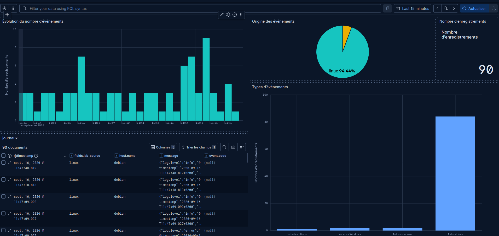

# Identifier les situations nécessitant une alerte

## Objectif et travail demandé

À partir de la plateforme et des dashboards de l’itération 1, rechercher les situations susceptibles de nécessiter l’intervention d’un administrateur. Examiner la disponibilité des endpoints, l’état des services, le CPU, la mémoire, le stockage, l’évolution des métriques et les événements présents dans les journaux.

Pour chaque situation, expliquer l’impact possible, décider s’il faut alerter et identifier qui doit agir. **Sélectionner au moins trois situations pour construire les futures alertes.**

## 1. Observer avant de décider

Ouvrir les dashboards existants, vérifier les filtres et choisir une période récente. Si seules les données historiques sont disponibles, les identifier comme telles et recontrôler la collecte avant de proposer une règle opérationnelle.

| Élément à examiner | Donnée déjà disponible | Limite d’interprétation |
| --- | --- | --- |
| Endpoint Linux/Windows | `up` des jobs `linux` et `windows` | Un scrape en échec ne prouve pas que la VM est arrêtée : exporter, réseau ou configuration peuvent être en cause |
| Service HTTP Linux/Windows | `probe_success` et état de collecte de la sonde | Distinguer échec du contrôle et impossibilité de récupérer son résultat |
| CPU | Pourcentage calculé à partir du temps CPU | Un pic bref pendant une tâche attendue peut être normal |
| Mémoire | Part de RAM non disponible | Interpréter selon l’OS, la durée, la pression mémoire et l’impact applicatif |
| Stockage | Occupation de `/` et de `C:` | Examiner aussi espace restant, vitesse de croissance et temps disponible pour intervenir |
| Évolution | Historique et durée des sondes | Comparer à une référence dans des conditions comparables |
| Journaux | `message`, `host.name`, `fields.lab_source`, fournisseur et code éventuel | Un événement isolé ou un code numérique ne donne pas à lui seul une criticité |

En préproduction, consigner les périodes d’arrêt volontaire et de maintenance : elles expliquent certains échecs sans les transformer en incidents imprévus.

## 2. Tableau à compléter à partir des observations

| Situation envisagée | Conséquence possible | Faut-il alerter ? | Pourquoi ? | Qui doit agir ? |
| --- | --- | --- | --- | --- |
| Collecte Linux ou Windows en échec durable | Perte de visibilité sur la machine | Oui, hors maintenance | L’équipe ne peut plus apprécier l’état de l’endpoint | Exploitation Infrastructure, puis responsable réseau ou système selon le diagnostic |
| Sonde HTTP en échec durable alors que sa collecte réussit | Service Web inaccessible ou réponse incorrecte | Oui | Le contrôle du service échoue ; un utilisateur peut être affecté | Exploitation puis responsable du service nginx/IIS |
| CPU élevé quelques secondes pendant une tâche prévue | Ralentissement temporaire possible | Surveiller d’abord | La hausse est attendue et peut se résorber sans action | Administrateur chargé de la tâche |
| CPU durablement élevé avec dégradation du service | Latence ou traitements retardés | Oui | La durée et l’impact justifient une investigation | Administrateur système et responsable applicatif |
| Mémoire non disponible élevée, sans autre symptôme | Risque à évaluer | Selon durée et contexte | Le pourcentage seul ne suffit pas ; examiner pression mémoire et comportement du service | Administrateur système |
| Stockage proche de la saturation ou en croissance rapide | Échec d’écriture, perte de journaux, arrêt de service | Oui, avant épuisement | Il faut du temps pour libérer ou augmenter la capacité | Administrateur système/stockage |
| Durée des sondes augmente durablement | Dégradation perceptible | Oui si écart significatif et action possible | Comparer à l’état nominal et aux exigences du service | Responsable applicatif et Infrastructure |
| Démarrage réussi d’un service ou test `AlpesNet-Lab` attendu | Information de fonctionnement | Non, en fonctionnement normal | Conserver la trace sans solliciter inutilement l’équipe | Consultation par l’exploitation |
| Erreurs répétées de démarrage d’un service utile | Service non rendu | Oui si problème actuel et non déjà traité | Le message permet d’orienter la première action | Administrateur du système concerné |

Privilégier des alertes liées à un impact et à une action identifiée. Un catalogue très volumineux de causes supposées rend les notifications difficiles à exploiter. [Principes d’alerte Prometheus](https://prometheus.io/docs/practices/alerting/)

## 3. Retenir au moins trois situations pour la suite

La sélection de travail proposée pour ce lab est la suivante. **Les durées et seuils sont des hypothèses pédagogiques à tester**, pas des standards ni des mesures déjà validées.

| Future alerte | Condition candidate | Durée proposée | Criticité proposée | Responsable et première action |
| --- | --- | --- | --- | --- |
| CollecteEndpointEnEchec | `up=0` sur un endpoint attendu | 2 minutes continues | Avertissement ; escalade selon impact et durée | Infrastructure : examiner la cible, le réseau et l’exporter |
| ServiceHTTPIndisponible | Sonde à 0 et collecte de cette sonde à 1 | 1 minute continue | Critique si le service doit être disponible à cet instant | Responsable nginx/IIS : vérifier le service, la réponse HTTP et les journaux |
| StockagePresquePlein | Occupation de `/` ou `C:` supérieure à 85 % | 10 minutes continues | Avertissement ; urgence à réévaluer selon espace libre et croissance | Système/stockage : identifier la croissance et préparer une action de capacité |
| CPUEleve | Utilisation moyenne des vCPU > 80 %, calcul sur 2 minutes | 2 minutes continues | Avertissement ; à corréler avec l’impact applicatif | Système/applicatif : identifier le processus et vérifier s’il s’agit d’une charge attendue |

Les quatre situations retenues couvrent la perte de collecte, l’indisponibilité d’un service, le stockage et la charge CPU. Le CPU est ajouté pour disposer d’un essai simple et borné avec `stress-ng`. Les seuils doivent laisser le temps d’agir sans solliciter inutilement l’équipe. Si l’exploitation du service n’est pas attendue pendant l’arrêt du lab, le traitement de cet arrêt doit être prévu.

### Où saisir les requêtes d’examen

Dans **Grafana → Explore**, sélectionner **Prometheus**, passer en mode **Code**, coller une requête à la fois et cliquer sur **Run query**. Utiliser une période où les données sont disponibles. Ces expressions examinent les conditions ; elles ne créent ni règle, ni notification.

**Situation 1 — échec de collecte d’un endpoint :**

```promql
up{job=~"linux|windows"} == 0
```

Le résultat conserve uniquement les cibles en échec, avec une valeur **0** : leur présence dans le résultat est significative. Pour voir également les cibles saines, retirer `== 0`. Une cible supprimée de la configuration ne produit pas forcément de série `up=0` : comparer au périmètre attendu.

**Situation 2 — contrôle HTTP en échec avec collecte réussie :**

```promql
(probe_success{job=~"sonde_.*"} == 0)
and on(job, instance)
(up{job=~"sonde_.*"} == 1)
```

Vérifier séparément les échecs de collecte des sondes avec :

```promql
up{job=~"sonde_.*"} == 0
```

La première expression écarte les sondes non collectées ; une réponse vide n’est donc pas une preuve générale de bonne santé. La couverture de collecte Blackbox devra être prévue dans le catalogue d’alertes.

**Situation 3 — occupation du stockage supérieure à 85 % :**

```promql
(100 * (1 - node_filesystem_free_bytes{job="linux",mountpoint="/",fstype!="rootfs"}
/ node_filesystem_size_bytes{job="linux",mountpoint="/",fstype!="rootfs"}) > 85)
or
(100 * (1 - windows_logical_disk_free_bytes{job="windows",volume="C:"}
/ windows_logical_disk_size_bytes{job="windows",volume="C:"}) > 85)
```

Cette expression reprend le calcul des dashboards et conserve les séries qui dépassent le seuil. Pour voir les occupations au repos, retirer les deux comparaisons `> 85`. Sur Linux, ce calcul porte sur les blocs libres ; l’espace disponible à un utilisateur non privilégié peut différer à cause des blocs réservés.

Ne pas remplir le disque pour réaliser cette activité d’identification. Prévoir plus tard un essai contrôlé du déclenchement, avec une méthode réversible et des limites adaptées au lab.

La durée proposée sera portée par la règle d’alerte, par exemple un paramètre `for` dans Prometheus : il impose que la condition reste présente aux évaluations successives avant le déclenchement. Ce n’est ni la période du dashboard, ni son rafraîchissement. Une règle et le mécanisme d’envoi des notifications seront configurés séparément. [Règles d’alerte Prometheus](https://prometheus.io/docs/prometheus/latest/configuration/alerting_rules/)

### Situation 4 — CPU durablement élevé

Sur Debian, examiner la condition dans **Grafana → Explore → Prometheus → Code** :

```promql
100 * (1 - avg by (instance, job, endpoint) (
  rate(node_cpu_seconds_total{job="linux",mode="idle"}[2m])
)) > 80
```

Retirer `> 80` pour voir le niveau au repos. La future règle demandera deux minutes de persistance. La [feuille des seuils](definir-seuils-criticite.md#d-cpu-durablement-eleve-test-simple-sur-debian) fournit l’expression Linux/Windows, les commandes `stress-ng` bornées à cinq minutes et les étapes de retour au nominal. Le test ne déclenchera une alerte qu’après configuration de la règle.

### Examiner aussi les journaux

Dans **Kibana → Discover → Journaux AlpesNet**, coller dans la barre **KQL** :

```kql
fields.lab_source: "windows" and event.provider: "Service Control Manager" and event.code: ("7000" or "7009")
```

Ces codes ont été observés pendant les difficultés de démarrage de Winlogbeat dans l’itération 1. Lire le message et l’heure avant de conclure : un ancien échec déjà corrigé ne justifie pas une alerte actuelle. Pour revoir cet épisode, utiliser une période absolue couvrant le 14 septembre 2026 vers 16:12, heure de Paris. Pour l’exploitation, revenir à une période récente.

## 4. Préparer une alerte exploitable

Pour chacune des quatre situations retenues, compléter cette fiche avant de configurer la règle :

| Information | À renseigner |
| --- | --- |
| Nom et périmètre | Endpoint/service/volume concerné |
| Impact | Conséquence pour l’utilisateur ou l’exploitation |
| Source | Métrique/sonde/journal, requête et labels/champs utiles |
| Condition et durée | Valeurs proposées puis justification à partir des observations |
| Criticité | Urgence et impact, pas uniquement valeur numérique |
| Responsable | Rôle puis destinataire réel à définir |
| Notification | Canal à configurer et preuve de réception à prévoir |
| Première réponse | Contrôles à réaliser et lien vers le dashboard pertinent |
| Fin de l’alerte | Condition de retour au nominal et contrôle du service |
| Cas particuliers | Maintenance, données absentes, autre alerte décrivant le même incident |

Ne pas envoyer deux notifications identiques à deux équipes sans préciser qui pilote l’action. Si un seul incident produit plusieurs symptômes, prévoir leur regroupement ou leur traitement coordonné lors de la configuration.

## Questions de fin d’étape

| Question | Réponse attendue |
| --- | --- |
| Une valeur élevée constitue-t-elle nécessairement une anomalie ? | Non. Une charge prévue peut être normale ; comparer au comportement attendu, à la durée et à l’impact. |
| Une anomalie nécessite-t-elle nécessairement une alerte ? | Non. Certaines évolutions demandent seulement une observation ou une action planifiée ; notifier si une intervention est justifiée. |
| Quelle différence entre information, anomalie et incident ? | Une information décrit un fait. Une anomalie est un écart à l’attendu. Un incident est une interruption ou une dégradation du service. Une alerte signale une condition à traiter ; elle ne prouve pas seule un incident. |
| Quelles situations nécessitent une intervention rapide ? | Un service important indisponible, une saturation imminente ou une dégradation avec impact actuel ; adapter à la criticité du service. |
| Quelles situations peuvent simplement être surveillées ? | Pic bref attendu, opération planifiée, événement informatif ou évolution sans impact nécessitant seulement un suivi. |
| Que risque-t-on avec trop d’alertes ? | Fatigue d’alerte, doublons, interruptions inutiles, perte de confiance et retard sur les incidents importants. |

## Cas observé le 16 septembre — refus de connexion puis reprise des journaux

L’utilisateur signale l’absence de nouveaux journaux depuis plus de 24 heures. Ce constat porte sur la visibilité dans Kibana ; la durée exacte d’une interruption de collecte n’a pas été mesurée.

| Étape | Élément fourni | Interprétation limitée aux preuves |
| --- | --- | --- |
| Test depuis Debian | `sudo filebeat test output -c /etc/filebeat/filebeat.yml` retourne `dial tcp 192.168.122.80:5044: connect: connection refused` | La destination TCP refuse la connexion lors du test ; ce n’est pas simplement une absence d’événements |
| État des conteneurs | `logstash` historique est `Exited (0)` ; `logstash-logs` permanent est `Up 3 hours`, sans port affiché dans la sortie Compose | Le premier est le test ponctuel terminé. Le statut Up du second ne démontre pas que son pipeline reçoit les journaux ; l’exposition réseau n’est pas établie par cette seule sortie |
| Action exécutée | `sudo docker compose up -d logstash-logs` ; Compose indique Elasticsearch Healthy et Logstash Started | Une remise en route est rapportée par Compose ; les premières lignes de log montrent seulement le démarrage de Java |
| Vérification utilisateur | Retour annoncé des journaux dans Kibana, puis capture à 11:48:28 | Des événements récents sont consultables ; la cause précise du refus initial reste non confirmée |



*Capture du 16 septembre 2026 à 11:48:28 — Vue « Last 15 minutes », 90 documents, histogramme couvrant environ 11:33–11:47. Le tableau montre notamment une entrée Linux horodatée à 11:47:48.812. Le camembert affiche Linux à 94,44 % et une seconde part ; le graphique des types comporte aussi des événements « services Windows » et « Autres Windows ».*

Cette vue constitue une preuve de présence de journaux du jour après la remise en route, contrairement aux captures historiques de la veille. Le pourcentage Linux correspond à environ 85 événements sur 90 ; confirmer les cinq autres en filtrant Windows et en lisant leurs messages. Les horodatages des événements ne donnent pas, seuls, leur heure d’ingestion : certains documents peuvent avoir été transmis après une attente dans la chaîne de collecte.

**À confirmer pour clôturer le diagnostic :** refaire le test de sortie Filebeat, retrouver un nouveau marqueur de chaque endpoint, puis vérifier la continuité sur plusieurs actualisations. Ne pas attribuer la panne à un port non publié ou à un pipeline arrêté sans avoir vérifié la configuration réseau et les journaux de démarrage. Le redémarrage apparent et la reprise ne suffisent pas à établir la cause racine.

**Situation supplémentaire à prévoir dans le catalogue :** perte de collecte des journaux. Impact : diagnostic privé d’événements récents. Responsable : équipe Infrastructure en charge de Filebeat/Winlogbeat et Logstash. Une absence de logs doit être interprétée selon l’activité attendue et complétée par un test de chaîne ; un simple seuil « aucun événement » ne convient pas à toutes les sources silencieuses.

## Dossier et validation de l’activité

Conserver le tableau complété, les observations datées, les captures utiles, les quatre fiches d’alerte et la justification des situations non retenues. Aucun résultat de test n’est présumé dans cette feuille.

- [ ] J’ai examiné endpoints, services, CPU, mémoire, stockage, évolutions et journaux.
- [ ] Je distingue panne du service, échec de collecte et données absentes.
- [ ] Chaque décision d’alerter est liée à une conséquence et une action.
- [ ] J’ai sélectionné au moins trois situations et identifié leur responsable.
- [ ] J’ai justifié les conditions et durées proposées à partir de mes observations.
- [ ] Les éléments sont consignés pour construire les alertes dans l’activité suivante.

[Retour à la mise en situation](alerter-diagnostiquer-incidents.md) · [Sommaire de l’itération](index.md)
