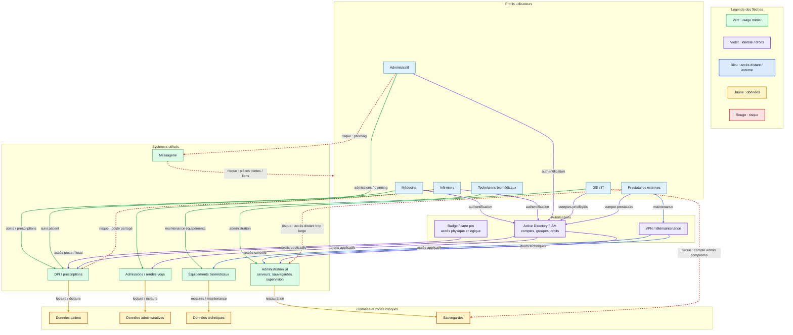

# Cartographie des utilisateurs

## Objectif

Relier les utilisateurs aux systèmes qu'ils utilisent, aux autorisations qu'ils possèdent et aux risques qu'ils peuvent introduire.

Le but n'est pas de juger les utilisateurs. L'objectif est de comprendre comment les usages réels, les urgences, les contraintes métier et les accès techniques peuvent créer des chemins d'attaque.

## Mise en situation : CHU de Rouen

Question déclencheur :

**Pourquoi un poste de prestataire a-t-il pu compromettre tout le SI ?**

Réponse à construire :

- un prestataire peut disposer d'un accès distant ou technique étendu ;
- son poste peut être moins maîtrisé que les postes internes ;
- ses identifiants peuvent ouvrir plusieurs systèmes ;
- l'accès de maintenance peut contourner certains usages classiques ;
- si le cloisonnement ou les droits sont insuffisants, un compte compromis devient un point d'entrée vers d'autres zones.

## Profils utilisateurs

| Profil | Objectif | Contraintes | Systèmes utilisés | Niveau d'accès typique |
| --- | --- | --- | --- | --- |
| Médecins | Diagnostiquer, prescrire, suivre les patients | urgence, mobilité, accès rapide aux résultats | DPI, prescriptions, imagerie, laboratoire, messagerie | lecture/écriture données patient, prescriptions, comptes rendus |
| Infirmiers | Administrer les soins, suivre les constantes, appliquer les prescriptions | postes partagés, rythme élevé, changements d'équipe | DPI, prescriptions, pharmacie, postes de soins, terminaux mobiles | lecture/écriture sur le suivi patient, accès aux prescriptions |
| Personnel administratif | Accueillir, admettre, facturer, planifier | files d'attente, appels, données à saisir vite | admissions, facturation, rendez-vous, messagerie, bureautique | lecture/écriture données administratives, accès limité aux données médicales |
| Techniciens biomédicaux | Maintenir les équipements médicaux | disponibilité des appareils, interventions urgentes | outils biomédicaux, équipements connectés, supervision, parfois télémaintenance | accès technique aux dispositifs, rarement aux données médicales complètes |
| DSI / IT | Administrer, sécuriser, maintenir le SI | continuité de service, astreinte, incidents | Active Directory, serveurs, sauvegardes, supervision, VPN, postes | accès administrateur, comptes privilégiés, accès aux journaux |
| Prestataires externes | Maintenir une application, un équipement ou une infrastructure | accès ponctuel, distance, contrats, délais | VPN, télémaintenance, application métier, équipement biomédical | accès restreint attendu, mais parfois privilèges élevés |
| Direction / encadrement | Piloter l'activité et les ressources | besoin de tableaux de bord, confidentialité | reporting, RH, finances, messagerie, planning | lecture données de pilotage, accès RH/finances selon fonction |

## Systèmes d'autorisation à identifier

Tous les accès ne passent pas uniquement par l'application métier analysée. Il faut aussi repérer les systèmes d'autorisation autour.

| Système d'autorisation | Ce qu'il contrôle | Point de vigilance |
| --- | --- | --- |
| Active Directory / IAM | comptes, groupes, sessions, droits applicatifs | point de concentration majeur |
| Messagerie | emails, pièces jointes, carnets d'adresses | phishing, diffusion interne, vol d'identifiants |
| VPN / accès distant | accès prestataires, DSI, télétravail, maintenance | MFA, horaires, périmètre limité |
| Badge / carte professionnelle | locaux, zones techniques, parfois authentification applicative | même support pour accès physique et logique |
| DPI / applications métiers | dossier patient, prescriptions, comptes rendus | droits fins par rôle et service |
| Rendez-vous / admissions | planning, identité patient, données administratives | exposition possible avec partenaires ou patients |
| Stockage fichiers / partages réseau | documents, exports, procédures, comptes rendus | droits hérités, dossiers trop ouverts |
| Outils de supervision | état des systèmes, alertes, journaux | peut révéler l'architecture du SI |
| Sauvegardes | copies, restauration, historiques | accès très sensible en cas de ransomware |

## Accès partagés ou distincts

| Méthode d'accès | Systèmes concernés | Partagé ou distinct ? | Risque |
| --- | --- | --- | --- |
| Identifiant Windows / AD | session poste, fichiers, parfois applications internes | souvent partagé entre plusieurs services | un compte compromis donne plusieurs accès |
| Carte professionnelle | locaux, postes, DPI, médicaments selon configuration | peut être partagée entre physique et logique | perte ou prêt de carte, accès trop large |
| Compte applicatif métier | DPI, laboratoire, imagerie, admissions | parfois distinct de l'AD | comptes oubliés, départs non révoqués |
| Compte administrateur | serveurs, postes, annuaire, sauvegardes | doit être distinct du compte bureautique | propagation rapide si compromis |
| Compte prestataire | VPN, télémaintenance, outil spécifique | devrait être distinct et limité | accès permanent, privilèges excessifs |
| Badge physique | locaux, salles serveurs, pharmacie, zones biomédicales | distinct ou couplé à la carte professionnelle | accès physique à des zones critiques |

## Diagramme utilisateurs, systèmes et autorisations

## Comportements à risque

| Profil | Comportement possible | Situation qui le favorise | Risque associé |
| --- | --- | --- | --- |
| Médecins | session laissée ouverte, accès depuis un poste non habituel | urgence, mobilité, manque de postes | accès non attribuable, erreur ou fuite |
| Infirmiers | partage de session ou de carte | postes partagés, soins enchaînés, urgence | traçabilité faible, droits utilisés par un autre |
| Administratif | clic sur pièce jointe ou lien | volume d'emails, pression des patients, factures | infection initiale, vol d'identifiants |
| Techniciens biomédicaux | usage de clés USB ou outils de maintenance | équipement isolé, ancien système, urgence de réparation | introduction de malware, contournement réseau |
| DSI / IT | utilisation d'un compte admin sur poste bureautique | dépannage rapide, astreinte, manque de bastion | compromission de privilèges élevés |
| Prestataires | accès VPN permanent ou trop large | maintenance à distance, contrats multiples, faible supervision | rebond vers le SI interne |

## Conditions qui poussent au contournement

Un utilisateur contourne rarement la sécurité par mauvaise volonté. Les causes sont souvent opérationnelles :

- urgence de prise en charge ;
- outil trop lent ou indisponible ;
- authentification trop fréquente ;
- manque de postes ou postes partagés ;
- droits insuffisants pour réaliser le travail ;
- procédure de support trop longue ;
- absence de solution simple pour transférer un fichier ;
- prestataire bloqué sans canal d'accès contrôlé.

## Points critiques à vérifier

| Question | Ce qu'il faut chercher |
| --- | --- |
| Qui a accès au DPI ? | profils autorisés, droits lecture/écriture, accès hors service |
| Qui peut utiliser le VPN ? | prestataires, DSI, comptes dormants, MFA |
| Qui administre l'AD ? | comptes privilégiés, séparation compte admin/compte bureautique |
| Quels postes sont partagés ? | services de soins, urgences, accueil, pharmacie |
| Quels accès physiques existent ? | salle serveur, pharmacie, locaux biomédicaux |
| Quels comptes sont communs à plusieurs systèmes ? | AD, carte professionnelle, SSO, badge |
| Comment les départs sont gérés ? | désactivation comptes internes et prestataires |

## À retenir

Un utilisateur est un acteur du SI au même titre qu'un serveur, une application ou une base de données.

Pour analyser la sécurité, il faut relier :

- **usage** : ce que la personne doit faire ;
- **accès** : ce qu'elle peut atteindre ;
- **autorisation** : comment elle est reconnue ;
- **risque** : ce qui peut être exploité en cas d'erreur, de pression ou de compromission.
