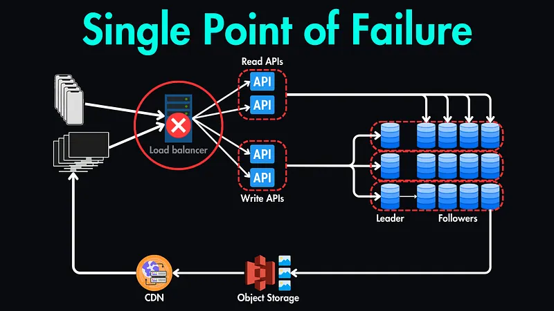

# Dépendances applicatives du SI

## Objectif

Représenter les applications critiques et leurs dépendances.

Une application isolée n'existe presque jamais : elle dépend souvent d'un serveur, d'une base de données, d'un annuaire, d'une API, d'un middleware, du réseau, d'un stockage ou d'un service externe.

L'objectif est donc de comprendre :

- quelles applications sont critiques ;
- avec quoi elles communiquent ;
- quel modèle d'architecture elles utilisent ;
- quels composants peuvent devenir des points critiques ou des **SPOF** (*Single Point of Failure*).

## Ressources utilisées

- [Red Hat - What is middleware?](https://www.redhat.com/en/topics/middleware/what-is-middleware)
- [Wikipedia - Single point of failure](https://en.wikipedia.org/wiki/Single_point_of_failure)
- [Hayk Simonyan - Single Point of Failure in System Design](https://hayksimonyan.substack.com/p/single-point-of-failure-spof-in-system)
- [Vidéo YouTube fournie en ressource](https://www.youtube.com/watch?v=Yzx7ihtCGBs&t=222s)

## Schéma fourni : exemple de SPOF

Sur ce schéma, le **load balancer** est entouré comme point critique. Si ce composant unique tombe, les clients peuvent perdre l'accès aux API et aux services derrière lui.

L'idée à retenir : même si les API, les bases de données ou le stockage sont redondés, un seul composant central mal protégé peut bloquer tout le système.

## Notions rapides

| Notion | Définition simple |
| --- | --- |
| Serveur | Machine ou service qui fournit une application ou des données. |
| Client | Poste, navigateur ou application qui consomme un service. |
| Middleware | Couche logicielle intermédiaire qui connecte applications, données et utilisateurs. |
| API | Interface permettant à deux applications de communiquer de manière standardisée. |
| SPOF | (single point of failure)Composant unique dont la panne bloque une fonction importante. |

Red Hat décrit le middleware comme une couche logicielle qui connecte les applications, les données et les utilisateurs. Il peut fournir des services comme l'authentification, la messagerie, l'intégration, les API ou le streaming de données.

## 1. Applications critiques à identifier

Dans un SI hospitalier, les applications critiques peuvent être regroupées ainsi :

| Domaine | Applications critiques |
| --- | --- |
| Patient | dossier patient informatisé, admissions, identitovigilance |
| Soins | prescriptions, plan de soins, observations médicales |
| Plateau technique | laboratoire, imagerie, pharmacie, bloc opératoire |
| Communication | messagerie, téléphonie, outils de coordination |
| IT | Active Directory, DNS, sauvegardes, supervision, gestion de parc |
| Administration | facturation, RH, planning, gestion hospitalière |

## 2. Dépendances par application

| Application | Dépendances / interactions | Typologie SI | Organisation probable | Point critique possible |
| --- | --- | --- | --- | --- |
| Dossier patient informatisé | identité patient, prescriptions, résultats labo, imagerie, comptes rendus | centralisée / hybride | clients web ou lourds, serveur applicatif, base centrale, API | base patient ou serveur applicatif central |
| Admissions | identité patient, dossier administratif, facturation | centralisée | clients accueil, serveur métier, base identité | référentiel identité patient |
| Prescriptions | dossier patient, pharmacie, laboratoire, soins | distribuée / hybride | application métier, API vers pharmacie et labo, base prescription | moteur de prescription ou API d'échange |
| Laboratoire | demandes d'analyses, prélèvements, résultats, dossier patient | décentralisée / distribuée | logiciel labo, base locale, interface/API vers DPI | interface entre labo et dossier patient |
| Imagerie | demandes d'examens, images, comptes rendus, dossier patient | décentralisée / distribuée | PACS/RIS, stockage images, API vers DPI | stockage images ou serveur PACS |
| Pharmacie | prescriptions, stocks, validation, délivrance | centralisée / distribuée | application pharmacie, base stocks, API prescriptions | base de stocks ou lien prescriptions |
| Messagerie | comptes utilisateurs, Internet, annuaire | cloud / hybride | client mail, serveur externe ou interne, annuaire | fournisseur cloud ou passerelle mail |
| Active Directory | comptes, droits, postes, serveurs, authentification | centralisée | contrôleurs de domaine, clients Windows, services liés | contrôleur de domaine unique ou comptes admin |
| DNS | résolution de noms pour applications et services | centralisée / distribuée | serveurs DNS internes, clients réseau | DNS unique ou mal redondé |
| Sauvegardes | serveurs, bases de données, fichiers, applications | hybride | agent, serveur de sauvegarde, stockage local/externe | sauvegardes accessibles au rançongiciel |
| Supervision | serveurs, réseau, applications, alertes | centralisée | serveur supervision, agents, tableaux de bord | console unique non disponible |

## 3. Chaîne de dépendance simplifiée

```mermaid
flowchart LR
    USER["Utilisateurs<br/>médecins, infirmiers, accueil"]
    POSTE["Postes clients<br/>navigateur ou client lourd"]
    AD["Active Directory<br/>authentification / droits"]
    DNS["DNS interne<br/>résolution des services"]
    APP["Applications métiers<br/>DPI, prescriptions, admissions"]
    MW["Middleware / API<br/>échanges entre applications"]
    LAB["Laboratoire"]
    IMG["Imagerie"]
    PHARMA["Pharmacie"]
    DB["Bases de données<br/>patients, prescriptions, résultats"]
    BACKUP["Sauvegardes"]
    SUP["Supervision"]

    subgraph LEG["Légende des flèches"]
        LGREEN["Vert : usage métier"]
        LPURPLE["Violet : identité / droits"]
        LYELLOW["Jaune : données / sauvegardes"]
        LBLUE["Bleu : API / middleware"]
        LGRAY["Gris : supervision"]
    end

    USER -->|"utilise"| POSTE
    POSTE -->|"authentification"| AD
    POSTE -->|"résolution"| DNS
    POSTE -->|"accès applicatif"| APP
    APP -->|"lecture / écriture"| DB
    APP -->|"API / flux métier"| MW
    MW -->|"résultats"| LAB
    MW -->|"images / comptes rendus"| IMG
    MW -->|"prescriptions"| PHARMA
    DB -->|"copie / restauration"| BACKUP
    APP -->|"état applicatif"| SUP
    AD -->|"droits applicatifs"| APP

    classDef user fill:#ede9fe,stroke:#6d28d9,stroke-width:1px,color:#111827;
    classDef infra fill:#e0f2fe,stroke:#0369a1,stroke-width:1px,color:#111827;
    classDef app fill:#ecfccb,stroke:#4d7c0f,stroke-width:1px,color:#111827;
    classDef data fill:#fef3c7,stroke:#b45309,stroke-width:1px,color:#111827;
    classDef critical fill:#ffe0e0,stroke:#b91c1c,stroke-width:2px,color:#111827;
    classDef legendGreen fill:#dcfce7,stroke:#16a34a,stroke-width:2px,color:#111827;
    classDef legendPurple fill:#ede9fe,stroke:#7c3aed,stroke-width:2px,color:#111827;
    classDef legendYellow fill:#fef3c7,stroke:#ca8a04,stroke-width:2px,color:#111827;
    classDef legendBlue fill:#dbeafe,stroke:#2563eb,stroke-width:2px,color:#111827;
    classDef legendGray fill:#f1f5f9,stroke:#64748b,stroke-width:2px,color:#111827;

    class USER,POSTE user;
    class AD,DNS,SUP infra;
    class APP,MW,LAB,IMG,PHARMA app;
    class DB,BACKUP data;
    class AD,DNS,APP,DB critical;
    class LGREEN legendGreen;
    class LPURPLE legendPurple;
    class LYELLOW legendYellow;
    class LBLUE legendBlue;
    class LGRAY legendGray;

    linkStyle 0,3 stroke:#16a34a,stroke-width:2px;
    linkStyle 1,2,11 stroke:#7c3aed,stroke-width:2px;
    linkStyle 4,9 stroke:#ca8a04,stroke-width:2px;
    linkStyle 5,6,7,8 stroke:#2563eb,stroke-width:2px;
    linkStyle 10 stroke:#64748b,stroke-width:2px;
```

### Légende des flèches

| Couleur | Type de flux | Exemple |
| --- | --- | --- |
| Vert | Usage métier | utilisateur vers poste, accès aux applications |
| Violet | Identité / résolution / droits | Active Directory, DNS, droits applicatifs |
| Jaune | Données / sauvegardes | base de données, copie, restauration |
| Bleu | API / middleware | échanges labo, imagerie, pharmacie |
| Gris | Supervision | état applicatif et alertes |

## 4. Points critiques et SPOF

| Composant | Pourquoi c'est critique | Risque si indisponible | Réduction du risque |
| --- | --- | --- | --- |
| Active Directory | authentifie les utilisateurs et postes | plus d'accès aux sessions ou applications | plusieurs contrôleurs, comptes de secours, MFA admin |
| DNS interne | permet de retrouver les services par nom | applications introuvables même si elles fonctionnent | DNS redondé, supervision, configuration cohérente |
| Base patient | contient les données médicales centrales | perte d'accès au dossier patient | réplication, sauvegardes, PRA/PCA |
| Serveur applicatif DPI | donne accès au dossier patient | soins et historique perturbés | haute disponibilité, équilibrage, redondance |
| Middleware / API | relie les applications entre elles | résultats labo ou imagerie non transmis | files d'attente, reprise sur erreur, monitoring |
| Stockage images | conserve les examens d'imagerie | diagnostic ralenti ou impossible | stockage redondé, sauvegardes, réplication |
| Serveur de sauvegarde | permet la restauration | reprise impossible après incident | isolation, copies hors ligne, tests de restauration |
| Load balancer | répartit les accès vers les services | accès coupé si point unique | redondance active/passive ou active/active |

## 5. Lecture avec les modèles d'architecture

| Modèle | Exemple hospitalier | SPOF typique |
| --- | --- | --- |
| Centralisée | dossier patient avec base centrale | base unique, serveur unique, annuaire unique |
| Décentralisée | logiciel propre au laboratoire ou à l'imagerie | interface d'échange avec le SI central |
| Distribuée | application avec plusieurs composants et API | middleware, file de messages, service d'orchestration |
| Cloud | messagerie ou télémédecine externe | fournisseur, connexion Internet, identité fédérée |
| Hybride | applications internes + services cloud + sauvegardes externes | passerelle, synchronisation, lien réseau |

L'identification du modèle architectural aide à repérer les SPOF :

- plus c'est **centralisé**, plus le composant central doit être protégé ;
- plus c'est **distribué**, plus les flux et dépendances doivent être surveillés ;
- plus c'est **hybride**, plus l'intégration et l'identité deviennent critiques.

## 6. Questions à se poser

Pour chaque application critique :

- Y a-t-il un serveur et des clients ?
- Y a-t-il une base de données unique ?
- Y a-t-il un middleware ou une API entre deux applications ?
- L'application dépend-elle d'Active Directory ou du DNS ?
- Les sauvegardes sont-elles isolées ?
- Que se passe-t-il si l'API tombe ?
- Que se passe-t-il si le serveur central tombe ?
- Existe-t-il une procédure papier ou un mode dégradé ?

## Livrable attendu

Le livrable peut prendre la forme :

- d'un tableau applications / dépendances / modèle / SPOF ;
- d'un schéma de chaînes de dépendance ;
- d'une liste des composants à rendre redondants ou à mieux cloisonner.

## À retenir

Une application critique dépend toujours d'autre chose.

Pour analyser une architecture applicative, il faut repérer :

- les clients,
- les serveurs,
- les données,
- les API,
- le middleware,
- les services d'identité,
- les sauvegardes,
- les points uniques de panne.
