# Diagramme réseau du SI

## Objectif

Produire un diagramme réseau compréhensible du système d'information.

Le but n'est pas de représenter chaque machine une par une, mais de montrer les grandes zones, les flux, les points d'entrée et les chemins possibles pour un attaquant.

## Ressources utilisées

- [Article du Monde sur la cyberattaque du CHU de Rouen](https://www.lemonde.fr/pixels/article/2019/11/18/frappe-par-une-cyberattaque-massive-le-chu-de-rouen-force-de-tourner-sans-ordinateurs_6019650_4408996.html)
- [LeMagIT - CHU de Rouen : autopsie d'une cyberattaque](https://www.lemagit.fr/etude/CHU-de-Rouen-autopsie-dune-cyberattaque)
- [L'Usine Digitale - La cyberattaque du CHU de Rouen serait bien d'origine criminelle](https://www.usine-digitale.fr/article/la-cyberattaque-du-chu-de-rouen-serait-bien-d-origine-criminelle.N908519)
- [CERT-FR / ANSSI - Informations concernant le rançongiciel Clop](https://www.cert.ssi.gouv.fr/uploads/CERTFR-2019-CTI-009.pdf)
- [ANSSI - Cartographie du système d'information](https://messervices.cyber.gouv.fr/documents-guides/20181213_anssi_guide_cartographie_v1b.pdf)
- [ANSSI - Recommandations pour architectures de systèmes d'information sensibles](https://messervices.cyber.gouv.fr/documents-guides/anssi-guide-recommandations_architectures_systemes_information_sensibles_ou_diffusion_restreinte-v1.2.pdf)

## Zones à identifier

Pour un hôpital, on peut représenter le SI avec des zones simples :

- **Internet** : messagerie, web, services externes.
- **Accès distant** : VPN, prestataires, télémaintenance.
- **Périmètre de sécurité** : pare-feu, filtrage, proxy, contrôle des flux.
- **Réseau utilisateurs** : postes des soignants, accueil, secrétariats, pharmacie.
- **Réseau serveurs** : applications métiers, dossier patient, prescriptions, laboratoire, imagerie.
- **Zone données** : bases patient, résultats, comptes rendus, images médicales.
- **Zone administration** : Active Directory, comptes, droits, administration.
- **Zone sauvegardes** : sauvegardes et restauration.
- **Zone biomédicale** : équipements médicaux connectés.
- **ToIP** : téléphonie IP, idéalement isolée du réseau informatique principal.

## Diagramme réseau brouillon

```mermaid
flowchart LR
    ATT["Attaquant<br/>campagne d'hameçonnage<br/>ou accès exposé"]
    INTERNET["Internet<br/>web, mail, services externes"]
    REMOTE["Accès distant<br/>VPN, prestataires,<br/>télémaintenance"]
    PERIM["Périmètre sécurité<br/>pare-feu, proxy,<br/>filtrage"]

    USERS["Réseau utilisateurs<br/>postes bureautiques,<br/>soignants, accueil"]
    SERVERS["Réseau serveurs<br/>applications métiers<br/>DPI, prescriptions, labo, imagerie"]
    DATA["Zone données<br/>bases patient,<br/>résultats, images"]
    ADMIN["Zone administration<br/>Active Directory,<br/>comptes, droits"]
    BACKUP["Zone sauvegardes<br/>restauration,<br/>copies protégées"]
    BIOMED["Zone biomédicale<br/>équipements médicaux<br/>connectés"]
    TOIP["Réseau ToIP isolé<br/>téléphones internes"]
    CRISIS["Mode dégradé<br/>papier, téléphone,<br/>résultats récupérés physiquement"]

    subgraph LEG["Légende des flèches"]
        LRED["Rouge : attaque / risque"]
        LBLUE["Bleu : externe / périmètre"]
        LPURPLE["Violet : identité / administration"]
        LGREEN["Vert : flux métier"]
        LYELLOW["Jaune : données / sauvegardes"]
        LGRAY["Gris : continuité de crise"]
    end

    ATT -->|"1. phishing / pièce jointe"| USERS
    ATT -->|"1 bis. accès distant compromis"| REMOTE
    INTERNET --> PERIM
    REMOTE --> PERIM
    PERIM -->|"flux autorisés"| USERS
    PERIM -->|"flux publiés / contrôlés"| SERVERS

    USERS -->|"2. rebond interne"| ADMIN
    ADMIN -->|"3. authentification / droits"| SERVERS
    USERS -->|"accès applications"| SERVERS
    SERVERS -->|"lecture / écriture"| DATA
    SERVERS -->|"flux métier"| BIOMED
    SERVERS -->|"sauvegardes"| BACKUP
    USERS -->|"coordination"| TOIP

    ADMIN -. "4. déplacement latéral<br/>si comptes compromis" .-> SERVERS
    ADMIN -. "5. chiffrement<br/>postes et serveurs" .-> USERS
    ADMIN -. "5. chiffrement<br/>serveurs Windows" .-> SERVERS
    SERVERS -. "risque si sauvegardes accessibles" .-> BACKUP

    TOIP -->|"continuité communication"| CRISIS
    USERS -->|"si SI indisponible"| CRISIS

    classDef entry fill:#fee2e2,stroke:#b91c1c,stroke-width:2px,color:#111827;
    classDef network fill:#e0f2fe,stroke:#0369a1,stroke-width:1px,color:#111827;
    classDef critical fill:#fef3c7,stroke:#b45309,stroke-width:2px,color:#111827;
    classDef safety fill:#dcfce7,stroke:#15803d,stroke-width:1px,color:#111827;
    classDef crisis fill:#f3f4f6,stroke:#4b5563,stroke-width:1px,color:#111827;
    classDef legendRed fill:#fee2e2,stroke:#dc2626,stroke-width:2px,color:#111827;
    classDef legendBlue fill:#dbeafe,stroke:#2563eb,stroke-width:2px,color:#111827;
    classDef legendPurple fill:#ede9fe,stroke:#7c3aed,stroke-width:2px,color:#111827;
    classDef legendGreen fill:#dcfce7,stroke:#16a34a,stroke-width:2px,color:#111827;
    classDef legendYellow fill:#fef3c7,stroke:#ca8a04,stroke-width:2px,color:#111827;
    classDef legendGray fill:#f1f5f9,stroke:#64748b,stroke-width:2px,color:#111827;

    class ATT entry;
    class INTERNET,REMOTE,PERIM,USERS,BIOMED,TOIP network;
    class SERVERS,DATA,ADMIN critical;
    class BACKUP safety;
    class CRISIS crisis;
    class LRED legendRed;
    class LBLUE legendBlue;
    class LPURPLE legendPurple;
    class LGREEN legendGreen;
    class LYELLOW legendYellow;
    class LGRAY legendGray;

    linkStyle 0,1,12,13,14 stroke:#dc2626,stroke-width:2.5px;
    linkStyle 2,3,4,5 stroke:#2563eb,stroke-width:2px;
    linkStyle 6,15 stroke:#dc2626,stroke-width:2.5px;
    linkStyle 7 stroke:#7c3aed,stroke-width:2px;
    linkStyle 8,10,11 stroke:#16a34a,stroke-width:2px;
    linkStyle 9 stroke:#ca8a04,stroke-width:2px;
    linkStyle 16,17 stroke:#64748b,stroke-width:2px;
```

### Légende des flèches

| Couleur | Type de flux | Exemple |
| --- | --- | --- |
| Rouge | Chemin d'attaque / risque | phishing, accès distant compromis, rebond, chiffrement |
| Bleu | Flux externe ou périmètre | Internet, VPN, pare-feu, flux autorisés |
| Violet | Flux identité / administration | Active Directory, comptes, droits |
| Vert | Flux métier | accès applications, biomédical, téléphonie |
| Jaune | Flux données / sauvegardes | lecture-écriture, sauvegardes |
| Gris | Continuité de crise | ToIP, papier, téléphone, mode dégradé |

## Lecture côté attaquant

Le schéma doit répondre à deux questions simples.

### Comment un attaquant entre ?

| Point d'entrée | Exemple | Justification |
| --- | --- | --- |
| Messagerie / phishing | Un utilisateur ouvre une pièce jointe ou un lien malveillant. | Le CERT-FR / ANSSI rattache les attaques Clop observées en France à une campagne d'hameçonnage liée au groupe TA505. |
| Accès distant | Compromission d'un accès VPN, d'un compte prestataire ou d'une télémaintenance. | Hypothèse réaliste : les hôpitaux utilisent souvent des accès distants pour la maintenance, les prestataires ou l'administration. |
| Service exposé sur Internet | Portail, messagerie, application web ou service mal filtré. | Hypothèse réaliste : tout SI connecté possède des flux entrants ou sortants à contrôler. |
| Poste utilisateur | Infection initiale d'un poste de travail. | Dans le cas du CHU de Rouen, une partie des postes de travail a été infectée. |

### Comment il se déplace ?

| Étape | Mouvement possible | Risque |
| --- | --- | --- |
| 1 | Compromission d'un poste utilisateur. | Premier accès au réseau interne. |
| 2 | Récupération d'identifiants ou usage de comptes existants. | Accès à davantage d'applications et de partages. |
| 3 | Rebond vers Active Directory ou l'administration. | Extension des droits et contrôle de comptes. |
| 4 | Propagation vers les serveurs applicatifs. | Indisponibilité des applications métiers. |
| 5 | Chiffrement de fichiers sur postes et serveurs. | Blocage du SI, mode dégradé, arrêt des ordinateurs. |
| 6 | Tentative d'atteinte des sauvegardes. | Risque majeur si les sauvegardes ne sont pas isolées. |

L'ANSSI indique que Clop peut chiffrer les documents présents sur les systèmes d'information et que le chiffrement peut être précédé d'une propagation manuelle dans le réseau victime pendant plusieurs jours.

## Flux principaux

| Flux | Rôle | Point de vigilance |
| --- | --- | --- |
| Internet vers périmètre sécurité | Permettre les échanges avec l'extérieur. | Filtrer, tracer et limiter les flux exposés. |
| Accès distant vers SI interne | Permettre l'administration ou la maintenance. | MFA, comptes dédiés, journalisation, restriction des horaires et droits. |
| Utilisateurs vers applications métiers | Accéder au dossier patient, prescriptions, laboratoire, imagerie. | Protéger les postes et limiter les droits utilisateurs. |
| Applications vers données | Lire et écrire les données patient, résultats, images, comptes rendus. | Protéger les bases et contrôler les accès applicatifs. |
| Administration vers serveurs | Gérer comptes, droits, serveurs et postes. | Séparer les comptes admin des comptes bureautiques. |
| Applications vers sauvegardes | Sauvegarder les systèmes et données. | Isoler les sauvegardes pour éviter leur chiffrement. |
| Services critiques vers ToIP | Communiquer en cas de crise. | Garder la téléphonie indépendante du SI principal autant que possible. |

## Cartographie des données

L'objectif est d'identifier les données critiques, leur lieu de stockage et leurs principaux flux.

Pour rester lisible, on peut retenir cinq familles :

| Type de données | Exemples | Stockage principal | Criticité |
| --- | --- | --- | --- |
| Données patient | identité, dossier médical, prescriptions, comptes rendus | DPI, bases patient, applications métiers | Très élevée |
| Données de soins et examens | résultats de laboratoire, imagerie, observations, traitements | laboratoire, PACS/imagerie, DPI | Très élevée |
| Données administratives | admissions, facturation, RH, planning | applications administratives, bases de gestion | Élevée |
| Données techniques | journaux, supervision, inventaire, configurations | serveurs techniques, SIEM/supervision, outils d'administration | Élevée |
| Données d'identité et sauvegardes | comptes, droits, Active Directory, copies de restauration | annuaire, serveurs de sauvegarde, stockage isolé | Critique |

## Diagramme des flux de données

```mermaid
flowchart TB
    subgraph LEG["Légende des flèches"]
        LBLUE["Bleu : flux externes"]
        LGREEN["Vert : usage métier"]
        LPURPLE["Violet : identité / droits"]
        LYELLOW["Jaune : données / sauvegardes"]
        LGRAY["Gris : données techniques"]
        LRED["Rouge : cible ransomware"]
    end

    subgraph ACT["Sources et utilisateurs"]
        direction LR
        EXT["Partenaires externes<br/>assurance maladie, fournisseurs,<br/>laboratoires externes"]
        USERS["Utilisateurs internes<br/>soignants, accueil,<br/>secrétariats, pharmacie"]
        BIOMED["Équipements biomédicaux<br/>imagerie, automates,<br/>dispositifs connectés"]
    end

    subgraph SEC["Identité et contrôle d'accès"]
        direction LR
        IDENTITY["Annuaire / IAM<br/>comptes, groupes,<br/>droits d'accès"]
        RISKID["Risque ransomware<br/>prise de droits"]
    end

    subgraph APPS["Applications"]
        direction LR
        ADMINAPP["Applications administratives<br/>admissions, facturation,<br/>RH, planning"]
        DPI["DPI / applications de soins<br/>dossier patient, prescriptions,<br/>comptes rendus"]
        TECHAPP["Applications techniques<br/>supervision, inventaire,<br/>administration"]
    end

    subgraph DATASTORE["Stockages et points de concentration"]
        direction LR
        ADMINDB["Bases administratives<br/>facturation, RH,<br/>données de gestion"]
        PATIENTDB["Bases patient<br/>identité, antécédents,<br/>dossier médical"]
        EXAMDB["Données examens<br/>labo, imagerie, résultats"]
        LOGDB["Données techniques<br/>journaux, supervision,<br/>configurations"]
        RISKDATA["Risque ransomware<br/>blocage des soins<br/>et diagnostics"]
    end

    subgraph RECOVERY["Restauration"]
        direction LR
        BACKUP["Sauvegardes<br/>copies applicatives,<br/>bases, fichiers"]
        RISKBACKUP["Risque ransomware<br/>attaque des copies"]
    end

    USERS -->|"authentification"| IDENTITY
    IDENTITY -->|"droits d'accès"| DPI
    IDENTITY -->|"droits d'accès"| ADMINAPP
    IDENTITY -->|"droits d'accès"| TECHAPP

    USERS -->|"consultation / saisie"| DPI
    USERS -->|"admission / gestion"| ADMINAPP
    USERS -->|"support / exploitation"| TECHAPP
    BIOMED -->|"mesures / images / résultats"| EXAMDB

    EXT -->|"échanges contrôlés"| ADMINAPP
    EXT -->|"résultats / demandes externes"| DPI

    DPI -->|"lecture / écriture dossier"| PATIENTDB
    DPI -->|"résultats et comptes rendus"| EXAMDB
    ADMINAPP -->|"données de gestion"| ADMINDB
    TECHAPP -->|"logs / supervision / configuration"| LOGDB

    PATIENTDB -->|"sauvegarde"| BACKUP
    EXAMDB -->|"sauvegarde"| BACKUP
    ADMINDB -->|"sauvegarde"| BACKUP
    IDENTITY -->|"sauvegarde configuration"| BACKUP
    LOGDB -->|"sauvegarde"| BACKUP

    RISKID -. "1. prendre les droits" .-> IDENTITY
    RISKDATA -. "2. bloquer les soins" .-> PATIENTDB
    RISKDATA -. "3. bloquer diagnostics" .-> EXAMDB
    RISKBACKUP -. "4. viser les copies" .-> BACKUP

    classDef actor fill:#e0f2fe,stroke:#0369a1,stroke-width:1px,color:#111827;
    classDef identity fill:#ede9fe,stroke:#7c3aed,stroke-width:2px,color:#111827;
    classDef app fill:#dcfce7,stroke:#15803d,stroke-width:1px,color:#111827;
    classDef data fill:#fef3c7,stroke:#b45309,stroke-width:2px,color:#111827;
    classDef tech fill:#f1f5f9,stroke:#64748b,stroke-width:1px,color:#111827;
    classDef danger fill:#fee2e2,stroke:#b91c1c,stroke-width:2px,color:#111827;
    classDef legendBlue fill:#dbeafe,stroke:#2563eb,stroke-width:2px,color:#111827;
    classDef legendGreen fill:#dcfce7,stroke:#16a34a,stroke-width:2px,color:#111827;
    classDef legendPurple fill:#ede9fe,stroke:#7c3aed,stroke-width:2px,color:#111827;
    classDef legendYellow fill:#fef3c7,stroke:#ca8a04,stroke-width:2px,color:#111827;
    classDef legendGray fill:#f1f5f9,stroke:#64748b,stroke-width:2px,color:#111827;
    classDef legendRed fill:#fee2e2,stroke:#dc2626,stroke-width:2px,color:#111827;

    class EXT,USERS,BIOMED actor;
    class IDENTITY identity;
    class DPI,ADMINAPP,TECHAPP app;
    class PATIENTDB,EXAMDB,ADMINDB,BACKUP data;
    class LOGDB tech;
    class RISKID,RISKDATA,RISKBACKUP danger;
    class LBLUE legendBlue;
    class LGREEN legendGreen;
    class LPURPLE legendPurple;
    class LYELLOW legendYellow;
    class LGRAY legendGray;
    class LRED legendRed;

    linkStyle 0,1,2,3 stroke:#7c3aed,stroke-width:2px;
    linkStyle 4,5,6,7 stroke:#16a34a,stroke-width:2px;
    linkStyle 8,9 stroke:#2563eb,stroke-width:2px;
    linkStyle 10,11,12,14,15,16,17,18 stroke:#ca8a04,stroke-width:2px;
    linkStyle 13 stroke:#64748b,stroke-width:2px;
    linkStyle 19,20,21,22 stroke:#dc2626,stroke-width:2.5px,stroke-dasharray:5 5;
```

### Légende des flèches

| Couleur | Type de flux | Exemple |
| --- | --- | --- |
| Bleu | Flux externes | partenaires vers admissions ou DPI |
| Vert | Usage métier | soignants vers DPI, accueil vers admissions, biomédical vers examens |
| Violet | Identité / droits | authentification, droits applicatifs, comptes |
| Jaune | Données / sauvegardes | lecture-écriture, copie, restauration |
| Gris | Données techniques | journaux, supervision, configurations |
| Rouge | Cible ransomware | chiffrement des données, prise de droits, attaque des sauvegardes |

### Lecture du diagramme

| Élément | Ce qu'il concentre | Pourquoi c'est critique |
| --- | --- | --- |
| DPI / bases patient | données médicales, prescriptions, comptes rendus | arrêt direct des soins informatisés, forte sensibilité RGPD |
| Données examens | résultats de laboratoire, imagerie, comptes rendus spécialisés | diagnostic ralenti, perte de disponibilité pour les services de soins |
| Annuaire / IAM | comptes, groupes, droits, authentification | un compte compromis peut ouvrir l'accès à plusieurs applications |
| Sauvegardes | copies des bases, fichiers, configurations | dernière ligne de défense après chiffrement |
| Applications administratives | admissions, facturation, RH, planning | fonctionnement de l'établissement perturbé même si les soins continuent en mode dégradé |

### Données visées en priorité par un ransomware

Un ransomware cherche surtout les données qui donnent un levier fort à l'attaquant :

| Priorité | Données visées | Intérêt pour l'attaquant |
| --- | --- | --- |
| 1 | Dossier patient, prescriptions, comptes rendus, résultats | bloquer les soins et créer une pression opérationnelle immédiate |
| 2 | Identifiants, annuaire, droits administrateurs | se propager, augmenter les privilèges et atteindre plus de systèmes |
| 3 | Sauvegardes accessibles depuis le SI | empêcher la restauration rapide |
| 4 | Données administratives et RH | augmenter l'impact métier et la pression de négociation |
| 5 | Journaux, supervision, configurations | masquer les traces et perturber l'analyse de l'incident |

### Zones critiques à surveiller

- **Concentration des données sensibles** : bases patient, imagerie, laboratoire, DPI.
- **Concentration des droits** : Active Directory, comptes administrateurs, accès prestataires.
- **Concentration de restauration** : serveurs et stockages de sauvegarde.
- **Flux inter-applications** : échanges DPI, laboratoire, imagerie, admissions.
- **Flux externes** : partenaires, assurance maladie, prestataires et télémaintenance.

## Enjeux à ajouter au schéma

| Enjeu | Explication |
| --- | --- |
| Disponibilité | Les urgences, soins, prescriptions, laboratoire, imagerie et pharmacie doivent continuer même en crise. |
| Sécurité | Les accès doivent être filtrés, les droits limités, les comptes administrateurs protégés. |
| Évolutivité | Le SI doit pouvoir intégrer de nouvelles applications, nouveaux sites ou nouveaux équipements. |
| Conformité | Les données médicales et personnelles sont sensibles et doivent être protégées. |
| Intégration | L'hôpital échange avec des partenaires : assurance maladie, autorités, fournisseurs, laboratoires externes. |
| Résilience | Les sauvegardes, procédures papier et moyens de communication de secours doivent permettre la continuité. |

## Hypothèses sur la segmentation

| Hypothèse | Justification |
| --- | --- |
| Le réseau interne est probablement segmenté en plusieurs zones. | LeMagIT indique qu'un cloisonnement réseau existait au CHU de Rouen ; l'ANSSI recommande aussi le cloisonnement des SI sensibles. |
| La ToIP est isolée du réseau informatique principal. | LeMagIT indique que la ToIP était isolée et n'a pas été affectée comme le reste du SI. |
| Les postes utilisateurs restent une zone d'entrée importante. | Le phishing vise souvent les utilisateurs ; le CERT-FR rattache Clop à une campagne d'hameçonnage. |
| Les serveurs applicatifs et l'annuaire sont des zones critiques. | LeMagIT mentionne Active Directory et des serveurs Windows touchés. |
| Les sauvegardes doivent être séparées de la production. | En cas de rançongiciel, si les sauvegardes sont accessibles depuis le SI compromis, elles peuvent être chiffrées. |
| Le réseau biomédical devrait être cloisonné. | Les équipements médicaux ont des contraintes fortes de disponibilité et ne doivent pas être exposés comme des postes bureautiques. |

## Incohérences et zones floues

Cette représentation reste un brouillon. Il faudrait encore vérifier :

- quels accès distants existent réellement ;
- quels prestataires ont accès au SI ;
- quelles zones réseau sont réellement séparées ;
- si les postes critiques sont dans des VLAN spécifiques ;
- si les équipements biomédicaux sont isolés ;
- si Active Directory est unique ou séparé par périmètre ;
- comment les sauvegardes sont protégées ;
- quels flux Internet sont indispensables ;
- quels flux ont été coupés pendant la crise ;
- quels serveurs étaient Windows, Linux ou Oracle.

## Livrables

Les livrables attendus sont :

- un **diagramme réseau** avec les zones, points d'entrée et chemins d'attaque ;
- un **diagramme des flux de données** avec les types de données, lieux de stockage, flux directionnels et points de concentration.

Le diagramme réseau doit montrer :

- les zones réseau,
- les points d'entrée,
- les flux principaux,
- les zones critiques,
- les hypothèses de segmentation,
- le déplacement possible d'un attaquant.

Le diagramme des flux de données doit montrer :

- les données patient, administratives, techniques, d'identité et de sauvegarde ;
- où elles sont stockées ;
- comment elles circulent ;
- quelles zones sont critiques pour un ransomware.

## À retenir

Un bon diagramme réseau ne montre pas seulement des équipements.

Il doit aider à comprendre :

- par où un attaquant peut entrer,
- comment il peut se déplacer,
- quelles zones sont critiques,
- quelles zones doivent être cloisonnées,
- quels flux doivent être surveillés ou coupés en cas de crise.
