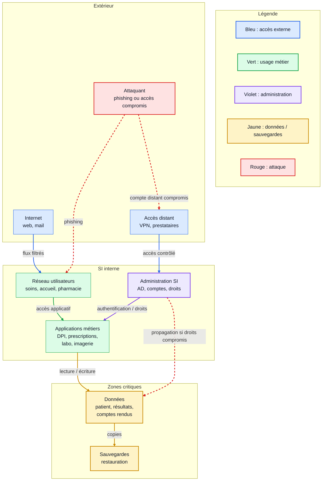
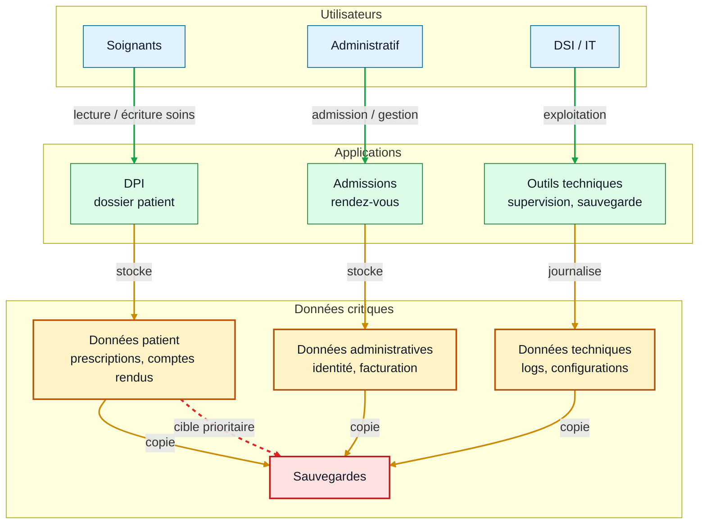
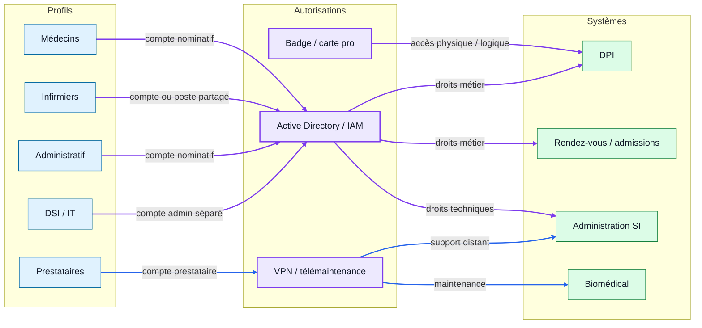
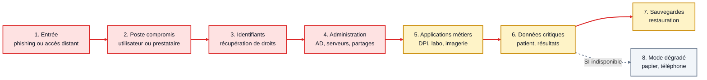

# Finalisation des diagrammes

## Objectif

Produire des diagrammes propres, lisibles et compréhensibles par une personne qui n'a pas participé au travail.

Un bon diagramme doit pouvoir être compris sans explication orale. Il doit donc avoir :

- un titre clair ;
- peu d'éléments ;
- des flèches directionnelles ;
- une légende ;
- des hypothèses explicites.

## Diagramme 1 : vue réseau simplifiée

Ce schéma montre les grandes zones du SI hospitalier et les flux principaux.

### Hypothèses

- Les accès distants passent par un VPN ou une solution de télémaintenance.
- Les applications métiers s'appuient sur un système d'identité central.
- Les sauvegardes doivent être séparées de la production.

## Diagramme 2 : flux de données critiques

Ce schéma montre où se concentrent les données qu'un ransomware viserait en priorité.

### Hypothèses

- Les données patient sont les plus sensibles et les plus critiques pour les soins.
- Les données techniques peuvent aider un attaquant à comprendre le SI.
- Les sauvegardes deviennent critiques si la production est chiffrée.

## Diagramme 3 : utilisateurs et autorisations

Ce schéma relie les profils utilisateurs aux systèmes d'autorisation.

### Hypothèses

- Les comptes prestataires doivent être séparés des comptes internes.
- Les comptes administrateurs doivent être séparés des comptes bureautiques.
- La carte professionnelle peut parfois servir à plusieurs usages.

## Diagramme 4 : chemin d'attaque ransomware

Ce schéma montre une lecture simple du scénario d'attaque.

### Hypothèses

- Le scénario est volontairement simplifié.
- L'attaque peut entrer par un poste utilisateur, un accès distant ou un service exposé.
- Le risque augmente si les droits sont trop larges et si les sauvegardes sont accessibles depuis le SI compromis.

## À retenir

Finaliser un diagramme, ce n'est pas ajouter plus de détails.

C'est choisir ce qui doit rester visible pour qu'un tiers comprenne :

- les zones principales ;
- les flux essentiels ;
- les points critiques ;
- les hypothèses ;
- les risques majeurs.
