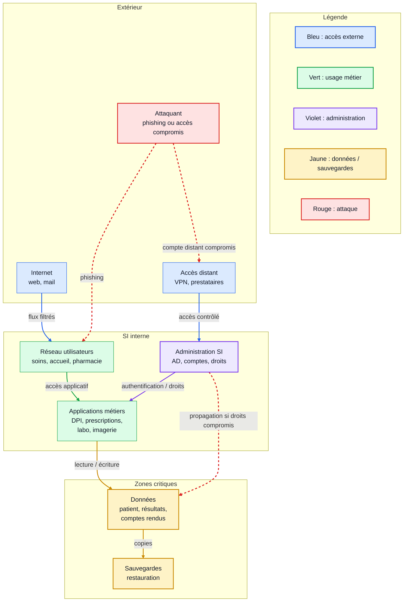
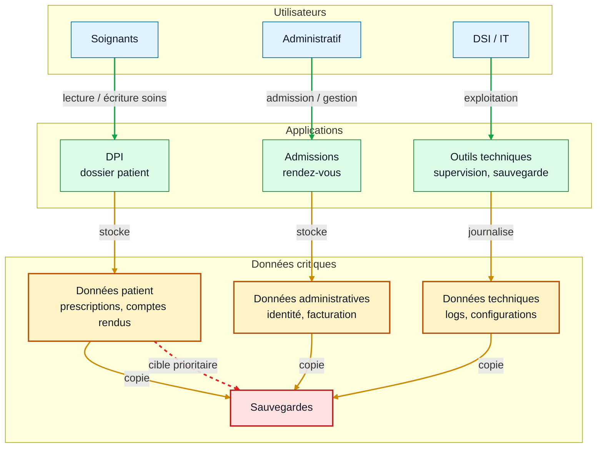
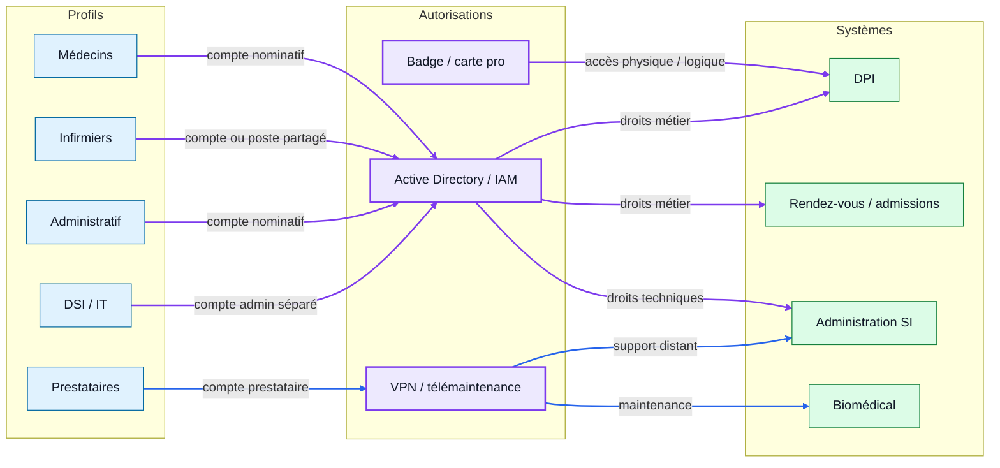
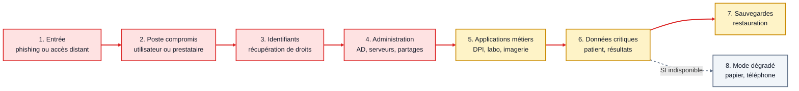

# Diagrammes finaux et résumé

## Objectif

Produire des diagrammes propres, lisibles et compréhensibles, puis savoir expliquer pourquoi l'architecture proposée est crédible.

Un bon diagramme doit pouvoir être compris sans explication orale. Il doit donc avoir :

- un titre clair ;
- peu d'éléments ;
- des flèches directionnelles ;
- une légende ;
- des hypothèses explicites.

Message à défendre :

**Le SI hospitalier est critique parce qu'il relie les soins, les utilisateurs, les applications, les données, les droits d'accès et les sauvegardes. Un ransomware devient grave quand il atteint ces points de concentration.**

## Versions draw.io

Les diagrammes sont aussi disponibles au format diagrams.net / draw.io :

- [00 - Schéma complet du SI hospitalier](drawio/00-schema-complet-si-hospitalier.drawio.png)
- [01 - Vue réseau simplifiée](drawio/01-vue-reseau-simplifiee.drawio.png)
- [02 - Flux de données critiques](drawio/02-flux-donnees-critiques.drawio.png)
- [03 - Utilisateurs et autorisations](drawio/03-utilisateurs-autorisations.drawio.png)
- [04 - Chemin d'attaque ransomware](drawio/04-chemin-attaque-ransomware.drawio.png)
- [05 - Vue hardware simplifiée](drawio/05-vue-hardware-simplifiee.drawio.png)
- [06 - Cartographie applicative](drawio/06-cartographie-applicative.drawio.png)

## Diagramme 1 : vue réseau simplifiée

Ce schéma montre les grandes zones du SI hospitalier et les flux principaux.

### Hypothèses

- Les accès distants passent par un VPN ou une solution de télémaintenance.
- Les applications métiers s'appuient sur un système d'identité central.
- Les sauvegardes doivent être séparées de la production.

## Diagramme 2 : flux de données critiques

Ce schéma montre où se concentrent les données qu'un ransomware viserait en priorité.

### Hypothèses flux

- Les données patient sont les plus sensibles et les plus critiques pour les soins.
- Les données techniques peuvent aider un attaquant à comprendre le SI.
- Les sauvegardes deviennent critiques si la production est chiffrée.

## Diagramme 3 : utilisateurs et autorisations

Ce schéma relie les profils utilisateurs aux systèmes d'autorisation.

### Hypothèses user/auth

- Les comptes prestataires doivent être séparés des comptes internes.
- Les comptes administrateurs doivent être séparés des comptes bureautiques.
- La carte professionnelle peut parfois servir à plusieurs usages.

## Diagramme 4 : chemin d'attaque ransomware

Ce schéma montre une lecture simple du scénario d'attaque.

### Hypothèses attaque

- Le scénario est volontairement simplifié.
- L'attaque peut entrer par un poste utilisateur, un accès distant ou un service exposé.
- Le risque augmente si les droits sont trop larges et si les sauvegardes sont accessibles depuis le SI compromis.

## Diagramme 5 : vue hardware simplifiée

Ce schéma donne une idée matérielle du chemin entre Internet, les équipements réseau, les serveurs et les postes, en distinguant les grands types de postes.

La segmentation reste simplifiée, mais elle montre les zones attendues dans un SI hospitalier : administratif, soins, imagerie/biomédical, administration IT, impression et Wi-Fi invité.

```mermaid
flowchart LR
    PREST["Prestataire externe"]
    PATIENT["Patient externe"]
    INTERNET["Internet"]

    subgraph INFRA["Infra réseau"]
        direction LR
        ROUTER["Routeur / box<br/>accès opérateur"]
        FW["Pare-feu<br/>filtrage"]
        CORE["Switch coeur réseau<br/>VLAN / segmentation"]
    end

    subgraph SRV["Salle serveur"]
        direction TB
        APP["Serveurs applicatifs<br/>DPI, admissions, métiers"]
        AD["Serveur annuaire / DNS<br/>comptes, noms"]
        FILES["Serveur fichiers<br/>partages internes"]
        PACS["Serveur imagerie<br/>PACS / RIS"]
        BACKUP["Serveur sauvegarde<br/>copies isolées"]
    end

    subgraph ADMIN["VLAN administratif"]
        direction TB
        COMPTA["Postes comptabilité<br/>budget, factures"]
        RH["Postes RH<br/>paie, dossiers agents"]
        ADM["Postes admissions / accueil<br/>identité patient"]
    end

    subgraph CARE["VLAN personnel soignant"]
        direction TB
        DOC["Postes médecins<br/>consultation DPI"]
        NURSE["Postes infirmiers<br/>soins, prescriptions"]
        MOBILE["Terminaux mobiles / chariots<br/>au lit du patient"]
    end

    subgraph IMG["VLAN imagerie / biomédical"]
        direction TB
        RADIO["Postes radiologues<br/>lecture imagerie"]
        MODAL["Modalités imagerie<br/>scanner, radio, IRM"]
        BIOMED["Équipements biomédicaux<br/>surveillance, dispositifs"]
    end

    subgraph TECH["VLAN administration IT"]
        direction TB
        BASTION["Bastion / console admin"]
        IT["Postes DSI<br/>administration technique"]
    end

    subgraph PRINT["VLAN impression"]
        direction TB
        PRN["Imprimantes réseau<br/>étiquettes, comptes rendus"]
    end

    subgraph GUEST["VLAN Wi-Fi invité"]
        direction TB
        WIFI["Terminaux visiteurs<br/>Internet uniquement"]
    end

    PREST -->|"via application"| INTERNET
    PATIENT -->|"via application"| INTERNET
    INTERNET --> ROUTER
    ROUTER --> FW
    FW --> CORE

    CORE -->|"VLAN serveurs"| APP
    CORE -->|"VLAN serveurs"| AD
    CORE -->|"VLAN serveurs"| FILES
    CORE -->|"VLAN imagerie"| PACS
    CORE -->|"VLAN sauvegarde"| BACKUP

    CORE -->|"VLAN admin"| COMPTA
    COMPTA --- RH
    RH --- ADM
    CORE -->|"VLAN soins"| DOC
    DOC --- NURSE
    NURSE --- MOBILE
    CORE -->|"VLAN imagerie / biomédical"| RADIO
    RADIO --- MODAL
    MODAL --- BIOMED
    CORE -->|"VLAN admin IT"| BASTION
    IT -->|"admin via bastion"| BASTION
    CORE -->|"VLAN impression"| PRN
    FW -->|"Internet uniquement"| WIFI

    CORE -->|"via application"| APP
    ADM -->|"applications administratives"| APP
    MOBILE -->|"DPI / soins"| APP
    RADIO -->|"PACS / RIS"| PACS
    MODAL -->|"images médicales"| PACS
    BASTION -->|"administration contrôlée"| AD
    BASTION -->|"administration serveurs"| APP
    APP -->|"authentification"| AD
    FILES -->|"authentification"| AD
    APP -->|"copies"| BACKUP
    PACS -->|"copies imagerie"| BACKUP

    classDef internet fill:#dbeafe,stroke:#2563eb,stroke-width:2px,color:#111827;
    classDef network fill:#e0f2fe,stroke:#0369a1,stroke-width:2px,color:#111827;
    classDef server fill:#fef3c7,stroke:#ca8a04,stroke-width:2px,color:#111827;
    classDef admin fill:#ede9fe,stroke:#7c3aed,stroke-width:2px,color:#111827;
    classDef care fill:#dcfce7,stroke:#16a34a,stroke-width:2px,color:#111827;
    classDef imaging fill:#fee2e2,stroke:#dc2626,stroke-width:2px,color:#111827;
    classDef tech fill:#f3e8ff,stroke:#9333ea,stroke-width:2px,color:#111827;
    classDef print fill:#f1f5f9,stroke:#475569,stroke-width:2px,color:#111827;
    classDef guest fill:#cffafe,stroke:#0891b2,stroke-width:2px,color:#111827;
    classDef external fill:#e1d5e7,stroke:#9673a6,stroke-width:2px,color:#111827;

    class PREST,PATIENT external;
    class INTERNET internet;
    class ROUTER,FW,CORE network;
    class APP,AD,FILES,PACS,BACKUP server;
    class COMPTA,RH,ADM admin;
    class DOC,NURSE,MOBILE care;
    class RADIO,MODAL,BIOMED imaging;
    class BASTION,IT tech;
    class PRN print;
    class WIFI guest;
```

### Hypothèses sur le hardware

- Le routeur, le pare-feu et le switch représentent les équipements réseau principaux.
- Les serveurs sont regroupés pour montrer le principe, pas le nombre réel de machines.
- Les postes sont regroupés par grands usages : administratif, personnel soignant, imagerie/biomédical et administration IT.
- Les VLAN indiquent une segmentation logique simplifiée : dans un SI réel, les règles de filtrage seraient plus précises.
- Le Wi-Fi invité doit sortir vers Internet sans accéder directement aux serveurs internes.
- Le chemin à retenir est : **Internet -> périmètre réseau -> réseau local -> serveurs et postes**.

## Résumé de présentation

| Partie | Message à faire passer | Diagramme à utiliser |
| --- | --- | --- |
| Structure du SI | Le SI est découpé en zones : utilisateurs, applications, administration, données, sauvegardes. | Vue réseau simplifiée |
| Données critiques | Les données patient, examens, droits et sauvegardes sont les cibles prioritaires. | Flux de données critiques |
| Utilisateurs et accès | Les profils métier ont des contraintes réelles et des droits différents. | Utilisateurs et autorisations |
| Risque ransomware | Une attaque peut partir d'un poste ou d'un accès distant puis se propager. | Chemin d'attaque |
| Vue matérielle | Internet arrive sur des équipements réseau, puis dessert des segments de postes différents : administratif, soins, imagerie, IT, impression et Wi-Fi invité. | Vue hardware simplifiée |

## Points critiques à défendre

| Point critique | Pourquoi c'est important |
| --- | --- |
| Active Directory / IAM | concentre l'authentification et les droits |
| DPI | porte le dossier patient et les soins informatisés |
| VPN / prestataires | peut devenir une entrée distante vers le SI |
| Données patient et examens | indispensables aux soins et très sensibles |
| Sauvegardes | dernière solution pour restaurer après chiffrement |
| Biomédical | équipements critiques, parfois difficiles à mettre à jour |

## Pourquoi c'est crédible ?

- Les zones retenues correspondent aux usages réels d'un hôpital : soigner, administrer, maintenir, restaurer.
- Les flux représentés sont les flux essentiels : accès applicatif, droits, données, sauvegardes.
- Les points critiques sont des points de concentration : comptes, données, applications, accès distant.
- Les hypothèses sont annoncées comme telles et restent vérifiables.
- Les limites sont identifiées : droits exacts, segmentation réelle, accès prestataires, isolation des sauvegardes.

## Limites à annoncer

| Limite | À vérifier |
| --- | --- |
| Accès distants | quels VPN, quels prestataires, quels droits |
| Segmentation | quelles zones sont réellement séparées |
| Droits applicatifs | qui lit, écrit ou administre |
| Sauvegardes | isolation, fréquence, tests de restauration |
| Biomédical | équipements connectés et niveau de cloisonnement |

## Questions possibles

| Question | Réponse courte |
| --- | --- |
| Pourquoi l'AD/IAM est critique ? | Parce qu'il contrôle les comptes et les droits. |
| Pourquoi les sauvegardes sont centrales ? | Parce qu'elles conditionnent la reprise après ransomware. |
| Pourquoi parler des utilisateurs ? | Parce que les accès et contraintes métier influencent la sécurité. |
| Pourquoi un prestataire est sensible ? | Parce qu'il peut avoir un accès distant et technique. |
| Pourquoi cette architecture est crédible ? | Elle part des usages réels et identifie clairement les hypothèses. |

## À retenir

Finaliser un diagramme, ce n'est pas ajouter plus de détails.

C'est choisir ce qui doit rester visible pour qu'un tiers comprenne :

- les zones principales ;
- les flux essentiels ;
- les points critiques ;
- les hypothèses ;
- les risques majeurs.
