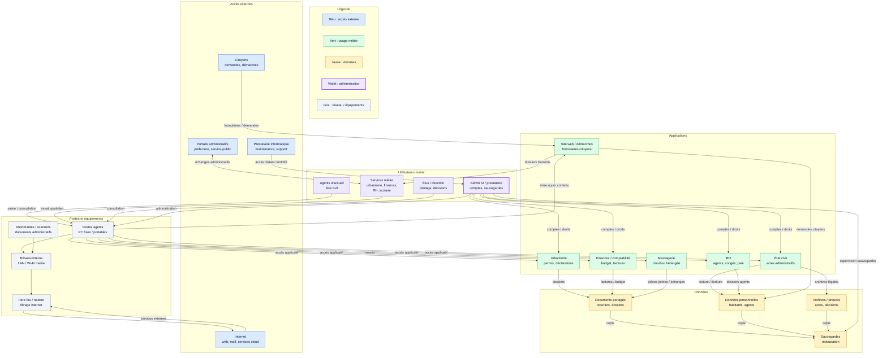

# Cartographie du SI d'une mairie

## Objectif

Construire une cartographie lisible du système d'information étudié.

Le schéma doit montrer :

- les utilisateurs ;
- les postes et équipements ;
- les applications ;
- les données ;
- le réseau ;
- les flux principaux ;
- les dépendances ;
- les accès externes ;
- le type d'architecture SI.

## Type d'architecture SI

Le SI de la mairie est une architecture **hybride**.

Elle mélange :

- une partie **centralisée** : comptes utilisateurs, fichiers partagés, sauvegardes, administration ;
- une partie **cloud / SaaS** : messagerie, démarches en ligne, certaines applications métier ;
- des **accès externes** : citoyens, prestataires, portails administratifs publics.

## Version Mermaid

## Fichier draw.io

Le diagramme est aussi disponible au format diagrams.net / draw.io :

- [Cartographie du SI d'une mairie](drawio/cartographie-si-mairie.drawio.png)

## Lecture du schéma

| Élément | Rôle dans le SI |
| --- | --- |
| Utilisateurs | Agents, élus, direction et administrateur utilisent le SI selon leurs droits |
| Postes et équipements | Les PC, imprimantes, scanners, réseau interne et pare-feu permettent l'accès au SI |
| Applications | Les logiciels métier supportent l'état civil, l'urbanisme, les finances, les RH et les démarches |
| Données | Les documents, données personnelles, archives et sauvegardes sont les éléments à protéger |
| Réseau | Le LAN / Wi-Fi et le pare-feu relient les postes aux applications et aux services externes |
| Flux principaux | Saisie, consultation, échanges administratifs, emails, sauvegardes |
| Dépendances | Les applications dépendent du réseau, des comptes utilisateurs, des données et des prestataires |
| Accès externes | Citoyens, portails administratifs, prestataire informatique et services cloud |
