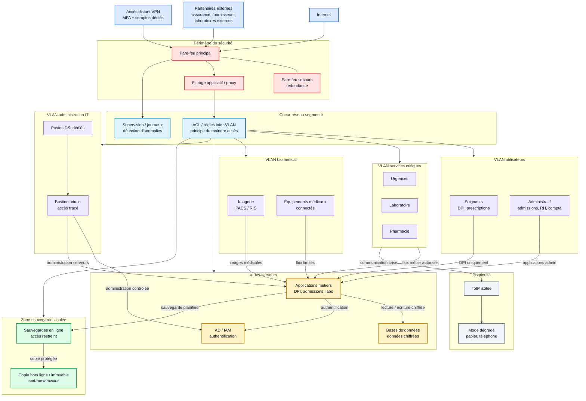

# Amélioration de l'architecture SI du CHU de Rouen

## Objectif

On repart de l'architecture SI du CHU de Rouen produite en itération 1.

L'objectif est d'ajouter des mesures de sécurité réalistes pour :

- bloquer ou ralentir la propagation d'un ransomware ;
- réduire les accès inutiles entre zones ;
- protéger les données sensibles ;
- limiter l'impact d'une panne ou d'une attaque.

Les améliorations proposées s'appuient sur quatre idées :

- **segmentation** : séparer les réseaux par usages ;
- **firewall / ACL** : filtrer les communications entre zones ;
- **redondance** : éviter qu'un seul composant bloque tout ;
- **chiffrement** : protéger les données même en cas d'accès non autorisé.

## Constats de départ

Dans l'architecture initiale, les grandes zones sont déjà identifiées :

- utilisateurs ;
- applications métiers ;
- données ;
- administration / Active Directory ;
- sauvegardes ;
- biomédical ;
- accès distant ;
- téléphonie.

Le point faible principal est le risque de **propagation** : si un poste utilisateur, un compte ou un accès distant est compromis, l'attaquant peut essayer de rebondir vers l'annuaire, les serveurs, les partages de fichiers ou les sauvegardes.

La Cour des comptes rappelle que les hôpitaux sont fortement exposés aux cyberattaques, que les SI hospitaliers sont complexes, parfois obsolètes, et qu'une attaque peut interrompre des services pendant longtemps avec un coût important.

## Architecture cible simplifiée

## Améliorations proposées

| Amélioration | Mesure concrète | Risque réduit | Impact attendu |
| --- | --- | --- | --- |
| Segmentation par VLAN | Créer des VLAN séparés : utilisateurs, services critiques, biomédical, serveurs, administration IT, sauvegardes, invités | Propagation latérale après compromission d'un poste | Un poste infecté ne peut pas atteindre directement tous les serveurs ou équipements. |
| ACL entre VLAN | Autoriser uniquement les flux nécessaires entre zones : soignants vers DPI, imagerie vers PACS, DSI via bastion | Accès trop larges entre réseaux | Réduit les chemins possibles pour un attaquant. |
| Pare-feu périmètre | Filtrer Internet, partenaires et VPN ; journaliser les connexions ; bloquer les services non nécessaires | Exposition externe, accès distant compromis | Réduit les points d'entrée et facilite l'analyse en cas d'incident. |
| Pare-feu interne | Placer un filtrage entre utilisateurs, serveurs, biomédical, sauvegardes et administration | Propagation interne | Même si l'attaquant entre, il rencontre plusieurs barrières. |
| Bastion d'administration | Interdire l'administration directe depuis un poste bureautique ; passer par un bastion journalisé | Compte admin utilisé trop largement | Limite les actions d'administration aux flux contrôlés. |
| Redondance des composants critiques | Prévoir pare-feu secondaire, switch coeur redondé, contrôleur AD secondaire, sauvegarde de configuration | Point unique de panne | Une panne matérielle ne bloque pas immédiatement tout le SI. |
| Sauvegardes isolées et immuables | Conserver une copie protégée, non modifiable directement depuis le SI de production | Chiffrement des sauvegardes par ransomware | Permet de restaurer même si la production est compromise. |
| Chiffrement des données | Chiffrer les bases sensibles, les sauvegardes et les flux applicatifs importants | Fuite de données patient ou données administratives | Les données sont moins exploitables en cas d'accès non autorisé. |
| Supervision centralisée | Centraliser les journaux firewall, VPN, AD, serveurs et sauvegardes | Détection tardive d'une attaque | Permet de repérer plus vite un comportement anormal. |
| Mode dégradé préparé | Prévoir procédures papier, téléphonie isolée, listes de contacts, priorisation des services | Désorganisation métier | Maintient une continuité minimale des soins. |

## Focus VLAN, ACL et firewall

| Élément | Rôle | Exemple dans le CHU |
| --- | --- | --- |
| VLAN | Séparer logiquement les réseaux sur une même infrastructure physique | VLAN soins, VLAN administratif, VLAN biomédical, VLAN sauvegardes |
| ACL | Définir précisément qui peut parler à qui | Le VLAN administratif peut accéder aux applications de gestion, mais pas directement aux sauvegardes |
| Firewall | Filtrer, journaliser et contrôler les flux entre zones ou avec Internet | Le firewall autorise le VPN vers le bastion, mais pas directement vers les serveurs |

À retenir :

**La segmentation seule ne suffit pas. Elle devient efficace quand elle est accompagnée de règles ACL et de firewalls qui bloquent les flux inutiles.**

## Priorisation réaliste

| Priorité | Action | Pourquoi commencer par là |
| --- | --- | --- |
| 1 | Isoler les sauvegardes et tester la restauration | Sans sauvegarde restaurable, la crise dure beaucoup plus longtemps. |
| 2 | Mettre MFA + bastion pour les accès admin et VPN | Les comptes privilégiés sont une cible majeure. |
| 3 | Segmenter utilisateurs, serveurs, biomédical et sauvegardes | C'est la base pour bloquer la propagation. |
| 4 | Ajouter des ACL simples entre VLAN | Permet de réduire les accès sans reconstruire tout le SI. |
| 5 | Mettre en place une supervision centralisée | Améliore la détection et la réponse. |

## Limites et vigilance

Ces mesures doivent rester réalistes :

- segmenter tout le SI d'un coup peut provoquer des coupures ;
- il faut d'abord inventorier les flux réellement nécessaires ;
- les ACL trop strictes peuvent bloquer des applications métier ;
- la redondance coûte cher et doit cibler les composants les plus critiques ;
- le chiffrement doit être accompagné d'une bonne gestion des clés ;
- les procédures de crise doivent être testées, pas seulement écrites.

## Synthèse

| Besoin | Réponse proposée |
| --- | --- |
| Bloquer la propagation | VLAN, ACL, firewall interne, bastion |
| Réduire les accès | Moindre privilège, filtrage inter-zones, MFA |
| Protéger les données | Chiffrement, séparation des sauvegardes, contrôle d'accès |
| Éviter l'arrêt complet | Redondance, sauvegardes restaurables, mode dégradé |
| Détecter plus vite | Supervision, journaux, alertes sur comportements anormaux |

## Sources

- Shuming Gao, [Network Security Problems and Countermeasures of Hospital Information System after Going to the Cloud](https://pubmed.ncbi.nlm.nih.gov/35898480/), *Computational and Mathematical Methods in Medicine*, 2022.
- Cour des comptes, [La sécurité informatique des établissements de santé](https://www.ccomptes.fr/sites/default/files/2024-12/20250103-S2024-1456-La-securite-informatique-des-etablissements-de-sante.pdf), observations définitives, 2024.
