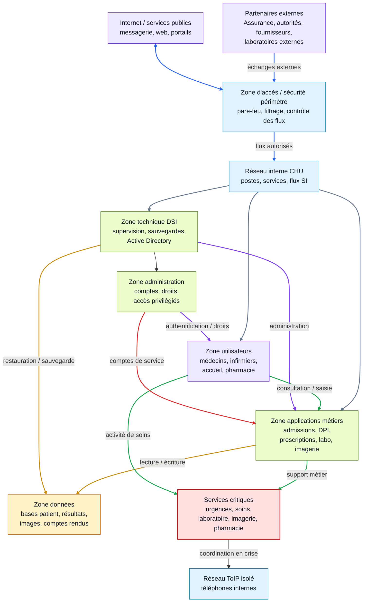

# Première vue globale du SI

## Objectif

Construire une première représentation globale du système d'information.

Cette vue est volontairement imparfaite : elle sert de brouillon pour comprendre les grandes zones, les interactions principales et les parties critiques du SI.

## Méthode

Pour une première cartographie, il ne faut pas chercher la précision maximale.

Il faut surtout chercher :

- la cohérence générale,
- les grandes zones réseau,
- les applications principales,
- les utilisateurs,
- les flux importants,
- les zones critiques ou encore floues.

## Schéma global brouillon

### Légende des flèches

| Couleur | Type de flux | Exemple |
| --- | --- | --- |
| Bleu | Flux externe / périmètre | partenaires, Internet, flux autorisés vers le SI |
| Gris | Flux réseau interne | accès aux zones utilisateurs, applications et DSI |
| Vert | Flux métier | consultation, saisie, activité de soins, support métier |
| Jaune | Flux données / sauvegardes | lecture, écriture, restauration |
| Violet | Flux administration / identité | droits, comptes, administration technique |
| Rouge | Flux de crise | coordination en mode dégradé |

## Zones principales

| Zone | Rôle | Pourquoi elle est importante |
| --- | --- | --- |
| Utilisateurs | Regroupe les personnes qui utilisent le SI : médecins, infirmiers, accueil, pharmacie, DSI, direction. | Le SI doit répondre aux besoins réels des métiers. |
| Réseau interne | Relie les postes, serveurs, applications et équipements du CHU. | Si cette zone est touchée, la propagation peut bloquer beaucoup de services. |
| Zone applications métiers | Héberge ou donne accès aux applications hospitalières : admissions, dossier patient, prescriptions, laboratoire, imagerie. | C'est le coeur du fonctionnement quotidien de l'hôpital. |
| Zone données | Contient les données patient, prescriptions, comptes rendus, résultats d'analyses et images médicales. | Ces données sont critiques pour les soins et très sensibles. |
| Zone technique / DSI | Supervision, sauvegardes, annuaire, administration des serveurs et postes. | Elle permet de piloter, sécuriser et restaurer le SI. |
| Zone d'accès / sécurité périmètre | Contrôle les échanges avec Internet et les partenaires externes. | Elle limite l'exposition du SI et filtre les flux entrants/sortants. |
| Réseau ToIP isolé | Assure les communications téléphoniques. | En crise, le téléphone peut rester indispensable si la messagerie tombe. |
| Partenaires externes | Assurance maladie, fournisseurs, autorités de santé, laboratoires externes. | L'hôpital ne fonctionne pas seul : il échange avec son écosystème. |

## Interactions principales

| Interaction | Exemple de flux | Criticité |
| --- | --- | --- |
| Utilisateurs vers applications métiers | Un médecin consulte le dossier patient ou saisit une prescription. | Très critique |
| Applications métiers vers données | Le logiciel de soins lit ou écrit dans le dossier patient. | Très critique |
| Applications métiers vers laboratoire | Une demande d'analyse est envoyée, puis le résultat revient. | Très critique |
| Applications métiers vers imagerie | Une demande de radio, scanner ou IRM est transmise. | Très critique |
| DSI vers serveurs et postes | Administration, supervision, restauration, gestion des comptes. | Critique |
| SI interne vers partenaires externes | Échanges avec assurance, autorités, fournisseurs ou services externes. | Important |
| Services métiers vers téléphonie | Coordination entre urgences, soins, laboratoire et imagerie. | Critique en mode dégradé |

## Zones critiques

Les zones les plus critiques sont celles qui ont un impact direct sur la prise en charge des patients :

- **urgences**,
- **soins**,
- **dossier patient**,
- **prescriptions**,
- **laboratoire**,
- **imagerie**,
- **pharmacie**,
- **annuaire et droits d'accès**,
- **sauvegardes**,
- **communication interne**.

Dans le cas du CHU de Rouen, les applications métiers, les postes, certains serveurs, les admissions, les prescriptions, les analyses, l'imagerie et la messagerie ont été perturbés. Cela montre que les zones critiques ne sont pas seulement techniques : elles sont directement liées aux missions de l'hôpital.

## Incohérences et zones floues

Cette première vue reste un brouillon. Plusieurs points doivent être vérifiés ou précisés :

- Où sont exactement hébergées les applications critiques ?
- Quelles applications dépendent du même annuaire ou des mêmes serveurs ?
- Quelles bases de données sont communes à plusieurs applications ?
- Quels flux externes sont indispensables au fonctionnement quotidien ?
- Quels services peuvent continuer sans informatique ?
- Le réseau biomédical est-il séparé du réseau bureautique ?
- Les sauvegardes sont-elles accessibles sans exposer les systèmes de production ?
- Les droits administrateurs sont-ils suffisamment séparés des comptes utilisateurs ?
- Les postes des services critiques sont-ils dans une zone spécifique ?

## Hypothèses justifiées

| Hypothèse | Justification |
| --- | --- |
| Il existe probablement un SI patient centralisé. | Les admissions, prescriptions, résultats, comptes rendus et soins doivent partager une même identité patient. |
| Le SI repose probablement sur un annuaire central. | Dans un grand hôpital, les comptes et droits doivent être gérés de façon centralisée ; dans le cas du CHU de Rouen, Active Directory est mentionné. |
| Le réseau est probablement découpé en plusieurs zones. | Un hôpital contient des usages très différents : soins, administration, biomédical, téléphonie, serveurs, invités. |
| Les applications critiques dépendent de plusieurs couches. | Une prescription dépend d'un utilisateur, d'une application, de données patient, d'un réseau et de droits d'accès. |
| La téléphonie doit être isolée autant que possible. | En cas de panne informatique, le téléphone reste un moyen essentiel de coordination. |
| Les sauvegardes doivent être protégées séparément. | En cas de rançongiciel, les sauvegardes sont indispensables pour restaurer les services. |

## Livrable

Le livrable attendu est un **schéma global brouillon**.

Il doit montrer :

- les principales zones du SI,
- les applications ou services majeurs,
- les utilisateurs,
- les interactions principales,
- les zones critiques,
- les zones encore floues.

## À retenir

Une première vue globale du SI n'a pas besoin d'être parfaite.

Elle sert à poser une base commune, à repérer les dépendances importantes et à préparer une cartographie plus précise.

On part d'un brouillon cohérent, puis on l'améliore progressivement.
